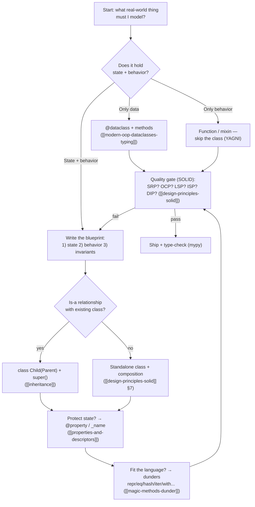
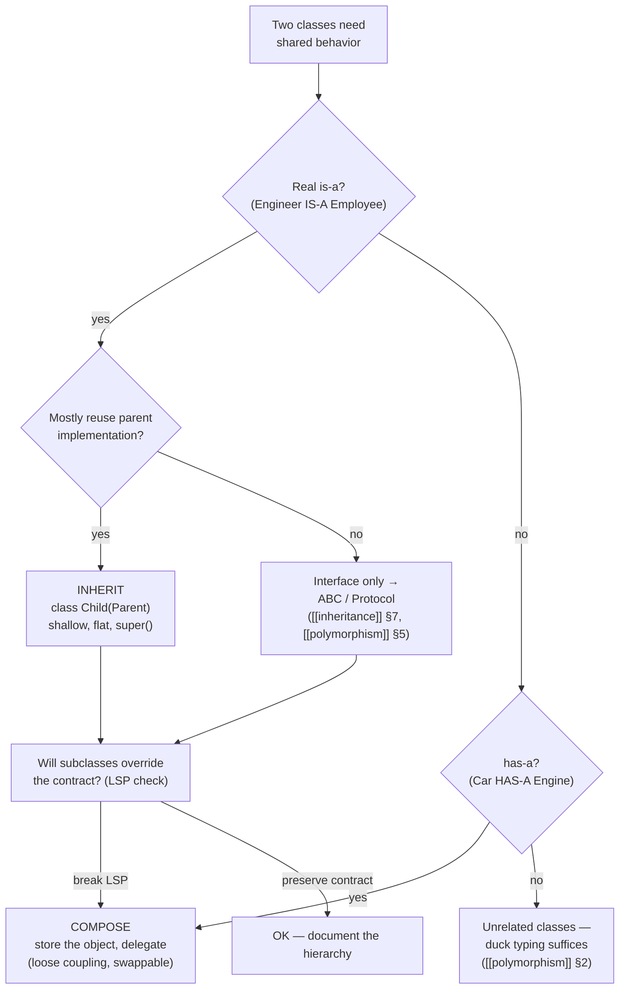
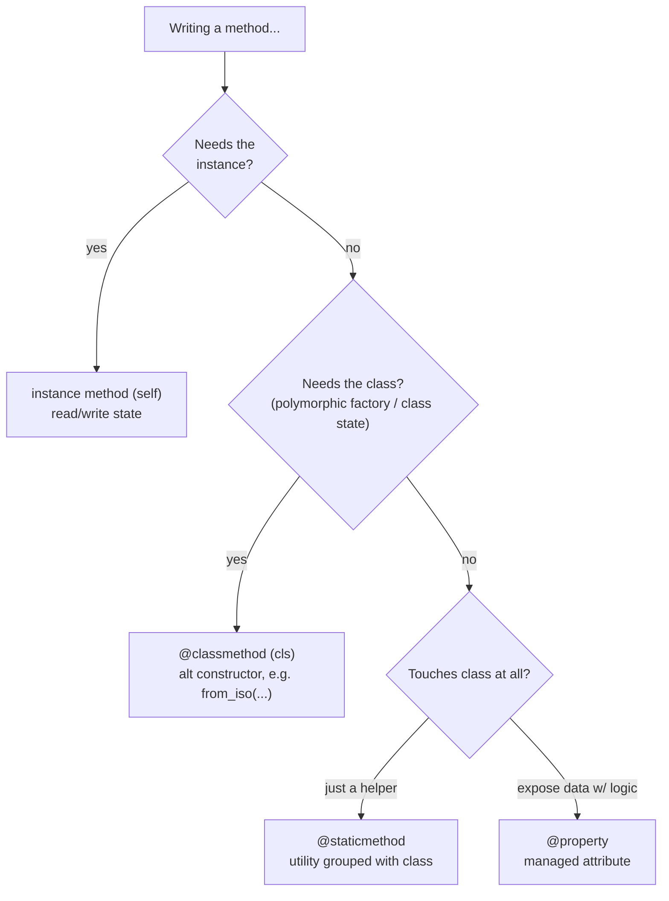
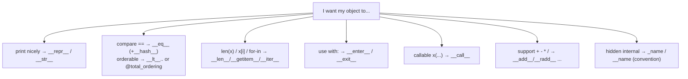
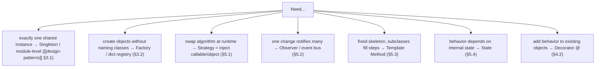
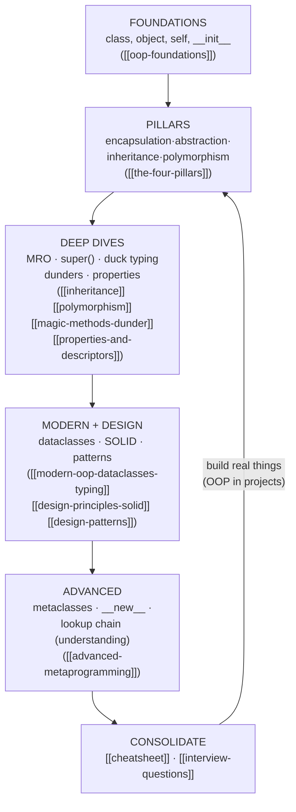

# Object-Oriented Python — Master Flowcharts

> All the OOP decision procedures as diagrams (Mermaid + ASCII): how to design a class, when to inherit vs compose, which method kind to use, which dunder you need, and how to pick a pattern. Each box = an action, each diamond = a decision.
> Companion to [[cheatsheet]] (reference) and [[design-principles-solid]] (the "why").

---

## 1. The Class-Design Loop (from problem to shipped class)



**ASCII version:**
```
 real-world thing ─► data-only? ──► @dataclass ──┐
                   │ behavior-only? ─► function ─┤
                   └ state+behavior ─► blueprint ─┴─► SOLID gate ─► ship
                                          ▲              │ fail
                                          └──────────────┘ (redesign)
```

---

## 2. Inheritance vs Composition Decision Tree



```
   shared behavior?
   ├─ true is-a + reuse parent impl ─► INHERITANCE (shallow, super(), MRO-aware)
   ├─ interface contract only       ─► ABC or Protocol
   ├─ has-a                        ─► COMPOSITION (inject + delegate)
   └─ otherwise                    ─► duck typing ([[polymorphism]])
```

---

## 3. Which Method Kind Do I Need?



---

## 4. Which Dunder Do I Need? (behavior you want → method)



---

## 5. Design-Pattern Picker



---

## 6. The OOP Learning Loop (zero → fluent)



---

## 7. Navigation

- Reference companion: [[cheatsheet]] · decision "why": [[design-principles-solid]] · [[design-patterns]]
- Concepts: [[oop-foundations]] · [[the-four-pillars]] · [[inheritance]] · [[polymorphism]]
- Back to [[overview]]
