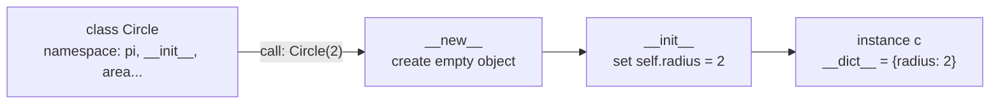

# OOP Foundations — The Mental Model

> The single most important page in this module: if you truly get *classes as blueprints, objects as instances, `self` as the instance, and attribute lookup order*, everything else (inheritance, magic methods, design) is downstream.
> Sources: [Python tutorial §9](https://docs.python.org/3/tutorial/classes.html), [Real Python OOP](https://realpython.com/python3-object-oriented-programming/).

---

## 1. Class = Blueprint, Object = Instance

> "You can think of a class as a piece of code that specifies the data and behavior that represent and model a particular type of object." — Real Python

```
    class Dog:                          ← the BLUEPRINT (one per type)
        species = "Canis familiaris"    ← class attribute (shared)
        def __init__(self, name):       ← initializer
            self.name = name            ← instance attribute (per object)
        def speak(self, sound):         ← behavior
            return f"{self.name} says {sound}"

    d1 = Dog("Miles")     ← INSTANCE 1 (has its own .name)
    d2 = Dog("Buddy")     ← INSTANCE 2 (has its own .name)
```

| Term | Means | Example |
|---|---|---|
| **class** | a new *type*; a blueprint + a namespace | `Dog` |
| **object / instance** | a concrete thing made from the class | `d1`, `d2` |
| **attribute** | data attached to an object | `d1.name` |
| **method** | a function that "belongs to" an object | `d1.speak("woof")` |
| **member** | collective word for attributes + methods | — |
| **instantiation** | calling the class to build an object | `Dog("Miles")` |

**Why classes exist (per Real Python):** bundle related data+behavior; guarantee instances have the expected attributes; build hierarchies that reuse code; hide implementation behind an interface; unlock polymorphism.

---

## 2. Anatomy of a Class Definition

```python
class Circle:                  # class statement; body runs as a namespace
    """A circle with radius."""

    pi = 3.14159               # CLASS attribute: shared by all instances

    def __init__(self, radius=1.0):   # INITIALIZER (not a "constructor")
        self.radius = radius          # INSTANCE attribute: per-object state

    def area(self):                   # INSTANCE method
        return self.pi * self.radius ** 2

    @classmethod
    def from_diameter(cls, d):        # CLASS method: receives cls
        return cls(d / 2)

    @staticmethod
    def about():                      # STATIC method: receives nothing
        return "Circles have an area."
```

**What actually happens when Python executes `class Circle:`**
1. A new **namespace** is created and used as the local scope for the body.
2. All assignments inside the body (including `def` statements, which bind function names) go into that namespace.
3. When the body finishes, a **class object** is created — "a wrapper around the contents of the namespace" — and bound to the name `Circle`.

So `Circle` is just a **name bound to an object whose `__dict__` holds `pi`, `__init__`, `area`, ...**. This is why "classes are objects too."

**Namespace sanity check:**
```python
Circle.__dict__   # mappingproxy with pi, __init__, area, about, from_diameter...
c = Circle(2)
c.__dict__        # {'radius': 2}   ← instance attributes live HERE
```

---

## 3. The Initializer vs the Constructor

| | Java/C++ | Python |
|---|---|---|
| Creates the raw object | constructor | `__new__` (returns the object) |
| Sets initial state | constructor | `__init__` (initializes the object) |

Python calls `Circle(2)` → `__new__(Circle, 2)` creates the empty object → `__init__(self, 2)` sets `.radius = 2` → returns the object. **99.9% of the time you only write `__init__`.** (`__new__` deep-dive: [[advanced-metaprogramming]]).

```python
c = Circle(2)
# 1. Circle.__new__(Circle, 2)  →  empty Circle object
# 2. Circle.__init__(c, 2)      →  c.radius = 2
# 3. return c
```

---

## 4. `self` — Explicit Instance

- `self` is **just a name** (convention; Python passes the instance in that position).
- Calling `x.f()` is *exactly equivalent* to `MyClass.f(x)`.
- Method = function + bound instance. Accessing `d1.speak` produces a **bound method object**: `d1.speak` packs together the function `Dog.speak` and the instance `d1`; calling it re-inserts `d1` as the first argument.

```python
d = Dog("Miles")
d.speak("woof")       # "Miles says woof"
Dog.speak(d, "woof")  # same thing
# bound method internals:
d.speak.__self__      # <__main__.Dog object ...>
d.speak.__func__      # <function Dog.speak at ...>
```

---

## 5. Class Attributes vs Instance Attributes

| | Class attribute | Instance attribute |
|---|---|---|
| Declared | in the class body, outside methods | inside a method via `self.x = ...` (usually `__init__`) |
| Owned by | the class | one specific instance |
| Shared | ✅ all instances see it | ❌ each has its own copy |
| Lookup | found on `Circle` | found on the instance first |

```python
class Dog:
    species = "Canis familiaris"     # shared
    def __init__(self, name):
        self.name = name             # per-instance

d1, d2 = Dog("Miles"), Dog("Buddy")
d1.species is d2.species   # True  (same object)
d1.name == d2.name         # False
```

**Lookup rule (single inheritance, simplified):** reading `obj.attr` → check `obj.__dict__` first → then walk up the class MRO → if still nothing, raise `AttributeError`. *(Full lookup incl. descriptors: [[advanced-metaprogramming]] §3.)*

```python
d1.name       # found in d1.__dict__      → "Miles"
d1.species    # not in d1.__dict__        → found on Dog → "Canis familiaris"
d1.weight     # nowhere                   → AttributeError
```

**Danger — assigning to a class attribute does NOT update instances:**
```python
d1.species = "Canis lupus"   # creates a NEW instance attribute shadowing the class one
Dog.species                  # still "Canis familiaris"
d2.species                   # still "Canis familiaris"
```
Use `type(self).species = ...` or `Dog.species = ...` if you really mean the class.

**`__dict__` is your friend:**
```python
vars(d1)          # {'name': 'Miles', 'species': 'Canis lupus'}
vars(Dog)         # mappingproxy of the class namespace
```

---

## 6. The Three Kinds of Methods

| Kind | First arg | Receives | Typical use |
|---|---|---|---|
| **instance method** | `self` (convention) | the instance | operate on/read instance state |
| **class method** (`@classmethod`) | `cls` (convention) | the class | alternative constructors, class-level state |
| **static method** (`@staticmethod`) | — | nothing | utility logically grouped with the class |

```python
class Temperature:
    scale = "Celsius"

    def __init__(self, value):
        self.value = value

    def to_kelvin(self):                     # instance: needs self
        return self.value + 273.15

    @classmethod
    def from_fahrenheit(cls, f):             # class: alternative constructor
        return cls((f - 32) * 5 / 9)

    @staticmethod
    def is_absolute_zero(v):                 # static: needs nothing
        return v <= -273.15

Temperature.from_fahrenheit(32)   # Temperature(0.0)  → cls is Temperature
Temperature.is_absolute_zero(-300)  # True
```

`cls` matters: `cls((f-32)*5/9)` builds the *right subclass* if `Temperature` is inherited — writing `Temperature(...)` would hard-code the base class. *(See [[inheritance]] for why.)*

---

## 7. Instantiation & State Diagrams



```
   CLASS (blueprint)                    INSTANCES (real things)
   ┌───────────────┐                   ┌────────────┐  ┌────────────┐
   │ Circle        │                   │ c1         │  │ c2         │
   │  pi = 3.14159 │  ── instantiate ─▶│  radius=2  │  │  radius=5  │
   │  __init__     │                   │  __dict__  │  │  __dict__  │
   │  area()       │                   └────────────┘  └────────────┘
   └───────────────┘    shared members referenced through the class
```

**Naming the state:**
- `c.__class__` → `Circle` (every object knows its type)
- `isinstance(c, Circle)` → `True`
- `type(c) is Circle` → `True`
- `hasattr(c, "area")`, `getattr(c, "radius", None)`, `setattr(c, "x", 1)`, `delattr(c, "x")` — dynamic attribute tools

---

## 8. First-Class-ness (the Python specialness)

Classes and objects are **values**: you can store them in variables/lists/dicts, pass them to functions, return them, and construct them dynamically.

```python
animals = [Dog, Cat]                     # classes in a list
factory = Dog("Miles") and Dog or Cat    # whatever
make = Dog                               # alias
pet = make("Rex")                        # instantiate via alias

# registry pattern → see [[design-patterns]] §3 (Factory)
REGISTRY = {"dog": Dog, "cat": Cat}
pet = REGISTRY["dog"]("Miles")
```

This is *why* Python design patterns often collapse into dicts + functions — there's no ceremony needed to treat a class as data.

---

## 9. Minimal Working Example (run this)

```python
class BankAccount:
    currency = "USD"                      # class attr

    def __init__(self, owner, balance=0):
        self.owner = owner                # instance attrs
        self._balance = balance

    def deposit(self, amount):
        self._balance += amount

    def withdraw(self, amount):
        if amount > self._balance:
            raise ValueError("Insufficient funds")
        self._balance -= amount

    @property
    def balance(self):                    # read-only access (see [[properties-and-descriptors]])
        return self._balance

    def __repr__(self):                   # see [[magic-methods-dunder]]
        return f"BankAccount({self.owner!r}, {self.balance!r})"

acc = BankAccount("Alice", 100)
acc.deposit(50)
acc.withdraw(30)
acc.balance          # 120  (can't accidentally do acc.balance = -500)
repr(acc)            # "BankAccount('Alice', 120)"
```

**Pattern:** constructor sets instance state; behavior is methods that guard the state; `_`-names mark "private, by convention"; `@property` exposes a clean read-only interface. That *is* encapsulation in Python.

---

## 10. Common Pitfalls

1. **Forgetting `self`** → `TypeError: missing 1 required positional argument: 'self'` when you call the method on an instance.
2. **Mutable class attributes shared by accident:**

```python
class Bug: items = []
a, b = Bug(), Bug()
a.items.append("oops")
b.items          # ['oops'] — a and b share the SAME list
```
3. **`self.x = []` inside `__init__` is the fix** for #2.
4. **Using `__init__` like a constructor** — you usually never need `__new__`.
5. **Shadowing class attributes on instances** by plain assignment (see §5).
6. **Believing `_name` is enforced** — it's a *convention*; Python will not stop you (see [[the-four-pillars]] §1).
7. **Over-using classes** — plain data → `@dataclass`; simple transform → function (see [[modern-oop-dataclasses-typing]]).

---

## 11. Navigation

- Next: **[[the-four-pillars]]** — see how all the above serves encapsulation/abstraction/inheritance/polymorphism.
- Deeper: [[magic-methods-dunder]] (make `__repr__`/`__eq__` sing) · [[inheritance]] · [[advanced-metaprogramming]] (the lookup chain in full).
- Reference: [[cheatsheet]] · [[flowcharts]] · back to [[overview]].
