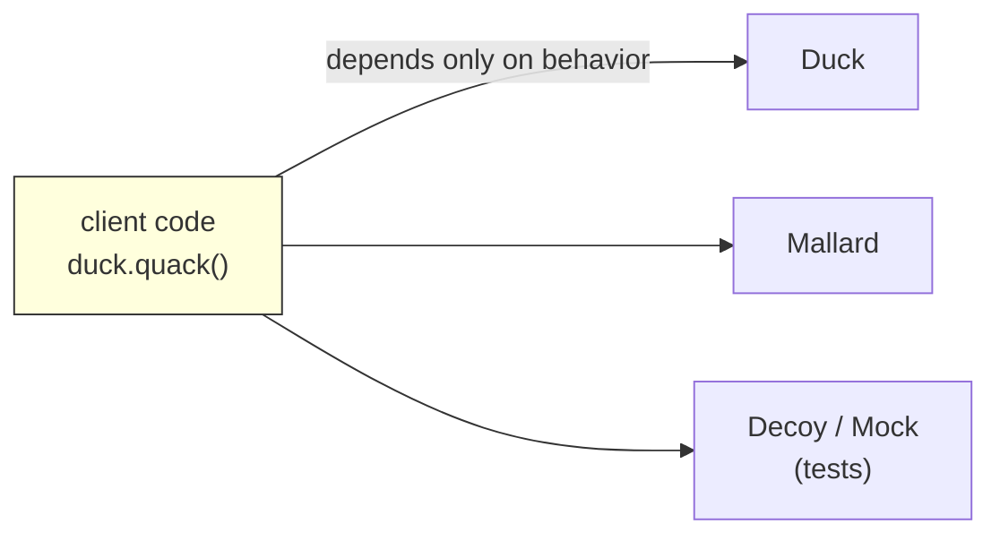

# Polymorphism in Python — Deep Dive

> Polymorphism = *"many forms."* In Python it means: **write code against an interface (a behavior), not a concrete class, and let many different objects plug in.** Python is unusually polymorphic because it's dynamically typed and duck-typed by default.
> Sources: [Real Python OOP](https://realpython.com/python3-object-oriented-programming/), [Python tutorial §9](https://docs.python.org/3/tutorial/classes.html).

---

## 1. The One Idea

```python
for animal in [Dog(), Cat(), Robot()]:     # three unrelated types
    print(animal.speak())                  # same interface, three behaviors
```

- **Compile-time (static) polymorphism** — operator overloading, resolved by types at compile time in other languages.
- **Runtime (dynamic) polymorphism** — method overriding + duck typing; resolved when the call happens.
- Python leans hard on *dynamic* polymorphism.

---

## 2. Duck Typing — Python's default

> "If it walks like a duck and it quacks like a duck, then it must be a duck."

```python
def apply_discount(order, strategy):
    return strategy(order)          # only cares about: strategy is callable

# three totally unrelated callables:
def flat(amount): return amount - 10
def pct(amount): return amount * 0.9
class BulkDiscount:
    def __call__(self, amount):    # makes instances callable → see [[magic-methods-dunder]]
        return amount * 0.8 if amount > 100 else amount

apply_discount(120, flat)     # 110
apply_discount(120, pct)      # 108.0
apply_discount(120, BulkDiscount())  # 96.0
```

**The tutorial's phrasing:** *"A piece of Python code that expects a particular abstract data type can often be passed a class that emulates the methods of that data type instead."* So you can build an object that *quacks like a file* (has `.read()`/`.write()`) and pass it anywhere a file was expected — no inheritance needed.

**EAFP vs LBYL** (polymorphism's ethics):
```python
# LBYL: look before you leap (breaks duck typing, rejects good objects)
if hasattr(x, "speak") and callable(x.speak): ...

# EAFP: easier to ask forgiveness than permission (duck-typed & Pythonic)
try:
    x.speak()
except AttributeError:
    ...
```

---

## 3. Method Overriding (subtype polymorphism)

```python
class Shape:
    def describe(self): return "a shape"
    def area(self): return 0.0

class Circle(Shape):
    def __init__(self, r): self.r = r
    def describe(self): return "a circle"        # override
    def area(self): return 3.14159 * self.r**2   # override

shapes = [Shape(), Circle(2)]
for s in shapes:
    print(s.describe(), s.area())   # same loop, dynamic dispatch
```

Because all methods are effectively `virtual`, *even calls made inside the parent* dispatch to the override — see the `greet()`/`name()` example in [[inheritance]] §1.

**Preserve the contract** — overrides should:
- keep the same meaning (see LSP in [[design-principles-solid]] §4),
- accept *at least* the same inputs, return a *compatible* output,
- call `super()` when extending, not replacing, behavior you want to keep.

---

## 4. Operator Overloading via Dunders

Operators are just method calls in disguise: `x + y` → `type(x).__add__(x, y)`. Full reference in [[magic-methods-dunder]]; the polymorphic angle here:

```python
class Money:
    def __init__(self, amount): self.amount = amount

    def __add__(self, other):                       # +
        return Money(self.amount + other.amount)

    def __eq__(self, other):                        # ==
        return isinstance(other, Money) and self.amount == other.amount

    def __lt__(self, other):                        # < (also enables sorting)
        return self.amount < other.amount

    def __str__(self):                              # str()
        return f"${self.amount}"

Money(10) + Money(5)          # Money(15)
Money(10) == Money(10)        # True
Money(10) < Money(20)         # True
```

Now `Money` behaves like a numeric value *anywhere* — `sorted([...])`, `sum(...)`, `==` — pure polymorphism with built-in operations.

---

## 5. `typing.Protocol` — explicit duck typing for type checkers

`Protocol` turns "it has these methods" into something **mypy/pyright can check**, without forcing inheritance. Runtime behavior stays duck-typed.

```python
from typing import Protocol

class Quacker(Protocol):
    def quack(self) -> str: ...

def announce(duck: Quacker) -> str:      # any object with .quack() qualifies
    return duck.quack()

class Duck:
    def quack(self): return "quack"
class Mallard:
    def quack(self): return "quack-quack"
class FakeDuck:
    def quack(self): return "quack (from a decoy)"

announce(Duck())        # mypy ✅  Duck structurally matches Quacker
announce(Mallard())     # mypy ✅
announce(42)            # mypy ❌  int has no quack()
```

- **Structural** typing: an object matches a `Protocol` if it has the right methods — no `isinstance`-style inheritance needed.
- Great for **DIP** ("depend on abstractions") without creating a class hierarchy: [[design-principles-solid]] §6, and the `Readable`/`Writable` split in the ISP example.

**Protocol vs ABC quick pick:**
| Situation | Use |
|---|---|
| You control the class hierarchy, want runtime enforcement | `abc.ABC` |
| You want duck typing documented + type-checked | `typing.Protocol` |
| Legacy/unrelated classes must be accepted | `Protocol` (or `ABC.register`) |

---

## 6. `@functools.singledispatch` — polymorphic functions

Polymorphism isn't only for classes — dispatch on the *first argument type*:

```python
from functools import singledispatch

@singledispatch
def render(value):
    return f"unknown: {value}"

@render.register
def _(value: int):
    return f"int: {value}"

@render.register
def _(value: list):
    return f"list[{len(value)}]"

render(3)          # int: 3
render([1,2,3])    # list[3]
render("x")        # unknown: x
```

---

## 7. Real-world Polymorphism (frame it this way)

- **`len(x)`** works on strings, lists, dicts, sets, numpy arrays... because they all implement `__len__` — one interface, many forms.
- **`print()`/`str()`** — any object with `__str__`/`__repr__`.
- **`with x:`** — any object with `__enter__`/`__exit__` (context manager protocol).
- **`for y in x:`** — any object with `__iter__`/`__next__` (iteration protocol).
- **Serialization**: `json.dumps(obj)` accepts any object with a custom `default=` callable.
- **Payment processors, storage backends, DB drivers** — every framework hands you a "plugin interface"; polymorphic design is what makes plugins possible.



---

## 8. Pitfalls

1. **Over-abstracting** — a `Protocol`/ABC per feature before two real implementations exist ("Rule of Three").
2. **`type(x) == Y` checks** destroy polymorphism — prefer `isinstance(x, Y)` and, better, no checks at all (duck typing).
3. **Breaking LSP in overrides** (raising, narrowing inputs) — see [[design-principles-solid]] §4.
4. **Ambiguous dunder returns** — `__eq__` should return `bool` or `NotImplemented`, not `None`.
5. **Assuming only classes can be polymorphic** — functions, callables, and modules are polymorphic citizens too.

---

## 9. Navigation

- Pillars: [[the-four-pillars]] · inheritance machinery: [[inheritance]]
- Make objects fit the language: [[magic-methods-dunder]] · [[properties-and-descriptors]]
- Design: [[design-principles-solid]] (LSP, ISP, DIP are polymorphism's guardrails) · [[design-patterns]] (Strategy/Observer use it heavily)
- Reference: [[cheatsheet]] · back to [[overview]]
