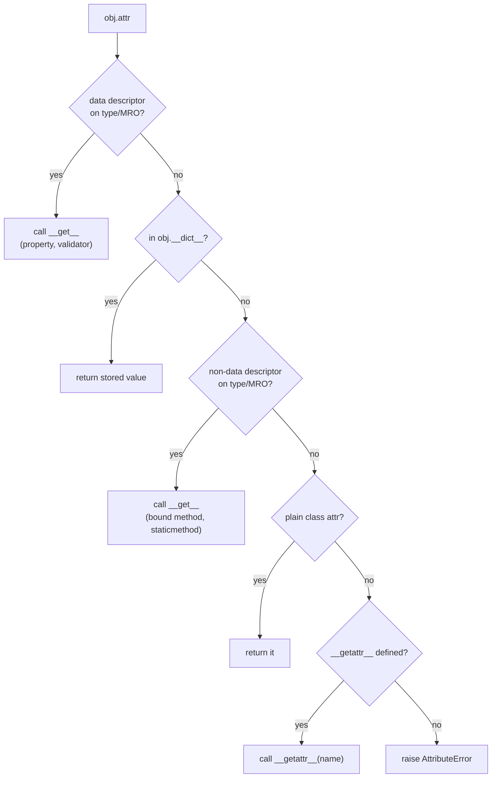

# Properties & Descriptors — Managed Attributes in Python

> This page is about Python's answer to getters/setters: **`@property`** for simple managed attributes, the **descriptor protocol** (`__get__`/`__set__`) that powers properties (and methods, and `classmethod`, and `staticmethod`) underneath, and **`__slots__`** for memory-lean classes.
> Sources: [Python Data Model §3.3.2](https://docs.python.org/3/reference/datamodel.html), [Real Python — Python Classes](https://realpython.com/python-classes/), [Real Python — Descriptors](https://realpython.com/python-descriptors/).

---

## 1. `@property` — turn a field into a managed attribute without breaking callers

**The upgrade story (why properties exist):** you shipped `class Circle: self.radius`. Later you must validate radius ≥ 0. If you introduce `get_radius()`/`set_radius()`, every caller breaks. **`@property` lets you keep `c.radius` syntax and add logic behind it** — the API doesn't change.

```python
class Circle:
    def __init__(self, radius=1.0):
        self.radius = radius            # goes through the property setter!

    @property
    def radius(self):                   # getter
        return self._radius

    @radius.setter
    def radius(self, value):            # setter
        if value <= 0:
            raise ValueError("radius must be positive")
        self._radius = value

    @radius.deleter
    def radius(self):                   # deleter (optional)
        del self._radius
```

- Real data lives in `self._radius`; the public `radius` is the *managed* view.
- `__init__` assigns `self.radius` → validation runs there too. 
- Read-only properties = getter only (like `balance` in [[oop-foundations]] §9).

**Classic vs property style:**

| Classic | Pythonic |
|---|---|
| `get_name()` / `set_name(v)` | `@property` / `@name.setter` |
| verbose, breaks callers if added later | transparent, backward-compatible |

**`functools.cached_property`** — compute once, cache, invalidate on assignment:
```python
from functools import cached_property

class Slow:
    @cached_property
    def result(self):
        return expensive_computation()   # computed once, then cached
```

---

## 2. What a property really is: a descriptor

> "Properties in Python are just… descriptors!" — Real Python

`property(fget, fset, fdel, doc)` returns an object implementing the **descriptor protocol** — it's a *class attribute* that intercepts attribute access on instances.

**The descriptor protocol** (Data Model):

| Method | Role |
|---|---|
| `__get__(self, instance, owner=None)` | intercept reads |
| `__set__(self, instance, value)` | intercept writes |
| `__delete__(self, instance)` | intercept deletes |
| `__set_name__(self, owner, name)` | learn the attribute name (PEP 487) |

```python
class PositiveNumber:
    def __set_name__(self, owner, name):      # told the attribute name once
        self._name = name

    def __get__(self, instance, owner):
        if instance is None:
            return self                        # accessed via the class
        return instance.__dict__[self._name]   # read through __dict__ (no recursion!)

    def __set__(self, instance, value):
        if value <= 0:
            raise ValueError("positive number expected")
        instance.__dict__[self._name] = value  # write through __dict__ (no recursion!)

class Order:
    quantity = PositiveNumber()     # reuse the SAME validation everywhere
    price    = PositiveNumber()

o = Order()
o.quantity = 5      # validated
o.quantity = -1     # ValueError: positive number expected
```

**Why `instance.__dict__` and not `instance._name = value`?** Inside `__set__`, plain `instance.name = value` re-triggers the descriptor → infinite recursion → `RecursionError`. Writing directly to `__dict__` bypasses the protocol.

**Data vs non-data descriptors** (the lookup precedence subtlety):
- **Data descriptor** — has `__set__`/`__delete__`: wins over instance `__dict__` (properties, validators).
- **Non-data descriptor** — only `__get__`: loses to instance `__dict__` (functions = methods, `@property` is data).

This is exactly why instance attributes can't shadow a `property`, but *can* shadow a method.

---

## 3. The Full Attribute Lookup Chain

When you read `obj.attr`, Python (in order):
1. Look for a **data descriptor** named `attr` in the type + its MRO → call its `__get__`.
2. Look in `obj.__dict__` → return the stored value.
3. Look for a **non-data descriptor** in the type/MRO → call its `__get__`.
4. Look for a plain class attribute in the MRO.
5. `__getattr__` hook (if defined).
6. Raise `AttributeError`.



**The recursion trap:** if `__getattribute__` (the always-called hook) or `__setattr__` uses `self.attr` directly, you recurse. Use `object.__setattr__`/`object.__getattribute__` or `__dict__`.

---

## 4. `__slots__` — lean, fast instances

By default every instance has a `__dict__` (a dict = memory + lookup overhead). `__slots__` declares a fixed attribute set and **eliminates `__dict__`**:

```python
class Point:
    __slots__ = ("x", "y")
    def __init__(self, x, y): self.x, self.y = x, y

p = Point(1, 2)
p.x            # 1
p.z = 3        # AttributeError — no __dict__ to store it
```

**Effects:**
- ✅ ~30–50% less memory per instance; attribute access faster (fixed offsets, no dict probe).
- ❌ No dynamic attributes; no `weakref` by default (`weakref_slot=True` in dataclasses / add `"__weakref__"` to slots).
- ❌ `vars(p)` / `p.__dict__` fail (they're the dict you removed).

**Rules & gotchas:**
- A subclass of a slotted class **must redeclare inherited slots** (or it silently regains a `__dict__`).
- `__slots__` with inheritance:

```python
class P2(Point):
    __slots__ = ("z",)     # must repeat Point's slots: ("x","y","z")
```
- **Dataclasses do this for you:** `@dataclass(slots=True)` (Python 3.10+). See [[modern-oop-dataclasses-typing]].
- Many stdlib behaviors assume `__dict__` — code that does `obj.__dict__` will break; use `getattr`/`setattr` instead.

---

## 5. When to use which

| Tool | Use when | Example |
|---|---|---|
| Plain attribute | no logic needed | `self.name = name` |
| `@property` | validation / computed value / backward-compatible upgrade | `radius`, `balance`, `area` |
| `@cached_property` | expensive one-time computation | model inference, parsing |
| Descriptor | same managed behavior reused across many attributes/classes | `PositiveNumber`, ORM fields |
| `__slots__` | millions of tiny fixed-shape objects | graph nodes, 2D points, parsed records |

**Descriptor vs property rule of thumb:** one attribute → property; the *same* logic on 2+ attributes → descriptor.

---

## 6. Pitfalls

1. **Recursion in `__set__`/`__setattr__`** — always write through `__dict__` or `object.__setattr__`.
2. **`__slots__` + inheritance** — forgetting to repeat slots → you think you saved memory but didn't.
3. **Descriptor storing values on itself** → all instances share one descriptor → shared state bug. Store per-instance (use `instance.__dict__[name]`).
4. **Name collisions** — descriptor `_name` vs actual attribute; use `__set_name__` to stay DRY.
5. **Properties vs plain data** — don't wrap everything in properties; YAGNI. Add them when the logic appears.

---

## 7. Navigation

- Encapsulation pillar: [[the-four-pillars]] §2 · foundations `__dict__`: [[oop-foundations]] §5
- Dunders & protocols: [[magic-methods-dunder]] · the engine room: [[advanced-metaprogramming]] (lookup chain, metaclasses)
- Modern idiom with slots: [[modern-oop-dataclasses-typing]]
- Reference: [[cheatsheet]] · back to [[overview]]
