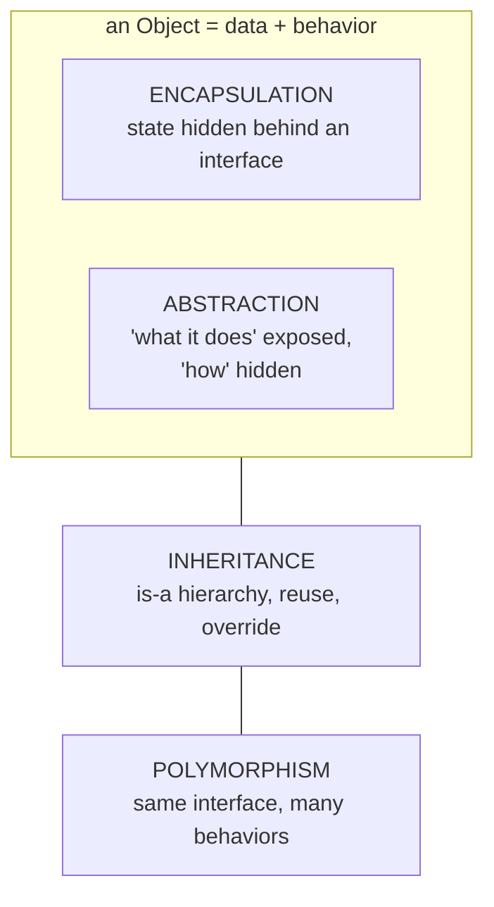

# The Four Pillars of Object-Oriented Programming

> Encapsulation, Abstraction, Inheritance, Polymorphism — the four concepts that define OOP. In Python each pillar is delivered by specific mechanisms (conventions, ABCs, `class Base(...)`, duck typing). This page unifies them; the deep dives live in the linked node pages.
> Sources: [Real Python OOP](https://realpython.com/python3-object-oriented-programming/), [Python tutorial §9](https://docs.python.org/3/tutorial/classes.html).

---

## 1. The Four Pillars in One Picture



```
          data ─┐                    behavior ─┐
                ▼                              ▼
        ┌── THE OBJECT ────────────────┐
        │  state: _balance = 100        │
        │  contract: deposit()          │   ← Encapsulation (bundle + hide)
        │            withdraw()         │   ← Abstraction  (interface only)
        └───────────────────────────────┘
                          ▲
        ┌─────────────────┼──────────────────┐
        │  Inheritance    │  Polymorphism     │
        ▼                 ▼                   ▼
   Savings extends    deposit() works     any object with
   BankAccount        for Savings too     deposit() qualifies
   (is-a reuse)       (LSP)               (duck typing)
```

| Pillar | Plain English | Python mechanism | Deep dive |
|---|---|---|---|
| **Encapsulation** | Bundle data + behavior; keep internal state safe behind a public interface | class, `_`/`__` convention, `@property`, descriptors | [[properties-and-descriptors]] |
| **Abstraction** | Hide *how*, expose *what* | ABCs (`abc`), `Protocol`, duck typing, good method names | [[inheritance]], [[polymorphism]] |
| **Inheritance** | Child class *is-a* parent; reuse + override | `class B(A)`, `super()`, MRO, multiple inheritance, mixins | [[inheritance]] |
| **Polymorphism** | One interface, many implementations | method overriding, duck typing, operator overloading | [[polymorphism]] |

---

## 2. Encapsulation — "bundle and protect"

**Definition.** *Encapsulation allows you to bundle data (attributes) and behaviors (methods) within a class to create a cohesive unit. By defining methods to control access to attributes and its modification, encapsulation helps maintain data integrity.*

Two halves:
1. **Bundling** — state + the code that operates on it live together in one object.
2. **Hiding** — external code should not poke at internals directly; it should use the public interface.

**Python's honesty:** the tutorial says plainly — *"nothing in Python makes it possible to enforce data hiding — it is all based upon convention."*

| Convention | Meaning |
|---|---|
| `name` | public |
| `_name` | "protected" — internal, don't touch (just a naming convention) |
| `__name` | name-mangled to `_ClassName__name` — weak form of privacy for collisions |

```python
class BankAccount:
    def __init__(self, owner, balance=0):
        self.owner = owner
        self._balance = balance          # "private by convention"

    def deposit(self, amount):           # public interface = the contract
        if amount <= 0:
            raise ValueError("must be positive")
        self._balance += amount

    @property                            # read-only access via attribute syntax
    def balance(self):
        return self._balance

acc = BankAccount("Alice", 100)
acc.balance         # 100   ← clean read
acc.deposit(50)     # ✅ contract
# acc._balance = -9999   ← technically possible; that's Python trusting you
```

**Why it matters:** validation lives next to the data, callers can't corrupt state by accident, and you can change the internal representation later *without breaking the API* (see [[properties-and-descriptors]] §1 for the "from field to property without breaking callers" story).

---

## 3. Abstraction — "what, not how"

**Definition.** *Abstraction focuses on hiding implementation details and exposing only the essential functionality of an object. By enforcing a consistent interface, abstraction simplifies interactions with objects, allowing you to focus on **what** an object does rather than **how** it achieves it.*

- **Encapsulation** hides *state*; **abstraction** hides *implementation*. (Overlapping, but different lenses.)
- Vehicles of abstraction: the *method names you publish*, abstract base classes (see below), `Protocol` classes, and the fact that callers depend on behavior, not class identity.

```python
from abc import ABC, abstractmethod

class Shape(ABC):                 # abstract: defines the interface
    @abstractmethod
    def area(self): ...           # every shape MUST implement area()

class Square(Shape):
    def __init__(self, side): self.side = side
    def area(self): return self.side ** 2

Shape()          # TypeError: Can't instantiate abstract class Shape
Square(3).area() # 9
```

Callers who write `shape.area()` never care *how* the area is computed — they depend only on the abstraction. *(Full ABC treatment: [[inheritance]] §7.)*

---

## 4. Inheritance — "is-a + reuse"

**Definition.** *Inheritance enables the creation of hierarchical relationships between classes, allowing a subclass to inherit attributes and methods from a parent class. This promotes code reuse and reduces duplication.*

```python
class Employee:
    def __init__(self, emp_id, name):
        self.emp_id = emp_id
        self.name = name
    def work(self):
        return f"{self.name} works"

class Engineer(Employee):               # Engineer IS-A Employee
    def __init__(self, emp_id, name, language):
        super().__init__(emp_id, name)  # reuse parent init
        self.language = language
    def work(self):                     # override parent behavior
        return f"{self.name} writes {self.language} code"
```

- **Inherits** attributes/methods of the parent (the tutorial: *"method references are resolved by searching, descending down the chain of base classes"*).
- **Overrides** anything it redefines — and because all Python methods are effectively `virtual`, a base method that calls another method will dispatch to the *subclass's* version (the basis of the [[design-patterns#template-method|Template Method]] pattern).
- **`super()`** lets a child *extend* rather than replace.

**Careful:** inheritance should encode a genuine **is-a** relationship — otherwise prefer composition (`has-a`). Decision flow: [[design-principles-solid]] §7.

---

## 5. Polymorphism — "one interface, many forms"

**Definition.** *Polymorphism allows you to treat objects of different types as instances of the same base type, as long as they implement a common interface or behavior.*

In Python the common interface is **not** a formal `interface` keyword — it's behavior. Two mechanisms:

**(a) Method overriding (subtype polymorphism):**
```python
class Shape:
    def describe(self): return "generic shape"
class Circle(Shape):
    def describe(self): return "round"
class Square(Shape):
    def describe(self): return "angular"

for shape in [Circle(), Square(), Shape()]:
    print(shape.describe())      # same call, different behavior
```

**(b) Duck typing (the Python way):**
> "If it walks like a duck and it quacks like a duck, then it must be a duck."

```python
def play(animal):
    return animal.speak()          # no base class required!

class Duck:
    def speak(self): return "quack"
class Dog:
    def speak(self): return "woof"

play(Duck()); play(Dog())          # both work — duck typing
```

`play()` doesn't care about type — it cares that the object has `speak()`. This is why the tutorial says: *"A piece of Python code that expects a particular abstract data type can often be passed a class that emulates the methods of that data type instead."*

**Operator overloading** (another polymorphic face) is covered with dunders: [[magic-methods-dunder]]; `Protocol` for *explicit* duck typing: [[polymorphism]] §4.

---

## 6. The Four Pillars Working Together (a real mini-design)

```python
from abc import ABC, abstractmethod

class PaymentProcessor(ABC):                  # ABSTRACTION: the contract
    @abstractmethod
    def pay(self, amount): ...                # "what": pay

class CardProcessor(PaymentProcessor):        # INHERITANCE: is-a processor
    def __init__(self, limit=1000):
        self._limit = limit                   # ENCAPSULATION: hidden state
    def pay(self, amount):                    # POLYMORPHISM: shared interface
        if amount > self._limit:
            raise ValueError("over limit")
        print(f"card: ${amount}")

class PayPalProcessor(PaymentProcessor):      # another polymorphic sibling
    def pay(self, amount):
        print(f"paypal: ${amount}")

def checkout(processor: PaymentProcessor, amount):
    processor.pay(amount)                     # depends on the abstraction only

checkout(CardProcessor(), 50)     # card: $50
checkout(PayPalProcessor(), 500)  # paypal: $500  ← swap behavior, zero changes
```

Every pillar pulls its weight: `ABC` states the contract (abstraction), both processors are substitutable (polymorphism + LSP), `_limit` is tucked away (encapsulation), and `CardProcessor` extends the base (inheritance).

---

## 7. Common Confusions

1. **Encapsulation vs abstraction** — encapsulation *bundles + protects state*; abstraction *exposes an interface, hides implementation*. Encapsulation is a *means*, abstraction is a *goal*.
2. **"Private" in Python** — not enforced. `_x` = "leave me alone"; `__x` = name-mangled, mainly to avoid accidental overrides in inheritance.
3. **Inheritance is not the only reuse tool** — composition (`has-a`) is often the better answer; see [[design-principles-solid]] §7.
4. **Polymorphism ≠ inheritance** — duck typing means two unrelated classes can be polymorphic through a shared method name.
5. **ABCs vs Protocols** — ABCs enforce inheritance-based contracts (explicit); Protocols enforce structural contracts without inheritance (duck typing, checked by mypy). Both are "abstraction tools."

---

## 8. Navigation

- Foundations: [[oop-foundations]]
- Deep dives: [[inheritance]] · [[polymorphism]] · [[magic-methods-dunder]] · [[properties-and-descriptors]]
- Design quality: [[design-principles-solid]] (LSP, ISP are about these pillars) · [[design-patterns]]
- Reference: [[cheatsheet]] · back to [[overview]]
