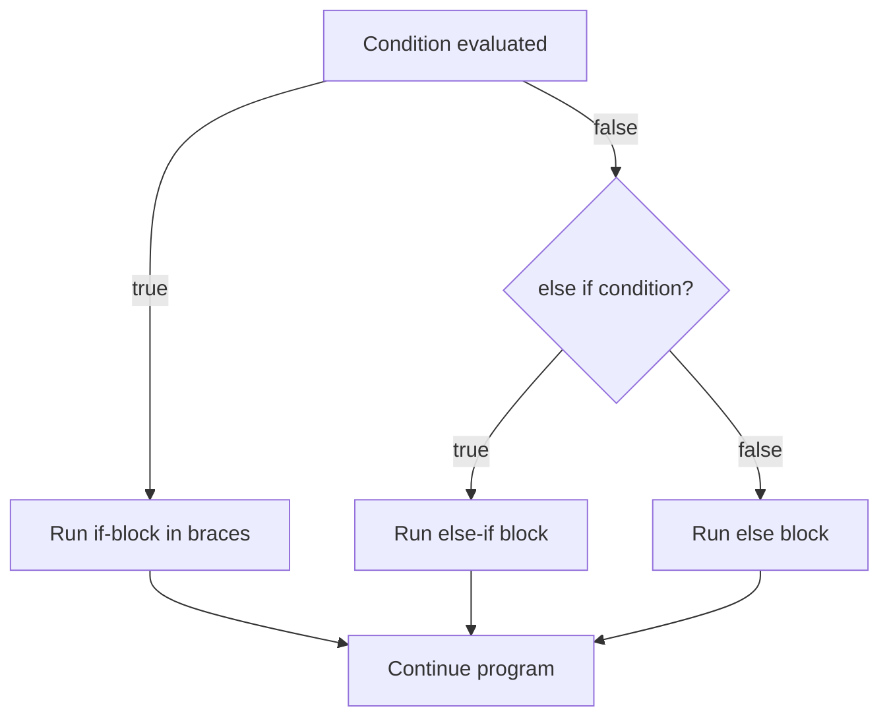
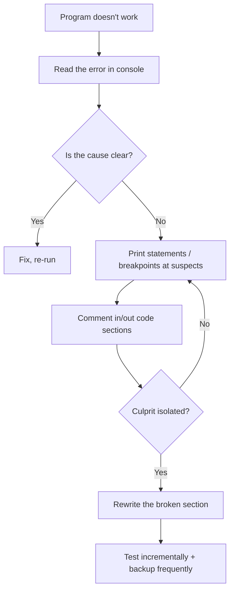
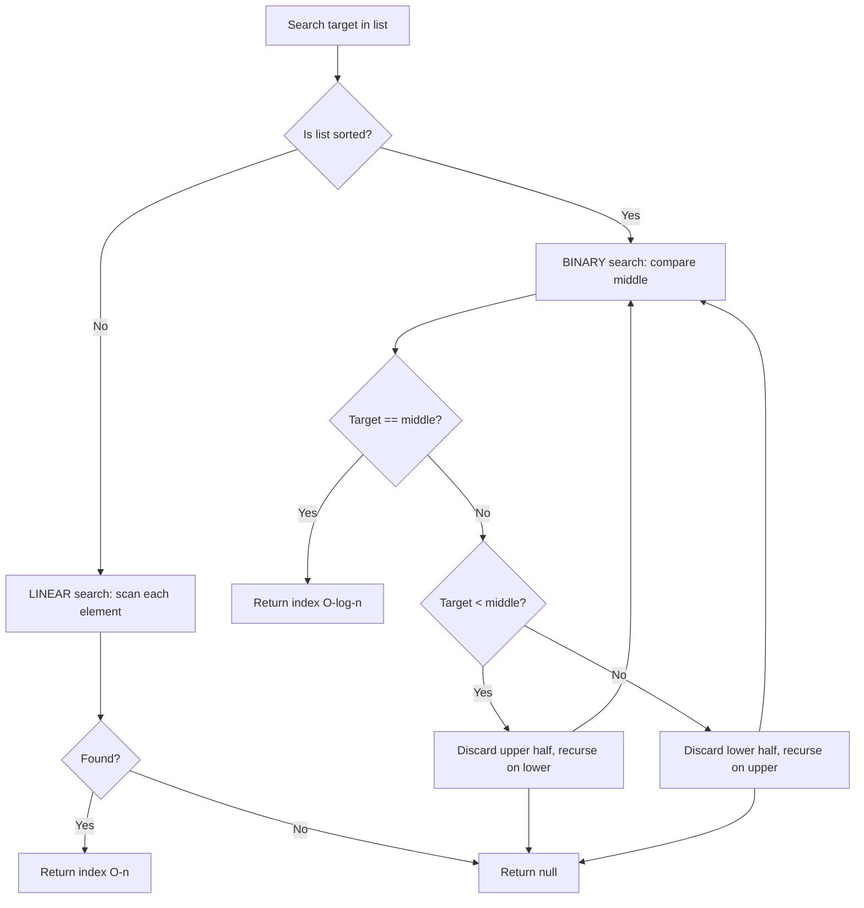
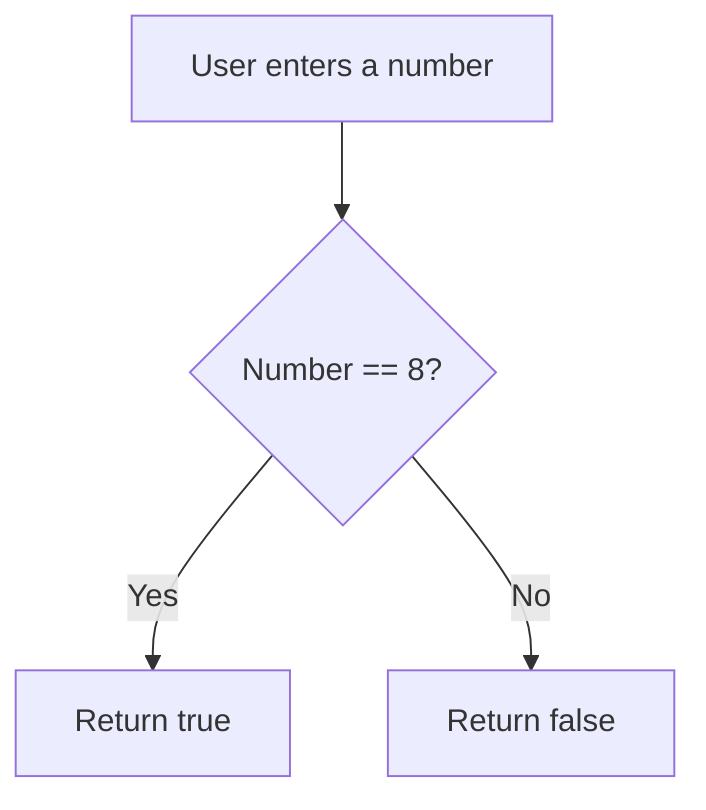

# Programming & Computer Science Fundamentals (Language-Agnostic Core)

> **Source:** *Introduction to Programming and Computer Science — Full Course* (Steven & Shawn, *No Pointer Exception*).
> **Video:** https://www.youtube.com/watch?v=zOjov-2OZ0E — raw transcript: [[raw-sources/youtube-transcript-introduction-to-programming-computer-science.txt]].
> **Scope:** the universal principles that apply to *any* programming language. OOP and terminal navigation are deliberately excluded (language-specific).

---

## 1. What Programming Actually Is

**Dictionary:** "the process of preparing an instructional program for a device."
**Layman's translation:** *getting a computer to complete a specific task without making mistakes.*

- **The Lego analogy.** Imagine a not-very-bright friend building a Lego set with no instructions, listening only to your commands. Miss one piece's exact placement and the project is ruined. A computer is exactly this "friend" — **computers are dumb**. Their sophistication comes entirely from how we instruct them.
- **A language problem on top of a dumbness problem.** The computer only understands **machine code** (binary — 1s and 0s). A real program is *millions* of those digits; a human cannot write that directly.
- **Programming languages = the middleman.** They sit between human language and machine code — an interpreter translating your instructions into binary. Think of a translator who speaks both English and your friend's language.

### High-level vs low-level languages

| Level | Examples | Positioning |
|---|---|---|
| **Low-level** | Assembly, C | Close to machine code → code resembles what a machine can interpret |
| **High-level** | Java, Python, JavaScript | Far from machine code → closer to human language, more abstraction |

The "level" is measured by **how similar the language is to machine code**. Lower level ⇒ more resemblance. Languages are also purpose-built: **HTML/CSS** for websites, **C / Robot C** for moving robots, **Python / Java** as general-purpose workhorses. Choosing a language usually comes down to *preference* — many can accomplish the same task.

---

## 2. Writing Code: The IDE + Syntax

### The IDE (Integrated Development Environment)

A graphical app for **writing, running, and debugging** code without manually handling compilation/interpretation. Superpowers:
- **Error checking** — highlights problems before you run.
- **Auto-fill** of frequently used words and phrases.
- **Project hierarchy** — organize project files.

The IDE performs the translation to machine code for you. (History: punch cards → modern IDEs.)

### Syntax — the grammar of programming

- Every language has strict rules (**syntax**) you must follow to the letter, like real-world grammar.
- **Breaking syntax = an error.** Example: declaring an integer in Java requires the type + semicolon; in Python you just assign; in JavaScript you use a keyword but no type. Same goal, different rules.
- **Tiny mistake, huge consequence:** *"Let's eat, grandma"* vs *"Let's eat grandma"* — a missing comma changes the entire meaning. A missing semicolon can corrupt the program's whole context.
- **IDEs catch syntax errors**: underline the offending line and **block running until fixed**.

---

## 3. The Console & The Print Statement

- **Console** = a text interface for the *developer* to see program output. Not for end-users (a phone app never shows its console).
- **Print statement** = `print("Hello World")` → writes to the console. Exists in nearly every language; in Java there are variants (with/without line break).
- Key uses:
  - Print literal text.
  - Print **results** (`print(4 + 3)` → `7`) — otherwise computed values are invisible.
- **Concatenation:** `print("Game Over " + score + " was your final score")`. Watch out for:
  - **Missing spaces** between strings (the computer prints exactly what you give it).
  - **"4" (string) vs 4 (int):** doing math on a quoted number errors — the computer sees int + string, which is illegal.

---

## 4. Basic Math & Strings

Computers natively handle **addition `+`, subtraction `-`, multiplication `*`, division `/`** — and the fifth operator, **modulo `%`** (the remainder of a division).

| Expression | Meaning |
|---|---|
| `10 % 3` | `10 ÷ 3 = 3 remainder 1` → **1** |
| `50 % 2` | remainder 0 → **0** (so 50 is even) |

**Modulo's headline use:** even/odd test — `x % 2 == 0` ⇒ even, `x % 2 == 1` ⇒ odd.

**Strings = text.** Anything inside quotes is a string (*"Hello"*, *"A"*, *"game over"*). Strings can be added (concatenated) but not subtracted/multiplied/modulo'd.

---

## 5. Variables — the Cardboard Box Model

**Variable** = a named storage unit that can be referenced and manipulated — like a labeled cardboard box in a storage facility (memory).

### Primitive types

| Type | Stores | Notes |
|---|---|---|
| **int** | whole numbers | Range ≈ $-2^{31}$ to $2^{31}-1$; **no decimals** |
| **boolean** | `true` or `false` | Essential for conditionals |
| **float** | decimals (32-bit precision) | Floating-point |
| **double** | decimals (64-bit precision) | More precision than float |
| **string** | text / words | Can be concatenated |
| **char** | a single character | Good for key-presses; a string can hold one too |

### Memory mechanics
- **Define** a variable → the computer reserves a labeled memory cell.
- **Assign** `name = "no pointer exception"` → label points at that content.
- **Reference** → pull the value; **Update** → erase + write a new value in the same box.
- **Aliasing:** `channelName = name` does not make a *second* box — it adds a second label to the *same* memory (saves space for known-equal values).
- **Uninitialized variables:** referencing them throws a **NullPointerException**. You can declare-without-assignment to reserve space (e.g., for future user input).
- **Lifetime:** memory is allocated per run and cleared when the program ends.

### Manipulation
- Numeric vars accept `+ - * / %` (calculator app: `num1 * num2 → result`).
- String vars can be added: `"Hello" + " there"` → `"Hello there"`.

### Naming conventions — camelCase
- Variables must be one continuous token (no spaces).
- **camelCase:** first word lowercase, later words capitalized: `playerScore`, `playerScoreBeforeFinalBoss`.
- Readability matters hugely when scanning for bugs.

---

## 6. Conditionals — Branching Logic

Statements that change the path of execution based on conditions (evaluated to a boolean).



- **`if (condition) { ... }`** — braces delimit the block (Python: indentation + colon).
- **`else if`** — tested only if the *previous* if/else-if was `false`. You can chain many, but it clutters.
- **`else`** — runs when all preceding conditions are false. **Always include one** to catch weird cases.
- **Example:** age 10 vs age 12 — only the matching branch executes; the other is skipped entirely.
- **`switch`** — the decluttered alternative for many fixed cases: `switch (var)` + `case value: ... break;` + a mandatory **`default`** case as fallback.

### Real-world uses
User gating (18+), difficulty scaling, time-of-day theming, button-driven screen changes. Without conditionals, a program repeats mechanically.

---

## 7. Arrays — Fixed-Size Lists

**The problem:** a variable holds exactly one value — you can't store a grocery list in one box.
**The solution:** an **array** — a list of same-typed values under one name (like a column in Excel / Google Sheets).

### Indexing (the famous quirk)
- Indices start at **0**, not 1. First element = index 0, the 5th = index 4, the $n$-th = index **$n-1$**.
- Counting past the end → **ArrayOutOfBounds error** (a 10-length array's last valid index is 9).

### Size & type rules
- **Fixed size forever.** Created pre-populated or size-declared-then-filled. Memory is allocated exactly; you cannot grow it later — re-declare bigger if needed.
- **Single type only.** No mixing ints/strings/doubles in one array.

### Multidimensional arrays
- An **array of arrays** = **2D array** (matrix / spreadsheet rows + columns). Index with two numbers: row first, then column (`arr[0][2]` = first row, third column).
- 3D arrays exist but are beyond intro scope.

---

## 8. Loops — Repetition Machines

A loop runs instructions repeatedly.

### for loop
`for (int i = 0; i < 3; i++) { ... }` — three parts: **initialization, condition, update**.
- **Trace:** `i=0` ✓ → run → `i=1` ✓ → run → `i=2` ✓ → run → `i=3` ✗ exit. Prints 3 times.
- **Infinite-loop warning:** if the condition can never become false (start at 10, check `i < 0`, always increase), the program crashes. *Verify the condition is reachable.*

### for-each / for-in loop
Iterates over every element of an array/list without an index — perfect for "do something to each value."

### while loop
`while (condition) { ... }` — repeats while true.
- Commonly **infinite by design:** `while (true)` is the classic game loop (continuously refresh the screen).

### do-while loop
Runs the body **at least once**, then checks the condition.

---

## 9. Errors — Syntax, Runtime, Logic

| Error type | What it is | Difficulty | Example |
|---|---|---|---|
| **Syntax error** | Breaks grammar rules; machine can't parse | Easiest (IDE flags + blocks running) | Missing semicolon, two-word variable, misspelling |
| **Runtime error** | Looks logically sound but can't finish | Medium | Infinite loop (The Office "joke" that never comes) |
| **Logic error** | Runs cleanly but produces wrong result | **Hardest** (no red text) | Calculator multiplies when told to add → 36 instead of 13 |

**Why incremental testing matters:** wait 5 hours to run and dozens of mistakes can hide; run frequently and the last small change is the only suspect.

---

## 10. Debugging Strategies

1. **Read the error.** The IDE prints an error, often with a line number.
2. **Google it.** Forums like **Stack Overflow** almost certainly have your error with a tested fix.
3. **Print statements.** Print `x` right before the `if (x > 5)` to reveal what the program thinks. **Delete the prints afterward.**
4. **Breakpoints.** Pause the program at a line; inspect variables; use several to march through the code.
5. **Comment out suspects.** Comments are ignored by the machine, so they "delete" code reversibly. If the bug disappears, you found the culprit.
6. **Prevention:** backup frequently (Git/GitHub); run often in small increments.



---

## 11. Functions — Reusable Code Blocks

**Function** = a named, wrapped segment of code you can call repeatedly. `print()` is itself a function (the messy console machinery hidden behind one line = **abstraction**).

### The 2×2 taxonomy (arguments × return)

| Returns value? | Takes arguments? | Example |
|---|---|---|
| Void (returns nothing) | No | `printStats()` — bundles six print calls |
| Void | Yes | `multiplyNumbers(num1, num2)` — prints product |
| Returns value | No | Function computing/returning a constant |
| Returns value | Yes | `max(a, b)` — returns greater; `combine(s1, s2)` — returns concatenated string |

- **Arguments** = inputs passed in (like ordering food — you must specify *what*). Mix types freely; parameter order must match the declared signature when calling.
- **Returned values do nothing alone** — capture them: `int m = max(5, 8);` → `m` is 8.
- **Return-type discipline:** a function declared `int` **must return an int on every code path** (add a sentinel return; IDEs warn about missing returns). Can't return a string from an int function.
- **The killer benefit:** edit one definition → every call site updates (add a stat to `printStats()` ⇒ all displays include it).
- **Conventions:** camelCase, no special characters, no spaces.

### Function skeleton
- Java: `public <returnType> <name>(<type> <name>, ...) { ... }` e.g. `public void multiplyNumbers(int num1, int num2)`.
- Python: `def <name>(<params>):` + indented body.

---

## 12. Imports & Libraries

Instead of building a house from scratch, go to the local Home Depot: **libraries** are ready-made function collections shipped with languages.

- **Why import?** Most functions you need already exist (math, data analysis, text translation...). A large slice of a programmer's job is *finding packages that make the job easier*.
- **Import anatomy (library → package → class):** e.g., Java `import java.util.Scanner` (library `java`, package `util`, class `Scanner` — reads user input).
  - **Package** = smaller subset of a library. **Class** = even more specialized.
- **Import specificity = efficiency.** `from math import factorial` loads one function; importing the whole library costs more compute/time (matters on big projects).
- IDEs often auto-prompt imports; Google when unsure. Extra packages can be downloaded if the standard ones fall short.

---

## 13. ArrayLists & Dictionaries — Beyond Fixed Arrays

### ArrayList / Python list — the growing array
- Starts at a default size and **grows itself** by allocating more memory as you append past capacity.
- Perfect when the count is unknown (e.g., an ever-growing user database).
- Solves the "can't resize an array" limitation from §7.

### Dictionary / map — key-value pairs
- Unlike arrays (position-indexed), dictionaries store **key → value pairs**; each value is tied to a **unique key**.
- **Duplicate keys = error** (the computer can't tell which box a repeated key points to), but the *same value* can sit under many different keys.
- **Handcrafted box + unique key** mental model: one-of-a-kind key opens exactly one box of data.
- **Why dictionaries win in readability:** look up a tangible key instead of a meaningless number. Example: store prices → `{"apples": 1, "milk": 2, "bread": 3}`; `dictionary["bread"]` → `3`.
- You can iterate, compare, and manipulate dictionary values just like arrays (find the most expensive product, etc.).

### Why data structures matter
Arrays, ArrayLists, and dictionaries are only three of *many* storage structures (linked lists, stacks, queues, maps, trees...). Each has its own strengths; choosing the right one is a core CS skill.

---

## 14. Searching Algorithms

**Goal:** return the *index* of a target value in a list **as fast as possible**.

- **The stakes:** millions of calculations per second still matter when a giant company searches millions of data points. Even a 1% efficiency gain changes user-perceived speed.
- **Two list states:** **sorted** (patient IDs, alphabetical names, credit-card numbers...) vs **unsorted** (random). Sorted lists unlock far more efficient searches.
- **Efficiency measurement = Big-O notation:** each algorithm has an equation in the array size $n$ describing worst-case work, plus an average-case figure.

### Linear search
- Start at the first element; compare each; continue until match found or list exhausted.
- **Works on sorted AND unsorted lists.**
- **Complexity:** worst case $O(n)$ (target is last), average $O(n/2)$ — scanning the whole list is slow at scale.

### Binary search
- **Requires a sorted list.** Recursively halve the list: compare the target to the *middle* element; if it's lower, discard the upper half; if higher, discard the lower; repeat.
- **Trace:** 10 names, find "Brandon" vs middle "Carl" → Brandon < Carl, keep top half → middle "AJ" → Brandon > AJ, keep bottom of that half ... until found. Not found ⇒ return null.
- **Complexity:** worst case **$O(\log n)$** — dramatically faster than linear search for large sorted lists (99.9% of cases, binary wins).



---

## 15. Recursion

**Recursion** = a function that calls *itself*, breaking a problem into smaller sub-problems.

### Anatomy of a recursive function
1. **The base case** — a simple, definite condition that ends the recursion (e.g., `n <= 1`). *Critical:* if the base case is never satisfiable, the function calls itself forever → **Stack Overflow** crash.
2. **The recursive step** — calls itself with a *modified* argument that moves toward the base case.

### Worked trace — sum 1 → n
`sum(3) = 3 + sum(2) = 3 + (2 + sum(1)) = 3 + 2 + 1 = 6`, with base case `sum(1) = 1`.

### Why recursion needs a "stack"
- The **stack** is a LIFO data structure (Last-In-First-Out — like stacking stones; you must remove the top before reaching the bottom).
- Each recursive call is pushed on the stack *before* it can be resolved; the stack unwinds only when the base case is hit.
- No base case ⇒ tasks pile up with none completing ⇒ memory exceeds max ⇒ **Stack Overflow**.

### Why recursion is powerful
By decomposing a whole problem into tiny sub-problems, small easy-to-compute solutions combine into the full answer — often more efficient and elegant than iterative code.

```
sum(n):
  if n <= 1:  return n          # base case
  else:       return n + sum(n-1)
```

---

## 16. Pseudocode & Planning (the "soft skills" of programming)

> *"No good program has ever been written by getting an idea and immediately typing code."* Most professional time is **thinking**, not writing.

**Pseudocode** = planning *what* a program should do before writing real syntax: language-agnostic, throw away syntax/variables, focus on logic.

### Three techniques

| Technique | Good for | Analogy |
|---|---|---|
| **Flowcharts** | Thinking through a *single function's* paths (blocks + arrows + diamonds) | Road-trip planning of routes |
| **Write-up (chronological)** | Getting the general program flow down — "prompt the user, wait for input, divide, return" | Essay outline |
| **Feature / functionality planning** | Listing user-facing features → needed functions (e.g., banking UI: login → withdraw/deposit/loan) | Blueprint hierarchy |

**The payoff:** every branch is designed before code exists → fewer logic errors, easier testing (walk test cases through the flowchart arrows), no last-second shoehorning of missing features.



---

## 17. Choosing a Programming Language

- **Level = distance from machine code.** Block languages (drag-and-drop) are high-level; plain English input would be "theoretical highest level"; feeding raw 1s/0s is absurd low-level.
- **By use case:**
  - **Websites:** HTML (content markup) + CSS (styling).
  - **Scripting** (no compile step, cross-platform, fast to write): JavaScript, PHP, Perl, AJAX.
  - **General-purpose** (most programs): Java, C++, Python — each with strengths (Java → games/interactive web; Python → scripting, apps, data analysis; C++ → apps & system programs).
- **The practical verdict:** for most projects any general-purpose language works — the choice is largely **preference**. Get fluent in one, and you can apply it almost anywhere. (Author defaults to Python for cleaest syntax.)

---

## 18. Next Steps After This Course

1. **Research** the target language (official site / Wikipedia).
2. **Watch an intro video series** for that language (syntax + rules).
3. **Practice on challenge websites:**
   - **CodingBat** — free Java/Python challenges, efficiency tricks.
   - **Coderbyte** — 200+ challenges in 10+ languages.
   - **HackerRank** — challenges *plus* job/internship connections.
4. **High school students:** AP Computer Science Principles / AP CS A (college credit + fundamentals).
5. **Go further:** GitHub contributions, personal projects, collaboration.

**Continuing links:** the fast-track system in [[learn-python-fast-system]], the math rationale in [[math-for-programming]], and the execution mindset in [[winning-in-tech-art-of-winning]].