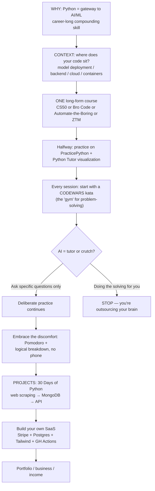
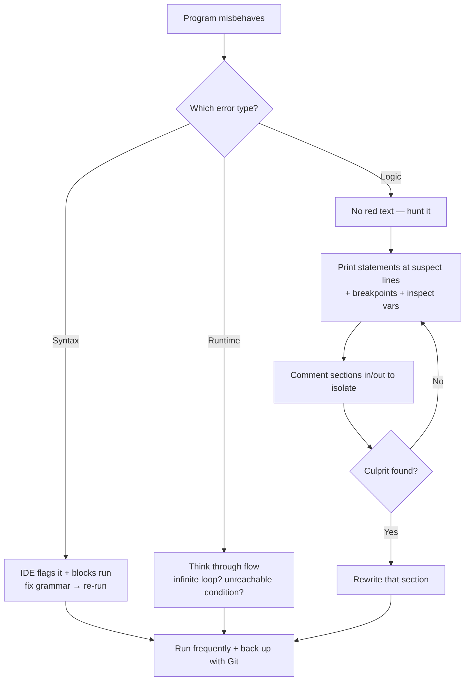
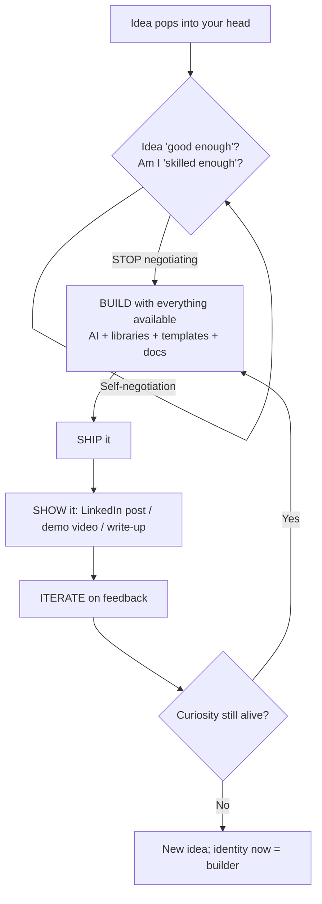

# Programming — Master Flowcharts

> The three loops that govern the whole module, rendered as state machines (Mermaid + ASCII).
> Each box = an action, each diamond = a decision.
> 1. **The Learning Loop** — from absolute zero to job-ready ([[learn-python-fast-system]]).
> 2. **The Debug Loop** — how to fix code you broke ([[programming-cs-fundamentals]] §10).
> 3. **The Build Loop** — from idea to shipped product ([[winning-in-tech-art-of-winning]]).

---

## 1. The Learning Loop (zero → builder)



**ASCII version:**

```
 START ─► CONTEXT ─► ONE COURSE ─► PRACTICE (PracticePython, Python Tutor)
                                        │
        P(product) ◄── SAAS ◄── 30 DAYS OF PYTHON ◄── DISCOMFORT-ZONE ◄──┘
        ▲                                     ▲                ▲
        └────────── portfolio / income ───────┴── CODEWARS DAILY ┘
```

---

## 2. The Debug Loop

See [[programming-cs-fundamentals]] §10 for the full text; the flow: **read the error → is it clear? → (yes) fix → (no) print/breakpoint → comment in/out → isolate → rewrite → re-test** with back-ups and small increments.



---

## 3. The Build Loop (idea → shipped, visible)



---

## 4. Mathematics & Creativity inside the mix

- **Quantity → quality** ([[mathematics-of-creativity]]) is the engine behind *build → ship → show → iterate*.
- **The 1% math edge** ([[math-for-programming]]) is what converts a copier into a *modifier* of code.
- **Focus/attention** ([[overview]]) is the fuel — Pomodoro, MITs, and distraction-proofing make all three loops run.

---

## 5. Module Navigation

- **[[overview]]** — the module synthesis & concept map.
- **[[programming-cs-fundamentals]]** · **[[math-for-programming]]** · **[[mathematics-of-creativity]]** · **[[winning-in-tech-art-of-winning]]** · **[[learn-python-fast-system]]**.