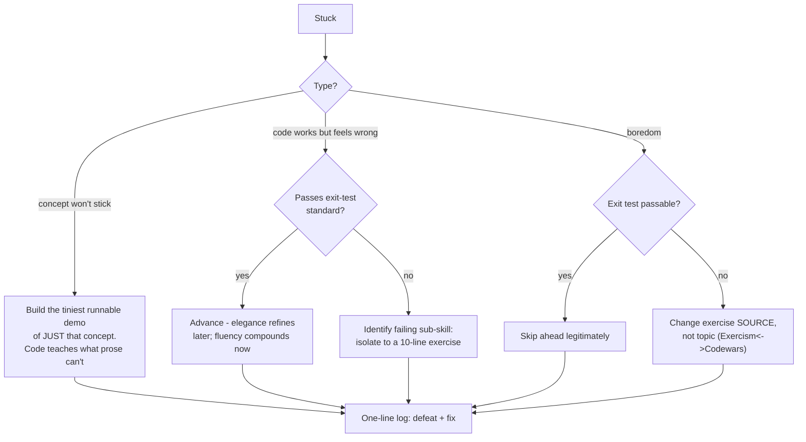

## For future agent
Deep edition of the Python mastery path. Adds per-stage failure-mode tables with mechanisms and early warnings, full premortem, defeat-tackling flowchart, the exit-test philosophy R&D (why stage gates beat hour-counting), life integration with college semesters, and metrics. Complements [[programming/object-oriented-programming/overview]]; ecosystem detail in [[languages-python-advanced]].

# Python Mastery Path — Deep Edition

## Part 1 — Design Philosophy (why stages, not hours)

Time-based plans ("learn Python in 30 days") fail because they measure INPUT while skill lives in OUTPUT. This path uses **stage gates**: you advance when an exit test passes, however long it takes. Gates convert vague anxiety ("am I learning?") into binary checks.

Second design principle: every stage ends SHIPPED — a running artifact exists. Artifacts compound; certificates don't.

## Part 2 — Stage Deep-Dives

### Stage 1 — Core Syntax + Problem Solving (banked if CS50 done)

- **Exit test**: 25 easy exercises ([Exercism](https://exercism.org)/Codewars) without lookups beyond stdlib docs.
- **Failure mode**: none usually — momentum stage. Boredom = signal to skip ahead.

### Stage 2 — Data Structures + Stdlib (3–4 weeks)

dict/list/set deep behavior, slicing, `collections` (`defaultdict`, `Counter`, `deque`), `itertools` basics, sorting with `key=`.

| Failure Mode | Mechanism | Early Warning | Counter |
|--------------|-----------|---------------|---------|
| Stdlib boredom quit | Dry reference-learning without output | Skipped sessions | Alternate stdlib days ↔ Codewars days |
| Loop-brain lock-in | Solving everything with nested for-loops | 10-line problems needing 40 | After solving, rewrite ONE solution functionally |

- **Mini-project**: log-file analyzer (parse server log → per-IP counts, top-10, hour histograms) in pure stdlib.
- **Exit test**: rewrite any frequency problem as ~4 lines with `Counter`.

### Stage 3 — Idiomatic Python (4–6 weeks)

Comprehensions, unpacking, `*args/**kwargs`, exceptions done right, classes → [[programming/object-oriented-programming/oop-foundations]], f-strings, `pathlib`.

Resources: [wtfpython](https://github.com/satwikkansal/wtfpython) · [pytudes](https://github.com/norvig/pytudes).

| Failure Mode | Root Cause | Early Warning | Counter |
|--------------|-----------|---------------|---------|
| OOP confusion spike | Abstraction before concrete reps | Classes feel ceremonial | Park classes one week; functional small programs; return fresh |
| Cleverness trap | Idioms used before understood | Code others can't read — including future-you | Rule: comprehension only when the loop version already works |

- **Mini-project**: CLI tool you'd actually use — e.g., a vault-note linter checking frontmatter (meta!).
- **Exit test**: explain mutable-default-argument bug three fixes deep; `is` vs `==` with interning example.

### Stage 4 — Real-World I/O (4–6 weeks)

Files (`with`, encodings), `requests`+JSON APIs, SQLite basics, pytest first tests, venvs + requirements.

| Failure Mode | Root Cause | Early Warning | Counter |
|--------------|-----------|---------------|---------|
| Env/dependency hell night | Ad-hoc global installs finally colliding | "works on my machine" moments | One evening on venv discipline saves months ([[languages-python-advanced]] hypermodern series) |
| API error handling skipped | Happy-path bias | Crashes on first bad response | Every request wrapped: timeout + status check + retry policy |

- **Mini-project**: public API → SQLite → daily markdown report generator.
- **Exit test**: rebuild mini-project blank-folder-to-working in ≤2h.

### Stage 5 — Language Depth (interleaved ongoing)

Context managers, generators/laziness, decorators, dunder survey → [[programming/object-oriented-programming/magic-methods-dunder]], typing hints, async reality-check (benchmarks show asyncio often loses to threads for HTTP servers — [[languages-python-advanced]]).

- **Exit test**: retry-with-exponential-backoff decorator from scratch; explain generator memory advantage concretely.

### Stage 6 — Production Habits

Project layout, black+ruff, pytest coverage habit, `breakpoint()` debugging over prints, reading others' code (Flask source is famously readable).

- **Exit test**: take any old script → introduce a real bug → tests catch it → lint clean → typed public functions.

## Part 3 — Full Premortem

*Mastery path abandoned at month 3.* Findings ranked:

1. **Tutorial relapse** during Stage 3's abstraction wall (videos resumed, builds stopped)
2. **Stage-gate skipping** — advanced on calendar pressure, not passed exits → Stage 5 built on sand
3. **No artifacts** — knowledge existed, nothing to show or return to
4. **Env chaos** poisoning every session start (unfixed Stage 4 debt)
5. **Perfectionism freeze** — rewriting Stage 3 project instead of advancing

Counters exist per-stage above; the premortem makes them visible BEFORE month 3.

## Part 4 — Defeat-Tackling Flowchart

## Part 5 — Life Integration

| Anchor | Practice |
|--------|----------|
| Fixed daily slot (45m) | Current stage work; same slot daily (implementation intention) |
| College synergy | SPM C-course concepts map onto Stage 2/5 depth; CS50p runs parallel |
| Exam weeks | Never-zero: one Codewars kata/day |
| Sunday review (15m) | Exit-test progress check + premortem signal scan + next-week plan |

**Semester phasing**: start new STAGES in college-light windows; mid-stage maintenance survives exam weeks via the floor.

## Part 6 — Success Metrics

| Metric | Healthy Signal |
|--------|---------------|
| Exit tests passed (cumulative) | Advancing ≥1 per 6 weeks |
| Built-vs-consumed ratio | ≥1 sustained |
| Mini-projects alive | Each stage's artifact still runs today |
| Kata streak | ≥5 days/week |
| Reading fluency | Can skim unfamiliar stdlib code and follow intent |

## Example Checkpoint Questions

1. What does this print and why: `def f(x, acc=[]): acc.append(x); return acc` called twice?
2. When is a tuple NOT effectively immutable?
3. Generator vs list comprehension in memory terms — name one workload where it matters.
4. Why is `with open(...)` safer than manual close — which mechanism guarantees cleanup?

## Cross-Vault Links

[[programming/cs50/week-6-python]] · [[programming/object-oriented-programming/overview]] · [[languages-python-advanced]] · [[how-to-self-teach]] · [[roadmap-data-scientist]]