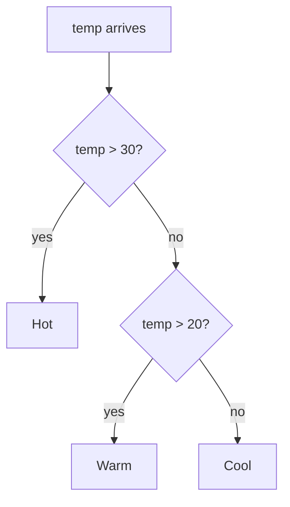
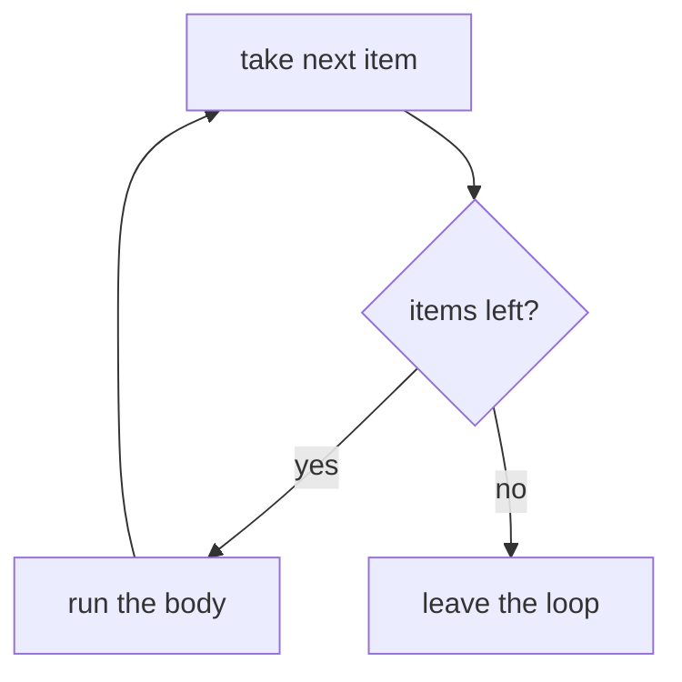

## For future agent
ELI5 Python revision for the [[01-Areas/Engineering/nexus-robotics/INDEX|Nexus Robotics interview]] (2026-10-06). Reader already knows Python basics — this is a confidence rebuild, not first teaching: plain words, one analogy each, runnable snippets (all executed on CPython 3.13 while drafting). Next step up: [[01-Areas/Programming/python-interview-revision-plain-language]]. Deep library: [[01-Areas/Programming/languages-python-advanced]].

# Python — Explained Like You're Five

## 0. What is Python, in one paragraph

If C is standing in the kitchen giving orders, Python is hiring a very good chef. You say "sort this list" and Python figures out the how. You trade direct control for speed of writing — which is exactly why sensor data gets parsed in Python on the laptop while the robot itself runs C.

**Say in the interview:** *"I use Python for data and iteration speed — parsing logs, analysis, tooling — and C where timing and memory matter. This interview's telemetry tasks are Python-shaped for exactly that reason."*

---

## 1. Variables — sticky notes, not boxes

```python
age  = 20
name = "Asha"
pi   = 3.14
```

In C a variable is a fixed-size box. In Python it's a **sticky note slapped on an object** — no declaration, no fixed type, and you can peel it off and stick it on something else entirely (`x = 5` then `x = "hi"` is legal).

**Say in the interview:** *"Python variables are dynamically typed references, not fixed storage. The type lives on the value, not the name."*

---

## 2. Strings — text you can slice

```python
s = "robot"
s[0]      # 'r'  — first character, counting from 0 like C
s[-1]     # 't'  — last character (negative counts from the end)
s[1:4]    # 'obo' — from index 1 UP TO (not including) 4
```

**Say in the interview:** *"Indexing starts at zero, negatives count from the end, and slices exclude the end index."*

**f-strings** — putting values inside text:

```python
name, score = "Asha", 95
print(f"{name} scored {score}")   # Asha scored 95
```

The `f` in front means "fill in the curly braces." That's all it is.

---

## 3. The four containers — shelves

```python
my_list  = [1, 2, 3]       # numbered shelf — order kept, editable
my_tuple = (1, 2, 3)       # numbered shelf behind glass — order kept, FROZEN
my_set   = {1, 2, 3}       # lucky-dip bag — no order, no duplicates
my_dict  = {"a": 1}        # labelled drawers — name → thing
```

| Container | Ordered? | Changeable? | Duplicates? | Superpower |
|---|---|---|---|---|
| `list` | yes | yes | yes | the default workhorse |
| `tuple` | yes | **no** | yes | safe to pass around, usable as dict keys |
| `set` | no | yes | **no** | instant membership testing |
| `dict` | insertion order | yes | keys unique | counting and lookups |

**The one performance sentence that scores:**

```python
x in my_list   # slow — checks every item, one by one
x in my_set    # fast — jumps straight to it
```

**Say in the interview:** *"Lists keep order and allow duplicates. Tuples are frozen lists. Sets drop duplicates and test membership instantly. Dicts map keys to values — they're what I reach for when counting things."*

**Counting trick (use it, it's idiomatic):**

```python
from collections import Counter
Counter(["a", "b", "a"])   # {'a': 2, 'b': 1}
```

---

## 4. Decisions — `if` / `elif` / `else`

```python
if temp > 30:
    print("Hot")
elif temp > 20:
    print("Warm")
else:
    print("Cool")
```



Same logic as C. Two differences: `elif` instead of `else if`, and **indentation replaces braces** — the spaces ARE the structure.

**Say in the interview:** *"Same branching logic as C, but blocks are defined by indentation rather than braces."*

---

## 5. Loops

```python
for i in range(5):    # 0, 1, 2, 3, 4 — five rounds, like C
    print(i)

for name in ["a", "b"]:   # walk straight through the items — no index needed
    print(name)
```



Python's `for` walks through things directly — you usually don't need a counter at all. Need both index and item? `enumerate`:

```python
for i, name in enumerate(["a", "b"]):
    print(i, name)   # 0 a / 1 b
```

`break` exits now, `continue` skips to the next item — same as C.

**Say in the interview:** *"Python's for iterates over items directly rather than counting. Enumerate gives index plus item when I need both."*

---

## 6. Functions

```python
def add(a, b):
    return a + b     # hand the answer back

add(2, 3)            # 5
```

Same idea as C, less ceremony: no types declared, `def` instead of a return type.

**The trap:** a function with no `return` gives back `None` — silently:

```python
def add(a, b):
    a + b        # computed... and thrown away

x = add(2, 3)    # x is None, NOT 5
```

**Say in the interview:** *"Def defines a function, return hands a value back. A missing return silently yields None, which is the classic beginner bug."*

**Defaults and keywords:**

```python
def greet(name="friend"):
    return f"Hi {name}"

greet()          # Hi friend
greet("Asha")    # Hi Asha
```

---

## 7. `import` — borrowing someone's toolbox

```python
import math
math.sqrt(16)      # 4.0

from math import sqrt
sqrt(16)           # 4.0 — same thing, shorter name
```

Your file is one toolbox. `import` borrows another one. `from X import Y` borrows just one tool. That is the entire concept — and it is exactly how the project pages work: `import cv2` borrows the camera toolbox, `import mediapipe` borrows the hand-finding toolbox.

**Say in the interview:** *"Import makes another module's tools available. Plain import keeps the module name as a prefix; from-import pulls names directly."*

---

## 8. Files — `with` cleans up after you

```python
with open("log.csv") as f:
    for line in f:
        print(line)
```

`with` means "open this, let me use it, and **close it automatically when I leave** — even if something crashes." Always use `with`. Never open/close by hand.

**The trap:** mode `"w"` **erases** the file first. `"r"` reads, `"a"` appends. Same trap as C's `fopen`.

**Say in the interview:** *"With guarantees the file closes even on error. Write mode truncates, so I double-check the mode before opening anything I care about."*

---

## 9. Classes — cookie cutters

```c
// C version (for comparison): a struct holds data, functions sit outside
struct Student { int roll; char name[30]; };
```

```python
class Student:                        # the cookie cutter
    def __init__(self, name, roll):   # runs when a cookie is cut
        self.name = name              # THIS student's name
        self.roll = roll

s = Student("Asha", 101)              # cut one cookie
s.name                                # Asha
```

- A **class** is the cutter (the design). An **object** is one cookie.
- `__init__` runs at creation and sets up that object's data.
- `self` means "this particular object" — it's how the method knows which cookie it's working on.

**Say in the interview:** *"A class defines the shape, objects are instances of it. Init sets up per-object state, self refers to the current instance."*

---

## 10. try/except — planning for failure

```python
try:
    x = int(input("Number: "))
except ValueError:
    print("That wasn't a number")
```

"Try this risky thing. If THIS specific thing goes wrong, do that instead." Name the error you expect — a bare `except:` with no name catches everything including your own typos, which hides bugs.

**Say in the interview:** *"Try/except handles expected failure modes explicitly. I catch specific exceptions, never bare except, because swallowing everything hides real bugs."*

---

## 11. List comprehensions — one-line loops

```python
squares = [x * x for x in range(5)]   # [0, 1, 4, 9, 16]
```

Read it inside-out: "x-squared, for each x in 0–4." Same as a loop that appends, in one line.

**Say in the interview:** *"A comprehension builds a list in one expression — same as an append loop, but declarative. I use it when it stays readable on one line."*

---

## 12. The traps, all in one list (read before sleep)

1. `=` assigns, `==` compares (same as C, still catches people).
2. Slices **exclude** the end: `[1:4]` gives indexes 1, 2, 3.
3. `range(5)` is 0–4, not 1–5.
4. Empty string, empty list, `0`, and `None` are all **falsy**.
5. Missing `return` → `None`, silently.
6. Bare `except:` hides your own bugs — name the error.
7. `"w"` erases the file.
8. Indentation IS structure — mixed tabs/spaces break silently-looking code.
9. `is` checks identity, `==` checks value — use `is None`, never `== None`.
10. `import` runs the whole file — hence the `if __name__ == "__main__":` guard.

---

## 13. Python vs C in one breath (they WILL ask)

> *"Python trades control for speed of writing — no manual memory, no compile step, huge libraries. C trades writing speed for control — exact memory layout, exact timing, no interpreter in the way. I parse and analyse in Python on the laptop, and the robot itself runs C because the control loop has a deadline."*

---

## Where next

- Same ideas, denser: [[01-Areas/Programming/python-interview-revision-plain-language]]
- C twin: [[01-Areas/Programming/c-revision-eli5]]
- Advanced: [[01-Areas/Programming/languages-python-advanced]]
- Applied version (do these next): [[01-Areas/Engineering/nexus-robotics/nexus-python-drills]]
- Home: [[01-Areas/Engineering/nexus-robotics/INDEX]]
