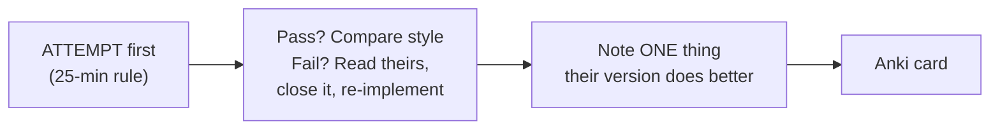
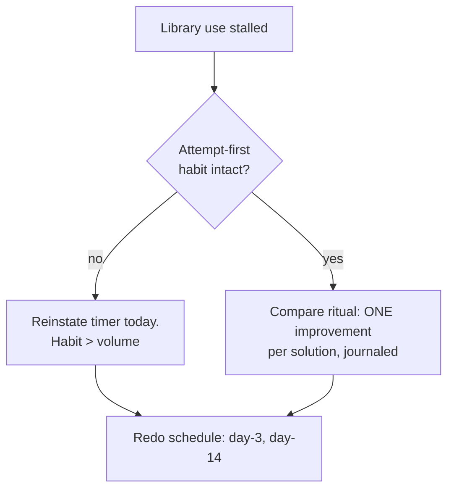

## For future agent
Three implementation libraries expanded together — they serve one function: *reference implementations to compare against after you attempt from scratch*. Includes javascript-algorithms' complexity tables (its best asset). Rule: NEVER read before attempting; these are answer keys, not tutorials.

# Algorithm Implementation Libraries — Expanded

## Repo A: TheAlgorithms/Python

Hundreds of algorithms in pure Python, categorized: **data_structures, sorting, searching, graphs, maths, ciphers, machine_learning, neural_network, dynamic_programming, strings, digital_image_processing** and more. Every file runnable standalone.

Best use: after implementing e.g., Dijkstra yourself → diff your version against theirs; steal their edge-case handling.

## Repo B: trekhleb/javascript-algorithms

The most pedagogically organized of the three. Its structure:

- **Data Structures**: linked list, doubly list, queue, stack, hash table, heap, priority queue, trie, tree families (BST, AVL, red-black, segment, fenwick), graph, disjoint set, bloom filter, LRU cache
- **Algorithms by Topic**: math, sets, strings, searches, sorting, linked lists, trees, graphs, cryptography, ML bits
- **Algorithms by Paradigm**: brute force, greedy, divide & conquer, dynamic programming, backtracking, branch & bound
- **Its killer tables**: Data Structure Operations Complexity + Array Sorting Complexity + Big-O explanations — copy these into Anki

## Repo C: priyankchheda/algorithms (C++)

Compact classic algorithms in C++ — useful for the SPM/C++ course track and quant-interview flavor.

## The Protocol (the only correct way to use answer keys)

## Failure Points

| Failure | Counter |
|---------|---------|
| "Reading implementations" as studying | Attempt-first rule is absolute |
| Copying into interviews muscle memory | Re-implement weekly from blank editor ([[dsa-interview-playbook]] redo rule) |

## Example Self-Check Questions

1. Their LRU cache uses which two structures together, and why exactly those two?
2. In their DP section, find one top-down vs bottom-up pair — when is each preferable?
3. From the JS repo's complexity table: average vs worst for quicksort — what causes the gap?

## Deep Edition Addendum

**Failure modes of implementation-library users**:

| Failure | Mechanism | Counter |
|---------|-----------|---------|
| Answer-key addiction | Reading before attempting → fluency illusion | Attempt-first 25-min timer is absolute |
| Copy-paste "solving" | Working code ≠ owned code | Close source, re-implement cold, then diff |
| Style cargo cult | Adopting clever one-liners unread | One-line journal: what their version does better |

**Premortem**: *"Studied" three algorithm repos; interviews unchanged.* Findings: read implementations linearly like novels; never attempted-then-compared; complexity tables skimmed not memorized. The libraries are answer KEYS — keys without attempts are trivia.

**Rescue flowchart**:

**Life integration**: library opened ONLY after an attempt exists (browser tab discipline); metrics = attempt-before-read ratio, journal entries per week.

## Cross-Vault Links

- [[dsa-interview-playbook]] · [[repo-coding-interview-university]]
- [[software-dev-general]]