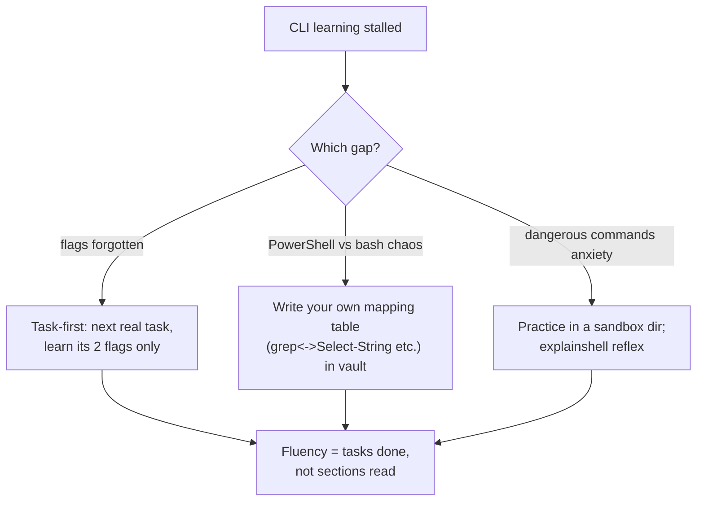

## For future agent
The canonical CLI fluency guide, expanded from its real section structure (fetched 2026-08-24): Basics → Everyday use → Processing files and data → System debugging → One-liners → Obscure but useful → macOS/Windows-only. Includes a Windows section directly relevant to this vault's PowerShell environment.

# The Art of Command Line — Expanded

## Its Section Map (with the highest-value items per section)

### Basics
- Learn Bash basics; `man` + `--help` reflex; Ctrl-R history search; Ctrl-C vs Ctrl-D difference

### Everyday use
- Globbing and word-designators (`!$`, `!!`), `cd -`, pushd/popd
- **ssh** properly: keygen, agent, `.ssh/config`; port forwarding basics
- File permissions, `chmod`; process management: `ps aux | grep`, signals, `kill`
- `curl`/`wget` with flags; disk: `df`, `du`; `free`

### Processing files and data
- The core trio: **grep/sed/awk** — learn one new flag per day
- `cut`, `paste`, `join`, `sort` (`-u`,`-k`,`-t`), `uniq`, `tr`, `head/tail -f`
- **jq** for JSON (its own sub-skill; see [[software-dev-general]] mastering-jq link)
- Compression zoo: tar flags, gzip/zstd differences at concept level

### System debugging
- `htop`/`lsof`/`dmesg`; `iostat`/`netstat` awareness
- strace/ltrace existence-level knowledge (what they're for)

### One-liners
The famous section — e.g., quick web-server `python -m http.server`, diff via git, timestamped history tricks. Skim monthly; absorb two per month by USE not reading.

### Obscure but useful / macOS / Windows
- **Windows section matters here**: ways to get Unix tools under Windows (WSL, Git Bash, Cygwin), useful native tools, tips — this vault runs on PowerShell 5.1, so map each Unix idiom to its PS equivalent (`Select-String`≈grep, `%`≈foreach-object alias, `$?` semantics).

## Fluency Protocol

| Habit | Frequency |
|-------|-----------|
| One new flag in daily terminal use | Daily |
| explainshell any unfamiliar pipeline before running | Always |
| Re-do a GUI task via CLI (file rename batch, log scan) | Weekly |

## Failure Points

| Failure | Counter |
|---------|---------|
| Copy-pasting one-liners blindly | `rm -rf` variants live here; read every token (explainshell) |
| Trying to memorize sections | Absorb through tasks only; the doc is reference, not curriculum |

## Example Checkpoint Questions

1. What does `grep -rn --include='*.md' 'TODO' .` do, token by token?
2. Difference between `>` and `>>`; between `2>&1` placement before/after a pipe.
3. In PowerShell 5.1, what replaces `grep -r` and why does `&&` fail there?

## Deep Edition Addendum

**Failure modes of CLI learners**:

| Failure | Mechanism | Counter |
|---------|-----------|---------|
| One-liner paste hazards | Blind copy of `rm -rf`-class commands | explainshell EVERY unfamiliar pipeline |
| Reference-as-curriculum | Reading sections linearly, retaining nothing | Absorb via tasks only: one new flag per real use |
| GUI regression | Reverting to file manager under time pressure | Weekly: redo one GUI task via CLI deliberately |

**Premortem**: *"Learned the command line" thrice; still GUI-dependent.* Findings: read the doc cover-to-cover twice (retention ≈ 0), never configured `.ssh/config`, PowerShell/Unix confusion never resolved into a deliberate map. The fluency protocol exists because command lines are motor skills.

**Rescue flowchart**:

**Life integration**: this vault runs on Windows — every Unix idiom gets a PS-mapping line in [[Gotchas]]; metrics = CLI-tasks-per-week, explainshell lookups becoming rare (internalization signal).

## Cross-Vault Links

- [[software-dev-general]] CLI mastery section
- [[Gotchas]] — PowerShell quirks already logged in this vault