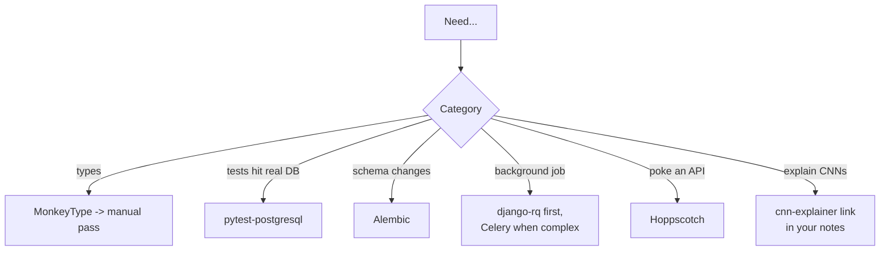
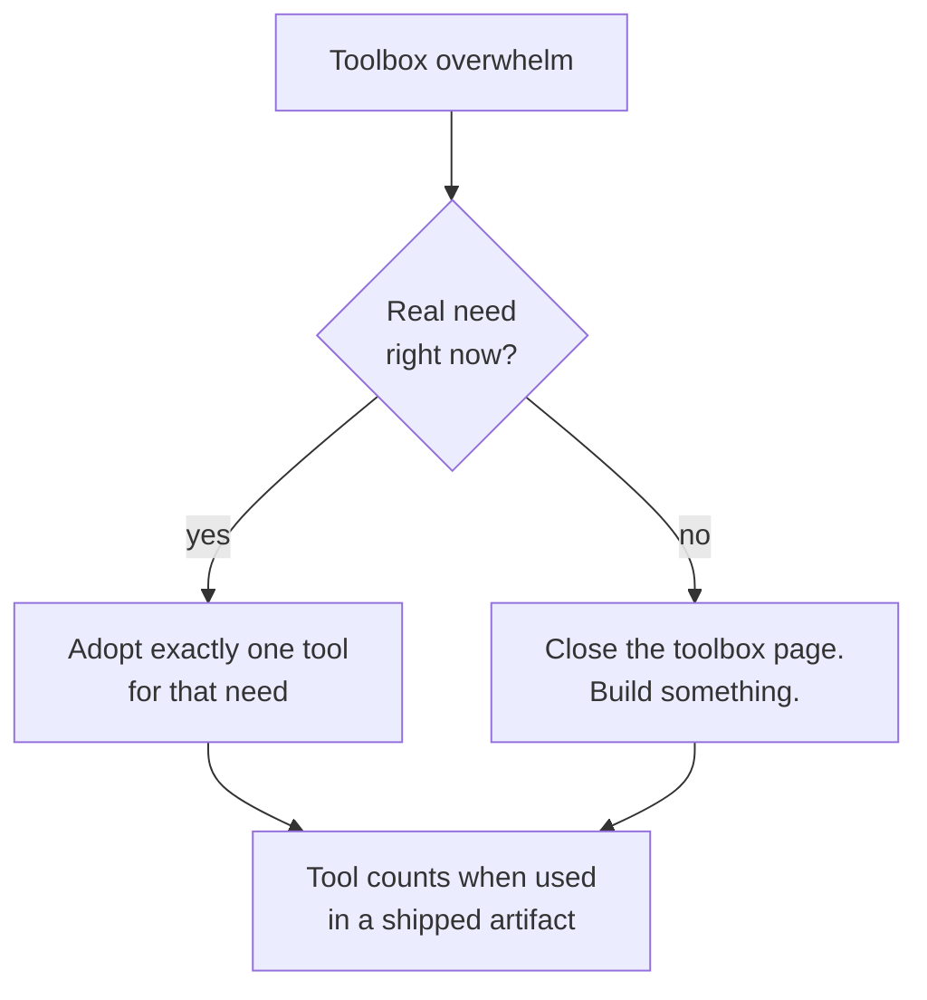

## For future agent
All small utility repos from the knowledge-repo README grouped by function — each gets a two-line verdict and when-to-reach-for-it. These don't warrant individual pages; this page is their index. Volatile tools marked.

# Developer Toolbox Minors — Expanded

## Python Craft Utilities

| Repo | Verdict |
|------|---------|
| **instagram/MonkeyType** | Auto-generates type hints from runtime tracing — great bootstrap for typing legacy code; review before committing |
| **rednafi/pysanity** | Opinionated style/philosophy checklist — read once, adopt selectively |
| **norvig/pytudes** *(own page-level coverage in [[languages-python-advanced]])* | Study-quality programs; read like literature |

## Testing & Databases

| Repo | Verdict |
|------|---------|
| **google/googletest** | The C++ unit-test framework standard; learn assertions + fixtures only |
| **pytest-postgresql / pgmock** | Spin real Postgres in integration tests — beats mocking SQL |
| **alembic** | SQLAlchemy migrations; the Python answer to schema versioning |
| **flyway / roundhouse** | DB version control outside Python ecosystems; concept: migrations-as-code |
| **psycopg** | THE Postgres driver for Python; know its parameterized-query idiom (SQL-injection safety) |

## Background Jobs & Messaging

| Repo | Verdict |
|------|---------|
| **rq/django-rq** | Redis Queue for Django — simplest honest background jobs |
| **django-celery era → celery directly** | Historical pypi shim; modern usage configures Celery directly `(TBC)` |
| **tomconte/sample-keda-queue-jobs** | Reference for KEDA queue-triggered scaling demos |

## Bots & Scraping

| Repo/Doc | Verdict |
|----------|---------|
| **Telethon docs** | Full Telegram MTProto client (user-account bots too) — more powerful than Bot API alone |

## Vision / Interactive ML

| Repo | Verdict |
|------|---------|
| **poloclub/cnn-explainer** | In-browser interactive CNN — best teaching artifact for conv layers; show non-ML friends here |
| **victordibia/handtracking** | SSD hand detector w/ pretrained model — quick AR-style demos |
| **google/graph_distillation** | Research code for label-transfer across datasets; niche |

## Infra Utilities

| Tool | Verdict |
|------|---------|
| **liyasthomas/postwoman (now Hoppscotch)** | Open-source Postman in browser; fast API poking |
| **k8syaml.com** | YAML scaffolding generator; start-then-edit tool |
| **Pulumi** | Infra-as-code in real languages vs YAML/HCL; steeper but durable skill |
| **KeyDB** | Multithreaded Redis fork; reach for Redis bottlenecks `(TBC: project activity as of 2026)` |
| **yolossn/Prometheus-Basics** | Metric types → PromQL primer repo; one-evening read before any monitoring work |
| **DigitalOcean nginx config generator** | UI that emits sane nginx configs; learning tool more than prod crutch |

## Reach-For Rules

## Deep Edition Addendum

**Failure modes of toolbox pages** (including this one):

| Failure | Mechanism | Counter |
|---------|-----------|---------|
| Toolbox tourism | Installing 20 utilities, using none | Reach-for-rules flowchart = adopt on REAL need only |
| Version archaeology | Studying stale tools as if current | `(TBC)` marks mean: verify activity before investing |
| Utility substitution | Tool-learning replacing core-skill building | Tools attach to projects; never standalone study |

**Premortem**: *"Optimized my setup" for a month.* Findings: MonkeyType run once, pytest configured twice, zero features shipped — setup perfectionism is procrastination with a productivity costume. Every entry here earns its place mid-project, not before it.

**Rescue flowchart**:

**Life integration**: revisit quarterly; prune entries unused for 6 months; metrics = tools-in-active-use count (small is healthy).

## Cross-Vault Links

- [[languages-python-advanced]] · [[systems-design-distributed]] · [[python-datascience-topics]]
- [[01-Areas/Business/automations/quick-start-guide]] — Telegram via n8n as no-code alternative