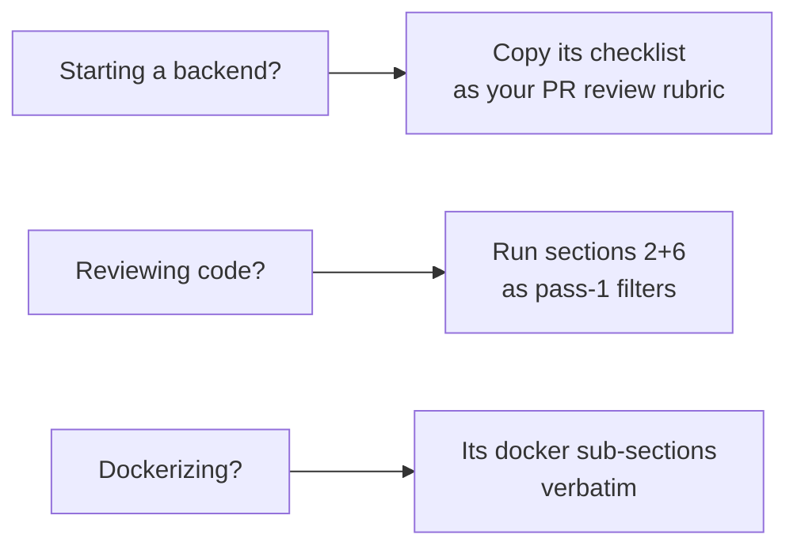
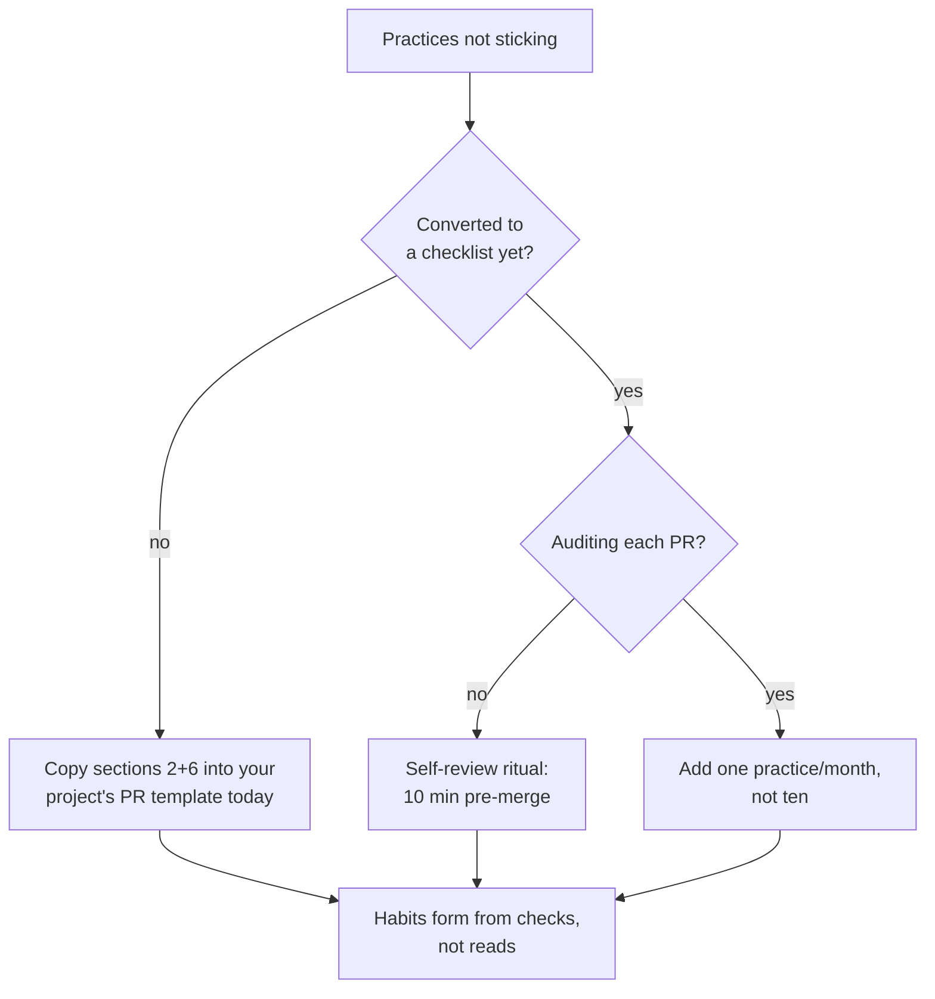

## For future agent
The huge Node.js best-practices compendium (100k+ stars; 2026 edition active). Its Docker and security sections are language-agnostic — that's why the knowledge-repo linked it inside Systems Design. Structure below from its real TOC (fetched 2026-08-24). Use as a checklist during code review of any backend.

# Node.js Best Practices — Expanded

## Its Section Architecture (real TOC, condensed)

1. **Project Architecture Practices** — structure by business components (not technical layers); 3-tier layering with web layer boundaries; environment-aware hierarchical config; thoughtful framework choice; TypeScript "sparingly and thoughtfully" (its own 2026 stance)
2. **Error Handling** — async/await everywhere; extend built-in Error; **operational vs catastrophic error distinction**; central (non-middleware) handling; OpenAPI-documented API errors; graceful shutdown; mature loggers; APM; unhandled-rejection traps; fail-fast argument validation
3. **Code Patterns & Style** — ESLint + Node plugins; naming conventions; const-over-let, no var; explicit entry points; ===; async-await over callbacks; no cross-function side effects
4. **Testing & QA** — the pyramid (unit/integration/e2e); test real components not mocks-of-everything; include DB in integration tests; coverage as signal not goal
5. **Going to Production** — health checks (`/health` + readiness), graceful degradation, zero-downtime restarts, process managers/clustering
6. **Security Practices** — the big one: linter security rules, secrets management, ORM/query-sanitization against injection, rate limiting, HTTPS/HSTS, non-root containers
7. **Performance** — avoid sync code in hot paths, JSON payload care, CPU-long tasks to worker threads, queue offloading

## The Language-Agnostic Gold (why it's in a systems-design list)

| Practice | Applies To |
|----------|-----------|
| Build-time secrets never baked into images | Any Dockerfile ([[systems-design-distributed]]) |
| Multi-stage builds | Any compiled/served app |
| Operational vs catastrophic errors | Every backend language |
| Health/readiness endpoints + graceful shutdown | K8s-era deployment baseline |
| Business-component structure over tech-layer folders | Most services |

## Usage Protocol

## Failure Points

| Failure | Counter |
|---------|---------|
| Applying ALL practices on day 1 | It's a maturity ladder — start: config, errors, health checks, secrets |
| JS-specific dismissal by Python devs | Sections 2/5/6 port 1:1 to FastAPI/Django work |

## Example Checkpoint Questions

1. Operational vs catastrophic error — give one example of each and why their handling must differ.
2. Why is per-technical-layer foldering ("all controllers here") considered harmful at scale?
3. What breaks first if `/health` only checks process-alive but not DB connectivity?

## Deep Edition Addendum

**Failure modes of best-practices-list users**:

| Failure | Mechanism | Counter |
|---------|-----------|---------|
| Day-1 maximalism | 100 practices attempted → paralysis → none kept | Maturity ladder: config, errors, health-checks, secrets FIRST |
| Language dismissal | "I write Python" skips the page | Sections 2 (errors), 5 (production), 6 (security) port 1:1 to any backend |
| Checklist-as-ceiling | Practices adopted once, never re-audited | Use as PR-review rubric per project, quarterly refresh |

**Premortem**: *"Read all the best practices"* then built a service violating half of them. Findings: read passively; no checklist converted into review template; build-time secrets shipped in image anyway (the classic). Lists change behavior only when converted into CHECKS.

**Rescue flowchart**:

**Life integration**: attach rubric to every backend build ([[build-project-playbook]] README contract); metrics = rubric-audited PRs, incidents caught by own review.

## Cross-Vault Links

- [[systems-design-distributed]] · [[repo-fullstack-web-developer-path]] · [[01-Areas/Programming/SAAS_BUILD_NOTES]]