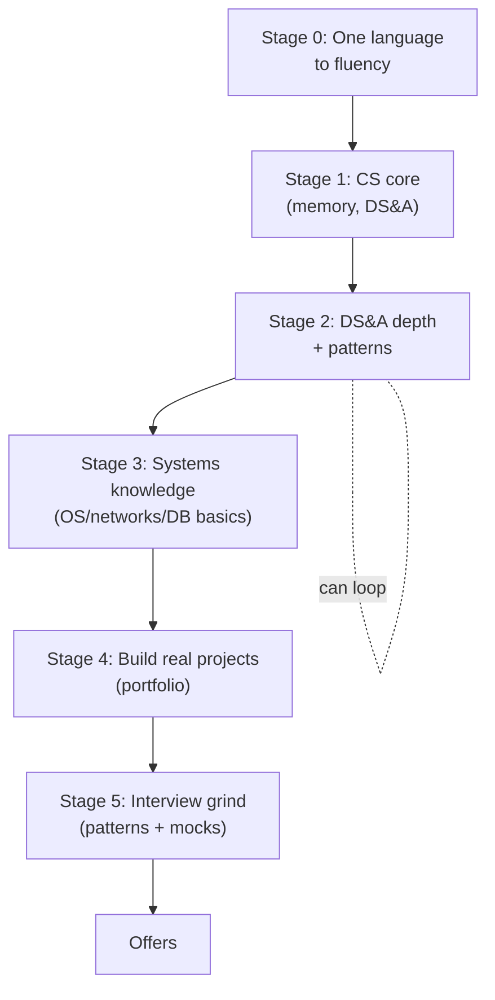

## For future agent
Complete SWE roadmap distilled from coding-interview-university's actual curriculum headings (fetched 2026-08-24) plus Teach Yourself CS. Stage-based with explicit exit tests, per-stage failure points, and build projects. India-fresher aware. Pairs with [[dsa-interview-playbook]] for question practice and [[how-to-self-teach]] for method.

# Software Engineer Roadmap

## The Map

## Stage 0 — Pick ONE Language, Get Fluent (4–8 weeks)

Choose **Python** (fastest feedback, this vault's ecosystem) or **C++** (SPM course synergy, quant signal). Java acceptable.

| Do | Don't |
|----|-------|
| Solve 30–50 small exercises ([Exercism](https://exercism.org), [HackerRank](https://www.hackerrank.com)) | Start a second language |
| Read error messages fully | Copy-paste from tutorials |

**Exit test**: implement a linked list + hash map from scratch in your language without references; explain every line to a rubber duck.

**Quit point**: "syntax is boring" → skip ahead to tiny projects; syntax consolidates through use, not study.

## Stage 1 — How Computers Actually Work (4–6 weeks)

From CIU's curriculum: **memory (stack vs heap, pointers/references), compilation, binary/two's complement**, plus Teach Yourself CS's pick: *CS50* or *Nand2Tetris*.

- Vault shortcut: [[programming/cs50/index]] weeks 1–4 cover exactly this with practice.
- **Exit test**: explain what happens between `main()` call and `printf` output — stack frames, addresses, registers — in your own words.
- **Failure point**: skipping this because "I just want to code" — it returns as inexplicable bugs and failed memory questions in interviews.

## Stage 2 — Data Structures & Algorithms Depth (10–16 weeks)

CIU order (verbatim structure): **Big-O → arrays/strings → linked lists → stacks/queues → hash tables → trees/BSTs → heaps → graphs → sorting/searching → recursion/backtracking → DP intro**.

Weekly rhythm:
- 2 new topics (learn via [[software-dev-general]] visualizers)
- 12–15 problems (see [[dsa-interview-playbook]] pattern ladder)
- Sunday: redo the week's 3 hardest from blank editor

**Exit test**: solve a random LeetCode medium in ≤35 min while talking aloud; pass 8/10 tries.

**Quit points**: DP feels impossible (→ it is, at first; do only memoized Fibonacci → climb stairs → house robber for two weeks straight); plateau at month 2 (→ [[how-to-self-teach]] recovery).

## Stage 3 — Systems Minimum (4–6 weeks)

What every SWE interview assumes: **HTTP, client-server, DNS, caching basics, SQL (joins, indexes), processes vs threads, concurrency vocabulary**.

- CS50 weeks 7–9 + [[systems-design-distributed]] primer links
- **Exit test**: given "design a URL shortener," produce storage schema, API shape, and one scaling decision with tradeoff — in 20 minutes.

## Stage 4 — Portfolio Projects (parallel from Stage 2 onward)

Two projects minimum, built per [[build-project-playbook]]:
1. **One deployed full-stack app** (API + DB + frontend or bot) — proves you ship
2. **One domain project** matching target role (ML model served behind an API for MLE track; trading backtest for quant interest)

**Failure point**: ten half-built repos. Rule: nothing goes on GitHub without a README + working run instructions.

## Stage 5 — Interview Grind (6–10 weeks)

- Patterns drill ([[dsa-interview-playbook]]) → company-tagged problems → 4+ mock interviews (Pramp / peers / AI-mocked)
- Behavioral stories written using STAR ([[interview-counter-guide]])
- India-specific: also prep aptitude rounds + OOP viva questions for service companies ([[example-question-bank]])

**Exit test**: 3 consecutive mock passes; resume reviewed by someone senior; applications sent in batches of quality ([[market-analysis-tech-2026]] strategy).

## Example Checkpoint Questions

1. Why is hash table lookup O(1) average but O(n) worst? What causes the worst case?
2. When would you pick an array over a linked list? Three concrete reasons.
3. What does the heap (memory) have that the stack doesn't — and who cleans each up?
4. A program works with 100 records, dies with 1M. First three suspects?

## Cross-Vault Links

- [[programming/cs50/index]] — Stage 1–3 practiced form
- [[dsa-interview-playbook]], [[system-design-interview]], [[interview-counter-guide]] — stage 5 weapons
- [[roadmap-data-scientist]], [[roadmap-ml-engineer]] — alternate tracks