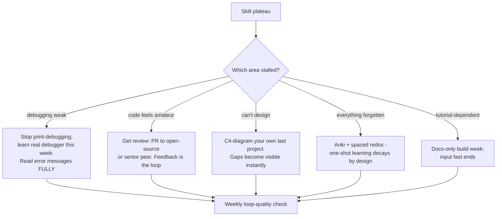

## For future agent
Deep edition of the general software engineering catalog. Adds the craft-development mechanism (why some devs compound and others plateau), per-area failure modes (the standard ways engineers stall), learning-order logic across these resources, defeat-tackling flowchart for skill plateaus, life integration. DSA drills live separately in [[dsa-interview-playbook]]; language pages are siblings.

# Software Development General — Deep Edition

## Part 1 — The Compounding-vs-Plateau Mechanism

Two engineers with equal start years diverge because of *feedback loop quality*, not talent:

| Loop Quality | Behavior | 5-Year Outcome |
|--------------|----------|----------------|
| **Fast feedback** | Ships small increments; reads errors fully; seeks code review; rebuilds from memory | Compounding fluency |
| **Slow/no feedback** | Big-bang attempts; copy-paste without reading; avoids review; follows tutorials forever | Plateau at year-2 level |

Every resource below is selected because it installs a faster feedback loop in some area. Use them as loop-upgrades, not reading material.

## Part 2 — Learning Tools
- [Learn Anything](https://learn-anything.xyz/) — visual knowledge-map search
- **[learnXinYminutes](https://learnxinyminutes.com/)** — first stop in any new language; syntax tour before commitment
- [devhints](https://devhints.io/) — cheatsheets

Failure mode: collecting learning tools instead of learning. One tool per need, in use, beats five bookmarked.

## Part 3 — CS Fundamentals & Knowledge

- **[Teach Yourself Computer Science](https://teachyourselfcs.com/)** → expanded [[repo-teachyourselfcs]] — 9 subjects, one book+course each
- [Things Every Programmer Should Know](https://github.com/mr-mig/every-programmer-should-know)
- [Naming Conventions](https://www.wikiwand.com/en/Naming_convention_(programming)) · [FP Jargon](https://functional.works-hub.com/blog/Functional-Programming-Jargon)
- [CS for Engineers (Robert Elder)](https://blog.robertelder.org/computer-science-for-engineers/)
- Books: [no-CS-degree must-reads HN thread](https://news.ycombinator.com/item?id=22803780) · [TAOCP](https://www.amazon.com/Computer-Programming-Volumes-1-4A-Boxed/dp/0321751043/) — reference, not reading
- **[Big-O Cheat Sheet](https://www.bigocheatsheet.com/)** — complexity tables until memorized

**Failure mode**: fundamentals as endless prerequisite ("I'll build after I learn everything") — the loop dies. Rule: fundamentals study capped at 30% of total time; building gets 70%.

## Part 4 — Algorithms & Data Structures / Interviews

### Study Systems
[Coding Interview University](https://github.com/jwasham/coding-interview-university) → [[repo-coding-interview-university]] · [geeksforgeeks DS](https://www.geeksforgeeks.org/data-structures/) · [TheAlgorithms/Python](https://github.com/TheAlgorithms/Python) + [javascript-algorithms](https://github.com/trekhleb/javascript-algorithms) → [[repo-algorithms-implementations]]

### Visualizations (intuition builders)
**[visualgo](https://visualgo.net/)** · [algorithm-visualizer](https://algorithm-visualizer.org/) · [USF visualizations](https://www.cs.usfca.edu/~galles/visualization/Algorithms.html)

### Books
Sedgewick C bundle · [DS&A with Java 4th](https://www.amazon.com/Data-Structures-Abstractions-Java-4th/dp/0133744051) · [Problem Solving with Python 2nd](https://www.amazon.com/Problem-Solving-Algorithms-Structures-Python/dp/1590282574) · CLRS (reference tier)

### Practice & internals
[LeetCode](https://leetcode.com/) · [HackerRank](https://www.hackerrank.com/) — drilled via [[dsa-interview-playbook]], never randomly · [Lambda function deep-dive](https://stackoverflow.com/questions/16501/what-is-a-lambda-function) · [Intro to compilers](https://nicoleorchard.com/blog/compilers)

**Failure mode**: problem-count vanity. 400 easy problems < 100 pattern-mastered mediums ([[dsa-interview-playbook]] ladder logic).

## Part 5 — Software Architecture
- **[Martin Fowler's Architecture Guide](https://martinfowler.com/architecture/)** — entry point
- [Architecture of Open Source Applications](http://aosabook.org/en/index.html) — real architects on real systems
- [Software Architecture Patterns (free O'Reilly)](https://www.oreilly.com/programming/free/files/software-architecture-patterns.pdf)
- **[C4 Model](https://c4model.com/)** — Context/Containers/Components/Code diagramming standard
- [SoftwareArchitect roadmap](https://github.com/justinamiller/SoftwareArchitect) · [GoF origins](https://en.wikipedia.org/wiki/Design_Patterns) → implementations [[01-Areas/Programming/object-oriented-programming/design-patterns]]

**Failure mode**: architecture vocabulary without a system to apply it to. Minimum: one project documented in C4 before reading deeper.

## Part 6 — Engineering Practices
- **[Google code review guide](https://google.github.io/eng-practices/review/reviewer/)** — official reviewer standard
- Git: [interactive tutorial](https://try.github.io/)
- ["I am a mediocre developer"](https://dev.to/sobolevn/i-am-a-mediocre-developer--30hn) — automation over heroics mindset

## Part 7 — Command Line Mastery
→ full expansion: [[repo-art-of-command-line]]
[Art of Command Line](https://github.com/jlevy/the-art-of-command-line/) · [htop explained](https://peteris.rocks/blog/htop/) · [tldr](https://tldr.ostera.io/) · **[explainshell](https://www.explainshell.com/)** · Bash: [Wooledge guide](http://mywiki.wooledge.org/BashGuide), [bash-hackers](https://wiki.bash-hackers.org/), [conditionals](https://www.gnu.org/software/bash/manual/html_node/Conditional-Constructs.html) · [jq series](https://codefaster.substack.com/p/mastering-jq-part-1-59c) · [CLI text processing](https://github.com/learnbyexample/Command-line-text-processing)

## Part 8 — Tooling
[analysis-tools.dev](https://analysis-tools.dev/) — 483+ static analysis tools compared by language.

## Part 9 — Defeat-Tackling Flowchart (craft plateau)

## Part 10 — Life Integration

- Fundamentals/architecture reading = commute/low-energy slots; hands-on = peak slots ([[how-to-self-teach]] energy map)
- Code-review habit: every personal project PR self-reviewed against Google's guide checklist once before merge
- Metrics: debugger sessions (vs prints) ratio ↑ · reviewed-PR count · C4 docs existing per project · CLI tasks done without GUI

## Example Checkpoint Questions

1. Which feedback loop in YOUR practice is currently slowest — and what upgrade fixes it?
2. Explain your last project's architecture in C4 terms. Where did you hesitate?
3. What did the last error message you read FULLY teach you?

## Cross-Vault Links

[[dsa-interview-playbook]] · [[repo-teachyourselfcs]] · [[languages-python-advanced]] · [[language-rust]] · [[how-to-self-teach]] · [[01-Areas/Programming/cs50/index]]