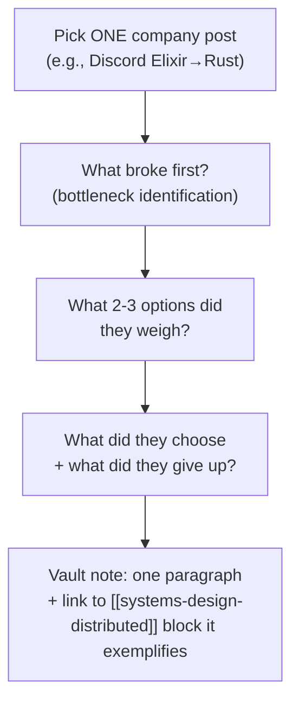
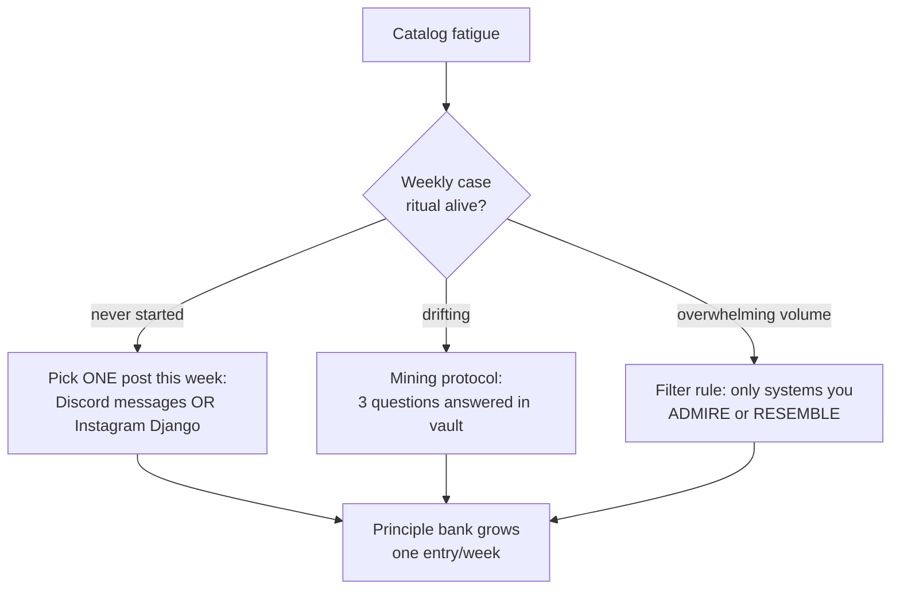

## For future agent
The two scalability/system-design link catalogs expanded together. awesome-scalability's real section headings (fetched 2026-08-24): Principle, Scalability, Availability, Stability, Performance, Intelligence, Architecture, Interview, Organization, Talks. These are CASE-STUDY libraries — the engineering-blog layer above [[repo-system-design-primer]]'s textbook layer.

# Scalability Catalogs — Expanded

## Repo A: binhnguyennus/awesome-scalability

Its sections map to what large-scale engineering actually worries about:

| Section | What Lives There |
|---------|-----------------|
| **Principle** | Foundational essays on scale thinking |
| **Scalability** | Sharding, partitioning, horizontal-scale war stories |
| **Availability** | Multi-region, fail-over, chaos engineering |
| **Stability** | Rate limiting, backpressure, circuit breakers, graceful degradation |
| **Performance** | Caching architectures, latency budgets, profiling |
| **Intelligence** | ML-in-production at scale |
| **Architecture** | Company architecture deep-dives (Netflix, Uber, Discord…) |
| **Interview** | System-design interview resources |
| **Organization** | Team structures behind scaling (Conway's law territory) |

## Repo B: madd86/awesome-system-design

A leaner catalog: videos (Gaurav Sen etc.), articles, interview-prep links, and company system-design breakdowns. Use as the video-first alternative when reading fatigue hits.

## How to Mine Case Studies (the actual value here)

One case study per week beats ten skimmed.

## Signature Case Studies Worth Starting With (commonly in these catalogs)

- **Netflix**: chaos engineering origin; regional failover
- **Discord**: storing trillions of messages (Cassandra → ScyllaDB)
- **Uber**: geo-sharding of trips; schemaless storage evolution
- **WhatsApp**: the small-team-serves-billions Erlang story
- **Instagram**: scaling Django (yes, Django) — proof boring stacks scale with discipline

## Failure Points

| Failure | Counter |
|---------|---------|
| Catalog-hoarding (starring everything) | One-per-week protocol; unread stars are noise |
| Treating big-tech solutions as defaults for your projects | They optimize at scales you don't have; extract principles, not stacks |

## Example Checkpoint Questions

1. In the Discord messages case, what data model property made Cassandra attractive — and what pain emerged later?
2. Why could Instagram scale on Django? Which layers absorbed the load?
3. Pick any case: name its stability mechanisms (rate limit? breaker? backpressure?) explicitly.

## Deep Edition Addendum

**Failure modes of catalog readers**:

| Failure | Mechanism | Counter |
|---------|-----------|---------|
| Star-and-forget | Catalogs hoarded as identity | One-case-per-week protocol; unread stars are noise |
| Big-tech cargo cult | Netflix stack copied for 100-user app | Extract PRINCIPLES, not stacks |
| Passive consumption | Case studies read like news | The 3-question mining protocol (broke-first? options weighed? tradeoff chosen?) |

**Premortem**: *"Studied scalability" = read 30 architecture posts, retained anecdotes.* Findings: no notes, no connection to own systems, selection by entertainment. Case studies compound only when each ends in a vault line: principle + where it applies to YOUR projects.

**Rescue flowchart**:

**Life integration**: commute reading slot (case studies are narrative-friendly); metrics = case-notes in vault (target 1/week), principles applied to own projects count.

## Cross-Vault Links

- [[systems-design-distributed]] · [[repo-system-design-primer]] · [[system-design-interview]]