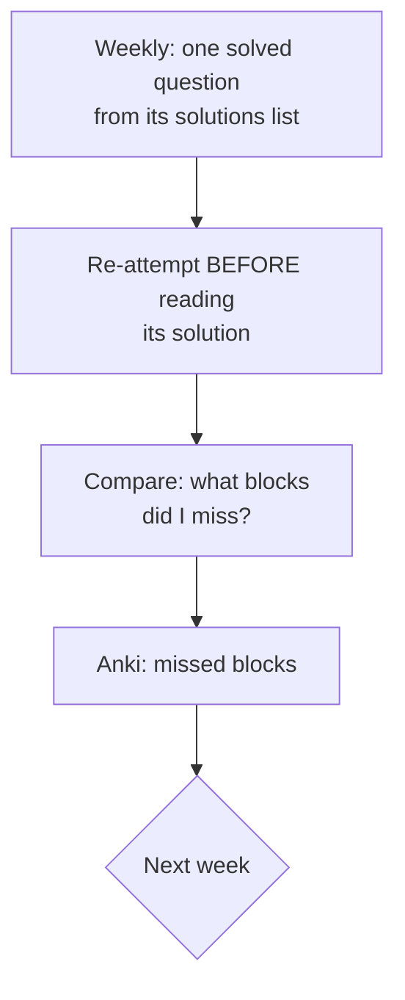
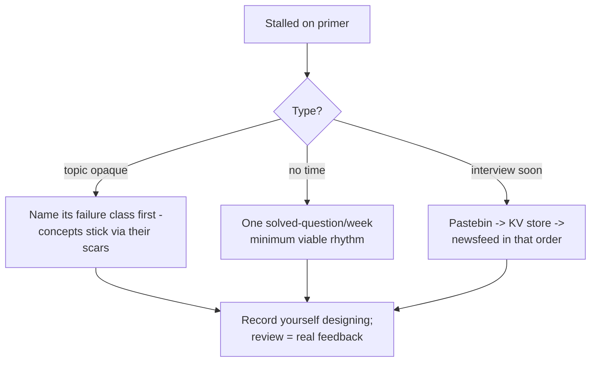

## For future agent
Full expansion of THE system design study repo. Topic index below mirrors its real TOC (fetched 2026-08-24). Includes its study guide path, Anki decks, and worked-question set. Framework for using it under time pressure lives in [[system-design-interview]].

# System Design Primer — Expanded

## What It Contains

1. **Study guide** (short/medium/long timelines)
2. **How to approach a system design interview question** (4-step method)
3. **System design questions WITH solutions**: URL shortener, Pastebin, Instagram, Twitter, Twitter search, web crawler, Key-Value store, unique-ID generator, Facebook newsfeed, chat app, Dropbox-style file store
4. **Object-oriented design questions with solutions**: hash map, LRU cache, call center, deck of cards, parking lot, chat server
5. **Anki decks**: System Design / Exercises / OO Design (+ his interactive-coding-challenges repo deck)
6. **The full topic index** (below)

## The Topic Index (learn in this order)

### Step 1–2: Foundations
Scalability video lecture + article; then core dichotomies:

| Pair | Know |
|------|------|
| Performance vs Scalability | Fast at low load vs fast AT high load; fix by more capacity or faster per-unit |
| Latency vs Throughput | Time-per-op vs ops-per-time; latency is usually the target |
| Availability vs Consistency | Uptime % vs data agreement |

### CAP Theorem
CP systems sacrifice availability during partitions (banks-ish); AP sacrifice consistency (social feeds). Every store choice you make should be named CP-or-AP out loud.

### Consistency Patterns
Weak (memcache) → Eventual (DNS, Cassandra default) → Strong (RDBMS transactions).

### Availability Patterns
Fail-over (active-passive vs active-active), replication (leader-follower, multi-leader, leaderless), the 9s table (99.9% = 8.76h/yr downtime).

### Core Building Blocks
- **DNS** → **CDN** (push vs pull)
- **Load balancer** (L4 vs L7), reverse proxy vs LB
- **Application layer**: stateless microservices, service discovery
- **Databases**: RDBMS — replication topologies, federation, sharding, denormalization, SQL tuning; NoSQL families — key-value/document/wide-column/graph; SQL-vs-NoSQL decision checklist
- **Caching**: client/CDN/web/DB/app layers; cache-aside vs write-through vs write-behind vs refresh-ahead
- **Asynchronism**: message queues, backpressure, task workers

## Its Interview Method (condensed)

1. Outline use cases, constraints, assumptions
2. Back-of-envelope estimates
3. Sketch general design (walk through)
4. Deep-dive on key components + bottlenecks

## How to Use With This Vault

Fresher depth guidance and grading rubric: [[system-design-interview]].

## Example Questions (from its own list)

1. Design TinyURL / Pastebin / Instagram / Twitter / web crawler / KV store / unique-ID generator / newsfeed / chat / Dropbox.
Start with URL shortener ([[system-design-interview]] has the walkthrough), then KV store, then newsfeed.

## Deep Edition Addendum

**Failure modes of primer users**:

| Failure | Mechanism | Counter |
|---------|-----------|---------|
| Read-only mode | 100k-star repo treated as a book | It's a GYM: weekly solved-question re-attempts are the membership |
| Anki deck import bloat | 1000 cards imported, none earned | Cards only from YOUR missed comparisons |
| Solution-peeking | Reading solutions before attempting | Attempt-first timer; solutions after 25 min |
| Vocabulary without mechanism | Naming CAP/sharding without when/why | Each term must answer "what failure does this prevent?" |

**Premortem**: *System design round failed despite "finishing the primer."* Autopsy: read linearly once, no re-attempt ritual, no recorded mock designs. The primer is a reference layer — [[system-design-interview]] framework + weekly practice loop is the operating system.

**Rescue flowchart**:

**Life integration**: commute slot for its video lecture; Sunday 45-min re-attempt ritual; metrics = questions re-attempted cold, blocks named correctly in mocks.

## Cross-Vault Links

- [[systems-design-distributed]] · [[repo-scalability-catalogs]] · [[roadmap-software-engineer]] Stage 3