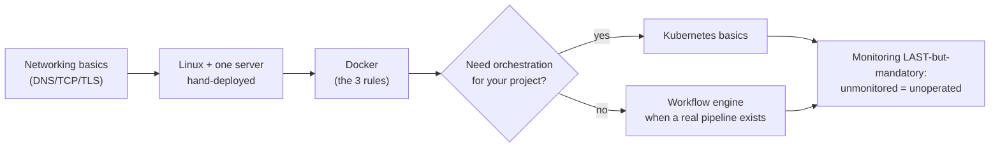
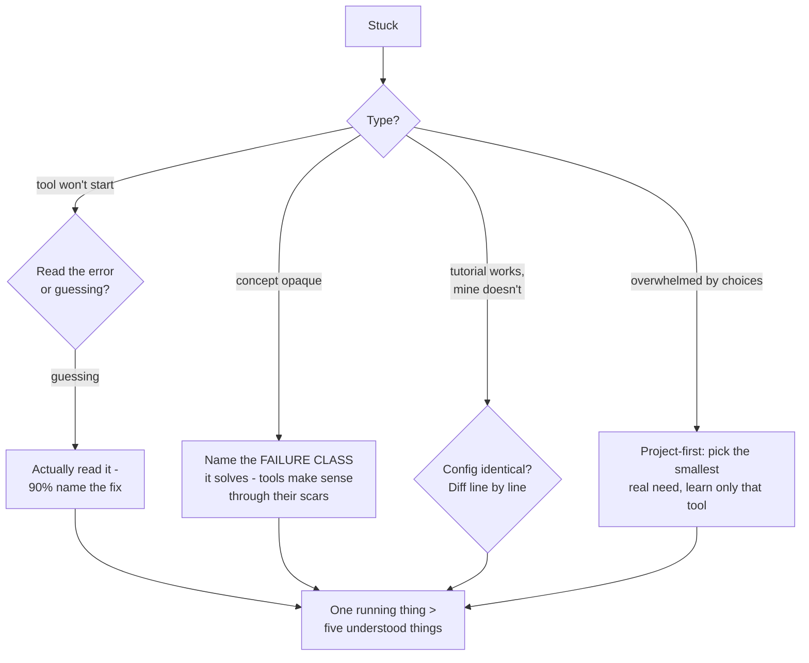

## For future agent
Deep edition of the systems design reference layer. Adds the failure-mode taxonomy of distributed systems (the classic ways systems actually die), learning-order logic (what to learn before what and why), per-tool failure traps (Docker/K8s standard mistakes), premortem of typical backend-learning abandonment, defeat-tackling flowchart, life integration. Interview application in [[system-design-interview]]; case studies in [[repo-scalability-catalogs]].

# Systems Design & Distributed Systems — Deep Edition

## Part 1 — The Distributed Failure Taxonomy (why this field exists)

Every distributed-systems tool is a scar tissue response to a specific failure class. Learn tools BY their failures:

| Failure Class | What It Kills | Tools Born From It |
|---------------|--------------|--------------------|
| **Single point of failure** | Whole service on one box dies | Load balancers, replication, fail-over |
| **Split brain** | Two masters accept conflicting writes | Consensus protocols, leader election |
| **Unbounded queues** | Memory death under load spikes | Backpressure, rate limiting, circuit breakers |
| **Cache-stale chaos** | Users see wrong data after writes | Invalidation strategies (cache-aside etc.) |
| **Cascade failure** | One slow service drags all down | Timeouts, bulkheads, retries-with-jitter |
| **Silent data loss** | Money/messages vanish | Acknowledgment semantics, durable queues, exactly-once patterns |

**Learning mechanism**: for every tool you study, name the failure class it exists for. Tools learned without their failure are cargo cults that collapse under interview probes.

## Part 2 — Pattern Catalogs & Primers

- **[awesome-scalability](https://binhnguyennus.github.io/awesome-scalability/)** → expanded [[repo-scalability-catalogs]]
- **[System Design Primer](https://github.com/donnemartin/system-design-primer)** → expanded [[repo-system-design-primer]]
- [awesome-system-design (madd86)](https://github.com/madd86/awesome-system-design)
- Book: **[Designing Data-Intensive Applications (Kleppmann)](https://dataintensive.net/)** — the distributed-systems bible; read after primer vocabulary, not before

## Part 3 — Big Data (era-aware)

- **[Hadoop: The Definitive Guide](http://hadoopbook.com/)** · [free 3-node cluster kit](http://hadoopinrealworld.com/hadoopstarterkit/)
- Era note `(2026)`: batch-Hadoop largely yielded to cloud warehouses + Spark; learn the *concepts* (distributed storage, shuffle, fault tolerance) here — they transfer everywhere.

## Part 4 — Docker Best Practices (language-agnostic gold)

| Practice | Why It Matters | Link |
|----------|---------------|------|
| Lint your Dockerfile | Catches order/layer mistakes cheaply | [guide](https://github.com/goldbergyoni/nodebestpractices/blob/master/sections/docker/lint-dockerfile.md) |
| **No build-time secrets** | Baked layers leak forever, even "deleted" | [rule](https://github.com/goldbergyoni/nodebestpractices/blob/master/sections/docker/avoid-build-time-secrets.md) |
| **Multi-stage builds** | Toolchain stays out of final image; smaller attack surface | [rule](https://github.com/goldbergyoni/nodebestpractices/blob/master/sections/docker/multi_stage_builds.md) |

Failure mode: treating Docker as "works on my machine, but portable" — without the three rules above you've just made your machine portable with its bugs.

## Part 5 — Kubernetes

**Learn**: [Katacoda interactive courses](https://www.katacoda.com/courses/kubernetes) · [gentle intro](https://medium.com/faun/a-gentle-introduction-to-kubernetes-4961e443ba26) · Magic Sandbox bootcamp

**The standard mistakes** ([pipetail's famous list](https://blog.pipetail.io/posts/2020-05-04-most-common-mistakes-k8s/) · [HN thread](https://news.ycombinator.com/item?id=23211325)):
1. Liveness/readiness misuse (liveness killing pods during slow loads)
2. No resource requests/limits → noisy neighbor + OOM roulette
3. `latest` image tags → non-reproducible deploys
4. Single-replica "production"
5. Ignoring PodDisruptionBudgets

**Tooling**: [k8syaml generator](https://k8syaml.com/) · [learnk8s YAML validation](https://learnk8s.io/validating-kubernetes-yaml) · [Pulumi](https://www.pulumi.com/kubernetes/) (infra in real languages)

## Part 6 — Workflow Engines / Messaging / Utilities

| Area | Resource | Trap to Avoid |
|------|----------|---------------|
| Airflow on K8s | [Marc Lamberti guide](https://marclamberti.com/blog/airflow-kubernetes-executor/#Introducing_Apache_Airflow_with_Kubernetes_Executor) | Non-idempotent tasks break backfills |
| KEDA autoscaling | [queue-triggered jobs sample](https://github.com/tomconte/sample-keda-queue-jobs) | Scaling on lag without poison-pill handling |
| Celery at scale | [When Kubernetes met Celery](https://hackernoon.com/https-medium-com-talperetz24-scaling-effectively-when-kubernetes-met-celery-e6abd7ce4fed) | Assuming task parallelism = correctness |
| nginx config | [DO config generator](https://www.digitalocean.com/community/tools/nginx) | Generated ≠ understood; read what it emits |
| Caching | [KeyDB](https://docs.keydb.dev/blog/2019/10/07/blog-post/) multithreaded Redis fork | Cache without invalidation strategy = stale-data bugs |
| Monitoring | [Prometheus Basics](https://github.com/yolossn/Prometheus-Basics) | Alerting on symptoms not causes |
| API testing | [Hoppscotch/postwoman](https://github.com/liyasthomas/postwoman) | — |
| Video streaming | [Go+HLS how-to](https://hackernoon.com/building-a-media-streaming-server-using-go-and-hls-protocol-j85h3wem) | — |
| Serialization | [Flexbuffers](https://google.github.io/flatbuffers/flexbuffers.html) · [Arrow Flight](https://arrow.apache.org/blog/2019/10/13/introducing-arrow-flight/) | Schema-less flexibility ↔ validation tradeoff |

## Part 7 — Learning-Order Logic + Premortem

### Premortem
*Systems learning abandoned.* Findings: (1) started with Kubernetes before networking — pure symbol soup; (2) tool-collected endlessly, never ran a hand-deployed server; (3) Hadoop rabbit hole in 2026; (4) no personal project ever needed >1 machine, so all knowledge stayed theoretical. Counters: the order chart + project-driven entry rule.

## Part 8 — Defeat-Tackling Flowchart

## Part 9 — Life Integration

- One deployed service maintained beats ten tutorials: keep ONE always-running project ([[00-Current-Projects/retrieval-agent/overview]] qualifies) and practice operations on it
- Weekly case study from [[repo-scalability-catalogs]] during commutes
- Metrics: services alive · incidents debugged (logged in vault) · failure-classes you can explain from experience vs reading

## Example Checkpoint Questions

1. Your service survives single-instance kill but fails when network partitions mid-write — which CAP position did you accidentally choose?
2. Why do retries WITHOUT jitter cause cascade failures?
3. What breaks first if cache TTL is set to infinity? And to zero?

## Cross-Vault Links

[[system-design-interview]] · [[repo-system-design-primer]] · [[repo-scalability-catalogs]] · [[repo-nodejs-best-practices]] · [[mlops-production-deployment]] · [[01-Areas/Programming/SAAS_BUILD_NOTES]]