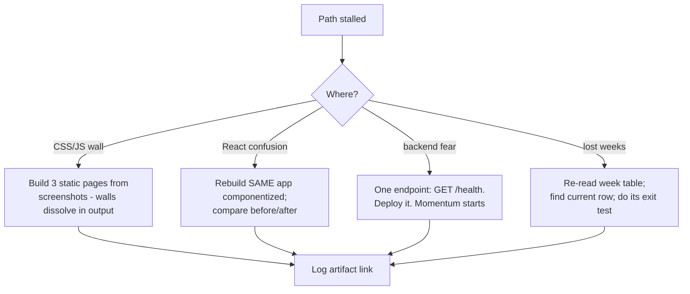

## For future agent
Free-resource-only full-stack web path. Its actual structure (fetched 2026-08-24): The Fundamentals → React → Backend (Node) → Extra Goals, plus a coding-log habit. Compressed page; the vault's deeper web resources live in [[web-development-resources]] and [[languages-polyglot]].

# Full Stack Web Developer Path — Expanded

## Its Structure (real headings)

1. **The Fundamentals** — HTML/CSS/JS basics + Git + how the internet works
2. **React** — components, state, hooks, router
3. **Backend (Node)** — Express, REST, databases, auth
4. **Extra Goals** — deployment, testing, TypeScript
5. **Coding log** — its own built-in accountability habit (matches your daily notes pattern)

## The Sequence as an Execution Plan

| Weeks | Do | Exit Test |
|-------|----|-----------|
| 1–3 | HTML+CSS by building 3 static pages pixel-close from screenshots | Page indistinguishable from target at arm's length |
| 3–6 | JS DOM + fetch API; small interactive apps | Build a weather app consuming a public API unaided |
| 6–7 | Git flow: branch→PR→merge on every feature | Muscle-memory Git without GUI |
| 7–11 | React: rebuild the same 3 pages as components; add state | Same app, componentized, with routing |
| 11–16 | Node/Express + SQLite/Mongo: build YOUR OWN API consumed by your React app | Full CRUD live on a URL (Render/Vercel free tier) |
| 16–18 | Auth (sessions or JWT) + basic tests | Register/login works; one test suite passes in CI |

## Why This Path Works (and Where It Fails)

- Works: **one project growing across all stages** — you never restart from "todo app #2"
- Fails when: tutorial-watching replaces building ([[how-to-self-teach]] 1:1 rule); skipping deployment till "the end" (deploy week 1)

## India Note

Full-stack is "competitive" tier in 2026 hiring — plenty of roles, deep applicant pools. Differentiate via ONE specialty bolt-on (GenAI features, [[market-analysis-tech-2026]]) rather than pure CRUD.

## Example Checkpoint Questions

1. What actually happens when React `setState` runs? (re-render mechanics, one level deep)
2. JWT vs session cookies: one security tradeoff each.
3. Your API takes 3s per request — first three things you profile.

## Deep Edition Addendum

**Failure modes of path followers**:

| Failure | Mechanism | Counter |
|---------|-----------|---------|
| Tutorial chapter-chaining | Next-video autopilot | Its own "coding log" habit: every session ends with something RUNNING |
| Framework-first jump | React at week 2 because "nobody writes vanilla" | Weeks 1–6 exist to make React's VALUE legible |
| Deploy-at-end myth | Deployment debt | Deploy skeleton day 1 (its Extra Goals section exists for a reason) |
| Project restart loop | New todo-app per tutorial | ONE growing project across all stages — the path's core design |

**Premortem**: *Month 3: five half-cloned apps, zero deployed.* Findings: tutorial-hell relapse (1:1 rule violated), auth skipped ("later"), no Git history discipline so progress invisible. The week-table's exit tests were never attempted.

**Rescue flowchart**:

**Life integration**: weekend build-blocks (context-heavy work); daily floor = one commit; metrics = deployed-URL alive, exit-tests passed, Git commit streak.

## Cross-Vault Links

- [[web-development-resources]] · [[repo-frontend-learning-resources]]
- [[01-Areas/Programming/cs50/week-9-flask]] — alternative backend route