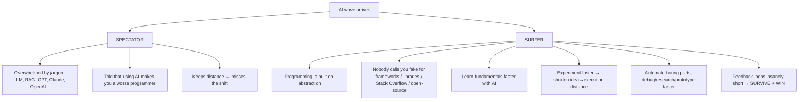
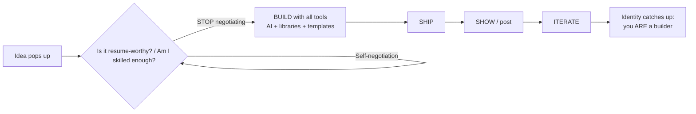

# The Art of Winning in Tech — Riding the AI Wave

> **Source:** *The Art Of Winning In Tech* (Lattice).
> **Video:** https://www.youtube.com/watch?v=4MAupwjl3pc — raw transcript: [[raw-sources/youtube-transcript-the-art-of-winning-in-tech.txt]].

---

## 1. Thesis: "There has never been a better time to be a software engineer"

Contrary to doomsday chatter (that AI will wipe out developers), the author argues:

- What used to take a *team of five* now takes **one person**.
- What used to take *years* of learning syntax/docs, now takes a **fraction of the time**.
- **The people "wiped out" by AI aren't losing because they're bad developers** — they're losing because the world of software *they built for* is fading.

**Winners** share one trait: they understood the **new rules** faster — about *what to build, how to build it, and how to use every resource* to close the gap between where they are and where they want to be.

---

## 2. Spectator vs Surfer

**The Surfer's moves (all four in the video):**
- Scaffold an entire dashboard in a day.
- Use AI to decode brutal graphics/documentation concepts in minutes, not hours.
- Test ideas immediately instead of waiting to "master" a language/framework.
- Continuously **build → test → learn → ship → adjust**.

---

## 3. The New Bottleneck: Thinking, not Typing

> "The bottleneck is no longer *can you write the code* — it's **can you think clearly? Can you recognize good ideas? Can you move on them quickly? Can you learn fast enough to keep up with your own ambition?**"

Programming is becoming a **creativity game** (cross-link: [[mathematics-of-creativity]]):

- Winners notice things, connect things, and build **weird tools nobody thought of before**.
- They follow curiosity **fast**, before the excitement disappears.
- A random student can "lock in for a weekend" and accidentally build something thousands use.

---

## 4. The Rules of the New Game

### Rule 1 — Build in motion, not in silence
The people getting opportunities right now (internships, referrals, startup roles, research positions) are the **visible** ones:
- Building projects **and** posting them on LinkedIn.
- Short demo videos on Twitter.
- Writing about things they learn — a bug, a failed project, a sharp opinion.

> *"It's not about being an influencer. It signals that this person is actively building."* → Reviewers at companies like OpenAI/Anthropic look for **builders already in motion**. **You don't need a perfect portfolio; you need a visible one.**

### Rule 2 — Stop over-filtering what you're allowed to build
The questions that trap spectators:
> "Is this idea good enough for my resume?"
> "Am I skilled enough — should I wait until I know more?"

The answer every time: **build it anyway** — with AI, libraries, templates, random GitHub repos, and docs. **Brute-force learning through building.**

### Rule 3 — Let identity catch up to behavior
The fastest way to become the programmer who "just makes things work":
1. **Stop negotiating with yourself** when an idea arrives.
2. **Build it.**
3. **Ship it.**
4. **Show it.**
5. **Iterate.**

> Slowly, *your identity catches up with your behavior* — you become the person who builds.

---

## 5. The Meta-Skill: Never Stop Learning

The single thing underneath everything: **keep learning fast enough to keep up with your own ambition**. (The video's sponsor segment highlights Brilliant — a math/coding tutor — as one tool for this; the point stands independent of brand.)

---

## 6. Synthesis & Cross-Links

| Video principle | Adjacent wiki node |
|---|---|
| Abstract everything; move with the wave | [[programming-cs-fundamentals]] §12 (imports) |
| Creativity game = produce more | [[mathematics-of-creativity]] |
| Visible, shipping builder | [[learn-python-fast-system]] (build real projects) |
| Consistency & execution discipline | [[overview]] (8-pillar productivity) |

**One-line summary:** *Surf the abstraction wave with brutal short feedback loops, build visibly, stop negotiating with yourself, and never stop learning — the identity will catch up.*