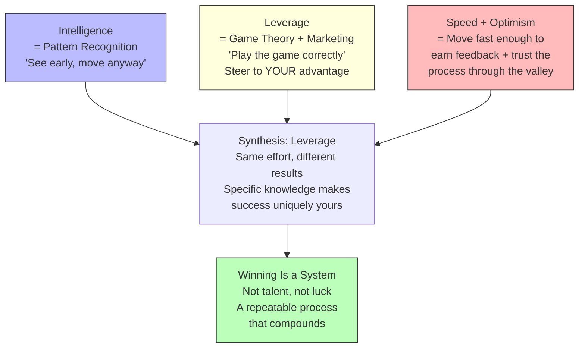
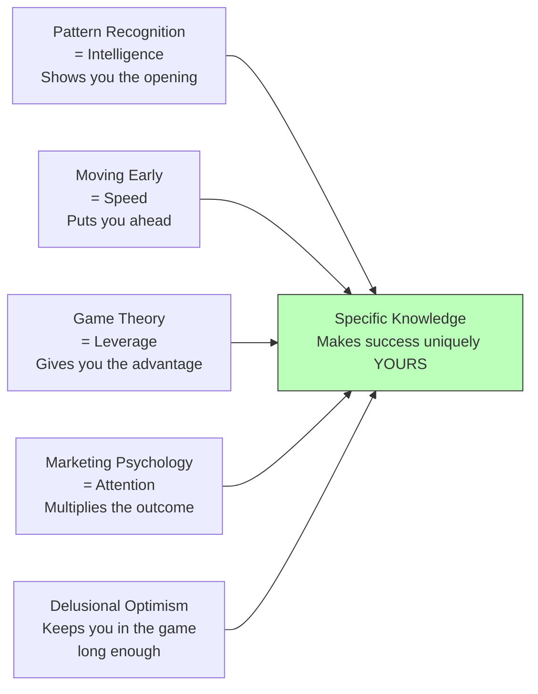

## For future agent
Anonymous creator's system for winning at anything — built from a personal chess story (lost first 4 rounds at age 13, coach gave opponent score sheets to study). Three-component framework: pattern recognition as intelligence ("see early, move anyway"), game-theory + marketing psychology for leverage ("same effort, different results"), and speed + delusional optimism for clarity ("move fast enough to earn feedback"). Synthesis: winning is a repeatable system, not talent. Aimed at a BTech student who feels lost and needs a strategic framework, not more motivation.

# The Art of Winning — A System, Not Talent

## Core Framework: Intelligence × Leverage × Speed

The central claim: **the same people keep winning because they follow a system, not because they're more talented.** The system has three components that compound:

---

## The Origin Story: Score Sheets at Age 13

At a national chess tournament, the creator lost their first 4 rounds. Every move felt wrong. Instead of quitting, their coach brought back a stack of **score sheets from upcoming opponents** — records of every move those opponents had made in past games.

The instruction: study the sheets. Find patterns. Find mistakes. Find habits.

**This moment illuminated the true mechanics of winning.** It wasn't about being smarter or more talented. It was about **seeing what others miss** and **moving before they do.**

---

## Component 1: Intelligence = Pattern Recognition

### The Principle
"Most things that blow up or succeed do not start as secrets; they start as **patterns.**"

While studying the chess score sheets, clear patterns emerged:
- One opponent always played aggressive openings but collapsed in the endgame
- Another rushed decisions under pressure
- These weren't random — they were **signals**

### Where Most People Lose
They see the pattern but **still hesitate.** They wait to:
- Feel ready
- Be good enough
- Get confirmation it will work

By the time they move, the space is already crowded.

### The Operating Rule
**"See early, move anyway."**

When you stop REACTING and start EXPECTING, that is true intelligence.

### Beyond Chess
- **Content creation:** Certain types of videos get attention, certain methods keep working
- **Studying:** Certain topics repeat, certain question patterns emerge
- **Career:** Certain skills compound, certain paths have hidden advantages

---

## Component 2: Leverage = Game Theory + Marketing Psychology

### The Principle
"Effort does not scale — **position does.**"

Once you see clearly, your **next move** matters more than your effort. In chess, the creator stopped trying to "play better" and started playing **smarter** — steering games into positions where the opponent was weak.

### The Chess Example
- Forced endgames when the opponent struggled there
- Sped up play when the opponent panicked under time pressure
- Same board. Same pieces. **Completely different outcome** — because of leverage.

### The Three Domains of Leverage

| Domain | Someone Who Just Works Hard | Someone Who Uses Leverage |
|--------|---------------------------|--------------------------|
| **Studying** | Reads and repeats | Understands how questions are formulated, what topics repeat, where marks actually come from |
| **Fitness** | Goes to the gym, works hard | Understands what actually builds muscle vs. what is noise |
| **Content** | Uploads and hopes | Studies what people click, adjusts framing, builds around attention psychology |

**Same effort. Different results.** Because one person actually played the game correctly.

### Marketing Psychology × Game Theory
- **Marketing psychology** = understanding attention, what people click, watch, and return for
- **Game theory** = choosing moves that steer the situation toward your advantage
- Combined = you don't just work hard — you work where the leverage is

---

## Component 3: Speed + Delusional Optimism

### The Principle
"Speed is where everything separates."

After the chess losses, the creator didn't try to perfect their play — they just **played.**

| Path | Person A (Planner) | Person B (Mover) |
|------|-------------------|-------------------|
| Week 1 | Planning, researching | Starts, makes mistakes |
| Month 1 | Still preparing | Has real data, adjusting |
| Month 3 | Has ideas | Has **experience** |
| Month 6 | Still preparing | Has **momentum** |

### The Valley of Nothing Works
Eventually you hit a phase where **nothing seems to work.** Results feel nonexistent. This is where most people stop.

**"Delusional optimism"** — not blind hope, but trusting the process long enough for it to start making sense.

"If you keep seeing what others miss, the results will have no choice but to follow."

### The Invisible Formation
In the valley of "nothing works," something invisible is forming:
- Faster pattern recognition
- Stronger instincts
- Specific knowledge that stops you from copying and starts you **operating**

---

## The Synthesis: Intelligence with Leverage

**The compound effect:**
1. Pattern recognition shows you the opening
2. Moving early puts you ahead
3. Game theory gives you the advantage
4. Attention multiplies the outcome
5. Speed compounds your attempts
6. Optimism keeps you in the game long enough
7. **Specific knowledge makes the success uniquely yours**

"Most people are just trying harder. A few are seeing earlier. The ones who learn to do both stop competing with people who do not even see the game."

---

## Failure Modes

| Failure Mode | What It Looks Like | How to Avoid |
|---|---|---|
| **Pattern Paralysis** | Seeing the pattern but waiting to "feel ready" before moving. By the time you move, the space is crowded. | "See early, move anyway." Move messy and early. Clarity comes from action, not preparation. |
| **Hard Work Without Leverage** | Grinding 12 hours/day on the wrong things. Same effort, no results, because position is wrong. | Ask: "Am I working hard, or am I working where the leverage is?" Study the game before playing it. |
| **Over-Planning** | Month 3: still researching, still preparing, still "getting ready to start." | Set a hard deadline: 1 week to plan, then execute. Speed of iteration beats quality of plan. |
| **Quit-at-the-Valley** | "Nothing is working" → quit → start something new → hit the same valley → quit again. | Expect the valley. It's where specific knowledge forms. "Delusional optimism" = trusting the process through the invisible phase. |
| **Copying Without Understanding** | Mimicking what successful people do without understanding WHY it works for them. | Pattern recognition means understanding the underlying system, not surface tactics. Your leverage is different from theirs. |
| **Ignoring Marketing Psychology** | Building something great but nobody knows about it. "If you build it, they will come" is a lie. | Study attention. Study what people click, watch, return for. Great work + invisible = zero results. |
| **Perfectionism Disguised as Quality** | "I'll release it when it's perfect" → never released. Meanwhile, someone imperfect shipped and iterated. | Speed beats perfection. Ship messy, learn from real feedback, iterate. The market teaches faster than your imagination. |

---

## Actionable Takeaways for a 2nd-Year BTech Student

### This Week: Pattern Recognition
1. **Study your "opponent score sheets"** — look at the last 5 exam papers for any subject. Find the repeating question patterns, the topics that always appear, the question types that carry the most marks. This is your score sheet.
2. **Map one competitor's pattern** — pick someone you admire (senior, YouTuber, founder). Study their trajectory. Find the repeating decisions they made. What patterns do you see?

### This Month: Leverage
3. **Audit your effort for leverage** — are you studying hard, or studying WHERE THE MARKS ARE? Are you working on projects that build skills the market values, or just random tutorials? Redirect 50% of your effort to high-leverage activities.
4. **Choose your game-theory move** — for your next goal (internship, project, exam), identify: "What position can I force where the other side is weak?" Apply chess thinking to career strategy.

### This Semester: Speed + Optimism
5. **Set a "ship date" for one project** — not "when it's ready," but a fixed date. Ship messy. Learn from real feedback. Iterate.
6. **Start the valley journal** — every week, write: "What invisible thing is forming?" Track the slow accumulation of pattern recognition, instincts, and specific knowledge. You won't see it day-to-day. You'll see it month-to-month.
7. **Adopt "delusional optimism"** — when nothing is working, write: "I am in the valley. This is where specific knowledge forms. I trust the process." Read it when you want to quit.

---

## Quote Bank

1. "Most things that blow up or succeed do not start as secrets; they start as patterns."
2. "Where most people lose is that they see the pattern but still hesitate."
3. "See early, move anyway."
4. "Effort does not scale — position does."
5. "It was the same board and the same pieces, but a completely different outcome because they used leverage."
6. "One person keeps planning, researching, and waiting for the perfect moment. The other starts, learns from mistakes, and adjusts in real time."
7. "Speed is where everything separates."
8. "Eventually, you will hit a phase where nothing seems to work. This is where most people stop."
9. "Most people are just trying harder. A few are seeing earlier."
10. "The ones who learn to do both stop competing with people who do not even see the game."

---

## Related

- [[motivation-self-belief]] — the identity-level belief that powers you through the valley
- [[debate-and-argumentation]] — strategic thinking applied to disagreement (RISA framework)
- [[harvard-learning-system]] — the learning version of "study the score sheets" (review periods, pattern connection)
- [[digital-wellness]] — phone addiction as the enemy of pattern recognition (monkey mind destroys seeing)
- [[deep-work-attention-economics]] — focused attention as the prerequisite for seeing patterns
- [[communication-mastery]] — the delivery system for when your patterns become your advantage