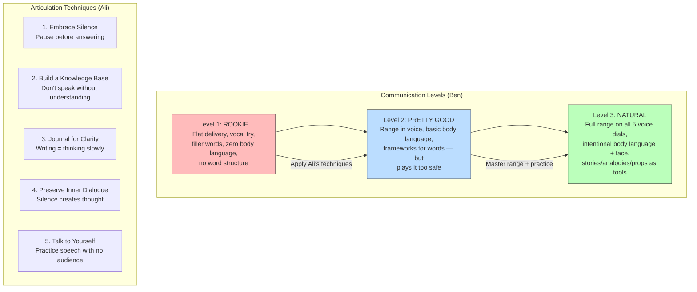

## For future agent
Two-video merge: (1) Ben's 3-level communication framework (Rookie → Pretty Good → Natural) covering voice, body language, and word structure (FsxorSNJBaA, ~5.2k words); (2) Ali Abdaal's articulation techniques — silence, knowledge base, journaling, inner dialogue, self-practice (ldoYlkeq-w4, ~2.7k words). Unified into a single progression system: Ben gives the *map* (where you are, where to go), Ali gives the *techniques* (how to get there). Aimed at a BTech student preparing for quant-finance interviews and presentations.

# Communication Mastery — Voice, Body, Words & Articulation

## Core Framework: The 3-Level Communication Ladder + 5 Articulation Techniques

**Ben gives the diagnostic.** Where do you sit on the Rookie → Pretty Good → Natural spectrum? What specific voice, body, and word behaviors hold you back?

**Ali gives the treatment.** Five concrete techniques that work at ANY level to move you up the ladder.

---

## Part 1: The 3-Level Framework (Ben)

### Level 1: Rookie Communicator — "Unconscious Incompetence"

**Voice:**
- **Flat delivery** — same speed, pitch, volume, emotion from first word to last (like a GPS voice)
- **Vocal fry** — low, creaky, gravelly quality at end of breath ("Oh, hey Sam. How you going?")
- **Filler words** — "um, uh, like, you know" used in every sentence, signaling uncertainty
- Even brilliant thinkers (Zuckerberg, Musk, Altman) exhibit rookie voice habits — but they can afford to because they're geniuses with billions. You are not.

**Body Language:**
- Zero expression — hands do nothing, posture is collapsed, no eye contact
- "They may as well not have any bloody hands"
- Unconscious habits: touching glasses 10-20x/minute, repetitive swaying

**Words:**
- No structure whatsoever — speak in circles, ramble, get stuck in thoughts
- Forces the listener to do all the cognitive work decoding what's being said
- Never developed self-awareness because they never recorded themselves

**Self-Test:** Record a 2-minute unscripted answer to "Why do you want to improve your communication?" Transcribe it (use Gemini/Whisper). Count fillers, circle-talks, and unclear points. This is Level 0 self-awareness.

### Level 2: Pretty Good Communicator — "Trapped by Fear of Judgment"

**Voice:**
- Has range — varies volume, pitch, speed. Not monotone.
- BUT plays it too safe. Avoids extremes because "people won't take me seriously"
- The fear that people will judge you for being expressive is NOT REAL — most people aren't thinking about you

**Body Language:**
- Knows basics — not shrinking, decent posture, reasonable eye contact
- BUT limited gesture vocabulary — cycles between the same 2-3 movements
- Repetitive non-functional movements (e.g., Mark Manson's constant swaying) distract from message
- Rule: **Only move with purpose.** If there's no reason for the movement, don't move.

**Words:**
- Uses communication frameworks (PREP, STAR, 3-2-1, PARA, PEEL)
- Frameworks act as a filter — distill thinking into clear, concise, coherent responses
- The listener doesn't have to work because you've done the work for them

**The Lock:** The single thing keeping "pretty good" communicators from becoming natural is **the fear of judgment**. They're scared to play at the edges of their voice, their body, their expressiveness.

### Level 3: Natural Communicator — "Unconscious Mastery"

**Voice — 5 Dials Used Simultaneously:**
1. **Rate** — fast for passion, slow for emphasis
2. **Volume** — loud for vitality, soft for intimacy
3. **Pitch** — high for warmth/playfulness, low for authority
4. **Tonality** — emotion injection for authenticity
5. **Pause** — silence for impact

**Body Language:**
- Larger gesture vocabulary, purposeful movement
- **Facial expressions** — the most underrated element. People look at your face while you talk. "When people see the emotion in your face, but they don't hear the emotion in your voice, then they don't feel it."
- Syncs how they LOOK to how they SOUND → impacts how people FEEL

**Words:**
- Full toolkit: frameworks + stories + analogies + props + demonstrations
- Knows when to use which tool for which audience and moment
- The same message ("read more books") can land 5 different ways depending on delivery tool

---

## Part 2: 5 Articulation Techniques (Ali)

### Technique 1: Embrace Silence
- The pressure to answer immediately makes your mouth move faster than your brain
- **Fix:** Become comfortable with pauses. Allow time to think, understand the question, compose your response.
- **Hacks for awkward silences:**
  - Tell the person "I need a moment to think" — shows respect, proves you're listening
  - Repeat their last sentence/question — buys time, confirms understanding
  - Think out loud — admit you don't have an answer yet, walk through your thought process in real time

### Technique 2: Build a Knowledge Base Before Speaking
- "To speak of something clearly, you have to first understand it clearly"
- The internet has created a world where people form opinions from memes and viral posts — then try to articulate them
- **Fix:** Don't let pride push you to articulate something you're not prepared for. Ask questions instead. Focus on what you *do* know. Reach conclusions together.
- For interview prep: know your resume, your projects, and your quant-finance fundamentals COLD before you walk in.

### Technique 3: Journal for Clarity
- Writing forces slow, intentional thinking — every pen stroke requires intention
- When you speak, you can ramble forever. When you write, you must slow down.
- Writing reveals mistakes, nuances, and better ways to phrase ideas
- **Application:** Write scripts/outlines before presentations. Write daily thoughts. Write mini-essays on topics you care about. "Writing is thinking, and you need to be able to think well before you can speak well."

### Technique 4: Preserve Inner Dialogue (Create Silence)
- Modern life fills every gap with content — scrolling, podcasts, music, video
- "Shower thoughts" exist because the shower is the ONLY time your brain gets silence
- **Fix:** Find daily/weekly silence — coffee without phone, walks without headphones, gym without music
- Let your mind process all the content you consume. Only then does speech have a foundation.

### Technique 5: Talk to Yourself
- Practice articulating in zero-stakes environments
- Pretend you're giving a speech, arguing a point, or explaining a concept
- You're free to make mistakes, think on the spot, no fear of judgment
- Hear your ideas out loud — check if they make sense
- **Bonus:** Film yourself, review footage, identify waffling, improve speech patterns

---

## Failure Modes / How Can Someone FAIL at Applying This?

| Failure Mode | What It Looks Like | How to Avoid |
|---|---|---|
| **Framework Dependency** | Memorizing STAR/PREP but sounding robotic and scripted. Every answer sounds like a template. | Frameworks are training wheels. Once internalized, speak naturally and use frameworks only as invisible scaffolding. |
| **Over-Correction on Fillers** | Becoming so anxious about "um" that you freeze, speak too slowly, or sound stilted. | Occasional fillers are normal. The goal is reduction, not elimination. Natural communicators still use them — sparingly. |
| **Body Language Over-Engineering** | Practicing gestures in the mirror until every hand movement looks rehearsed and fake. | Start with ONE thing: stop your worst habit (e.g., touching glasses). Don't add 10 new gestures at once. |
| **Knowledge Hoarding** | "I need to know everything before I speak" → never speaking at all. | You need a BASE level, not mastery. Aim for "I understand the core, and I'm honest about what I don't know." |
| **Journaling Without Review** | Writing daily but never re-reading. The clarity benefit is in the review, not just the writing. | Spend 5 minutes weekly reviewing old entries. Notice how your thinking evolves. |
| **Avoiding Real Conversations** | Only practicing alone (talking to walls) but never testing with real humans. | Practice solo → test with safe people (close friends) → test in high-stakes (interviews, presentations). |
| **Silence as Avoidance** | Using "I'm embracing silence" as an excuse to not participate in discussions. | Silence is a tool for BETTER answers, not a shield. If you're silent for 30+ seconds in an interview, you've overcorrected. |
| **Accent Shame** | Being so self-conscious about your accent that you mumble or avoid speaking altogether. | Ben (the communication coach) learned English as his THIRD language. Your accent is not your barrier — your delivery habits are. |

---

## Actionable Takeaways for a 2nd-Year BTech Student

### Immediate (This Week)
1. **Record a 2-minute self-introduction video.** Transcribe it. Count fillers, circle-talks, flat spots. This is your baseline.
2. **Practice the pause.** In your next 3 conversations, deliberately pause for 2 seconds before answering. Notice how it changes the quality of your response.
3. **Turn off phone for first hour of day.** This is Ali's inner-dialogue technique — creates the mental space for articulate thinking.

### Short-Term (This Month)
4. **Write a 500-word script** answering "Why quant-finance?" Read it aloud. Record it. Review. Rewrite. Repeat. This combines journaling + self-practice.
5. **Identify your #1 voice problem** (flat delivery / vocal fry / fillers) and practice ONLY that for 2 weeks.
6. **Do one 10-minute "talk to yourself" session per day** — pace around your room explaining a quant concept aloud (e.g., Black-Scholes, portfolio theory).

### Medium-Term (This Semester)
7. **Join or create a weekly practice group** — 3-4 friends practicing presentations or interview answers. Record each other. Give specific feedback.
8. **Master 2-3 communication frameworks** (STAR for behavioral interviews, PREP for opinion questions, 3-2-1 for impromptu speaking).
9. **Build facial expressiveness** — watch yourself speak in a mirror. Practice matching your face to your message's emotion.

---

## Quote Bank

### From FsxorSNJBaA (Ben — Communication Levels)
1. "Every time you open your mouth and you speak, people unconsciously categorize you into one of three categories."
2. "You're not a bad communicator. You just have bad communication habits."
3. "Don't be so attached to who you are in the present, you don't give the future version of you a chance."
4. "The key thing that stops people from using more of their range is the fear of judgment."
5. "When people see the emotion in your face, but they don't hear the emotion in your voice, then they don't feel it."
6. "Only move with purpose. If there's no reason for the movement, don't move."
7. "Most people aren't thinking about you anyway. They're thinking about themselves. So don't let a false fear keep you trapped."

### From ldoYlkeq-w4 (Ali — Articulation)
8. "Articulation is not a natural talent that you're just born with — it's a skill, one that can be improved."
9. "To speak of something clearly, you have to first understand it clearly."
10. "Writing is thinking, and you need to be able to think well before you can speak well."
11. "When it's your turn to reply... your mouth starts to move faster than your brain and before you even had the chance to gather your thoughts, you've already started talking."
12. "I straight up tell the person that I need a moment to think, and so now the silence is no longer awkward because they know why I'm doing it."
13. "I write a script for every video — not so I can read off the pages like some NPC — but so I can articulate my thoughts before I share them."

---

## Related

- [[motivation-self-belief]] — belief systems and discipline as foundation for all self-improvement
- [[vocabulary-building]] — advanced vocabulary as the precision layer of communication
- [[digital-wellness]] — phone addiction as the enemy of inner dialogue and articulate thinking
- [[belief-engineering]] — the science of self-belief and how it shapes output
- [[psychological-execution]] — overthinking, focus, and the default mode network
- [[deep-work-attention-economics]] — distraction-free concentration for skill building
