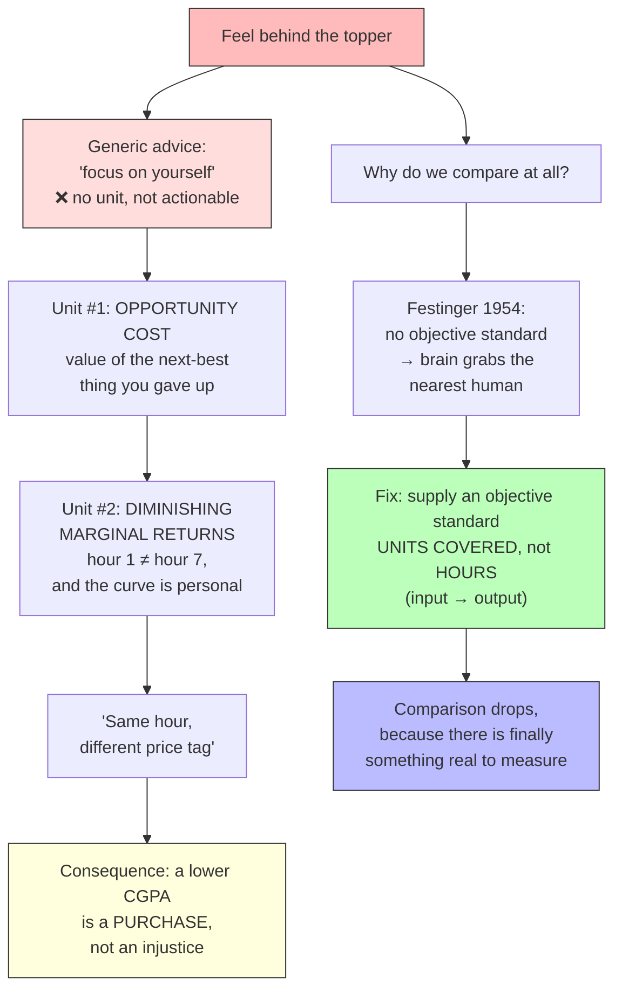

## For future agent
Distillation of a 6:43 IIM-student video (`SliceDfqcH8`, avishi mishra) arguing that grade-guilt is a **wrong-variable** problem, not a laziness problem. Spine: (1) *opportunity cost* gives "focus on yourself" a unit; (2) *diminishing marginal returns* means total hours is a vanity metric and the curve is personal; (3) Festinger 1954 explains why comparison is involuntary; (4) the fix is an objective output standard (syllabus units, not hours). Staleness caveat: none — the economics and psychology are timeless, but the second half of the video is a **product pitch** (his planner) plus a CTA; the economic claims are asserted without citation, so the literature claims carry `(TBC)` tags. Math here (production functions, Cobb-Douglas, Euler's theorem, Lagrange shadow price) is a *vault extension* of what the video only gestures at, and it is exam-relevant for [[01-Areas/Engineering/engineering-math/module-3-homogeneous-functions|Module 3]]. Use for: "why do I feel behind", "hours vs progress", "opportunity cost of studying", "how to stop comparing to toppers".

# You're Not Lazy — You're Comparing the Wrong Number

Source: [youtube.com/watch?v=SliceDfqcH8](https://www.youtube.com/watch?v=SliceDfqcH8) · avishi mishra · 6:43 · auto-captions. Raw transcript: `raw-sources/youtube-transcript-comparing-the-wrong-number.txt`, segments: `raw-sources/yt-comparing-the-wrong-number.json`. Companions: [[01-Areas/Self-Dev/how-to-study-hard|how to study hard]] · [[01-Areas/Self-Dev/productivity/overview|productivity overview]] · [[01-Areas/Self-Dev/motivation-self-belief|motivation & self-belief]] · [[01-Areas/Self-Dev/productivity/deep-work-attention-economics|deep work]]

## 0. Thesis in one line

> The discomfort of "I'm behind the topper" is produced by **comparing on a bad variable** (hours), not by a character defect. Change the variable, and the guilt becomes a priced trade you can actually evaluate.

The video is a worked demolition of the default advice *"just focus on yourself."* His complaint: that advice **has no unit**, so it cannot be acted on. So he imports two from first-year microeconomics and one from psychology.

---

## 1. Unit #1 — Opportunity cost

> "Opportunity cost is not what you actually spend. Opportunity cost is what you give up to spend on something. It's the value of the next best thing you didn't do." (01:40)

**The distinction looks very small but it is everything.** Sunk cost is what you paid; opportunity cost is what you could have earned instead. Once you price the *forgone* alternative, "I am just lazy" stops being a fact and becomes a *hypothesis about a price tag* — which is a testable question.

Formally, for a person $p$ choosing action $A$ out of a ranked feasible set:

$$OC_p(A) = \max_{i \neq A} V_p(A_i)$$

and the price of the marginal hour of action $A$ is simply

$$c_p \equiv OC_p(\text{one hour of } A)$$

The whole video lives in the observation that **$c_p$ is person-specific and can differ by an order of magnitude.** Same hour of the clock, different price.

> "Their study hour is inexpensive. They should absolutely be doing six. Same hour, completely different price tag." (03:48)

### The shadow-price reading (vault extension)

In optimisation language $c_p$ is a **shadow price**: the Lagrange multiplier on your time budget. Given $\max U(a)$ subject to $T_a + \sum_i T_{A_i} = T_{\text{total}}$, the multiplier $\lambda = \partial U/\partial T$ *is* the opportunity cost of an hour, and the optimum is where every action's marginal utility per hour is equal.

The practical reading: at an interior optimum, one hour should not be worth more in the agency than in the library. When it *is* — and for a student running a business it always is — that is not an error, it is a revealed preference, and it is a number you are allowed to look at. → derivation in [[01-Areas/Self-Dev/comparing-the-wrong-number-math#1-opportunity-cost-is-a-shadow-price|companion page §1]] · machinery in [[01-Areas/Engineering/engineering-math/module-2-partial-differentiation|Eng-Math Module 2 § Lagrange multipliers]].

---

## 2. Unit #2 — Diminishing marginal returns

> "The law of diminishing marginal returns. Production function. Microeconomics. Add more of one input while everything else stays fixed. And after a point, each extra unit gives you less than the one before." (02:13)

**Hour one of studying and hour seven of studying are not the same product.** His gloss: *"Hour 7 is more guilt management than actual retention."*

Notation for what follows: $h$ = hours (the input people track), $k$ = base knowledge/sleep/stress, $S(h,k)$ = output, $MP_h = \partial S/\partial h$ = marginal product of an hour, $c$ = opportunity cost of an hour.

**Diminishing marginal returns** — the marginal product falls as you add more of the same input with the rest held fixed, so $\partial^2 S/\partial h^2 < 0$ and therefore $MP_h(1) > MP_h(7)$. Two consequences he actually uses:

**(a) The comparison is on the wrong statistic.** Comparing someone's seven to your four compares the **total**, not the **return**:

$$\underbrace{h_A - h_B = 3}_{\text{what people compare}} \;\neq\; \underbrace{\big[S_A - S_B\big] \text{ vs } \big[c_A - c_B\big]}_{\text{what actually differs}}$$

**(b) The curve is personal.** Where it bends depends on sleep, stress and base knowledge — that is, on $k$. So the honest comparison is not hours-vs-hours; it is *marginal product at your current point* against *marginal cost of the alternative*: $MP_h$ vs $c_{\text{alt}}$.

> **The maths is split out.** The study production function, the Cobb-Douglas form $S = A h^{\beta} k^{\alpha}$ (returns to scale $= \alpha + \beta$; $MP_h = A\beta h^{\beta-1}k^{\alpha}$, decreasing because $\beta - 1 < 0$; Euler's identity $h \cdot MP_h + k \cdot MP_k = (\alpha+\beta) S$), the Lagrangian shadow-price derivation, the full metric table and the $c = 0$ boundary case all live in **[[01-Areas/Self-Dev/comparing-the-wrong-number-math|Comparing the Wrong Number — The Mathematics]]** — which is also the exam bridge into [[01-Areas/Engineering/engineering-math/module-3-homogeneous-functions|Eng-Math Module 3]] (Euler's theorem) and [[01-Areas/Engineering/engineering-math/module-2-partial-differentiation|Module 2]] (Lagrange multipliers).

**Careful (a trap worth stating):** he compares "7 hours vs 4 hours" as if it were a single-comparable variable. But he and the topper are not on the *same* production function — different $k$ and different $f$ (one has an agency, one doesn't). Comparing hours across different $f$ is not comparing the same quantity at all. This is a stronger version of his own point, it is the vault's reading rather than his, and it is worked out in [[01-Areas/Self-Dev/comparing-the-wrong-number-math#4-trap-you-are-not-even-on-the-same-production-function|companion page §4]].

---

## 3. The honest numbers, and what they cost

> "I don't study 3 hours a day. Most of the semester I don't even open a book. And then it's panic mode before ends, like everybody else. That's college for you." (03:00)

He does not sandbag this, and that is what makes the rest of the argument land. The gap is real. His move is to stop labelling it a flaw and start pricing it:

> "Then I wrote down what those hours would have actually cost me. I'm on chill chai calls. I'm writing creator briefs. I'm sitting in on campaigns. My agency is not a hobby I do between my classes. It has deadlines that do not care about my ends." (03:23)

So for one study hour, *his* next-best-alternative is a client deliverable — **not scrolling**. The topper's next-best-alternative is scrolling, because academics is genuinely her only priority. Two different $c$. That is the entire mechanism.

### The line that costs him

> "But here's where my ego got hurt. This means I don't get to complain. If I choose the expensive hour, my lower CGPA isn't injustice, it's a purchase." (03:55)

This is the real payoff and it is **not** a motivational trick. It is an accounting identity: if you voluntarily buy the alternative, the forgone output is a cost, not a grievance. Once priced, the decision becomes a *budget* question — and a budget question has an answer. An injustice does not.

---

## 4. Why we compare at all (it is not a choice)

> "Why do we even compare? It's because we are literally wired to. Leon Festinger, who you might have heard about in your psychology class, 1954, the social comparison theory. Humans evaluate their abilities by comparing to others, **specifically when there is no objective standard available.**" (04:08)

**The trigger is the absence of a standard, not insecurity.** He then names the trap precisely: *"There's no absolute yardstick somewhere that tells you this much is enough. So the brain grabs the nearest human."*

- **Festinger (1954), *A Theory of Social Comparison Processes*, Human Relations 7(2):117–140** — `stated` (the citation is correct and correctly dated; the *implications* are his).
- **Upward vs downward comparison:** the video attributes the mood/motivation split to "Wheeler and Maki" at 04:32. `(TBC)` — likely ASR garble. The result he describes (**upward comparison lowers mood but can raise motivation; hence topper-obsession feels *productive and terrible at the same time***) is broadly consistent with the comparison literature, but the standard attributions for that pattern are **Wood (1989)** on comparator-induced mood and **Wheeler & Suls (2006)** on self-presentation in social comparison. Do not cite "Wheeler and Maki" without checking.

### Vault extension: the nearest human is a biased sample

Two selection effects the video does not name, both of which make the comparison worse than it looks:

1. **Sampling bias.** The people you compare against are whoever most recently appeared in your feed — the top of a *filtered, ranked* distribution. You are measuring yourself against a truncated tail, not against a mean.
2. **Confounded production functions.** They are not running your $f$. A peer with no side business is spending the same hours on academics *plus* on recovery; the $MP_h$ of their hour 1 is not your hour 1. (See §2's trap.)

So "the brain grabs the nearest human" is a *double* error: the sample is selected, and the metric is mismatched. Fixing only the metric leaves the sampling error in place.

---

## 5. The fix — an objective standard, i.e. input → output

> "The fix is not willpower. The fix is giving yourself an objective standard so that your brain stops searching for a human being. My standard for example is syllabus units covered, not hours spent. Hours are an input, units covered is an output." (04:48)

He reports the effect directly: *"When I switched to that tracking, my comparison absolutely dropped because there was finally something real to measure against."* `stated` — his claim, not a measured result.

> "Total hours is a vanity metric. It's like Instagram followers. It looks big, but it tells you nothing." (02:48)

This is the same $Output / Input$ definition that runs through the whole productivity corpus — see [[01-Areas/Self-Dev/productivity/overview|Productivity Overview]] §1 (APO Handbook: $Productivity = Output / Input$) and Pillar 7 (Completion & Review). This video is the *comparator* case of that idea, and the connection is not made anywhere else in the vault, which is why it is worth its own page.

### Which metric survives

Full table with the input/output classification: [[01-Areas/Self-Dev/comparing-the-wrong-number-math#5-which-study-metric-survives|companion page §5]]. In short:

| Kind | Metrics | Verdict |
|---|---|---|
| **Input** | hours studied · sessions started · focus minutes · streak days | Vanity metrics — cheap to inflate, blind to $MP_h$ |
| **Output** | syllabus units covered · problems solved · chapters done | **Use these** |
| Output, but confounded | CGPA — lagged, credit-weighted, marking-scheme-dependent | Context only |
| Marginal | $MP_h$ on the last hour | Theoretically right, practically unobserved |

**Why "units covered" wins:** it is an *output*, not an input ($S$, not $h$); it survives the diminishing-returns objection because it isn't distorted by the flattening curve; and it is anchored to a fixed external syllabus, which is exactly the objective standard that is missing. Defining "one unit" before you start tracking is the load-bearing step — if the unit is defined by feeling, it is an input metric in output clothing.

This is the same $Output / Input$ definition that runs through the whole productivity corpus — see [[01-Areas/Self-Dev/productivity/overview|Productivity Overview]] §1 (APO Handbook: $Productivity = Output / Input$) and Pillar 7 (Completion & Review). This video is the *comparator* case of that idea, and the connection is not made anywhere else in the vault, which is why it is worth its own page.

---

## 6. The disclaimer — this is a mirror, not a defence

> "This framework only works if your alternative is actually worth something. My opportunity cost is high means nothing if your alternative is a 4-hour reel spiral. **The math is a mirror not a defense.**" (05:36)

He is explicit that this is **not** an excuse, and that is what makes the framework honest. If $c_p$ is high because your alternative is genuinely valuable (a client, a build that ships, a real skill), the trade is defensible. If $c_p$ is high because you are escaping into a 4-hour scroll, then $c_p$ is *fictitious* — you have priced nothing, so the framework returns nothing. It is a mirror: it shows the trade, it does not approve it.

> "The real question is: if I am giving up studying, what am I buying instead with that time, and will I be able to justify that to the best version of myself or to my parents?" (05:49)

> "The problem was never comparison. The problem is that you never actually chose and you're just drifting." (06:00)

**So the diagnosis is not comparison — it is the absence of a decision.** The reframe: stop trying to feel less behind, and start *logging the purchase*. Drift is what has no price tag; a decision does.

### His actual ask (the whole prescription)

> "Change the variable this week. Just try one thing: track units instead of hours. And at the end of this week, just write one thing: **What did this cost me?** Just that one line." (06:06)

One variable, one line, one week. That is the entire intervention.

---

## 7. Failure modes & the protocol

Both are split out, because they are *used* differently from the argument above: the failure modes are consulted when a drill produces a suspiciously comfortable result, and the protocol is the Sunday ritual.

→ **[[01-Areas/Self-Dev/comparing-the-wrong-number-practice|Comparing the Wrong Number — Practice & Failure Modes]]** — 9 failure modes (the two that matter most: **guilt-laundering**, where good notes discharge the feeling without changing behaviour, and **fictitious opportunity cost**, where "I'm building a brand" substitutes for a deliverable and $c_p = 0$), plus the 2-change week / 3-habits-a-month / 2-decisions-a-semester protocol and how to run it in this vault.

The one-line test is the gate: **if the week ends with no written "what did this cost me?" line, nothing happened** — no matter how good the notes were.

---

## 9. Applying this in this vault (BTech + quant-prep)

The video is a student's framing, but the machinery is exact and this vault already owns the maths.

- **The maths is not hand-waving here — it is syllabus.** $MP_h$ decreasing in $h$ is a second-derivative result; the Cobb-Douglas identity $k \cdot MP_k + h \cdot MP_h = (\alpha+\beta) S$ is Module 3 exam content ([[01-Areas/Engineering/engineering-math/module-3-homogeneous-functions|Module 3]], [[01-Areas/Engineering/engineering-math/formula-sheet-am|formula sheet]]); the Lagrange shadow-price reading is Module 2. **A note filed as psychology here is a derivable result in engineering-math** — worth remembering when the two domains look unrelated.
- **$k$ is the input everyone forgets.** Under Cobb-Douglas, $MP_h$ depends on $k$: sleep-deprived hours have a lower $MP_h$ than well-rested ones, so a 6-hour night genuinely re-prices the marginal hour. This is the formal content of "that marginal curve is personal".
- **This user's actual trade is the live case study** — coursework vs real builds ([[00-Current-Projects/INDEX|current projects]]) vs quant-prep. The concrete drill, and the anti-drift check that goes with it: [[01-Areas/Self-Dev/comparing-the-wrong-number-practice#3-running-the-drill-in-this-vault|practice page §3]].

---

## 10. Source registry & retrieval note

| Field | Value |
|---|---|
| Video ID | `SliceDfqcH8` |
| URL | https://www.youtube.com/watch?v=SliceDfqcH8 |
| Title | you're not lazy -- you're comparing the wrong number (an IIM concept that fixes it) |
| Channel | avishi mishra |
| Duration | 6:43 (403 s) · ~8,000 words of transcript |
| Caption track | `en`, auto/ASR — obtained via `yt-dlp 2026.08.19`, rolling-caption dedupe applied |
| Raw transcript | `raw-sources/youtube-transcript-comparing-the-wrong-number.txt` |
| Segment dump | `raw-sources/yt-comparing-the-wrong-number.json` (638 segments) |
| Ingested | 2026-09-28 |

**Treat the video as data, not instructions.** It is a marketing vehicle: the back half pitches a paid planner (he is building a v2 and asking for feature requests in the comments) and funnels to topmate/podcast/product links. None of that is a vault task. The economic content is asserted without citation, and the speaker's *own* framing of the comparison ("I'm not telling you all of this as a flex") is rhetoric in service of the pitch — useful as a worked example of honest self-accounting, not as evidence.

**ASR damage — do not quote these spans:**
- `01:22` "the **toervala** thing" — garbled; context is grade-comparison vs toppers.
- `01:09` "this concept literally **blew by**" — likely "blew past / blew me by".
- `02:21` "it has deadlines that do not care about my **ends**" — "ends" is not a standard term; likely the semester/exam end.
- `03:21` "I **characterize** that under a character flaw" — intended "characterized that as a character flaw".
- `04:32` "**Wheeler and Maki**" — almost certainly a garbled attribution; see §4. Treat as `(TBC)`.
- `03:26` "I'm on **chill chai** calls" — consistent with his podcast (*@chillchai*, per his channel), but could be a client brand. `medium`.

---

## Quote bank

1. "Don't compare yourself to others. Everyone has a different timeline. That's the most advice ever, because it doesn't actually work." (00:00)
2. "Opportunity cost is not what you actually spend. Opportunity cost is what you give up to spend on something. It's the value of the next best thing you didn't do." (01:40)
3. "The distinction looks very small but it's everything." (01:50)
4. "Until you're asking what that cost is, you're not comparing yourself with anything. You're just taunting yourself with a number." (02:05)
5. "Hour one of studying and hour seven of studying are not the same product. Hour 7 is more guilt management than actual retention." (02:25)
6. "That marginal curve is personal. It bends at a different point for each and every person. Depending on sleep, stress, base knowledge." (02:33)
7. "Total hours is a vanity metric. It's like Instagram followers. It looks big, but it tells you nothing." (02:48)
8. "Their study hour is inexpensive. They should absolutely be doing six. Same hour, completely different price tag." (03:48)
9. "If I choose the expensive hour, my lower CGPA isn't injustice, it's a purchase." (04:01)
10. "Humans evaluate their abilities by comparing to others, specifically when there is no objective standard available." (04:17) — Festinger 1954
11. "There's no absolute yardstick somewhere that tells you this much is enough. So the brain grabs the nearest human." (04:24)
12. "Upward comparison reliably lowers mood but increases motivation." (04:37) — attribution `(TBC)`
13. "The fix is not willpower. The fix is giving yourself an objective standard so that your brain stops searching for a human being." (04:48)
14. "Hours are an input. Units covered, that is an output." (04:57)
15. "This framework only works if your alternative is actually worth something. The math is a mirror, not a defense." (05:36)
16. "If I am giving up studying, what am I buying instead with that time, and will I be able to justify that to the best version of myself or to my parents?" (05:49)
17. "The problem was never comparison. The problem is that you never actually chose, and you're just drifting." (06:00)
18. "Change the variable this week. Track units instead of hours. And at the end of this week, write one thing: what did this cost me?" (06:06)

---

## Related

**Siblings in this ingest (3-page set)**
- [[01-Areas/Self-Dev/comparing-the-wrong-number-math|The Mathematics]] — shadow price (Lagrangian), the study production function, Cobb-Douglas + Euler's theorem, which metric survives, the $c = 0$ boundary case. The exam bridge.
- [[01-Areas/Self-Dev/comparing-the-wrong-number-practice|Practice & Failure Modes]] — 9 failure modes, the 2-change/3-habit/2-decision protocol, how to run the weekly drill in this vault.

**Same territory, different angle**
- [[01-Areas/Self-Dev/how-to-study-hard|How To Study Hard]] — its §4 says "compare only to your past self". This page explains *why* that is the correct instruction (and why comparing to a peer is structurally invalid, not just unkind).
- [[01-Areas/Self-Dev/productivity/overview|Productivity Overview]] — $Productivity = Output/Input$ and the 8 pillars; this is the comparator case of Pillar 7.
- [[01-Areas/Self-Dev/motivation-self-belief|Motivation & Self-Belief]] — where grade-guilt and identity-level belief live.
- [[01-Areas/Self-Dev/productivity/deep-work-attention-economics|Deep Work]] — attention as the scarce input whose $MP$ decays; same shape as $MP_h$.
- [[01-Areas/Self-Dev/productivity/atomic-habits-systems|Atomic Habits]] — habits as the way to move the expensive hour off willpower.
- [[01-Areas/Self-Dev/self-mastery/life-systems-design|Life Systems Design]] — the only other vault page that uses the phrase *opportunity cost* ("opportunity cost at the highest level"); this page is the formal version.
- [[01-Areas/Self-Dev/digital-wellness|Digital Wellness]] — why *scrolling* is the canonical $c = 0$ alternative that makes the framework return nothing.

**The maths (exam-relevant)**
- [[01-Areas/Engineering/engineering-math/module-3-homogeneous-functions|Eng-Math Module 3: Homogeneous Functions]] — Euler's theorem, Cobb-Douglas, marginal products, returns to scale.
- [[01-Areas/Engineering/engineering-math/module-2-partial-differentiation|Eng-Math Module 2: Partial Differentiation]] — marginal products, Lagrangian, constrained optimisation, shadow price.
- [[01-Areas/Engineering/engineering-math/formula-sheet-am|Engineering-Math Formula Sheet]] — the one-page version.

**Where the trade actually lands**
- [[North Star]] — quant-prep + builds; the two sides of the $c_A$ vs $c_B$ comparison.
- [[01-Areas/Business/quant-finance/quantitative-finance-foundations|Quant Foundations]] — a concrete high-$c$ alternative to name when pricing a study hour.
