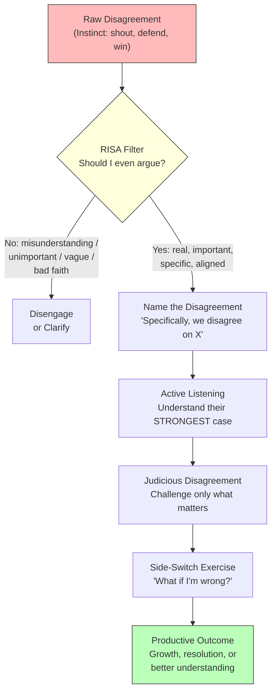

## For future agent
Bo Seo (two-time world debate champion, former Harvard + Australian debate coach, author of *Good Arguments*) on the structured art of disagreement. Core deliverables: the RISA framework for deciding whether to argue at all, active listening as a strategic weapon, side-switch exercises for empathy, and judicious disagreement for productive conversations. Aimed at a BTech student who needs to argue well in interviews, presentations, and life.

# Debate & Argumentation — The Structured Art of Disagreement

## Core Framework: From Instinct to Discipline

The central claim: **argument is a skill, not an instinct.** Public discourse is broken because people treat disagreement as a reflex (defensive, emotional, chaotic) rather than a deliberate practice. Bo Seo's system restores structure:

---

## Key Insights

### 1. Intelligence vs Wisdom in Argument
"Intelligence is the ability to respond to any argument; wisdom lies in knowing **which** arguments to respond to, and **which parts** of an argument to respond to." Most people burn energy contesting every point. The skilled arguer selects.

### 2. The RISA Framework — Should You Even Argue?
Before engaging, check four conditions:

| Letter | Question | Why It Matters |
|--------|----------|----------------|
| **R** | Is the disagreement **Real** (not just a misunderstanding)? | Many "disagreements" are just miscommunication — clarify first |
| **I** | Is it **Important** enough to justify the cost? | Not every hill is worth dying on |
| **S** | Is the topic **Specific** enough to make progress? | Vague disputes ("you always do this") go nowhere |
| **A** | Are your **Aligned** in why you're arguing? | Both must want understanding/resolution, not just to hurt |

**Application:** Family gatherings (Thanksgiving/Christmas), workplace disputes, interview challenges. RISA creates an implicit "contract" — "This is what we're disagreeing about, and these are our reasons for engaging." If someone breaks the contract (changes topic, introduces new grievances), you can redirect: "We agreed to discuss X."

### 3. Active Listening Is Strategic, Not Passive
Two debate- listening principles:
- **Understand their argument AS THEY WOULD** — not the weakened, distorted strawman version. They won't feel heard otherwise.
- **Respond to the STRONGEST version** — sometimes even strengthen their case before rebutting. This challenges them to go further and elevates the conversation.

### 4. Judicious Disagreement — Not Everything Needs Challenging
Two filtering questions before contesting a point:
1. Is resolving this disagreement **necessary** to make progress?
2. Will challenging it **help** advance the overall argument?

If neither is true → let it go. This prevents arguments from becoming "unruly, all-encompassing disputes."

### 5. Side-Switch Exercises — The Empathy Machine
In the last moments before going on stage, skilled debaters:
1. **Write the 4 best arguments for the opposing side**
2. **Review their own case through opponent's eyes** — identify all flaws
3. **Imagine losing and why**

"This puts a pause on certainty. It makes us feel, for a moment, the reasonableness of other people's beliefs. It creates wiggle room through which humility or empathy might arise."

### 6. Debate as Salvation
Bo Seo's personal story: immigrant from South Korea to Australia at age 8, couldn't speak English, constantly interrupted and spun out of conversations. Debate offered one promise: "When one person speaks, no one else does." For the interrupted and unheard, structured argument is freedom.

---

## Failure Modes

| Failure Mode | What It Looks Like | How to Avoid |
|---|---|---|
| **Skipping RISA** | Jumping into every disagreement emotionally — arguments about politics at dinner, online flame wars, interview defensiveness | Always run the RISA filter first. Most "disagreements" fail R or I. |
| **Strawman Listening** | Hearing only the weakest version of their argument so it's easy to dismiss | Actively try to make their case STRONGER before rebutting. Steelman, then dismantle. |
| **Contesting Everything** | Turning every point into a battle — the argument becomes chaotic and exhausting | Apply the two filtering questions. If it's not necessary and won't help, let it go. |
| **Bad Faith Alignment** | Arguing with someone who just wants to hurt feelings, "win," or provoke | RISA's A-check: if their objective isn't understanding/resolution, disengage. |
| **Never Side-Switching** | Absolute certainty in your position — you become dogmatic and brittle | Do the 3 exercise steps before any high-stakes argument (interview, presentation, debate). |
| **Agreeableness as Avoidance** | Keeping thoughts to yourself to avoid conflict — the opposite of productive argument | "Debate offered salvation" — structured disagreement is NOT aggression. It's clarity. |

---

## Actionable Takeaways for a 2nd-Year BTech Student

### This Week
1. **Run RISA on your next disagreement** — before responding, silently check: Real? Important? Specific? Aligned? You'll skip 80% of pointless arguments.
2. **Practice steelmanning** — in your next debate/discussion, try to articulate the OTHER person's position better than they did before responding.
3. **Do one side-switch exercise** — pick a position you hold strongly (e.g., "quant finance is the best career path"). Write 4 arguments AGAINST it. Notice what happens to your certainty.

### For Interviews
4. **RISA for behavioral questions** — when the interviewer challenges you ("Tell me about a time you failed"), don't get defensive. Name the specific failure, own it, show growth.
5. **Active listening in panel interviews** — understand what they're REALLY asking before responding. Many candidates answer the surface question, not the underlying concern.
6. **Judicious disagreement** — if an interviewer states something you disagree with, don't contest everything. Pick the ONE point where your perspective adds value. Let the rest go.

### For Presentations & Group Work
7. **Name disagreements explicitly** — in group projects, when conflict arises: "Specifically, we disagree on [X]. We both want [Y]. Let's focus on X." This is RISA in action.
8. **Side-switch before presenting** — anticipate the 3 toughest questions, write your answers from the questioner's perspective.

---

## Quote Bank

1. "Our public conversations are in a state of crisis — they're stuck. It's people fully convinced of their views, shouting at each other from a distance."
2. "Intelligence is the ability to respond to any argument; wisdom lies in knowing which arguments to respond to, and which parts of an argument to respond to."
3. "In debate, when one person speaks, no one else does. And to someone who had been interrupted and spun out of conversation, that sounded to me like a kind of salvation."
4. "It is in your best interest to understand the opposition's argument as they would understand it."
5. "It's also in your best interest to respond to the strongest version of the other side and sometimes to build up the other side's case so that it's even better than where they have it now."
6. "Those exercises put a pause on that feeling of certainty. It makes us feel, for a moment, the reasonableness of other people's beliefs."
7. "It creates wiggle room through which something like humility or empathy might arise."
8. "Each of us are bigger than our political affiliations, than our religious commitments, than our ideological beliefs."
9. "Unless you are careful to say, 'We're having this disagreement at this moment and not all the other disagreements we could be having,' all of the differences between two people can start flooding in."
10. "No matter how offensive or wrong-seeming it may be, by asking whether it's first necessary to challenge, you can be a little bit more judicious in how you disagree."

---

## Related

- [[communication-mastery]] — the delivery system (voice, body, articulation) that argumentation plugs into
- [[vocabulary-building]] — precision language for making arguments land
- [[motivation-self-belief]] — confidence to engage in disagreement without fear
- [[digital-wellness]] — online discourse as the worst arena for productive disagreement
- [[how-to-self-teach]] — learning through debate and discussion (social learning step)
- [[interview-counter-guide]] — argumentation skills applied to interview challenges