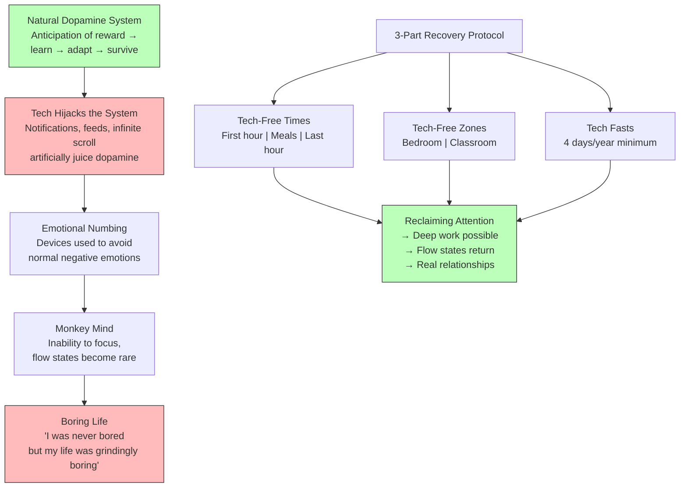

## For future agent
Arthur Brooks (Harvard professor, happiness scientist) on the neuroscience of tech addiction, why negative emotions are healthy, how devices hijack the dopamine system, and a 3-part recovery protocol (tech-free times, tech-free zones, tech fasts). Also covers Emerson's philosophy of self-reliance as the framework for rebellion against digital chains. Directly relevant to any student whose deep work is destroyed by phone checking. Cross-links to [[deep-work-attention-economics]], [[temptation-mastery]], [[psychological-execution]].

# Digital Wellness — Breaking Device Addiction

## Core Framework: The Addiction-Hijack-Recovery Model

---

## Key Insights

### 1. Dopamine Is Not Pleasure — It's Anticipation
The most common misconception: dopamine is a "pleasure hormone." It is not. Dopamine gives you the **anticipation of reward**. You learn something, you're surprised by it, you encode it. Next time you think about it → dopamine spritz → you go searching for it. Find more → more dopamine → reinforced cycle. This is *evolutionary genius* — it made humans remember where gazelles gather and where berries grow. But tech has found ways to **juice this system artificially**: notifications, infinite scroll, likes, and social comparison all spike dopamine without delivering actual reward.

### 2. Your Phone Is a Numbing Device — Like Alcohol
Brooks draws a direct parallel: alcohol cuts the connection between the amygdala (fear/anger) and the prefrontal cortex (conscious awareness). You feel fear and anger, but you don't *know* you feel them. When you sober up → rebound → more fear/anger than before → escalation → addiction. **Same mechanism with phones.** You don't feel boredom, anxiety, or loneliness because you scroll. But the emotions don't disappear — they accumulate. The next day, you need more scrolling. Same escalation. Same addiction cycle.

### 3. Negative Emotions Are Not a Bug — They're a Feature
"There are four negative emotions: anger, disgust, sadness, and fear. They exist because different parts of the limbic system have been evolved to produce them. When you're feeling those things, it means your brain is working properly." The average American spends **16% of their day** in intense negative emotions. That's normal. The dorsal anterior cingulate cortex lights up during social exclusion/grief — and that's *good*, because without it, you'd do things that get you expelled from the tribe. 250,000 years ago, that meant death. Today, it means fired, friendless, and divorced in two weeks.

### 4. The "Vegging Out" Myth
"I just want to doom scroll for 45 minutes to relax." **Problem 1:** You're not relaxing — social media triggers social comparison and conflict, which *raises* anxiety. You're detaching (numbing) while being neurologically stressed. **Problem 2:** You're fueling the dopamine cycle. Short-term relief → long-term problems, every single time. "You're not designed to relax with something that actually stresses you out."

### 5. Flow Requires Boredom Tolerance
Csikszentmihalyi's flow state: fully immersed, hours turn to minutes, intensely pleasurable. But to reach flow, **you must get a little bored first**. If you've wiped out every moment of boredom with your phone, you've lost the ability to tolerate the gateway state that leads to flow. Tech gives you the "monkey mind" — jumping from tree to tree, never staying in one place. "When you're addicted to tech, you're doing it to yourself. You're turning on five things. You're constantly multitasking."

### 6. Emerson's 3-Step Rebellion (1841, Still Relevant)
Ralph Waldo Emerson's *Self-Reliance* provides the philosophical framework:
1. **Be honest with yourself.** Admit you're doing something you shouldn't be. Stop lying to yourself. "We lie to ourselves all day long. We got these biases that make us feel better about ourselves."
2. **Think for yourself.** Form your own opinions against the crowd. The internet/social media will pressure you into echo chambers. "Have a weird contrary opinion on the internet and watch how many friends you actually lose."
3. **Go your own way.** Walk away from what chains you. "I've talked to students... What would happen if you just got rid of your social media accounts? It makes them panic. That means I'm going to need to be honest with myself."

### 7. The Eulogy Test
"If you got to the end of your life right now... one thing you wouldn't say is, 'I wish I'd spent more time online.' You'd say, 'I wish I'd spent more time with my loved ones, with my friends, with my family.'" Average American: 4-9 hours on screens daily, checking phone 205 times/day. If that's you, this section is for you.

---

## The 3-Part Recovery Protocol

### Part 1: Tech-Free Times (3 Windows)

| Time Window | Why It Matters | Protocol |
|---|---|---|
| **First hour of day** | Neurocognitive programming is set here. Control the first hour = control the day. | No phone. Walk outside. Workout without devices. Ignites default mode network (your best ideas come here). |
| **Meal times** | Homo sapiens evolved to get oxytocin from eye contact with kin while eating. Phone on table → even face-down → interrupts bonding chemistry. | Phone in another room during meals. Focus on people you're eating with. |
| **Last hour of day** | Blue light wrecks pineal gland → poor melatonin → destroyed sleep architecture. Plus: focus on loved ones before sleep = connection + harmony. | No screens. Read physical book. Be with people you live with. |

### Part 2: Tech-Free Zones (2 Places)

| Zone | Protocol |
|---|---|
| **Bedroom** | Phone charges in another room. Buy a $5 alarm clock. After 6-7 weeks, you won't even want it at your bedside. |
| **Classroom** | No phones during lectures or lunch. (Brooks argues this should be mandatory at ALL school levels — it's "insanity" that it isn't.) |

### Part 3: Tech Fasts (1 Annual Minimum)

| Duration | Experience |
|---|---|
| **Day 1** | "Screaming in my head — where's my phone?" |
| **Day 2** | Calming down. |
| **Day 3** | "I understand this tranquility." |
| **Day 4** | "I wish it were all year round." |

**96 hours per year** (4 days). Find a secular retreat, a silent meditation, or just 4 device-free days. This resets your dopamine sensitivity.

### Bonus: Notification & Color Protocols

- **Turn off ALL notifications** except phone calls from close contacts. "It's bad enough that you think of the phone on your own. It's even worse when the phone is thinking of you."
- **Turn your screen to black and white.** Color is how your occipital lobe decides between ripe fruit and poison — it's deeply wired. B&W screens are measurably less addictive.

---

## Failure Modes / How Can Someone FAIL at Digital Wellness?

| Failure Mode | What It Looks Like | How to Avoid |
|---|---|---|
| **Cold Turkey Without Protocol** | Deleting all social media on a whim, then reinstalling within 48 hours because "I need it for college groups." | Follow the 3-part protocol systematically. Times → Zones → Fasts. Don't skip to the hardest step. |
| **"I Need My Phone for Alarm"** | Keeping phone on bedside table as alarm clock. Checking it at 2 AM when you can't sleep. | $5 alarm clock. Phone charges in another room. This is non-negotiable. |
| **Social Media as "Work"** | "I need Instagram for my business / networking / brand." 3 hours later, you've watched 47 reels. | Separate "post" time from "consume" time. Schedule 15 min for posting. Never open the app "just to check." |
| **Binge-Then-Restrict** | 12 hours of scrolling Saturday → complete phone abstinence Sunday → crash Monday. | Small, sustainable changes. First hour of day for 2 weeks. Then add meals. Then last hour. |
| **Ignoring the Rebound Effect** | "I stopped scrolling and now I feel MORE anxious!" Panic. Go back to scrolling. | Expected. Like alcohol withdrawal, anxiety spikes before it drops. Ride it out for 3-5 days. |
| **Confusing "Low-Quality" with "No Tech"** | Replacing Instagram with YouTube, Reddit, or news sites. Still 6 hours of screen time, just different apps. | The issue is the *device relationship*, not the specific app. Apply the same protocols to all screen time. |
| **"I Can't Because College"** | "I need my phone for WhatsApp groups, Google Classroom, PDFs..." | You need your phone for *specific tasks*. You don't need it *in your pocket all day*. Use it for tasks, then put it away. |
| **Sleep Sacrifice** | Scrolling until 1 AM, waking at 6 AM, wondering why deep work is impossible. | Protect the last hour. Blue light destroys melatonin. Sleep is non-negotiable for cognitive function. |

---

## Actionable Takeaways for a 2nd-Year BTech Student

### This Week
1. **Buy an alarm clock.** Move your phone charger out of the bedroom tonight. This single change compounds over months.
2. **First hour rule:** For 7 days, no phone in the first hour after waking. Walk, exercise, or eat breakfast screen-free.
3. **Test yourself:** Put your phone away for one hour. Count how many times you think about it or reach for it. If >12 times (once per 5 min), you're showing habitual dependency.

### This Month
4. **Meal-time protocol:** Phone stays in bag/backpack during every meal in the hostel mess. Make eye contact with the people you eat with.
5. **Notification purge:** Go into Settings → Notifications. Turn off everything except phone calls and messages from family. Everything else. Every app.
6. **B&W experiment:** Set your phone to grayscale for one week. (iOS: Accessibility → Display & Text Size → Color Filters → Grayscale. Android: Developer Options → Simulate Color Space → Monochromacy.) Notice how much less interesting your phone becomes.

### This Semester
7. **4-day tech fast.** Plan it during a break. No phone, no laptop (except essentials). Camp, trek, or just stay home with books. Experience the Day 1-4 arc Brooks describes.
8. **Default mode network sessions:** 20 minutes per day, no devices, just sitting with your thoughts. This is where your best quant-finance ideas will come from.
9. **Eulogy check:** Every Sunday, ask: "If I died today, would I be proud of how I spent my screen time this week?" If no → adjust.

---

## Quote Bank

1. "Dopamine is often mischaracterized as a pleasure hormone. It's not. What it does is give you the anticipation of reward."
2. "We found a way to juice that dopamine system... Your brain is working the way it was supposed to, but it's been hijacked by modern technology."
3. "If you're spending 10 to 12 hours a day behind the screen and checking your phone 205 times a day, you're in danger of getting to the end of your life saying, 'Well, that was pretty boring because I was never bored.'"
4. "Negative emotions are more intense than positive emotions because negative emotions keep you alive."
5. "People often say, 'I want to live without sadness.' No, you don't. If you never had any sadness, you'd say everything that's on your mind... and you'd be fired, friendless, and divorced in about two weeks."
6. "It's bad enough that you think of the phone on your own. It's even worse when the phone is thinking of you."
7. "One missed day is an error. Two missed days is the start of a new habit."
8. "When you're honest with yourself, then you're able to think for yourself. You're able to go against the crowd."
9. "Be honest with yourself. Because when you do that, then you're actually able to think for yourself."
10. "If you're like the average American, checking your phone 205 times a day... one thing you wouldn't say is, 'I wish I'd spent more time online.'"
11. "You're not designed to relax with something that actually stresses you out."
12. "The moment you start to feel a little bored, that could lead to something blissful, could lead to a divine experience. That's when you turn on the podcast and scroll the social media... you're a monkey jumping around from tree to tree."

---

## Related

- [[deep-work-attention-economics]] — Cal Newport's framework for distraction-free concentration (the *positive* side of attention management)
- [[temptation-mastery]] — BHATT's framework for resisting urges and maintaining vigilance
- [[psychological-execution]] — overthinking, dopamine deficit, boredom tolerance, and the default mode network
- [[motivation-self-belief]] — discipline as the engine of sustained behavior change
- [[atomic-habits-systems]] — habit loops and identity-based change for replacing phone habits
- [[communication-mastery]] — inner dialogue and silence as prerequisites for articulate speech
- [[belief-engineering]] — the science of self-deception and how we lie to ourselves about our habits
