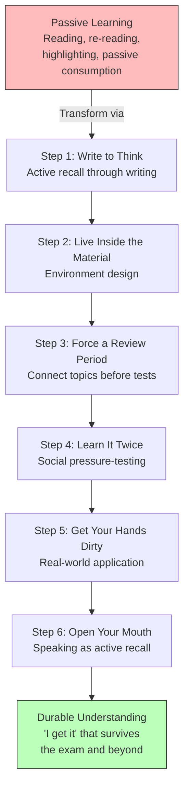

## For future agent
BetterU's breakdown of Harvard's 6-step learning system — a century-old pedagogical approach that most students use zero of. Six actionable techniques: write-to-think (active recall via writing), environment design (live inside the material), forced review periods (connect topics before tests), social pressure-testing (explain out loud), real-world application (learn via real decisions), and speaking as the antidote to "illusion of competence." Directly applicable to any BTech student who wants to learn faster than peers with less time.

# Harvard's 6-Step Learning System

## Core Framework: Passive → Active Learning

The central claim: Harvard's biggest classroom is a **dining hall**, not a lecture theatre. Students learn more there by accident than most students learn on purpose — because the environment forces active engagement. The 6 steps convert passive consumption into durable understanding:

---

## The 6 Steps

### Step 1: Write to Think (Active Recall via Writing)

**The technique:** Close your notes. Open a blank page. Write one full paragraph explaining something you recently studied — from scratch, in full sentences (no bullet points).

**Why it works:** Full sentences prevent you from hiding gaps. If you stall after ~2 sentences, that stall reveals the exact missing piece. Bullet points let you skim over what you don't actually know.

**The protocol:**
1. Close all materials
2. Write a full paragraph explaining the concept
3. If you stall → that's the gap → go back and learn THAT specific piece
4. Revise by writing what you actually know, not what you think you know

**Key insight:** "Passive reading creates an 'I get it' feeling that disappears when you must explain." Writing is the first test of real understanding.

### Step 2: Live Inside the Material (Environment Design)

**The technique:** Surround yourself with people who treat learning as normal. Model your habits from the group around you.

**Harvard's secret:** Their dining halls, libraries, and discussion groups create an environment where learning is the default. If others are always distracted, you drift into distraction. If others study seriously, you raise your ceiling.

**Practical "steal the environment" steps:**
- Join a study group working on similar material
- Eat meals with people solving similar problems
- Find libraries/spaces where serious people sit
- Choose discussion settings where learning happens naturally (not just in class)

**Key insight:** Environment > willpower. You don't need Harvard — you need to engineer the same environmental pressures.

### Step 3: Force a Review Period (Connect Before Tests)

**The technique:** Don't cram by consuming MORE information. Build dedicated review days before exams — ideally a full week (Harvard's "reading period"), or even 2 days.

**What to do during review:**
- Connect topics across weeks: "How does week 3 explain week 11?"
- Focus on **links and relationships** between ideas, not rereading in isolation
- Find the narrative thread that connects individual lectures into a coherent system

**Key insight:** "Isolated review stores facts briefly; connected review builds durable understanding." The difference between cramming and learning is whether you connect ideas or just collect them.

### Step 4: Learn It Twice (Social Pressure-Testing)

**The technique:** Harvard's structure: large lecture → weekly small group ("section"). The small group is where real learning happens — because you must explain, defend, and be challenged.

**Without a Harvard section group:**
- Close the book and explain out loud to someone (study partner, friend, anyone)
- If alone: write your explanation, then use AI to challenge it — ask it to disagree, ask hard questions, identify where your reasoning breaks

**Key insight:** "Learning happens when you process/retrieve the idea a second time." The first time is exposure; the second time (social or self-testing) is where understanding solidifies.

### Step 5: Get Your Hands Dirty (Real-World Application)

**The technique:** Move from "practice problems" to real scenarios with incomplete or contradictory information. Use life as your training ground.

**Examples:**
- Learning negotiation → negotiate something real this week (not a role-play)
- Learning coding → build a real project, not just textbook exercises
- Learning finance → paper-trade or analyze real market data, not just formulas

**Key insight:** "Notice where your understanding collapses — this is the lesson." Real application exposes gaps that practice problems never will.

### Step 6: Open Your Mouth (Speaking as Active Recall)

**The technique:** Force yourself to speak in meetings, lectures, conversations — even if imperfectly, even early.

**Why it's the strongest step:** "Passive reading can create an 'I get it' feeling that disappears when you must explain." Speaking forces REAL retrieval, not passive recognition. Getting corrected after speaking teaches more than staying quiet and confused.

**The protocol:**
- In any discussion, say something — even if uncertain
- Say it early, then let correction refine your thinking
- The act of articulating forces your brain to organize what it "kind of" knows

**Key insight:** The "illusion of competence" is the #1 enemy of learning. Speaking destroys it instantly.

---

## Failure Modes

| Failure Mode | What It Looks Like | How to Avoid |
|---|---|---|
| **Re-reading as "studying"** | Highlighting the textbook 3 times, feeling prepared, failing the exam | Re-reading is passive. Write-to-think is Step 1 for a reason — test yourself BEFORE you feel ready. |
| **Environment Ignorance** | Studying alone in bed with phone nearby, wondering why focus fails | Design your environment deliberately. Join a study group. Find a library. Remove the phone. |
| **Cramming Without Connecting** | Memorizing 10 lectures in 2 nights, dumping on exam day, forgetting next week | Force a review period (even 2 days). Connect week 3 to week 11. Find the narrative. |
| **Solo Learning Trap** | Never explaining concepts to anyone — you think you know it until the interview | Explain out loud. Use AI to challenge you. The "I get it" feeling is a lie until you can teach it. |
| **Textbook-Only Practice** | Solving 200 practice problems but never applying to a real scenario | Real application exposes gaps practice problems never will. Build something. Negotiate something. |
| **Silence in Discussions** | Staying quiet in lectures/groups because "I might be wrong" | Getting corrected after speaking teaches more than staying quiet and confused. Speak early. |
| **Illusion of Competence** | "I understand this" after reading — then freezing when asked to explain | Speaking (Step 6) is the antidote. If you can't explain it simply, you don't understand it. |

---

## Actionable Takeaways for a 2nd-Year BTech Student

### This Week
1. **Write-to-think exercise:** Close your notes on any subject. Write one paragraph explaining the core concept from memory. Where you stall = where you don't actually know it.
2. **Environment audit:** Where do you study? Is it a place where serious learning is the default, or a place where distraction is? Move to a library or study group this week.
3. **Explain out loud:** Pick one concept from today's lecture. Explain it to a friend (or to the wall) in your own words. If you can't, you've found your gap.

### This Month
4. **Build a review habit:** Before your next exam, block 2 full days for REVIEW ONLY (no new material). Connect topics across weeks. Find the narrative.
5. **Start or join a study group** (3-5 people). Weekly 1-hour session: each person explains one concept, others challenge. This is Harvard's "section" system.
6. **Apply one concept to real life:** If you're learning DSA, solve a real problem (not LeetCode). If you're learning finance, analyze a real stock. If you're learning electronics, build a circuit.

### This Semester
7. **Speak in every lecture/tutorial** — at least once. Even "I'm not sure, but..." is better than silence. The correction teaches more than the silence.
8. **Use AI as a sparring partner:** After studying a topic, ask an AI to disagree with your understanding. Find where your reasoning breaks.
9. **Teach someone:** Offer to explain a concept to a junior. Teaching is the highest form of active recall.

---

## Quote Bank

1. "Harvard's biggest classroom has no desks, no projector, no professor standing at the front. It's a dining hall, and students learn more there by accident than most students learn on purpose."
2. "If you stall after 2 sentences, that stall reveals the exact missing piece to learn next."
3. "Isolated review stores facts briefly; connected review builds durable understanding."
4. "Passive reading can create an 'I get it' feeling that disappears when you must explain."
5. "Learning happens when you process/retrieve the idea a second time."
6. "Notice where your understanding collapses — this is the lesson."
7. "Getting corrected after speaking teaches more than staying quiet and confused."
8. "If others are always distracted, you'll drift into distraction. If others study seriously, you'll raise your own ceiling."
9. "The illusion of competence is the #1 enemy of learning."
10. "Write one full paragraph explaining something you recently studied from scratch. Use full sentences so you can't hide gaps."

---

## Related

- [[how-to-self-teach]] — the broader self-teaching system this plugs into
- [[deep-work-attention-economics]] — environment design for distraction-free concentration
- [[communication-mastery]] — speaking skills that make Step 6 (open your mouth) effective
- [[motivation-self-belief]] — discipline to maintain learning habits when it's hard
- [[digital-wellness]] — phone addiction as the #1 enemy of environment design
- [[vocabulary-building]] — precision language for explaining concepts clearly