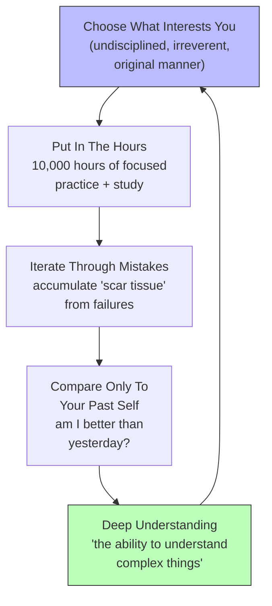

## For future agent
Compilation featuring Richard Feynman, John Carmack, Kevin Systrom, and Andrej Karpathy on the philosophy of hard work and studying. Core message: there are no miracles or shortcuts — understanding comes from extensive practice, reading, learning, and study. The 10,000-hour principle, iterating through mistakes, and comparing yourself only to your past self. Short but dense (~3 min), each speaker adds a distinct perspective. Cross-links to [[motivation-self-belief]], [[harvard-learning-system]], and [[art-of-winning]] for adjacent territory.

# How To Study Hard — The Feynman Philosophy

## Core Framework: No Miracles, Just Work

The central claim across every speaker: **there is no shortcut, no talent substitute, no miracle.** Understanding complex things — quantum mechanics, electromagnetic fields, code, markets — comes from one thing: putting in the hours with relentless curiosity.

---

## Key Insights

### 1. Feynman's Core Principle: Study Hard, But Irreverently
"Study hard what interests you the most in the most undisciplined, irreverent and original manner possible."

Two things here that most people miss:
- **"What interests you the most"** — not what's fashionable, not what pays most, not what your parents want. Follow genuine curiosity. That's the fuel that sustains 10,000 hours.
- **"Undisciplined, irreverent and original"** — not rigid, not textbook-perfect, not copying someone else's method. Study in YOUR way. Break rules. Be messy. Feynman was famous for this — he didn't learn physics the way physics was "supposed" to be learned.

### 2. Understanding Is Not Natural — It's Earned
"The ability to understand complex concepts like quantum mechanics or imagine electromagnetic fields does not come naturally or miraculously. It requires extensive practice, reading, learning, and study."

**The myth of talent:** Some people may have an obsessive nature that helps, but great achievements require a LOT of hard work — "often at levels far beyond average." Changing the world or making significant contributions demands working exceptionally hard.

### 3. The 10,000-Hour Principle — With a Caveat
Spend ~10,000 hours on a subject or skill to become an expert. But the key is:
- **Choose areas where you can maintain interest** — 10,000 hours of misery produces nothing
- **Iterate, improve, learn from mistakes** — the hours aren't just repetition, they're DELIBERATE improvement

### 4. Compare Only To Your Past Self
"Instead of comparing oneself to others in a harmful manner, it is more beneficial to compare personal progress over time."

**Evaluating whether one has improved compared to their past self serves as motivation for further growth.** The comparison trap (others' highlights vs. your behind-the-scenes) is toxic. The only useful comparison: Am I better than I was last month?

### 5. Mistakes = Scar Tissue
"Mistakes and failures are valuable experiences that contribute to personal development. Accumulating 'scar tissue' from past errors helps strengthen future decision-making processes."

**Scar tissue is stronger than the original tissue.** Every failure you survive makes you more resilient and wiser. The person with the most scar tissue has been through the most — and is therefore the strongest.

---

## The Four Perspectives

| Speaker | Core Contribution |
|---------|------------------|
| **Richard Feynman** | Study with irreverence. Follow curiosity, not convention. Understanding comes from practice, not talent. |
| **John Carmack** | The obsessive nature of deep work — when you're consumed by a problem, the hours accumulate naturally. |
| **Kevin Systrom** | Building things (Instagram) requires iterating through what doesn't work. The product is the scar tissue. |
| **Andrej Karpathy** | Deep technical understanding (neural networks, GPT) comes from building from scratch, not just reading about it. |

**The common thread:** All four are masters who became masters through obsessive, curious, iterative hard work — not through天赋 (talent) alone.

---

## Failure Modes

| Failure Mode | What It Looks Like | How to Avoid |
|---|---|---|
| **Talent Worship** | "They're just naturally smart/gifted. I could never do that." → never starts. | Feynman says it plainly: understanding doesn't come naturally or miraculously. It comes from practice. Start. |
| **Comparison Spiral** | Watching others' success and feeling inadequate. Comparing your Chapter 1 to their Chapter 20. | Compare only to your past self. Track YOUR progress, not theirs. |
| **Repetition Without Iteration** | Doing 10,000 hours of the same thing without improving. "Practice" that's just repetition. | Iterate. Learn from mistakes. Each hour should be slightly better than the last. Deliberate practice, not autopilot. |
| **Interest Drift** | Picking what's "optimal" instead of what genuinely interests you. Burning out at hour 2,000. | Follow curiosity first. 10,000 hours of genuine interest >> 10,000 hours of forced discipline. |
| **Perfectionism Before Starting** | "I need to know the perfect method before I begin." → never begins. | Feynman: study in an "undisciplined, irreverent and original manner." Start messy. Learn as you go. |
| **Ignoring Scar Tissue** | Failing and feeling ashamed instead of extracting the lesson. Each failure makes you weaker, not stronger. | Reframe every failure as scar tissue. What did this teach me? How am I stronger now? |

---

## Actionable Takeaways for a 2nd-Year BTech Student

### This Week
1. **Identify YOUR "undisciplined, irreverent" study method** — what way of learning genuinely works for YOU, not what the textbook says? Feynman studied by teaching others. Carmack studies by building. Find your mode.
2. **Start a "scar tissue journal"** — every failure this week, write one sentence: "What I learned from this." Review monthly. Watch the tissue accumulate.
3. **Replace one comparison with a self-check** — next time you see a peer's achievement, instead of "they're so much better," ask: "Am I better than I was last month?"

### This Month
4. **Choose your 10,000-hour target** — what one thing, if you spent 10,000 hours on it with genuine interest, would transform your life? Quant-finance? AI/ML? A specific project? Name it.
5. **Build something from scratch** (Karpathy's approach) — don't just read about a concept. Build it. Code it. Create it. The understanding that comes from building > the understanding that comes from reading.

### This Semester
6. **Track your hours** on your chosen target — even roughly. You'll be surprised how fast they accumulate when you're genuinely interested.
7. **Study in your own way** — if textbooks bore you, watch lectures. If lectures bore you, build projects. If projects bore you, teach others. The METHOD doesn't matter as long as the HOURS are real and the INTEREST is genuine.

---

## Quote Bank

1. "Study hard what interests you the most in the most undisciplined, irreverent and original manner possible." — Richard Feynman
2. "The ability to understand complex concepts does not come naturally or miraculously. It requires extensive practice, reading, learning, and study."
3. "Great achievements generally require a lot of hard work."
4. "Changing the world necessitates working exceptionally hard, often at levels far beyond average."
5. "It is crucial to choose areas where one can invest time and effort while maintaining interest."
6. "Regardless of where those 10,000 hours are spent, it is essential to iterate, improve, and learn from mistakes along the way."
7. "Instead of comparing oneself to others in a harmful manner, it is more beneficial to compare personal progress over time."
8. "Mistakes and failures are valuable experiences that contribute to personal development."
9. "Accumulating 'scar tissue' from past errors helps strengthen future decision-making processes."

---

## Related

- [[motivation-self-belief]] — the identity-level belief and discipline that sustains 10,000 hours
- [[harvard-learning-system]] — the specific techniques (write-to-think, environment, speaking) that make the hours productive
- [[art-of-winning]] — pattern recognition and leverage that make hard work compound faster
- [[digital-wellness]] — phone addiction as the #1 enemy of accumulating focused hours
- [[how-to-self-teach]] — the broader self-teaching system
- [[communication-mastery]] — Feynman's "irreverent" approach as a communication style