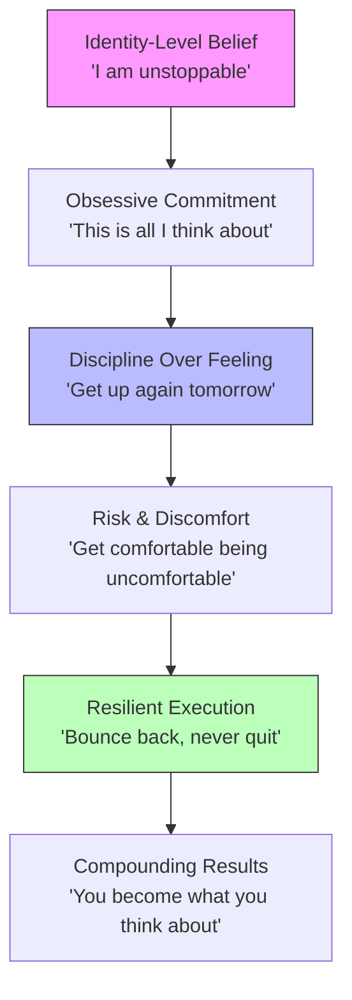

## For future agent
Compilation distillation of ~15 motivational speakers (David Goggins, Jocko Willink, Tom Bilyeu, Eddie Pinero, Andy Frisella, Patrick Bet-David, Earl Nightingale, and others) on self-belief, obsession, discipline, risk-taking, and mental toughness. Multiple overlapping perspectives — no single speaker dominates. All claims are **stated** (motivational-genre assertions), not peer-reviewed; cross-links to evidence-based notes where the science exists.

# Motivation, Self-Belief & Discipline — Compilation Distillation

## Core Framework: The Belief-to-Execution Pipeline

The central idea across every speaker in this compilation is a sequential pipeline:

**The pipeline has no off-ramp.** If you break at any stage, you restart. Every speaker essentially says the same thing in different words: believe first, commit obsessively, execute with discipline, embrace discomfort, and never stop. The differentiator between people who "make it" and people who don't is not talent or luck — it's *the willingness to stay in the pipeline when it hurts*.

---

## Key Insights

### 1. Self-Belief Is Not Confidence — It's a Deliberate Construction
You don't "find" self-belief. You build it through repeated proof. The compilation distinguishes between **affirmation-based belief** ("say it in the mirror") and **proof-based belief** ("give the world irrefutable proof you are who you say you are"). Real confidence comes from evidence you generate, not words you recite. This connects directly to [[belief-engineering]]'s distinction between delusional self-belief and earned self-efficacy.

### 2. Obsession Beats Talent
Multiple speakers converge on this: talent without obsession loses to obsession without talent. "Obsession's going to beat talent every time. You got all the talent in the world, but are you obsessed? Is it all you ever think about?" The implication for a BTech student: your JEE rank or CGPA doesn't determine your ceiling — how *consumed* you are by your craft does.

### 3. Success Is a Lonely Journey — And That's the Point
"Most people will not understand your obsession, your drive, and your determination. Success is a lonely journey." The compilation frames isolation not as a bug but as a feature. When you try to explain your 4 AM study sessions or weekend quant-finance deep-dives to peers, you'll get blank stares. That's expected. Go anyway.

### 4. Discipline Is the Antidote to Motivation's Inconsistency
"You need to let discipline be your guide, not how you feel." Motivation is episodic; discipline is structural. The compilation repeatedly says: you will not always feel like doing the work. The discipline to do it *anyway* — especially when tired, hurt, or discouraged — is what separates winners from talkers. This maps to [[atomic-habits-systems]]'s identity-based habit loop.

### 5. Risk Is Non-Negotiable
"Only risk takers win. By definition, if you are the same as everybody else, if you're not taking a risk over and above what everybody else is taking, by definition, you can't win." For a quant-finance aspirant: staying in a "safe" IT job because your batchmates are doing it is the guaranteed path to mediocrity. Risk here means applying to firms that scare you, building projects that might fail, relocating for opportunity.

### 6. The 90/8/2 Rule of a Winner's Life
One speaker breaks down the emotional reality: "90% of the time you're going to feel like you're getting your balls kicked in. 8% of the time you're going to be confused and frustrated. 2% of the time you actually win." This is a crucial reframe — if you expect winning to *feel* good most of the time, you'll quit. Winners find purpose in the fight, not in the victory.

### 7. "Never Miss Two Days in a Row"
The one-miss rule: one missed day is an error; two missed days is the start of a new (bad) habit. This is the practical bridge between grand ambition and daily execution. You *will* miss a workout, skip a study session, fail to code. The rule is: get back on track the very next day. Period.

---

## Failure Modes / How Can Someone FAIL at Applying This?

| Failure Mode | What It Looks Like | How to Avoid |
|---|---|---|
| **Affirmation Theater** | Reciting "I am unstoppable" in the mirror but taking zero action. Mistaking self-talk for self-belief. | Pair every affirmation with a concrete action today. Belief is built through *doing*, not saying. |
| **Obsession Without Direction** | Grinding 16 hours/day on random YouTube tutorials with no specific goal. "Hustle porn" consumption masquerading as work. | Define the ONE thing. Obsession needs a target. [[deep-work-attention-economics]] helps here. |
| **Waiting for Motivation** | Not starting until you "feel ready." Waiting for the perfect playlist, perfect mood, perfect plan. | Motivation follows action, not the reverse. Start before you're ready. "Go. Go." |
| **Isolation as Excuse** | Using "nobody understands me" to justify never asking for help, mentorship, or collaboration. | Loneliness of the path ≠ refusing to learn from others. Be solitary in *commitment*, not in *method*. |
| **Comfort Zone Quasi-Risk** | Calling a "safe" option a "risk" — e.g., applying only to companies your placement cell recommends. | Real risk means rejection is likely. If you're certain to get it, it's not a risk. |
| **Burnout Disguised as Discipline** | No rest, no recovery, no joy. Grinding until health collapses, then declaring "discipline doesn't work." | Discipline includes rest. "Champions do daily what everybody does occasionally" — daily, not manic-then-crash. |
| **Blame Lock-In** | Refusing to take ownership. "I'm broke because of the economy / my college / my parents." | "Broke people and successful people are both self-made. But only the rich and successful will admit it." |

---

## Actionable Takeaways for a 2nd-Year BTech Student

1. **Write a 1-sentence identity statement** and read it daily. Not "I want to be a quant" but "I am someone who understands markets at a mathematical level." Identity drives behavior. ([[belief-engineering]])
2. **Pick ONE obsession target this semester.** Not three. Not five. One thing you'll think about during every free hour. Quant-finance? A specific project? Define it.
3. **Build a "never miss two days" streak tracker.** Whether it's LeetCode, reading quant papers, or gym — track it visually. One miss is fine. Two is the start of a new habit. ([[atomic-habits-systems]])
4. **Do one thing that scares you every week.** Cold-email a professor for research. Apply to an internship you're "not qualified for." Present in class without notes. Risk is a muscle.
5. **Journal one line at end of day:** "Did I get better today?" If yes for 5 years straight, the compound effect is extraordinary.
6. **Detach from external validation.** "Winning is for the obsessed." Stop checking likes, stop comparing placement packages. Your only benchmark is yesterday's version of you.
7. **Create a "discard list"** — things that don't serve your obsession. "Is this going to make me better? No. It goes." Ruthlessly cut media, relationships, and activities that don't serve your pipeline.

---

## Quote Bank

1. "Believe in yourself, and don't rely on anybody to believe in you. Don't rely on anybody to push you or make you better."
2. "You have to be crazy enough to think that it's possible. That's how you do something worthwhile. That's how you beat the odds."
3. "How can you beat someone who cannot quit? How can you beat someone who every time they go through a hard time, they get better and they get stronger instead of getting weaker?"
4. "You got to get comfortable being uncomfortable if you ever want to be successful."
5. "You're not extraordinary. You just do the ordinary extra."
6. "Every man has two lives, and the second one begins when he realizes that nobody is coming to save him."
7. "Thoughts lead to actions. Actions lead to behaviors. Behaviors lead to lifestyle. Lifestyle determines your destiny."
8. "Real self-confidence doesn't come from shouting affirmations in the mirror. Real self-confidence comes from giving the world irrefutable proof you are who you say you are."
9. "Winning is for the obsessed. You must be obsessed if you want to win."
10. "I can sleep knowing I lost. I couldn't sleep watching all the misfits fight thinking I could have done it and not tried."
11. "The way that you become unstoppable is by refusing to stop."
12. "I get happier about the harder it is because I know that no one else will follow."
13. "Pain is temporary. It may last for a minute or an hour or a day or even a year, but eventually it will subside. If I quit, however, it will last forever."
14. "Success is the only revenge. It's not the best revenge. It's the only revenge."

---

## Related

- [[belief-engineering]] — the science of how beliefs create reality (placebo/nocebo, self-efficacy)
- [[temptation-mastery]] — BHATT's framework for mastering urges and distractions
- [[psychological-execution]] — overthinking, discipline, boredom tolerance, flow states
- [[atomic-habits-systems]] — James Clear's habit loop (identity → systems → results)
- [[deep-work-attention-economics]] — Cal Newport's attention economics and distraction-free focus
- [[life-systems-design]] — structuring life systems for sustained execution
- [[communication-mastery]] — voice, body language, and words as tools of influence
- [[vocabulary-building]] — precision language as a competitive advantage
