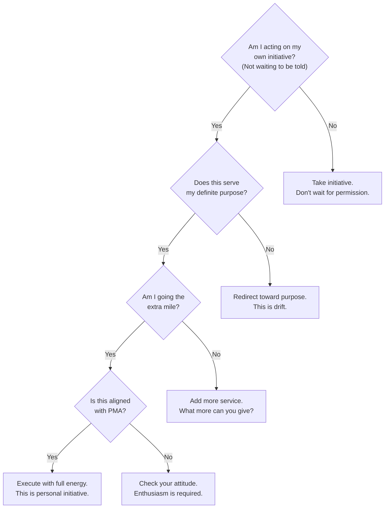
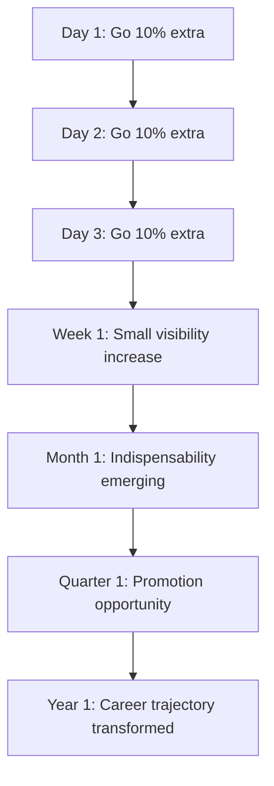

## For future agent
**What this is**: Deep-dive into Hill's EXECUTION layer — the four principles that convert purpose into results. Going the Extra Mile creates value. Self-Discipline provides control. Personal Initiative starts the engine. Enthusiasm activates everything. This is where philosophy meets action. Companion pages: [[napoleon-hill-master-key-overview]] (system overview), [[napoleon-hill-purpose-and-mind]] (foundation layer), [[napoleon-hill-mental-mastery]] (mental operating system), [[napoleon-hill-adversity-and-cosmic-force]] (advanced principles).

**Why saved**: Most people have ideas but fail at execution. These four principles explain WHY execution fails and provide specific remedies. The QQMA formula is the single most practical compensation model ever articulated — it explains exactly why some people earn 10x more than others for similar work.

**Staleness caveat**: Hill's examples are historical (1954) but the principles are universal. Sexual transmutation language may seem dated — the modern interpretation is channeling high-energy emotions into focused creative/professional work.

---

# The Action Engine: Extra Mile, Discipline, Initiative, Enthusiasm

> "The habit of going the extra mile means the habit of rendering more service and better service than one is expected to render and doing it in a positive mental attitude."

Purpose gives you direction. Master Mind gives you leverage. Faith gives you bridge. But none of it matters without ACTION. These four principles are the engine that converts thought into reality.

---

## Principle 3: Going the Extra Mile

> "Going the extra mile is the only legitimate excuse for asking for advancement or higher pay."

### The QQMA Formula

Hill's most practical formula for compensation and advancement:

**Compensation = Quality x Quantity x Mental Attitude**

This is not a metaphor — it's a precise model for why some people earn more than others:

| Factor | What It Means | Example |
|--------|--------------|---------|
| Quality | Excellence in what you deliver | Code that works perfectly, not just "good enough" |
| Quantity | Volume and consistency of delivery | Shipping features weekly, not quarterly |
| Mental Attitude | Enthusiasm, initiative, positive energy | Doing it with joy, not resentment |
| Compensation | The multiplier result | Promotion, raise, respect, opportunity |

**The multiplier effect**: Mental Attitude is the multiplier, not an additive factor. High quality + high quantity + negative attitude = mediocrity. Moderate quality + moderate quantity + high enthusiasm = outsized results.

Andrew Carnegie understood this: he paid Charles Schwab a million-dollar annual bonus specifically for his pleasing personality — ten times what he valued Schwab's direct services. The attitude multiplier was worth more than the output.

### The 10 Benefits of Going the Extra Mile

1. **Favorable attention from decision-makers** — people notice when you exceed expectations
2. **Indispensability** — when you consistently give more, you become essential
3. **Increased returns** — natural law rewards those who give more before expecting to receive
4. **Improved personality** — the habit transforms you through practice
5. **Sharper imagination** — creative thinking develops through active service
6. **Greater self-reliance** — each extra mile builds confidence
7. **Increased initiative** — momentum from action creates more action
8. **Greater courage** — facing challenges beyond requirements builds bravery
9. **Larger consciousness** — your sense of possibility expands
10. **The only legitimate basis for asking advancement** — you've EARNED the right to ask

### The Natural Law Analogy

Hill compares the extra mile to farming: a farmer must plant seeds before expecting harvest. You cannot harvest what you haven't planted. Going the extra mile is planting seeds of value that自然law必有回报。

**Practical application for a BTech student**:
- In a group project: do 30% more than your share, voluntarily
- In an internship: arrive early, stay late, ask for additional responsibilities
- In open-source contributions: fix bugs nobody asked you to fix, write documentation nobody requested
- In relationships: listen more than you speak, remember details, follow up

### The Extra Mile Decision Filter

Before any commitment, ask:
1. What is EXPECTED of me in this situation?
2. What MORE can I deliver beyond expectations?
3. Can I do it with a positive mental attitude?
4. Will this create long-term value for all parties?

If you can answer yes to all four, you've found an opportunity to go the extra mile.

---

## Principle 6: Self-Discipline

> "Self-discipline is the only means of transmuting sorrow into faith, hatred into sympathy, and the only means by which we may reveal and profit by the seed of equivalent benefit which comes with every adversity and defeat."

### Why Self-Discipline Is the Keystone

Without self-discipline, the previous five principles are useless:
- Definite purpose without discipline = daydreaming
- Master Mind without discipline = wasted meetings
- Extra Mile without discipline = one-time effort, not habit
- Applied Faith without discipline = wishful thinking
- Pleasing Personality without discipline = inauthentic performance

Self-discipline is what makes all other principles OPERATIONAL. It's the bridge between knowing and doing.

### The 7 Areas Requiring Self-Discipline

Hill identifies seven specific areas where discipline is essential:

**1. Master Your Tongue**
Think before speaking. Words once released cannot be收回。Most regrettable actions start with regrettable words. Hill's rule: if you cannot improve on silence, be silent.

**2. Resist Retaliation**
When wronged, the natural impulse is to strike back. Self-discipline means resisting this impulse. Retaliation escalates conflict; restraint disarms it. Hill argues that the person who can resist retaliation has already won the conflict.

**3. Control the Four Primary Emotions**
Hill identifies four emotions that, when uncontrolled, destroy everything:
- **Love** — when obsessive, it becomes possessive and suffocating
- **Hate** — when unchecked, it consumes energy needed for achievement
- **Fear** — when dominant, it paralyzes action
- **Sex** — when undisciplined, it disperses creative energy

The key is not to eliminate these emotions (they're essential to being human) but to CHANNEL them productively. Love becomes service to others. Hate becomes fuel for overcoming obstacles. Fear becomes caution that prevents recklessness. Sex becomes creative energy (sexual transmutation).

**4. Maintain Positive Mental Attitude**
This requires discipline because negativity is the default. The mind naturally gravitates toward worry, complaint, and criticism. Maintaining PMA is an ACTIVE CHOICE that must be renewed daily.

**5. Sexual Transmutation**
Hill's most controversial principle: sexual energy is the most powerful human drive, and when properly redirected, it becomes creative fuel. This does not mean repression — it means CHANNELING. Athletes, artists, and entrepreneurs throughout history have reported heightened creative output during periods of sexual restraint or redirection.

Modern interpretation: intense emotional energy (from any source — love, ambition, frustration) can be channeled into focused work. The "flow state" that athletes and coders describe is a form of transmutation.

**6. Diet and Fasting**
Hill emphasizes physical self-discipline: proper nutrition, regular fasting, and physical activity. The mind cannot function optimally in a poorly maintained body. This was radical advice in 1954 — now it's mainstream neuroscience (gut-brain axis, neuroinflammation, etc.).

**7. Tolerance**
In religion, politics, and personal opinions — self-discipline means tolerating views you disagree with. Not agreeing with them, but TOLERATING them without emotional disturbance. Most arguments are lost not because one side is wrong, but because both sides lose self-discipline.

### Historical Examples of Self-Discipline

| Person | Challenge | Discipline Applied | Result |
|--------|-----------|-------------------|--------|
| Thomas Edison | 10,000+ failures | Persisted without complaint | Incandescent light, phonograph, motion pictures |
| Wright Brothers | No formal training, limited resources | Daily disciplined experimentation | First powered flight |
| Helen Keller | Blind, deaf, mute | Disciplined learning despite impossible odds | Author, lecturer, activist |
| Napoleon Hill himself | Years of discouragement, no recognition | Continued writing and teaching | The success philosophy |

### The Self-Discipline System

Daily practice:
1. **Morning intention**: Set 1-3 specific discipline goals for the day
2. **Trigger awareness**: Identify situations where discipline will be tested
3. **Pause practice**: When triggered, pause 10 seconds before responding
4. **Evening review**: Where did I maintain discipline? Where did I fail?
5. **Next-day adjustment**: Double down on weak areas

Weekly practice:
1. Review the week's discipline wins and failures
2. Identify patterns (same triggers, same failures)
3. Design specific countermeasures for recurring failures
4. Celebrate discipline wins (positive reinforcement works)

---

## Principle 9: Personal Initiative

> "Personal initiative is the dynamo which starts the faculty of imagination into action in the process of translating one's definite major purpose into its physical or financial equivalent."

### The Two Types Who Never Amount to Much

Hill quotes Cyrus H.K. Curtis: "There are two kinds of men who never amount to much: those who cannot do as they are told and those who can do nothing else."

The first type rebels against all authority. The second type waits for instructions and never acts independently. SUCCESS comes to those who move on their own initiative — who don't wait to be told what to do, but also don't rebel against constructive direction.

### The 16 Attributes of Personal Initiative

Hill provides a complete checklist:

1. **Definite purpose** — knows exactly what they want
2. **Master mind alliances** — builds and maintains harmonious relationships
3. **Persistence** — continues despite setbacks and opposition
4. **Prompt decisions** — decides quickly, changes slowly
5. **Going the extra mile** — consistently exceeds expectations
6. **Accepting responsibility** — owns outcomes, doesn't blame others
7. **Constructive criticism** — accepts feedback without defensiveness
8. **Understanding human motives** — knows why people do what they do
9. **Listening more than talking** — gathers information before acting
10. **Observing details** — notices what others miss
11. **Concentrating fully** — focuses completely on the task at hand
12. **Positive mental attitude** — maintains optimism regardless of circumstances
13. **Giving direct answers** — honest, clear communication
14. **No procrastination** — acts now, not later
15. **Defending underdog** — stands up for those who cannot defend themselves
16. **Cooperating harmoniously** — works with others, not against them

### The Initiative Decision Framework

Before any action, apply this filter:

### Personal Initiative vs. Procrastination

Hill identifies procrastination as the #1 enemy of initiative. He provides a specific antidote:

**The 10-Second Rule**: When you know what needs to be done, count to 10 and START. Don't plan more. Don't research more. Don't "think about it." Just start. Momentum creates clarity — not the other way around.

**Why this works**: Procrastination feeds on ambiguity. The longer you wait, the more reasons you find not to act. Starting — even imperfectly — breaks the cycle. You can adjust direction once you're in motion. You cannot steer a parked car.

**Practical application**:
- Email you've been avoiding → reply in the next 10 seconds
- Project you've been planning → write the first line of code now
- Conversation you've been dreading → initiate it today
- Workout you've been skipping → do 10 pushups right now

---

## Principle 8: Enthusiasm

> "Enthusiasm is one of the more powerful means by which we may put into action our education, experience and knowledge."

### The Steam-in-a-Boiler Metaphor

Hill compares enthusiasm to steam in a boiler:
- Knowledge = the boiler (potential energy)
- Experience = the fuel (source material)
- Education = the pipes (channels for delivery)
- Enthusiasm = the steam (activation energy that makes everything move)

Without steam, the boiler is just a metal box. Without enthusiasm, knowledge is just stored data. **Enthusiasm is the ACTIVATOR** — it converts potential into kinetic, ideas into results, learning into impact.

### The Brain as Broadcasting Station

Hill describes the brain as both a broadcasting and receiving station for thought vibrations. Enthusiasm increases the potency of these transmissions, making them more likely to influence others positively.

This explains why enthusiasm is contagious — when you're genuinely enthusiastic, others feel it. This is not mysticism; it's nonverbal communication amplified by emotional energy. Enthusiastic people:
- Speak with more vocal variety and energy
- Make more expressive gestures
- Maintain better eye contact
- Smile more genuinely
- Move with purpose and energy

These nonverbal signals are processed subconsciously by others, creating a "vibration" that Hill describes.

### The Five Sources of Enthusiasm

1. **Burning desire** for the outcome (connected to definite purpose)
2. **Love** for the work itself (intrinsic motivation)
3. **Sexual energy** redirected into creative/professional channels
4. **Financial desire** as freedom, not luxury
5. **The habit of enthusiastic reading** (10 minutes daily)

### The Enthusiasm Practice

Hill recommends a specific daily practice:

1. **10 minutes of enthusiastic reading** every day
2. Read material that excites you about your purpose
3. Read ALOUD — hearing your own enthusiastic voice reinforces the state
4. Focus on subjects connected to your definite major purpose
5. Let the enthusiasm carry into your next activity

**Why reading aloud works**: When you read silently, you process at cognitive speed. When you read aloud, you engage vocal cords, breathing, and emotional expression. The physical act of speaking enthusiastically creates the emotional state — not just reflects it.

### Enthusiasm vs. Excitement

Hill distinguishes between:
- **Excitement**: External, temporary, dependent on circumstances ("I got a promotion!")
- **Enthusiasm**: Internal, sustained, independent of circumstances ("I love this work")

Excitement fades when circumstances change. Enthusiasm persists because it's connected to purpose, not outcomes. A person with enthusiasm maintains energy regardless of whether today is good or bad — because the enthusiasm is about the JOURNEY, not the destination.

---

## The Action Layer in Practice

### A Daily Action System

**Morning Activation (20 minutes)**:
1. Read purpose statement with enthusiasm (2 min)
2. Review today's top 3 priorities — which ones serve the purpose? (3 min)
3. Apply the Extra Mile filter to each: what more can I deliver? (5 min)
4. Set discipline triggers: where will I be tested today? (3 min)
5. 10 minutes of enthusiastic reading (10 min)

**During the Day**:
1. Apply 10-Second Rule for any deferred action
2. When asked to do something, ask "what MORE can I do?"
3. When feeling resistance, identify which emotion needs disciplining
4. When interacting with others, lead with enthusiasm and PMA

**Evening Review (10 minutes)**:
1. Where did I go the extra mile today?
2. Where did discipline hold? Where did it break?
3. Did I act on my own initiative, or wait to be told?
4. Was my enthusiasm genuine or performed?
5. One specific improvement for tomorrow

### The Compound Effect of Daily Extra Miles

The compound effect of going the extra mile daily is not linear — it's exponential. By month 3, you're noticeably different from peers. By year 1, you're in a completely different category.

---

## Cross-References
- [[napoleon-hill-master-key-overview]] — system overview and interconnections
- [[napoleon-hill-purpose-and-mind]] — foundation layer (Purpose, Master Mind, Faith)
- [[napoleon-hill-mental-mastery]] — mental operating system (PMA, Personality, Thinking, Vision)
- [[napoleon-hill-adversity-and-cosmic-force]] — advanced principles (Adversity, Cosmic Habit Force)
- [[temptation-mastery]] — parallel self-discipline system (BHATT's temptation framework)
- [[how-to-study-hard]] — enthusiasm in learning context
- [[art-of-winning]] — strategic initiative in competition

---

*Source: Napoleon Hill's Master Key (1954), published by Master Key Society. YouTube video JfqDvi8b4gg. Full transcript in raw-sources/yt/JfqDvi8b4gg.txt.*