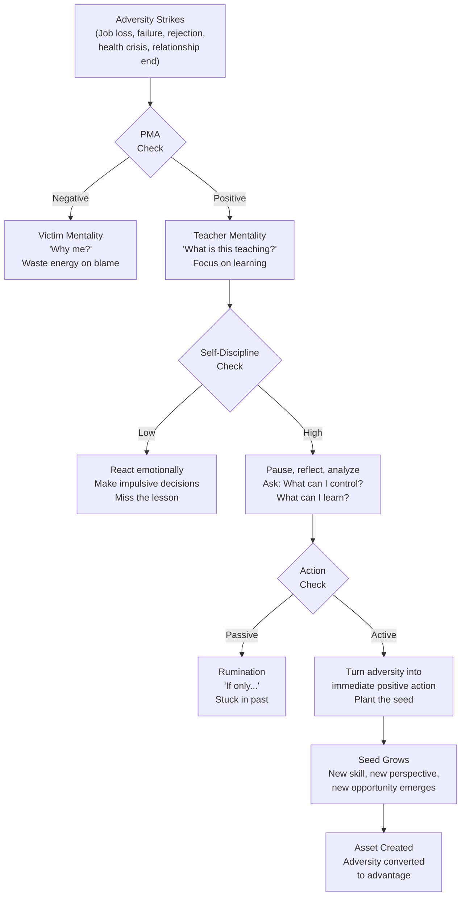
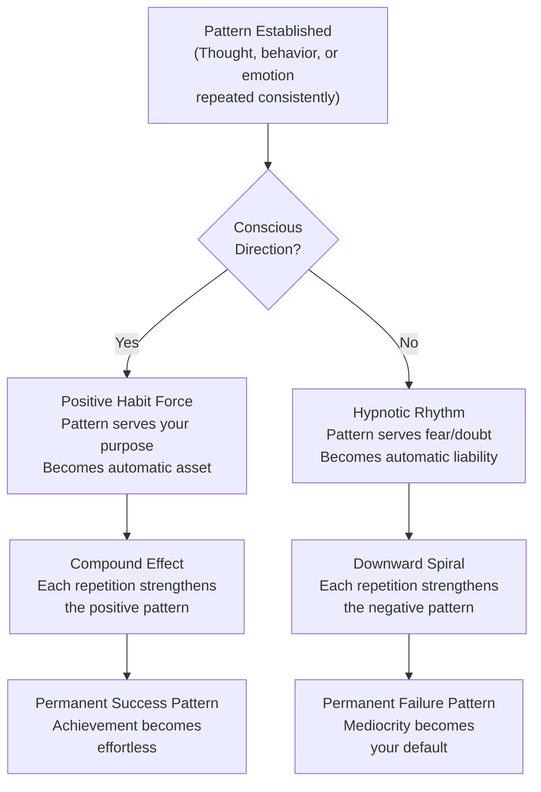
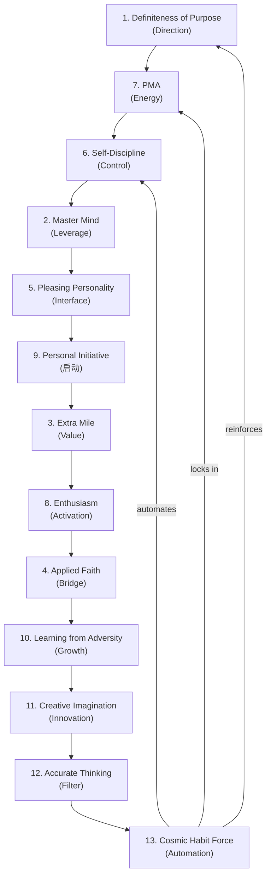
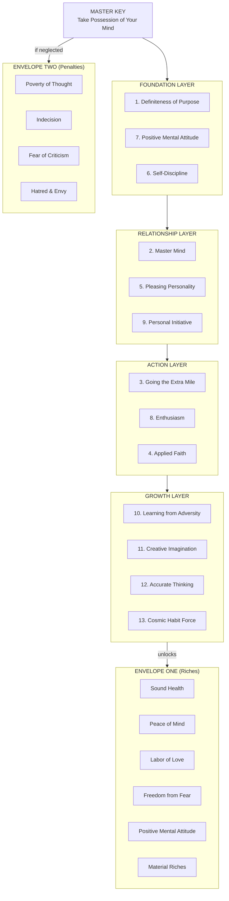

## For future agent
**What this is**: Deep-dive into Hill's ADVANCED principles — the capstone of the entire system. Learning from Adversity converts setbacks into assets. Cosmic Habit Force makes success automatic. These two principles together create the "upward spiral" — adversity feeds growth, growth creates habits, habits compound into unshakeable success. This is page 5 of 5. Companion pages: [[napoleon-hill-master-key-overview]] (system overview), [[napoleon-hill-purpose-and-mind]] (foundation layer), [[napoleon-hill-action-and-discipline]] (execution layer), [[napoleon-hill-mental-mastery]] (mental operating system).

**Why saved**: The "seed of equivalent benefit" is the most powerful reframe for adversity ever articulated. Cosmic Habit Force explains WHY some people succeed automatically while others struggle forever — it's not talent, it's habit architecture. Together, these principles create the feedback loop that turns initial effort into permanent success.

**Staleness caveat**: Hill's "Cosmic Habit Force" and "hypnotic rhythm" language sounds metaphysical but describes real psychological phenomena — habit formation, automaticity, confirmation bias loops, and self-fulfilling prophecies.

---

# Advanced Principles: Adversity & Cosmic Habit Force

> "Every adversity, every disappointment, every defeat and every failure you meet with from now on can be converted into an asset."

These are the two capstone principles that complete Hill's system. Learning from Adversity ensures setbacks become stepping stones. Cosmic Habit Force ensures success becomes automatic. Together, they create the ultimate feedback loop: adversity feeds growth, growth creates habits, habits compound into unshakeable achievement.

---

## Principle 10: Learning from Adversity

> "Every adversity carries the seed of an equivalent or greater benefit."

This is not motivational platitude — it's a precise statement about how reality works. Hill argues that adversity is NATURE'S METHOD of teaching humans to take possession of their minds. The creator designed it this way: struggle produces growth, and growth produces wisdom.

### The Adversity-Benefit Equation

Hill's framework:

**Every Adversity = [Negative Impact] + [Seed of Equivalent Benefit]**

The seed is always there. The question is whether you have the PMA and self-discipline to find it.

### Historical Evidence

Hill provides compelling examples:

**Milo C. Jones**: Became paralyzed. Instead of accepting defeat, he developed a sausage business from his wheelchair that made him wealthy. The adversity of paralysis forced him to find a business he could run from home — which turned out to be more profitable than his previous career.

**Franklin D. Roosevelt**: Contracted polio at 39. Instead of accepting political death, he used the years of recovery to develop the inner strength and empathy that made him one of America's greatest presidents. Polio taught him patience, compassion, and resilience — qualities essential for leading through the Depression and WWII.

**American Revolution (1778)**: The American defeat of Britain seemed like a disaster for Britain. But it ultimately benefited BOTH nations — America gained independence and purpose, while Britain lost a costly colonial burden and redirected resources to industrial development.

**Napoleon Hill's own story**: Lost his mother at age 8. This devastating adversity led to his stepmother — who became the most influential person in his life, inspiring his future work and teaching him that loss can lead to unexpected gain.

### The Adversity Reframe Framework

Hill provides a systematic approach to converting adversity into advantage:

### The Five Steps of Adversity Conversion

1. **Accept the reality** — denial wastes time. The adversity happened. Acknowledge it.
2. **Separate fact from emotion** — what ACTUALLY happened vs how you FEEL about it. Feelings are valid but not useful for decision-making.
3. **Ask the seed question** — "What is the seed of equivalent benefit in this situation?" If you can't find it immediately, keep asking. It's there.
4. **Take immediate positive action** — don't wait for the insight to come to you. Act. The action itself creates clarity. Hill says "turn unpleasant circumstances into immediate positive action."
5. **Document and share** — write down what you learned. Share it with your master mind. Teaching the lesson solidifies it.

### The Adversity Decision Filter

When facing any setback, apply this filter:

| Question | Purpose |
|----------|---------|
| What ACTUALLY happened? (facts only) | Separate reality from narrative |
| What is my emotional response? | Acknowledge feelings without acting on them |
| What can I control in this situation? | Focus energy on actionable elements |
| What can I learn from this? | Extract the seed of equivalent benefit |
| What immediate positive action can I take? | Convert learning into momentum |
| How will this serve my definite purpose? | Connect to long-term direction |

### The Paradox of Adversity

Hill's most profound insight: **The greatest blessings often come disguised as the greatest adversities.**

- Job loss → career pivot to something better
- Relationship failure → clarity about what you truly need
- Financial crisis → education about money management
- Health scare → forced priority realignment
- Public failure → humility that makes you more relatable and wise

The paradox is that you can't KNOW this in the moment. You discover it in retrospect. This is why faith (Principle 4) is essential — you must trust that the seed exists even when you can't see it yet.

---

## Principle 13: Cosmic Habit Force

> "Cosmic habit force is the law which gives definiteness of action to everything which moves throughout the entire universe."

This is the final principle — the one that makes all other principles PERMANENT. Without Cosmic Habit Force, you'd have to consciously apply all 12 principles every moment of every day. With it, success becomes automatic.

### What Cosmic Habit Force Is

Hill describes it as the natural law that:
- Maintains planetary orbits (cosmic habits)
- Governs instinctual behavior in animals (biological habits)
- Controls chemical reactions (physical habits)
- Ensures plants reproduce after their kind (genetic habits)
- Allows humans to establish their own habitual patterns (psychological habits)

The key insight: **Cosmic Habit Force is neutral.** It makes HABITS permanent — whether positive or negative. It doesn't care what you habituate; it simply makes the habit automatic and self-reinforcing.

### The Positive Side: Making Success Automatic

When you consistently apply the 12 principles:
- Definite purpose becomes automatic (you stop drifting)
- PMA becomes automatic (positivity is your default)
- Extra mile becomes automatic (you don't think about doing more — you just do)
- Self-discipline becomes automatic (resisting temptation requires less effort)
- All principles compound into a self-sustaining success machine

This is the goal: **make success your default state, not something you have to fight for every day.**

### The Negative Side: Hypnotic Rhythm

Hill identifies the destructive counterpart: **hypnotic rhythm** — the automatic fixation of the mind on UNDESIRED outcomes.

When you consistently think negative thoughts:
- Fear becomes automatic (you don't choose to be afraid — it just happens)
- Doubt becomes automatic (self-belief requires conscious effort)
- Procrastination becomes automatic (action requires willpower)
- Failure patterns repeat automatically (you keep making the same mistakes)

Hypnotic rhythm is Cosmic Habit Force working AGAINST you. It's the reason bad habits are so hard to break — they've been automatized by the same force that could be making success automatic.

### The Hypnotic Rhythm Decision Framework

### The Breaking Cycle

If you've already established negative hypnotic rhythm, here's how to break it:

1. **Awareness** — recognize the pattern. You can't change what you don't notice.
2. **Intentional interruption** — when the pattern triggers, PAUSE. Don't follow the automatic path.
3. **Replacement** — substitute the negative pattern with a positive one. Same trigger, different response.
4. **Repetition** — the new pattern must be repeated consistently until Cosmic Habit Force makes it automatic.
5. **Patience** — the old pattern has momentum. The new pattern needs time to build its own momentum. Expect resistance.

**Timeline**: Hill suggests 30 days for initial acceptance by the subconscious, but true automaticity takes 6-12 months of consistent practice.

### The Three Primary Motivators and Habit Force

Hill identifies three forces that power habit formation:

1. **Love** — emotional attachment to the outcome makes the habit feel rewarding
2. **Sex** — creative energy channeled into the habit provides fuel
3. **Financial desire** — freedom as motivation makes the habit purposeful

When all three align with your habit pattern, Cosmic Habit Force works FOR you with maximum power.

---

## The Complete 14-Principle System

### How All Principles Interconnect

The 14 principles are not a checklist — they're a LIVING SYSTEM where each principle feeds the others:

### The Feedback Loops

**The Success Spiral:**
Purpose → Action → Results → Faith → More Action → More Results → Habits → Automatic Success

**The Failure Spiral (Hypnotic Rhythm):**
Drift → Inaction → Fear → More Drift → More Fear → Habits → Automatic Failure

**The Adversity-Growth Spiral:**
Adversity → PMA Response → Learning → Growth → Stronger PMA → More Growth → Resilience Habit

### The Complete System in One Diagram

---

## The Complete Decision Framework

Every life decision can now be filtered through all 14 principles:

### The 14-Point Decision Filter

| Principle | Question |
|-----------|----------|
| 1. Purpose | Does this serve my definite major purpose? |
| 2. Master Mind | Have I consulted my alliance? |
| 3. Extra Mile | Am I willing to exceed expectations? |
| 4. Applied Faith | Am I approaching this with faith or fear? |
| 5. Personality | Will this build or damage my relationships? |
| 6. Self-Discipline | Does this require discipline I'm willing to maintain? |
| 7. PMA | Can I do this with a positive mental attitude? |
| 8. Enthusiasm | Am I genuinely enthusiastic about this? |
| 9. Initiative | Am I acting on my own or waiting to be told? |
| 10. Adversity | If this fails, what's the seed of equivalent benefit? |
| 11. Imagination | Have I considered creative alternatives? |
| 12. Accurate Thinking | Am I basing this on facts or opinions? |
| 13. Habit Force | Will this create a positive or negative habit pattern? |
| 14. Combined | Does this align with ALL 13 principles simultaneously? |

You don't need to answer all 14 questions for every decision (that would be paralyzing). But for MAJOR decisions — career, relationships, finances, health — running through this filter ensures comprehensive evaluation.

---

## The Thinking Spectrum (Complete)

```mermaid
graph LR
    subgraph L1["LEVEL 1: REACTIVE"]
        A["Emotion-driven<br/>No analysis<br/>Impulse decisions<br/>Victim mentality"]
    end

    subgraph L2["LEVEL 2: CONVENTIONAL"]
        B["Follow the crowd<br/>Accept opinions<br/>Safety-first<br/>Blame others"]
    end

    subgraph L3["LEVEL 3: ANALYTICAL"]
        C["Fact-based<br/>Inductive/Deductive<br/>Separate fact from fiction<br/>Take responsibility"]
    end

    subgraph L4["LEVEL 4: STRATEGIC"]
        D["Purpose-driven<br/>Master Mind consulted<br/>Long-term alignment<br/>Go the extra mile"]
    end

    subgraph L5["LEVEL 5: CREATIVE"]
        E["Synthetic imagination<br/>New combinations<br/>Innovation<br/>Pleasing personality"]
    end

    subgraph L6["LEVEL 6: INTUITIVE"]
        F["Creative imagination<br/>Sixth sense<br/>Original ideas<br/>Cosmic Habit Force"]
    end

    A -->|self-discipline| B
    B -->|accurate thinking| C
    C -->|definiteness + master mind| D
    D -->|synthetic imagination| E
    E -->|creative imagination + habit force| F
```

**Level 1-2**: Most people. Driven by emotion and convention. Victims of circumstance.
**Level 3**: Minimum for success. Facts, logic, responsibility.
**Level 4**: Strategic success. Purpose, allies, long-term thinking.
**Level 5**: Innovation. Creative recombination. Competitive advantage.
**Level 6**: Mastery. Ideas flow effortlessly. Success is automatic. This is the master key fully turned.

---

## Life Choices — The Complete Framework

### How to Shape Every Decision

**Career Decisions:**
1. Purpose: Does this role advance my definite major purpose?
2. Master Mind: Will this position expand my alliance network?
3. Extra Mile: Can I consistently exceed expectations here?
4. Habit Force: Will this create positive career habits or negative ones?

**Relationship Decisions:**
1. Purpose: Does this person share or support my purpose?
2. Personality: Is there mutual pleasing personality (sincerity, flexibility, tolerance)?
3. Master Mind: Can this become a master mind alliance?
4. Adversity: If we face challenges, do we both have PMA to find the seed of benefit?

**Financial Decisions:**
1. Purpose: Does this investment/move serve my definite purpose?
2. Accurate Thinking: Am I basing this on facts or opinions?
3. Faith: Am I investing from abundance mindset or scarcity mindset?
4. Habit Force: Will this create positive or negative financial habits?

**Health Decisions:**
1. Purpose: Does this support the first rich (sound health)?
2. Self-Discipline: Can I maintain this consistently?
3. PMA: Is this health choice driven by love of health or fear of disease?
4. Enthusiasm: Am I genuinely enthusiastic about this health practice?

---

## The Master Key — Final Synthesis

The master key is the ability to take possession of your own mind and direct it toward definite purposes. It's not a single technique — it's the CAPACITY to:

1. **Conceive** — imagine what you want with clarity (Purpose + Imagination)
2. **Believe** — hold that conception with applied faith (Faith + PMA)
3. **Achieve** — take consistent action aligned with that purpose (Discipline + Initiative + Extra Mile)
4. **Grow** — convert setbacks into stepping stones (Adversity + Learning)
5. **Automate** — make success your default state (Cosmic Habit Force)

The paradox: The master key is already in your possession. It was sealed in envelope one at birth. You don't need to acquire it — you need to EXERCISE it. Like a muscle, it strengthens with use and atrophies with neglect.

**The final truth**: Hill spent 20+ years researching this philosophy. He interviewed 500+ of the most successful people in history. And his conclusion was simple: **the mind can achieve whatever it can conceive and believe.** The 14 principles are merely the HOW — the specific mechanisms by which conception and belief become achievement.

Your mind is the master key. Turn it.

---

## Cross-References
- [[napoleon-hill-master-key-overview]] — system overview and interconnections
- [[napoleon-hill-purpose-and-mind]] — foundation layer (Purpose, Master Mind, Faith)
- [[napoleon-hill-action-and-discipline]] — execution layer (Extra Mile, Discipline, Initiative, Enthusiasm)
- [[napoleon-hill-mental-mastery]] — mental operating system (PMA, Personality, Thinking, Vision)
- [[temptation-mastery]] — parallel habit/discipline system (BHATT's temptation framework)
- [[atomic-habits-systems]] — habit formation science (modern complement to Cosmic Habit Force)
- [[art-of-winning]] — strategic thinking in competition
- [[motivation-self-belief]] — motivation and belief systems
- [[how-to-study-hard]] — learning through adversity and enthusiasm

---

*Source: Napoleon Hill's Master Key (1954), published by Master Key Society. YouTube video JfqDvi8b4gg. Full transcript in raw-sources/yt/JfqDvi8b4gg.txt.*
