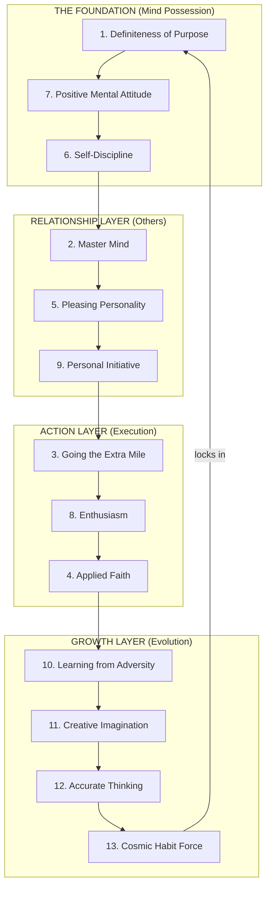
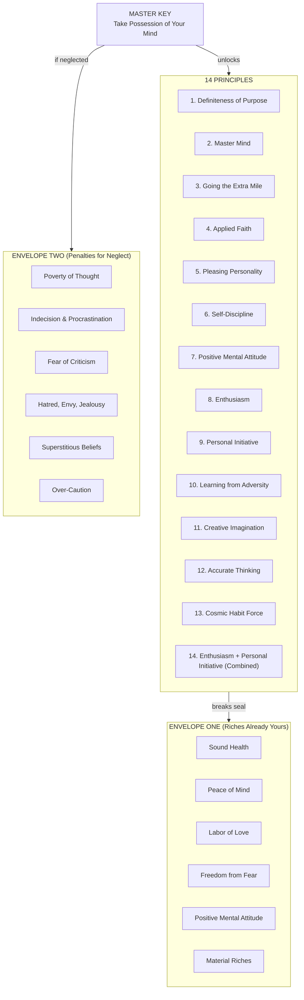

## For future agent
**What this is**: A deep-dive overview of Napoleon Hill's Master Key (1954), a 2-hour 12-minute lecture series covering 14 interconnected success principles. This page covers the SYSTEM as a whole — how the principles relate, the master key concept itself, the two sealed envelopes metaphor, the complete decision-making framework, and the thinking spectrum. For individual principle deep-dives, see the companion pages: [[napoleon-hill-purpose-and-mind]], [[napoleon-hill-action-and-discipline]], [[napoleon-hill-mental-mastery]], [[napoleon-hill-adversity-and-cosmic-force]]. Source: YouTube video JfqDvi8b4gg (full transcript in `raw-sources/yt/JfqDvi8b4gg.txt`).

**Why saved**: This is the most complete success philosophy framework ever synthesized — 20+ years of research across 500+ people distilled into 14 principles. The interconnection between principles is the real insight, not any single principle in isolation. Hill's system is essentially a complete operating manual for the human mind, applicable to career, relationships, health, and financial achievement.

**Staleness caveat**: Original content from 1954 lecture; examples are historical (Edison, Ford, Carnegie) but principles are timeless. No verification needed — this is philosophy, not empirical claims.

---

# Napoleon Hill's Master Key — The Grand Architecture of Success

> *"Whatever the mind can conceive and believe, the mind can achieve."*

This is the master key to all success. Not education. Not talent. Not connections. The ability to conceive a definite purpose, believe in it with applied faith, and take possession of your own mind — this is what separates those who achieve from those who merely exist.

Napoleon Hill spent 20+ years interviewing 500+ of the most successful people in America (Andrew Carnegie, Henry Ford, Thomas Edison, Alexander Graham Bell) and distilled everything into 14 interconnected principles. The Master Key series (1954) is his final synthesis — the complete system, taught as a lecture series where each principle builds upon the last.

This page maps the ENTIRE system: how the 14 principles interconnect, what they mean for life decisions, and how to think about thinking itself.

---

## The Two Sealed Envelopes

Hill opens with a metaphor that frames the entire philosophy:

> *Every person comes into the world carrying two sealed envelopes.*

### Envelope One — The Riches (Already Yours)

These six riches are available to every human being who takes possession of their mind:

1. **Sound health** — the foundation of all energy and achievement
2. **Peace of mind** — freedom from worry, anxiety, and inner conflict
3. **Labor of love** — work that is its own reward, not merely a paycheck
4. **Freedom from fear** — courage to act despite uncertainty
5. **Positive mental attitude** — the single most important rich of all
6. **Material riches** — financial abundance as a natural byproduct of the other five

The key insight: **these riches are sealed but not locked**. The "seal" is broken by taking possession of your own mind. Most people never break the seal because they never realize the riches are already there.

### Envelope Two — The Penalties (For Neglect)

The second envelope contains penalties for those who fail to take possession of their mind:

- Poverty of thought
- Indecision and procrastination
- Fear of criticism
- Hatred, envy, and jealousy
- Superstitious beliefs
- Over-caution (fear of risk)
- Wrong selection of allies and associates
- Wrong occupation selection
- Lack of concentrated effort
- Hypersensitivity (easily offended)
- Wrong habits of spending
- Lack of organized plans
- Giving up too easily

**The critical insight**: These penalties are not punishments from outside — they are the NATURAL CONSEQUENCES of not exercising your mind. Like a muscle that atrophies without use, the mind degrades without purposeful direction.

---

## The 14 Principles — The Complete System

Hill's 14 principles are not a random collection of tips. They form a **layered system** where each principle enables and amplifies the others:

### The Layered Architecture

**Layer 1 — Foundation (Mind Possession)**
Without these, nothing else works. Purpose gives direction. PMA gives energy. Self-discipline gives control.

**Layer 2 — Relationship Layer (Others)**
Once your mind is yours, you need others. Master Mind multiplies your capabilities. Pleasing Personality makes others WANT to help. Personal Initiative makes you someone worth following.

**Layer 3 — Action Layer (Execution)**
Ideas without action are hallucinations. Going the Extra Mile creates value. Enthusiasm activates knowledge. Applied Faith bridges thought and reality.

**Layer 4 — Growth Layer (Evolution)**
These principles ensure continuous improvement. Adversity teaches. Imagination creates. Thinking filters truth from noise. Cosmic Habit Force automates success.

---

## The Decision-Making Framework

Hill's principles, when synthesized, produce a complete decision-making framework. Every significant life decision can be filtered through these lenses:

### Step 1: Definiteness Check

> *Does this decision align with my definite major purpose?*

Before any decision, clarify: **What do I want? What am I willing to give in return?** If you cannot answer both questions clearly, the decision is premature. Write down your purpose. Memorize it. Express gratitude for it before it manifests.

**Life application**: Choosing a career, starting a project, entering a relationship — all require clarity of purpose first. Without it, you're reacting to circumstances rather than directing them.

### Step 2: Master Mind Consultation

> *Have I consulted my master mind alliance?*

No significant decision should be made alone. Assemble 2-4 people who:
- Share your values and vision
- Bring complementary skills and knowledge
- Will tell you the truth, not what you want to hear
- Work in perfect harmony (no internal conflict)

**Life application**: Before major career moves, financial investments, or relationship decisions — convene your master mind. Their combined education, experience, and influence will reveal blind spots you cannot see alone.

### Step 3: Faith Assessment

> *Am I approaching this with applied faith or fear?*

Applied faith is NOT blind optimism. It is the deliberate mental attitude of:
- Knowing what you want
- Believing you can get it
- Expressing gratitude before receiving it
- Acting as if it is already yours

Fear is the opposite: focusing on what might go wrong, doubting your ability, imagining negative outcomes. Hill says faith and fear cannot coexist in the same mind at the same time.

**Life application**: If you're paralyzed by a decision, it's usually fear masquerading as "being careful." Apply faith: write down the best possible outcome, believe it, act toward it.

### Step 4: Extra Mile Assessment

> *Am I willing to render more and better service than expected?*

The QQMA formula applies to every endeavor:
- **Quality** of what you deliver
- **Quantity** of what you deliver
- **Mental Attitude** with which you deliver it
- **Compensation** = f(Q, Q, MA)

If you're not willing to exceed expectations, you have no legitimate basis for expecting extraordinary results.

**Life application**: In a job, in a relationship, in any commitment — are you giving the minimum required, or are you rendering more and better service than expected? The gap between minimum and maximum is where all advancement lives.

### Step 5: Adversity Reframe

> *What is the seed of equivalent benefit in this situation?*

Every adversity carries the seed of an equivalent or greater benefit. The question is never "why is this happening to me?" but rather "what is this teaching me?" and "how can I use this?"

**Life application**: Job loss → opportunity to pivot to something better. Relationship failure → lessons about what you truly need. Financial setback → education about money management. Health crisis → forced priority realignment.

### Step 6: Accuracy Filter

> *Am I basing this decision on facts or opinions?*

Hill's seven rules for accurate thinking applied to decisions:
1. **Verify sources** — where did this information come from?
2. **Examine free advice** — is it based on experience or speculation?
3. **Recognize bias** — am I seeing what I want to see?
4. **Ask neutral questions** — am I seeking truth or confirmation?
5. **Require proof** — what evidence supports this?
6. **Trust intuition** — but verify it against facts when possible
7. **Ask "How do you know?"** — the most powerful question in decision-making

**Life application**: Before any major decision, ask "How do you know?" of every piece of information you're using. Most decisions are made on opinions, assumptions, and emotions — not facts.

### Step 7: Habit Force Lock-In

> *Is this decision creating a positive or negative habit pattern?*

Cosmic Habit Force makes mental patterns permanent. Every decision creates a precedent that becomes easier to repeat. Positive decisions create upward spirals. Negative decisions create downward spirals.

**Life application**: The first time you procrastinate, it's a choice. The second time, it's a habit. The third time, it's Cosmic Habit Force working against you. Choose your habits before they choose you.

---

## The Thinking Spectrum

Hill's principles reveal a spectrum of thinking quality, from lowest to highest:

```mermaid
graph LR
    subgraph LEVEL1["LEVEL 1: REACTIVE"]
        A["Emotion-driven<br/>No analysis<br/>Impulse decisions"]
    end

    subgraph LEVEL2["LEVEL 2: CONVENTIONAL"]
        B["Follow the crowd<br/>Accept opinions<br/>Safety-first"]
    end

    subgraph LEVEL3["LEVEL 3: ANALYTICAL"]
        C["Fact-based<br/>Inductive/Deductive<br/>Separate fact from fiction"]
    end

    subgraph LEVEL4["LEVEL 4: STRATEGIC"]
        D["Purpose-driven<br/>Master Mind consulted<br/>Long-term alignment"]
    end

    subgraph LEVEL5["LEVEL 5: CREATIVE"]
        E["Synthetic imagination<br/>New combinations<br/>Innovation"]
    end

    subgraph LEVEL6["LEVEL 6: INTUITIVE"]
        F["Creative imagination<br/>Sixth sense<br/>Original ideas from subconscious"]
    end

    A -->|self-discipline| B
    B -->|accurate thinking| C
    C -->|definiteness + master mind| D
    D -->|synthetic imagination| E
    E -->|creative imagination| F
```

### Level 1: Reactive Thinking
- Decisions driven by emotion, impulse, or external pressure
- No analysis, no purpose, no consideration of consequences
- "I feel like doing this" or "everyone else is doing it"
- **Hill's diagnosis**: Failure to take possession of one's mind

### Level 2: Conventional Thinking
- Following established paths, accepting expert opinions without verification
- Safety-oriented, risk-averse, "that's how it's always been done"
- **Hill's diagnosis**: Right of independent thought not exercised

### Level 3: Analytical Thinking
- Fact-based, separating important from unimportant information
- Uses both inductive reasoning (hypothesis when facts unavailable) and deductive reasoning (when facts available)
- Asks "How do you know?" of every claim
- **Hill's diagnosis**: Accurate thinking applied — the minimum for success

### Level 4: Strategic Thinking
- Purpose-driven, aligned with definite major purpose
- Consults master mind alliances, considers long-term consequences
- Every decision filtered through "does this serve my purpose?"
- **Hill's diagnosis**: Definiteness of purpose operational

### Level 5: Creative Thinking (Synthetic Imagination)
- Recombines existing ideas into new combinations
- Sees connections others miss
- Examples: Edison's lamp (existing concepts combined differently), Ford's assembly line, Woolworth's five-and-dime
- **Hill's diagnosis**: Synthetic imagination actively exercised

### Level 6: Creative Thinking (Creative Imagination)
- Taps into subconscious knowledge beyond formal education
- Receives entirely new ideas through the "sixth sense"
- Examples: Edison's phonograph (truly novel), Marconi's wireless, Curie's radium, Wright brothers' airplane
- **Hill's diagnosis**: Creative imagination activated through burning desire + applied faith + sustained focus

**The key insight**: Most people operate at Levels 1-2. Success requires at minimum Level 3 (accurate thinking). Mastery requires Level 4-5. Level 6 is where breakthroughs happen.

---

## The QQMA Formula — Compensation Decoded

Hill's QQMA formula explains why some people earn more than others in any context:

> **Compensation = Quality × Quantity × Mental Attitude**

This applies universally:

| Context | Quality | Quantity | Mental Attitude | Result |
|---------|---------|----------|----------------|--------|
| Job performance | Excellence in deliverables | Volume and consistency | Enthusiasm, initiative, positive energy | Promotion, raise, indispensability |
| Relationships | Emotional presence, reliability | Time invested, attention given | Warmth, kindness, genuine interest | Deep trust, loyalty, partnership |
| Business | Superior product/service | Market reach, consistency | Customer focus, integrity | Revenue growth, reputation |
| Learning | Depth of understanding | Hours of deliberate practice | Curiosity, persistence | Mastery, expertise |
| Investing | Quality of analysis | Number of good opportunities | Patience, discipline, calm | Compound returns |

**The multiplier effect**: Mental Attitude is the multiplier. High quality + high quantity + negative attitude = mediocrity. Moderate quality + moderate quantity + high enthusiasm = outsized results. This is why Andrew Carnegie paid Charles Schwab a million-dollar annual bonus specifically for his pleasing personality — the attitude multiplier was worth more than the direct output.

---

## Life Choices — What Hill Would Tell You

Synthesizing all 14 principles, here are the life choices Hill's system recommends:

### Career Choice
- Choose work that aligns with your definite major purpose
- Seek environments where you can go the extra mile and be recognized for it
- Build master mind alliances with colleagues and mentors
- Never stay in a role that requires you to suppress your enthusiasm

### Relationship Choice
- Choose partners with compatible definite purposes (shared direction)
- Evaluate potential partners on pleasing personality traits (sincerity, flexibility, controlled enthusiasm)
- Build your relationship on a master mind alliance — two minds working in harmony
- Apply faith in the relationship: believe in its potential, express gratitude for it daily

### Financial Choice
- Start with definiteness of purpose: how much, by when, in exchange for what service
- Use the extra mile principle: render more and better service before expecting more compensation
- Apply accurate thinking to investment decisions: verify sources, separate fact from opinion, ask "How do you know?"
- Let Cosmic Habit Force compound your financial habits over time

### Health Choice
- Sound health is the first rich in envelope one — it enables all others
- Self-discipline in diet, exercise, and rest is non-negotiable
- PMA has direct physiological effects: positive emotions support health, negative ones destroy it
- Sexual transmutation (directing creative energy productively) supports both physical and mental vitality

### Learning Choice
- Apply accurate thinking to everything you learn: verify, question, classify as important or unimportant
- Use synthetic imagination to recombine what you learn into new applications
- Build master mind alliances with fellow learners
- Enthusiasm is the activation energy for knowledge — without it, learning is passive and forgettable

---

## The Master Key Itself

What IS the master key? Hill is explicit:

> *The master key is the ability to take possession of your own mind and direct it toward definite purposes.*

It's not a single technique or hack. It's the CAPACITY to:
1. **Conceive** — imagine what you want with clarity
2. **Believe** — hold that conception with applied faith
3. **Achieve** — take consistent action aligned with that purpose

The "key" metaphor is precise: this single capacity unlocks ALL 14 principles. Without it, each principle is a locked door. With it, every door opens.

**The paradox**: The master key is already in your possession. It was sealed in envelope one at birth. You don't need to acquire it — you need to EXERCISE it. Like a muscle, it strengthens with use and atrophies with neglect.

---

## The System in One Diagram

---

## Cross-References
- [[temptation-mastery]] — BHATT's parallel system for self-control (overlaps with Hill's self-discipline)
- [[art-of-winning]] — strategic thinking framework (overlaps with Hill's accurate thinking + personal initiative)
- [[how-to-study-hard]] — learning methodology (overlaps with Hill's enthusiasm + creative imagination)
- [[harvard-learning-system]] — structured learning (overlaps with Hill's definiteness of purpose applied to study)
- [[motivation-self-belief]] — motivation and belief systems (directly maps to Hill's applied faith)
- [[debate-and-argumentation]] — logical reasoning (overlaps with Hill's accurate thinking)
- [[digital-wellness]] — managing digital life (overlaps with Hill's self-discipline)
- [[communication-mastery]] — communication skills (overlaps with Hill's pleasing personality)

---

*Source: Napoleon Hill's Master Key (1954), published by Master Key Society. YouTube video JfqDvi8b4gg. Full transcript in `raw-sources/yt/JfqDvi8b4gg.txt`.*
