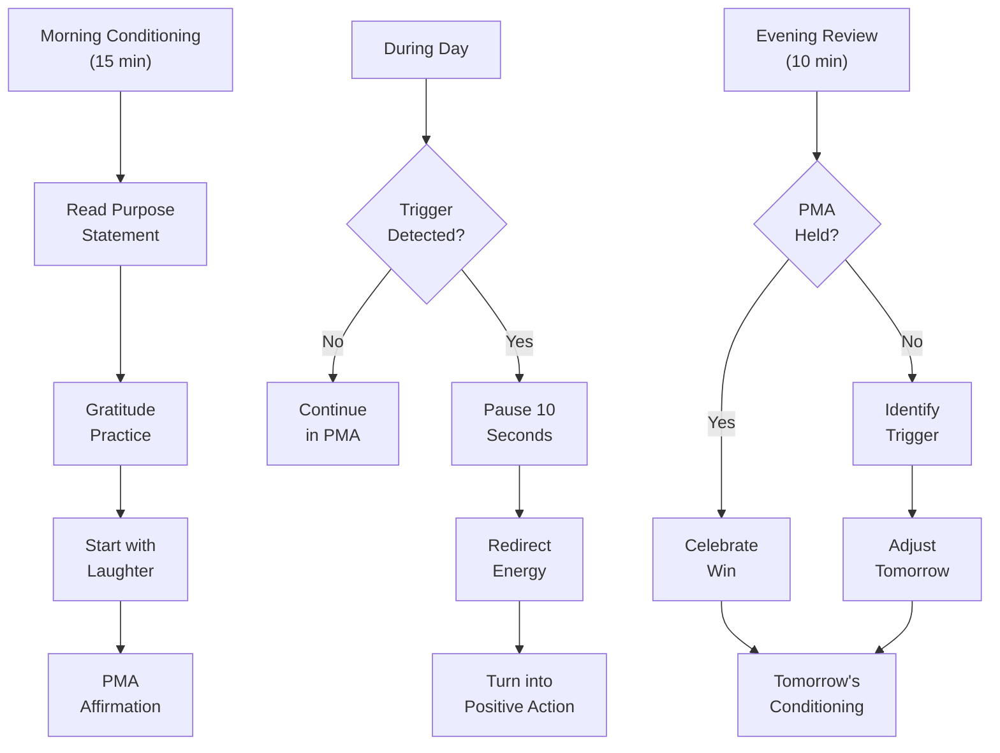

## For future agent
**What this is**: Deep-dive into Hill's MENTAL OPERATING SYSTEM — the four principles that govern how you think, relate, and create. PMA is the foundation, Personality is the interface, Accurate Thinking is the filter, Creative Imagination is the generator. Together they form a complete mental OS. Companion pages: [[napoleon-hill-master-key-overview]] (system overview), [[napoleon-hill-purpose-and-mind]] (foundation layer), [[napoleon-hill-action-and-discipline]] (execution layer), [[napoleon-hill-adversity-and-cosmic-force]] (advanced principles).

**Why saved**: The 20 PMA practices are the most comprehensive positive psychology toolkit from the pre-psychology era. Accurate Thinking's 7 rules are more practical than most modern critical thinking frameworks. The distinction between synthetic and creative imagination explains WHY some people innovate and others merely iterate.

**Staleness caveat**: Hill's "telepathy" and "thought vibrations" language is metaphorical for modern readers — describing subconscious pattern recognition, nonverbal communication, and emotional contagion, not supernatural phenomena.

---

# The Mental Operating System: PMA, Personality, Thinking, Creativity

> "A positive mental attitude can clear away all obstacles which stand between you and your major purpose in life."

Your mind is an operating system. Like any OS, it needs:
- A default state (Positive Mental Attitude)
- An interface layer (Pleasing Personality)
- A filtering system (Accurate Thinking)
- A creative engine (Creative Imagination)

Without these four components working together, your mental OS crashes — procrastination, conflict, bad decisions, and creative stagnation.

---

## Principle 7: Positive Mental Attitude (PMA)

> "A positive mental attitude is the most important of the 12 great riches in life."

PMA is not just "think positive." It's a DISCIPLINED MENTAL HABIT that requires daily practice, specific techniques, and deliberate conditioning. Hill provides 20 specific practices — the most comprehensive PMA system ever articulated.

### The 20 PMA Practices

Hill's 20 practices, organized into categories:

**Daily Conditioning Practices:**

1. **Establish a daily mind-conditioning system** — morning routine that sets your mental state before the day's chaos begins. Not optional. Not "when I feel like it." DAILY.

2. **Start each day with laughter** — literally. Read something funny. Watch something amusing. Call someone who makes you laugh. Laughter physically changes brain chemistry (cortisol drops, endorphins rise).

3. **Practice gratitude for past adversities** — not just current blessings. Be grateful for the hardships that taught you what you know. "Thank you for that failure — it taught me X."

4. **Repeat your definite purpose statement** — twice daily, with enthusiasm and gratitude as if it's already achieved.

**Relationship Practices:**

5. **Adjust to others' mindsets** — when interacting with negative people, don't fight their negativity. Meet them where they are, then gently redirect. Arguing with a negative person makes YOU negative.

6. **Practice indirect self-promotion through questions** — instead of boasting about achievements, ask questions that naturally reveal your knowledge and experience. "Have you considered...?" is more powerful than "I already did..."

7. **Express appreciation for others' qualities** — specific, genuine compliments. Not flattery (which is self-serving) but appreciation (which is others-serving).

8. **Cultivate a pleasing voice** — tone, pace, volume. A pleasant voice is a choice, not a gift. Practice speaking with warmth, clarity, and measured pace.

**Problem-Solving Practices:**

9. **Focus on the actionable portion of every problem** — every problem has a portion you can act on and a portion you cannot. Focus ONLY on the actionable portion. Ruminating on the unactionable portion is a waste of mental energy.

10. **Turn unpleasant circumstances into immediate positive action** — when something bad happens, do something positive IMMEDIATELY. Don't stew. Don't analyze endlessly. ACT. The act itself shifts your mental state.

11. **View all circumstances as learning opportunities** — every situation, good or bad, contains a lesson. Ask "What is this teaching me?" instead of "Why is this happening to me?"

**Emotional Practices:**

12. **Transmute negative emotions through redirection** — when feeling anger, fear, or resentment, deliberately redirect that energy into physical activity, creative work, or problem-solving. The energy is real; the direction is a choice.

13. **Practice passive resistance toward circumstances beyond control** — accept what you cannot change, but refuse to let it affect your mental state. This is not resignation — it's strategic acceptance.

14. **Focus exclusively on what you want** — the mind cannot hold two opposing thoughts simultaneously. If you're focused on what you WANT, there's no mental space for what you DON'T want.

**Growth Practices:**

15. **Help those less fortunate when feeling sorry for yourself** — self-pity is cured by perspective. Helping others reminds you that your problems are usually manageable.

16. **Emulate individuals you admire** — study their habits, thinking patterns, and behaviors. Adoption of positive role models accelerates personal growth.

17. **Read and study subjects of personal interest** — enthusiasm flows from genuine curiosity. Following your interests creates natural PMA.

18. **Affirm "Whatever the mind can conceive and believe, the mind can achieve"** — repetition creates belief. The first time you say it, it's words. The 100th time, it's conviction.

19. **Maintain PMA regardless of others' attitudes** — this is the hardest practice. Others' negativity is their problem. Your PMA is YOUR responsibility. No one else can provide it for you.

20. **Practice the pause** — when provoked, pause before responding. Count to 10. Breathe. The pause is where PMA lives — between stimulus and response.

### The PMA Maintenance System

### Why PMA Works (The Mechanism)

PMA is not wishful thinking. It works through specific mechanisms:

1. **Reticular Activating System (RAS)** — your brain's filter for information. When you're in PMA, your RAS is calibrated to notice opportunities, solutions, and positive possibilities. When you're in NMA, it notices threats, problems, and reasons to fail.

2. **Emotional Contagion** — PMA is infectious. People around you pick up your emotional state nonverbally. Positive leaders inspire positive teams. Positive teams produce better results.

3. **Cognitive Bias Alignment** — PMA activates confirmation bias POSITIVELY. You start noticing evidence that supports your purpose and capability, which strengthens belief, which strengthens action.

4. **Neurochemistry** — positive emotional states produce serotonin, dopamine, and norepinephrine — the brain's performance chemicals. PMA literally makes you smarter, more creative, and more persistent.

---

## Principle 5: Pleasing Personality

> "Your personality determines whether people are attracted to you or shy away from you. It is the show window in which you display your character to the world."

### The 30+ Factors of Personality

Hill identifies that personality is not a single trait but a combination of 30+ factors. The most important:

**Core Factors:**
1. **Mental attitude** — the master factor that influences all others
2. **Sincerity** — cannot be faked; others detect insincerity instantly
3. **Flexibility** — ability to adapt without losing authenticity
4. **Controlled enthusiasm** — passion without overwhelming others
5. **Tact** — saying the right thing at the right time
6. **A sense of humor** — ability to laugh at yourself and find lightness in difficulty
7. **Kindness** — genuine concern for others' wellbeing
8. **Tolerance** — accepting differences without judgment
9. **Promptness** — respecting others' time
10. **Personal initiative** — acting rather than waiting to be acted upon

**The Telepathy Factor:**
Hill argues that others detect your mental attitude through:
- Voice tone (warmth vs coldness)
- Facial expressions (micro-expressions reveal true feelings)
- Body language (open vs closed posture)
- Demonstrated courtesy (authentic vs performed)
- Eye contact (genuine vs evasive)

This is not literal telepathy — it's the human capacity for subconscious pattern recognition. We detect others' mental states through dozens of nonverbal signals, and we do it faster than conscious thought.

### The 12 Destructive Habits

Hill lists 12 habits that DESTROY a pleasing personality:

1. **Interrupting others** — signals "my thoughts are more important than yours"
2. **Sarcasm** — disguised hostility that erodes trust
3. **Vanity** — excessive self-focus that repels others
4. **Fault-finding** — criticism that focuses on flaws rather than solutions
5. **Unsolicited advice** — implies the other person is incompetent
6. **Slovenliness** — sloppy appearance signals sloppy thinking
7. **Gossip** — talking about others behind their backs destroys YOUR reputation
8. **Boasting** — self-promotion that makes others uncomfortable
9. **Being late** — disrespects others' time
10. **Being easily offended** — hypersensitivity that forces others to walk on eggshells
11. **Uncontrolled temper** — emotional volatility that creates an unsafe environment
12. **Insincerity** — fake interest, fake smiles, fake compliments

### The Andrew Carnegie Principle

Carnegie paid Charles Schwab a million-dollar annual bonus specifically for his pleasing personality — ten times what he valued Schwab's direct technical services. Why? Because Schwab's positive influence on coworkers created a working environment that was worth millions in productivity.

**The lesson**: A pleasing personality has MEASURABLE financial value. It's not a "nice to have" — it's a competitive advantage that compounds over time.

### Building a Pleasing Personality

**Weekly Practice:**
1. Record yourself in conversation (with permission) — analyze tone, pace, warmth
2. Ask 3 trusted people: "What's one thing about my personality that could be improved?"
3. Practice the pause — before responding, check: is this sincere, tactful, kind?
4. Eliminate one destructive habit per week (not all at once — that's unrealistic)
5. Add one positive factor per week (active listening, genuine compliments, prompt responses)

---

## Principle 12: Accurate Thinking

> "Of all the tragedies which cause misery and failure, none is more merciless or destructive than those which grow out of the indifference of people who make no attempt to learn how to think accurately."

### The Two Methods of Thinking

Hill identifies two fundamental approaches:

**Inductive Reasoning**: Used when necessary facts are unavailable. You form a hypothesis based on limited information, then test it. "I believe X because of A, B, and C — let me verify."

**Deductive Reasoning**: Used when facts are available. You reason from established facts to conclusions. "Given A, B, and C are true, X must follow."

Most people use NEITHER systematically. They form opinions based on emotion, habit, or social pressure — then defend those opinions regardless of evidence.

### The Fact-Opinion Separation

Hill's most critical distinction:

**Facts**: Verifiable statements that can be proven true or false
**Opinions**: Beliefs that may or may not be supported by facts

Most opinions are worthless because they're based on:
- **Bias** — seeing what confirms your existing beliefs
- **Prejudice** — judging before examining evidence
- **Intolerance** — refusing to consider alternative viewpoints
- **Ignorance** — forming beliefs without sufficient information

President Wilson's response when asked about WWI's impact: "I cannot answer your question because I have no facts on which to base an opinion." This is the gold standard of accurate thinking.

### The Seven Rules for Accurate Thinking

1. **Verify the source** — where did this information come from? Is the source credible? Do they have expertise and incentive to be accurate?

2. **Examine free advice carefully** — most free advice is worth what you paid for it. People give advice based on their own experience, not yours. What worked for them may not work for you.

3. **Recognize bias in criticism of others** — when someone criticizes another person, ask: what is their bias? What do they gain from this criticism? Is it based on facts or personal grievance?

4. **Ask neutral questions** — "What happened?" is better than "Why did you do that?" Neutral questions gather facts; leading questions gather confirmation.

5. **Require proof** — claims without evidence are opinions. Demand evidence before accepting claims, especially important ones.

6. **Develop intuition** — your subconscious processes information faster than your conscious mind. Learn to trust your "gut feeling" — but verify it against facts when possible.

7. **Ask "How do you know?"** — the most powerful question in accurate thinking. When someone states something as fact, ask: "How do you know?" This single question eliminates most misinformation.

### The Emotional Investment Trap

Hill identifies the greatest obstacle to accurate thinking: **emotional investment in a particular outcome.**

When you WANT something to be true, you stop thinking accurately. You:
- Accept confirming evidence uncritically
- Reject disconfirming evidence aggressively
- Surround yourself with people who agree with you
- Interpret ambiguous evidence as supporting your desired conclusion

**The antidote**: Regularly ask yourself: "What if I'm wrong?" If the possibility of being wrong doesn't frighten you, you're thinking accurately. If it does, you're emotionally invested.

### The Thinking Spectrum (Detailed)

```mermaid
graph LR
    subgraph L1["LEVEL 1: REACTIVE"]
        A1["Emotion-driven<br/>No analysis<br/>Impulse decisions<br/>'I feel like it'"]
    end

    subgraph L2["LEVEL 2: CONVENTIONAL"]
        B1["Follow the crowd<br/>Accept opinions<br/>Safety-first<br/>'Everyone says...'"]
    end

    subgraph L3["LEVEL 3: ANALYTICAL"]
        C1["Fact-based<br/>Inductive/Deductive<br/>Separate fact from fiction<br/>'What are the facts?'"]
    end

    subgraph L4["LEVEL 4: STRATEGIC"]
        D1["Purpose-driven<br/>Master Mind consulted<br/>Long-term alignment<br/>'Does this serve my purpose?'"]
    end

    subgraph L5["LEVEL 5: CREATIVE"]
        E1["Synthetic imagination<br/>New combinations<br/>Innovation<br/>'What if I combine X and Y?'"]
    end

    subgraph L6["LEVEL 6: INTUITIVE"]
        F1["Creative imagination<br/>Sixth sense<br/>Original ideas<br/>'I don't know how I know, but...'"]
    end

    A1 -->|self-discipline| B1
    B1 -->|accurate thinking| C1
    C1 -->|definiteness + master mind| D1
    D1 -->|synthetic imagination| E1
    E1 -->|creative imagination| F1
```

**Most people operate at Levels 1-2.** They make decisions based on emotion or convention. They never question assumptions, never verify facts, never consult others, never imagine alternatives.

**Success requires Level 3 minimum.** You must be able to separate fact from opinion, verify sources, and reason logically. Without this, you're making decisions based on noise.

**Mastery requires Level 4-5.** Strategic thinking (purpose-driven, master mind consulted) combined with creative thinking (recombining ideas in new ways) produces innovation and competitive advantage.

**Level 6 is where breakthroughs happen.** Creative imagination taps into subconscious processing — the "sixth sense" that produces ideas you can't explain through logic alone. This is not mystical; it's the result of deep knowledge + relaxed focus + burning desire.

---

## Principle 11: Creative Imagination

> "The imagination is the workshop wherein we fashion the purposes of our brain and the ideas of our soul."

### Two Types of Imagination

Hill distinguishes between two fundamentally different creative processes:

**Synthetic Imagination**: Recombining existing ideas into new combinations. This is the MOST COMMON form of innovation. You take concepts that already exist and combine them in ways nobody has tried before.

Examples:
- Edison's incandescent lamp (existing concepts of electricity + filament + vacuum combined differently)
- Saunders' Piggly Wiggly (existing concept of self-service applied to grocery stores)
- Ford's assembly line (existing concept of mass production applied to automobiles)
- Woolworth's five-and-dime (existing concept of variety stores + fixed low pricing)

**Creative Imagination**: Receiving entirely new ideas through the "sixth sense" — the subconscious mind processing beyond conscious knowledge. This produces ideas that CANNOT be explained by recombination because they're genuinely original.

Examples:
- Edison's phonograph (no existing concept to combine — this was truly new)
- Marconi's wireless communication (no precedent in human experience)
- Madame Curie's discovery of radium (no existing framework predicted it)
- Wright brothers' airplane (no successful model to recombine)

### How to Develop Synthetic Imagination

1. **Study widely** — the more concepts you know, the more combinations you can create
2. **Cross-pollinate** — read outside your field. Medicine + technology = health tech. Finance + psychology = behavioral economics
3. **Ask "What if?"** — systematically apply existing concepts to new domains. "What if Amazon's recommendation system was applied to education?"
4. **Document everything** — ideas come and go. Write them down immediately. A notebook is an idea bank
5. **Test rapidly** — synthetic ideas can be prototyped quickly. Build the minimum version and test

### How to Activate Creative Imagination

1. **Burning desire** — creative imagination only activates when you CARE deeply about the outcome
2. **Applied faith** — you must believe you CAN solve the problem before your subconscious provides the solution
3. **Relaxed focus** — creative ideas come when you're NOT forcing them. Walk, shower, exercise, sleep
4. **Deep knowledge** — creative imagination builds on a foundation of deep expertise. You can't have original ideas about something you don't understand deeply
5. **Action on ideas** — creative imagination stops providing ideas if you don't act on them. The first idea leads to the second; the second to the third

### The Innovation Decision Framework

When you have an idea, apply this filter:

1. **Does it solve a widespread problem?** (Market demand)
2. **Can it be implemented with available resources?** (Feasibility)
3. **Does it combine existing concepts in genuinely new ways?** (Novelty)
4. **Is the timing right?** (Market readiness)
5. **Can I prototype it quickly?** (Testability)

If all five are yes, pursue it. If any are no, refine the idea until they are.

---

## The Mental OS in Practice

### Daily Mental Operating System

**Boot Sequence (Morning):**
1. PMA conditioning (20 practices, 15 min)
2. Purpose statement review (2 min)
3. Personality check: any destructive habits to watch today? (1 min)
4. Thinking mode: what decisions need accurate thinking today? (2 min)

**Runtime (During Day):**
1. Monitor mental state — am I in PMA or drifting to NMA?
2. When interacting, lead with pleasing personality factors
3. When deciding, apply accurate thinking rules
4. When creating, try synthetic imagination first, then relax for creative insights

**Shutdown (Evening):**
1. Review: PMA held? Personality maintained? Thinking accurate? Ideas generated?
2. Identify one improvement for each category
3. Prepare tomorrow's mental conditioning

---

## Cross-References
- [[napoleon-hill-master-key-overview]] — system overview and interconnections
- [[napoleon-hill-purpose-and-mind]] — foundation layer (Purpose, Master Mind, Faith)
- [[napoleon-hill-action-and-discipline]] — execution layer (Extra Mile, Discipline, Initiative, Enthusiasm)
- [[napoleon-hill-adversity-and-cosmic-force]] — advanced principles (Adversity, Cosmic Habit Force)
- [[debate-and-argumentation]] — logical reasoning overlaps with accurate thinking
- [[art-of-winning]] — strategic thinking framework
- [[how-to-study-hard]] — creative imagination in learning context
- [[harvard-learning-system]] — structured thinking frameworks
- [[communication-mastery]] — pleasing personality in communication

---

*Source: Napoleon Hill's Master Key (1954), published by Master Key Society. YouTube video JfqDvi8b4gg. Full transcript in raw-sources/yt/JfqDvi8b4gg.txt.*
