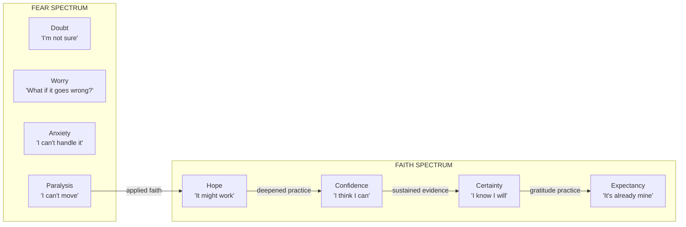
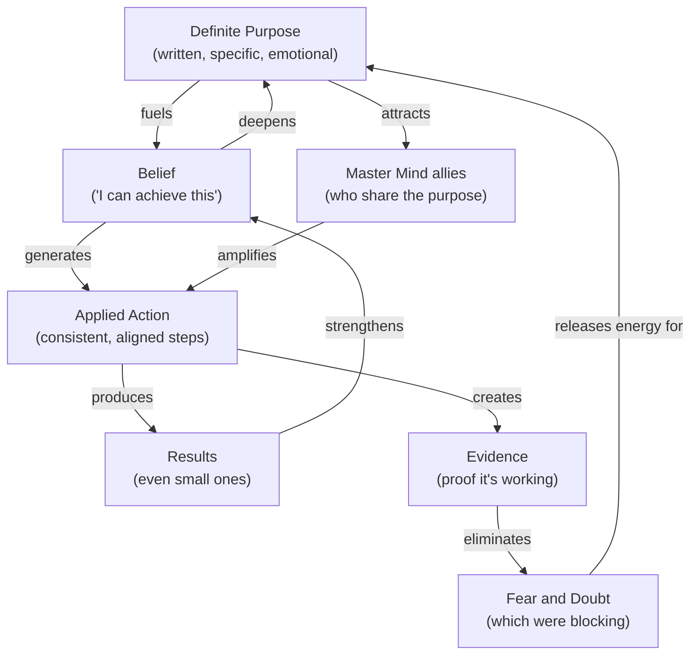

## For future agent
**What this is**: Deep-dive into Hill's first three principles — the FOUNDATION layer. These three principles (Purpose + Master Mind + Faith) are prerequisites for everything else. Without a definite purpose, you have no direction. Without a master mind, you have no leverage. Without applied faith, you have no bridge between thought and reality. This page is practical: step-by-step processes, decision frameworks, and real-world application. Companion pages: [[napoleon-hill-master-key-overview]] (system overview), [[napoleon-hill-action-and-discipline]] (execution layer), [[napoleon-hill-mental-mastery]] (mental operating system), [[napoleon-hill-adversity-and-cosmic-force]] (advanced principles).

**Why saved**: Purpose clarity is the #1 bottleneck for most people. Hill's three-step process is the most elegant solution to this problem ever articulated. The Master Mind principle explains why some people achieve in one year what others take a lifetime.

**Staleness caveat**: Hill's examples are historical (1954) but the principles are universal. The "telepathy" and "sixth sense" language is metaphorical — it describes subconscious pattern recognition and nonverbal communication.

---

# Purpose, Master Mind & Applied Faith

> "Whatever the mind can conceive and believe, the mind can achieve."

These three principles form the FOUNDATION of Hill's entire system. They are the first three of the 14 principles because NOTHING ELSE WORKS without them. You can have the best habits, the most disciplined mind, the most creative imagination — but without purpose, master mind, and faith, you're building on sand.

---

## Principle 1: Definiteness of Purpose

> "The starting point of all achievement is definiteness of purpose."

### The Problem Most People Have

Most people drift through life reacting to circumstances rather than directing them. They know what they DON'T want:

- "I don't want to be broke"
- "I don't want to be unhealthy"
- "I don't want a dead-end job"

But they cannot clearly articulate what they DO want. This is like driving while staring only at the rearview mirror — you'll eventually crash.

Hill's insight: **The mind cannot hit a target it cannot see.** You must CONCEIVE what you want before you can BELIEVE in it, and BELIEVE before you can ACHIEVE it.

### The Three-Step Purpose Activation Process

Hill provides a specific, practical process:

**Step 1: Write Down What You Desire Most**

Not what you think you should want. Not what others expect. What you ACTUALLY desire most when honest with yourself.

The exercise:
1. Set aside 30 minutes of uninterrupted time
2. Write without editing — let whatever comes flow
3. Answer: "If I could have anything in life, and knew I could not fail, what would it be?"
4. Keep writing until you feel a physical response — excitement, tears, goosebumps
5. That emotional response is your subconscious confirming alignment
6. Distill everything into ONE sentence — your definite major purpose

Why this works: The emotional response is your subconscious mind — which Hill calls the "creative imagination" — confirming that this purpose aligns with your deepest values and capabilities. When purpose and passion align, the subconscious activates as a creative force rather than remaining dormant.

Life application for a BTech student:
- "My definite major purpose is to build intelligent trading systems that generate consistent returns while I develop expertise in quantitative finance and AI/ML."
- Not: "I want to make money" (too vague)
- Not: "I want to be a quant" (too narrow, missing the why)

**Step 2: Document What You'll Give in Return**

This is the step most people skip, and it's why their purposes don't manifest. Hill is explicit: **there is no such thing as something for nothing.** Every desire has a price. The question is whether you're willing to pay it.

The exercise:
1. For each element of your purpose, ask: "What am I willing to give in return?"
2. Be specific: time, effort, sacrifice, discomfort
3. Write it down alongside the desire
4. If you're NOT willing to pay the price, the desire is a fantasy, not a purpose

Example price list:
- Build trading systems -> 2-3 hours daily focused study, 6 months no guaranteed income, sacrifice social time, tolerance of failure
- Physical fitness -> 1 hour daily exercise, dietary discipline, sleep consistency
- Deep relationships -> vulnerability, time investment, putting others' needs first sometimes

Why this matters: The price is not a punishment — it's a FILTER. It separates genuine purposes from idle wishes. When you know the price and commit to paying it, your subconscious shifts from "this is a nice dream" to "this is a commitment I've made."

**Step 3: Memorize Both Statements + Express Gratitude**

Write both statements (what you want + what you'll give) and read them aloud twice daily — morning and night. But the critical detail: **express gratitude as if you've already received what you desire.**

The exercise:
1. Read your purpose statement aloud every morning upon waking
2. Read it again every night before sleep
3. After reading, say: "Thank you for [specific thing] as if it's already yours"
4. Feel the gratitude — don't just say the words
5. Continue for a minimum of 30 days — when the subconscious begins to accept the new pattern

Why gratitude before receiving works (psychology, not mysticism):
- Signals to your subconscious that this outcome is EXPECTED, not just hoped for
- Activates the reticular activating system (RAS) to notice opportunities related to your purpose
- Shifts emotional state from scarcity ("I don't have") to abundance ("I'm receiving")
- Creates cognitive dissonance that drives behavior toward the goal

### The Three Types of Purpose

| Level | Description | Example | Outcome |
|-------|-------------|---------|---------|
| Negative purpose | Focused on what you DON'T want | "I don't want to fail" | Attracts failure |
| Neutral purpose | No clear direction, drifting | "I'll see what happens" | Mediocrity |
| Definite purpose | Clear, written, emotionally charged | "I will build X by Y in exchange for Z" | Achievement |

Your mind attracts whatever it focuses on most. Negative purpose ("I don't want to fail") is a magnet for failure because the subconscious processes "failure" as the target, not "don't."

---

## Principle 2: The Master Mind

> "The Master Mind consists of two or more people who work in perfect harmony for the attainment of a definite purpose."

### Why Master Mind Works

The Master Mind creates a **third mind** — a force greater than the sum of its parts. When two or more minds work in perfect harmony:

- Knowledge multiplies (each person's education and experience available to all)
- Energy compounds (enthusiasm is contagious, shared purpose amplifies motivation)
- Blind spots disappear (what one person misses, another catches)
- Opportunities multiply (each person's network becomes the group's network)
- Resilience increases (setbacks absorbed by the group, not borne by one person)

### How to Build a Master Mind Alliance

**The Selection Criteria:**

1. Shared definite purpose — everyone must want the same general outcome
2. Complementary skills — each person brings something the others lack
3. Harmonious temperament — no internal conflict, ego clashes, or personality clashes
4. Mutual respect — each person values what the others contribute
5. Truth-telling — members will tell you what you NEED to hear, not what you WANT to hear

**The Harmony Requirement:**

Hill emphasizes "perfect harmony" because even ONE discordant member destroys the Master Mind force. This doesn't mean everyone agrees on everything — it means disagreements are handled constructively, not destructively. The moment gossip, jealousy, or personal agendas enter the alliance, the Master Mind force dissipates.

**The Maintenance Ritual:**

Hill suggests regular meetings (at minimum weekly) where:
1. Each member states their current challenges and goals
2. Other members offer knowledge, connections, and perspective
3. The group holds each other accountable for commitments made
4. The meeting ends with renewed commitment to the shared purpose

### The Master Mind in Practice

**For a BTech student building in quant-finance:**

Your ideal Master Mind alliance might include:
- A fellow student with complementary skills (you do ML, they do finance theory)
- A senior mentor who has worked in quantitative finance
- A peer group of 2-3 others building similar projects (stock-agent, retrieval-agent)
- An industry professional who can provide reality checks on your assumptions

**Historical examples Hill cites:**

| Alliance | Members | Result |
|----------|---------|--------|
| Nazarene + Disciples | 1 teacher + 12 students | Changed world philosophy |
| Kate Smith + Ted Collins | Singer + Manager | $10M+ in bond sales |
| Henry Ford + Wife | Visionary + Trusted advisor | automotive empire |
| Thomas Edison + Ford + Firestone | Inventor + Industrialist + Tire maker | Edison Institute |

### The Hidden Power: Mental Harmonization

Hill describes something deeper than just "teamwork": when minds work in true harmony, they create a **mental energy field** that Hill calls the "Master Mind force." He compares it to electricity — individual cells produce small voltage, but connect them properly and you get enough power to light a city.

Modern interpretation: this is group flow state + social facilitation + cognitive synergy. When a small team is aligned on purpose, trusts each other, and communicates openly, they enter a collective creative state that produces insights no individual could reach alone.

---

## Principle 3: Applied Faith

> "Applied faith is the mental attitude wherein you may clear your mind of all fears and doubts and direct it to the attainment of whatever you desire in life."

### What Applied Faith Actually Is

Faith, in Hill's framework, is NOT:
- Religious belief (though it can be)
- Blind optimism ("everything will be fine")
- Wishful thinking ("I hope it works out")
- Denial of reality ("there's no problem")

Applied faith IS:
- Knowing exactly what you want
- Believing you can get it
- Expressing gratitude before receiving it
- Acting as if it is already yours
- Viewing every obstacle as a temporary test

### The Faith-Fear Spectrum

Hill describes faith and fear as occupying the same mental space — you cannot hold both simultaneously:

### How to Apply Faith in Practice

Hill gives seven specific instructions:

**1. Know What You Want and Believe You Can Get It**
This combines definite purpose with faith. You must be able to SEE the outcome in your mind before it exists in reality. Visualization is not enough — you must FEEL it as real.

**2. Express Gratitude Before Receiving**
This is the most counterintuitive instruction. Thank the universe/God/subconscious for what you want AS IF it's already yours. "Thank you for my successful trading systems" — before they exist. This programs your subconscious to work toward the outcome rather than just hoping for it.

**3. Remain Open to Inspiration and Act Promptly**
Faith creates a channel for creative ideas to flow through. When inspiration strikes — an idea, an opportunity, a connection — ACT ON IT IMMEDIATELY. Delay kills inspiration. Hill calls this "the drifting habit" — putting off action until the moment passes.

**4. View Defeats as Tests of Faith**
Every setback is a test: "Do you still believe?" If you abandon your purpose at the first obstacle, your faith was never real. Edison failed 10,000 times before the light bulb. Ford was ridiculed before the automobile succeeded. Each "failure" was a test they passed.

**5. Maintain Burning Desire**
Faith without desire is cold and inactive. You need emotional fuel — the "burning desire" that keeps faith alive when evidence seems to contradict it. This is why the purpose statement must create an emotional response.

**6. Follow Faith's Guidance with Action**
Faith is not passive. It provides direction — ideas, intuitions, opportunities — but YOU must take the action. "Faith without works is dead." You cannot sit in a room visualizing success while doing nothing. Faith tells you WHERE to go; initiative gets you there.

**7. Commit to the Purpose Indefinitely**
Faith is not a weekend project. It requires indefinite commitment. The subconscious mind takes time to accept new patterns (Hill says minimum 30 days for initial acceptance, but true mastery takes months or years of sustained practice).

### Applied Faith vs. Fear — The Decision Framework

Every decision you face can be filtered through this question: **Am I choosing from faith or from fear?**

| Decision Made from Fear | Decision Made from Faith |
|------------------------|-------------------------|
| Avoiding risk because "it might fail" | Taking calculated risk because "I can learn from failure" |
| Staying in comfort zone because "at least it's safe" | Pursuing purpose because "safety is an illusion" |
| Criticizing others' success to feel better | Celebrating others' success as proof it's possible |
| Hoarding resources because "there's not enough" | Sharing resources because "abundance creates abundance" |
| Postponing action until "conditions are perfect" | Acting now because "conditions are never perfect" |
| Blaming circumstances for outcomes | Taking responsibility for all outcomes |

### The Faith-Purpose Feedback Loop

Applied faith and definite purpose create a reinforcing cycle:

### The Three Primary Motivators

Hill identifies three forces that power faith and desire:

1. **Love** — the desire to create, protect, and nurture something beyond yourself
2. **Sex** — creative energy that can be transmuted into professional drive (sexual transmutation)
3. **Financial desire** — the desire for financial independence as freedom, not just luxury

When all three align with your definite purpose, faith becomes nearly unshakeable. Hill argues that most great achievements in history were fueled by the combination of these three forces.

---

## The Foundation Layer in Practice

### A Daily System for Foundation Mastery

Morning (15 minutes):
1. Read purpose statement aloud (1 min)
2. Express gratitude as if received (2 min)
3. Review master mind contacts — who to reach out to today (5 min)
4. Read affirmation: "Whatever the mind can conceive and believe, the mind can achieve" (1 min)
5. Visualize the day's most important task completed with excellence (5 min)

Evening (10 minutes):
1. Read purpose statement again (1 min)
2. Express gratitude for the day's progress, however small (3 min)
3. Review: Did I act from faith or fear today? (3 min)
4. Set intention for tomorrow's most important action (3 min)

### The Compound Effect

These three principles compound over time:

- Month 1: Purpose becomes clear, master mind begins forming, faith is fragile
- Month 3: Purpose is solid, master mind is active, faith is growing through small wins
- Month 6: Purpose is driving daily decisions, master mind is self-sustaining, faith is becoming default state
- Year 1: Purpose is identity, master mind is family, faith is unshakeable — and results are undeniable

---

## Cross-References
- [[napoleon-hill-master-key-overview]] — system overview and interconnections
- [[napoleon-hill-action-and-discipline]] — execution layer (Extra Mile, Discipline, Initiative, Enthusiasm)
- [[napoleon-hill-mental-mastery]] — mental operating system (PMA, Personality, Thinking, Vision)
- [[napoleon-hill-adversity-and-cosmic-force]] — advanced principles (Adversity, Cosmic Habit Force)
- [[motivation-self-belief]] — parallel motivation frameworks
- [[art-of-winning]] — strategic thinking overlaps
- [[temptation-mastery]] — self-discipline parallels

---

*Source: Napoleon Hill's Master Key (1954), published by Master Key Society. YouTube video JfqDvi8b4gg. Full transcript in raw-sources/yt/JfqDvi8b4gg.txt.*
