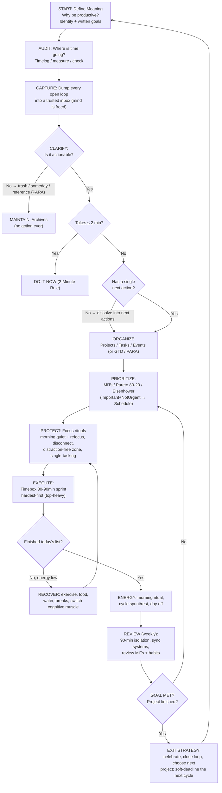

# The Productive Loop — A Flow Chart for Becoming (and Staying) Productive

> The theme's [[overview]] as a **state machine**: every box is an action, every diamond a decision, every arrow a hand-off. Follow it left-to-right, then round the PDCA loop forever.
> Renders natively in Obsidian (Mermaid). An ASCII version follows for plain-text/graph view.

---

## 1. Mermaid Flow Chart



---

## 2. ASCII Flow Chart (plain text / graph view)

```
                ┌──────────────────────────────────────────────────────────────┐
                │                                                              │
                ▼                                                              │
        ┌───────────────┐            ┌────────────────────────────┐            │
        │ 0. MEANING    │──────────▶ │ 1. AUDIT (CHECK)           │            │
        │ why + identity│            │ timelog / measure current  │            │
        │ written goals │            └────────────────────────────┘            │
        └───────────────┘                          │                           │
                ▲                                  ▼                           │
                │                         ┌────────────────────────────┐       │
                │                         │ 2. CAPTURE                 │       │
                │                         │ dump all open loops to     │       │
                │                         │ a trusted external system  │       │
                │                         └───────────────┬────────────┘       │
                │                                         ▼                   │
                │                         ┌────────────────────────────┐       │
                │                         │ 3. CLARIFY                │       │
                │                         │ is it actionable?         │       │
                │                         └───────┬────────────┬───────┘       │
                │                           No    │            │   Yes         │
                │                                 ▼            ▼               │
                │                       ┌───────────────────────┐              │
                │                       │ archive / someday /   │              │
                │                       │ reference (PARA)      │              │
                │                       └───────────┬───────────┘              │
                │                                   │                         │
                │                                   ▼                         │
                │                       ┌───────────────────────────────────┐  │
                │                       │ 4. ORGANIZE                       │  │
                │                       │ Projects / Tasks / Events         │  │
                │                       │ (or GTD buckets / PARA)           │  │
                │                       └──────────────────┬────────────────┘  │
                │                                          ▼                   │
                │                       ┌───────────────────────────────────┐  │
                │                       │ 5. PRIORITIZE                     │  │
                │                       │ MITs · Pareto 80/20 · Eisenhower  │  │
                │                       │ Important+NotUrgent → Schedule    │  │
                │                       └──────────────────┬────────────────┘  │
                │                                          ▼                   │
                │                       ┌───────────────────────────────────┐  │
                │                       │ 6. PROTECT (ATTENTION)            │  │
                │                       │ focus rituals, disconnect,        │  │
                │                       │ single-task, no notifications     │  │
                │                       └──────────────────┬────────────────┘  │
                │                                          ▼                   │
                │                       ┌───────────────────────────────────┐  │
                │                       │ 7. EXECUTE                        │  │
                │                       │ timebox 30–90 min · hardest first │  │
                │                       │ · dissolve tasks · batch · sprint │  │
                │                       └───────┬───────────────────┬───────┘  │
                │                        energy │                   │ list     │
                │                        low    │                   │ done     │
                │                               ▼                   ▼          │
                │                   ┌────────────────────┐  ┌────────────────┐ │
                │                   │ RECOVER           │  │ 8. REVIEW      │ │
                │                   │ move / rest /     │  │ weekly: sync   │ │
                │                   │ switch muscle ◀───┘  │ systems + goals│ │
                │                   └────────────────────┘  └───────┬────────┘ │
                │                                                     │        │
                │                                                     ▼        │
                │                                        ┌────────────────────┐ │
                │                                        │ 9. DECISION        │ │
                │                                        │ goal met?          │ │
                │                                        └─────┬────────┬─────┘ │
                │                                       no     │        │ yes   │
                │                                              ▼        ▼       │
                │                                       ┌───────────────────┐   │
                │                                       │ EXIT STRATEGY     │   │
                │                                       │ finish + celebrate│───┘
                │                                       │ → next project    │
                │                                       └───────────────────┘
                └── (loop back to 5. PRIORITIZE for next MIT / week)
```

---

## 3. Reading the Flow

1. **The spiral, not the line.** The chart is drawn left-to-right, but the *control* is a loop: after REVIEW you return to PRIORITIZE (next week's MITs) or to MEANING (when a project dies and a new identity-goal takes its place). This loop *is* the APO **Check→Act→Plan→Do** cycle ([[overview#^PDCA]]).
2. **The three exits are the anti-patterns:**
   - Stuck at *Capture/Clarify* → over-organization, "productivity as procrastination" ([[pkm-code-framework]] warns: capture ≠ express).
   - Stuck at *Prioritize* → analysis paralysis, "aiming forever" (Young's Ready-Fire-Aim).
   - Skipping *Recover* → burnout; the body procrastinates as a defense (Young, [[little-book-productivity-scott-young]]).
3. **Every diamond is a habit site.** The decisions *between* boxes are exactly the behaviors that [[atomic-habits-systems]] and the 30-Day Trial ([[little-book-productivity-scott-young]]) should automate. Make the diamonds automatic and the boxes run themselves.
4. **The weekly review is the governor.** It recalibrates trust in the system ([[gtd-task-management]]), enforces [[deep-work-attention-economics]] cadence, and prevents the flow chart from becoming a busy-work generator.

---

## 4. Fast-Start Cheat Sheet (if you can only do 5 things)

1. **Write the reason** and 3 Most Important Tasks each morning ([[focus-minimalism-babauta]]).
2. **Do the #1 MIT in a 90-min timebox before checking anything** (single-tasking).
3. **Capture every request/idea immediately; process once** ([[gtd-task-management]]).
4. **Close the day with an end-of-day review; run a weekly review + soft deadlines** ([[little-book-productivity-scott-young]]).
5. **Cycle: hard work → real recovery** (day off, sleep, exercise) → repeat.

---

## 5. Related Pages

- [[overview]] — the in-depth theme with full source registry
- [[focus-minimalism-babauta]] · [[little-book-productivity-scott-young]] · [[101-ways-workplace-productivity-fishel]] · [[apo-handbook-productivity]]
- [[deep-work-attention-economics]] · [[gtd-task-management]] · [[atomic-habits-systems]] · [[pkm-code-framework]] · [[mental-models-for-execution]]