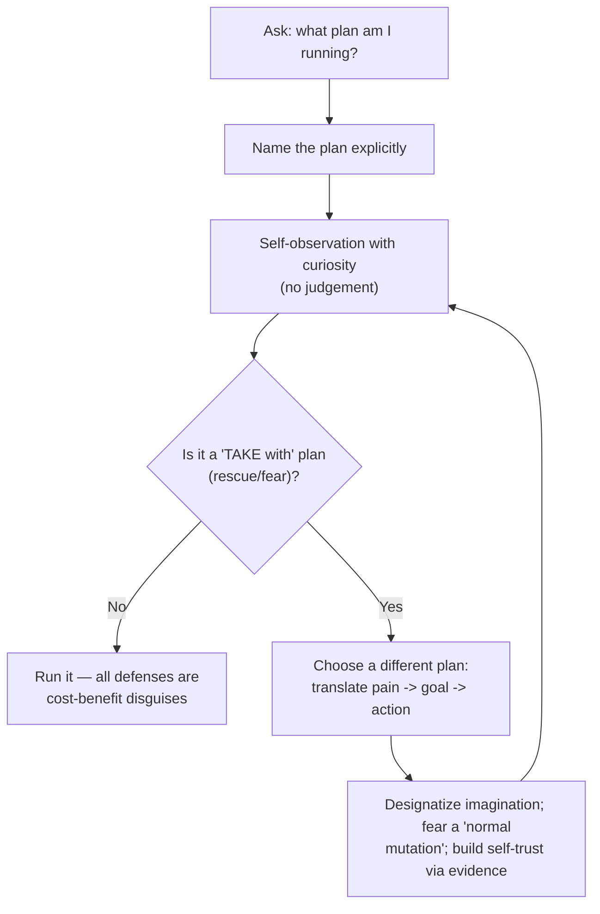
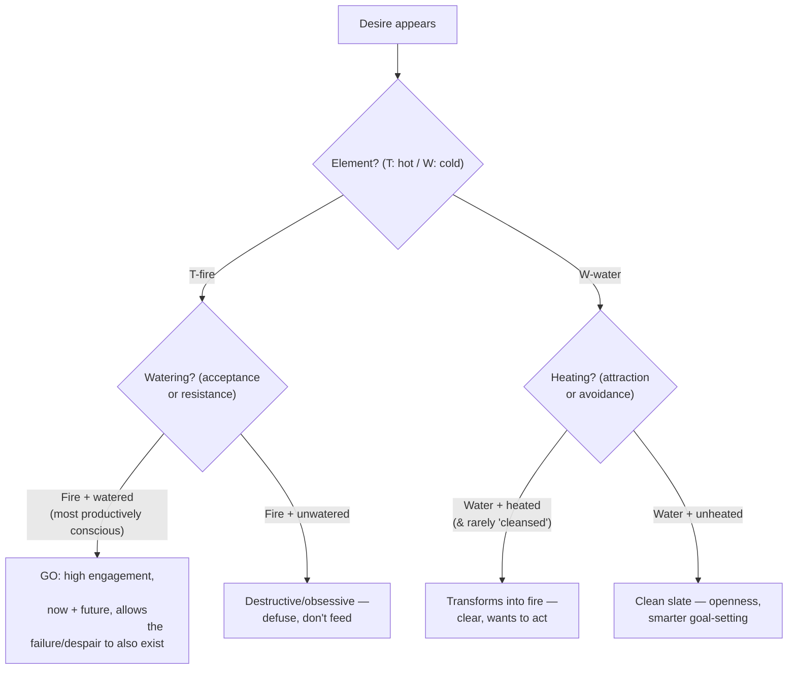
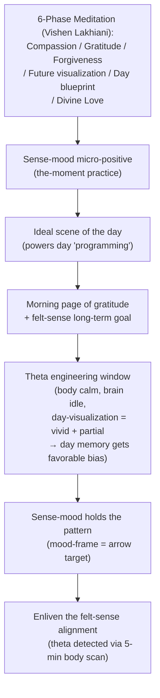
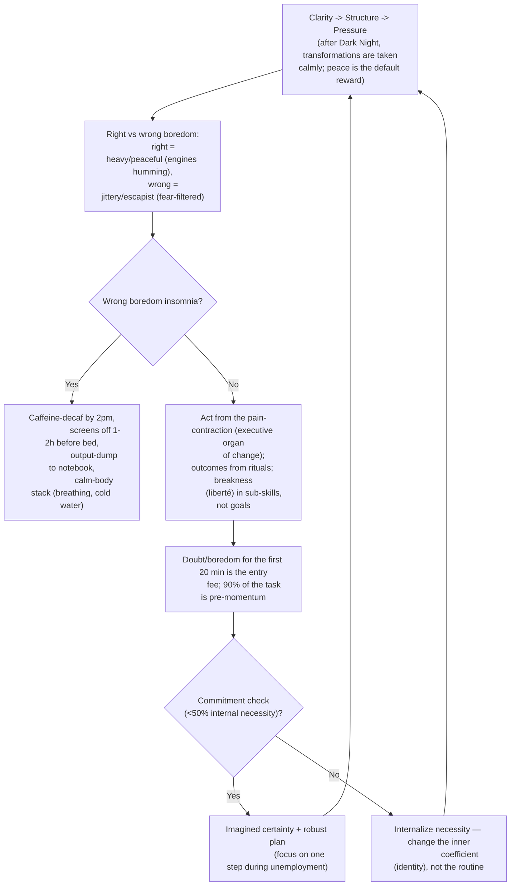
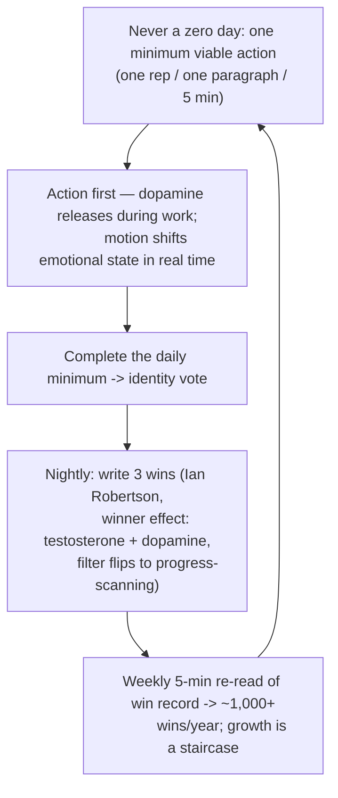
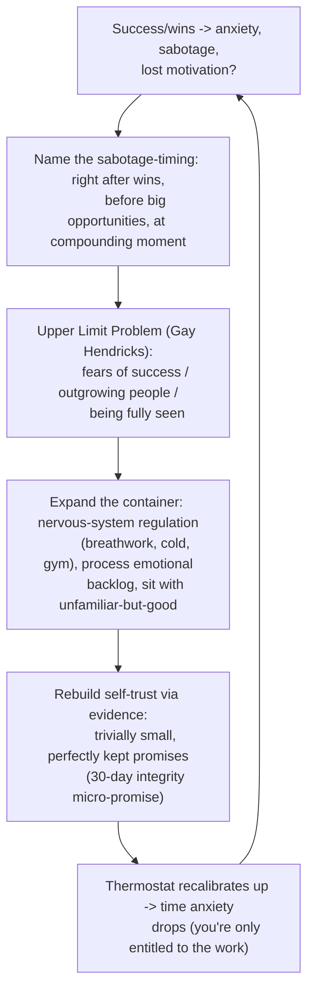
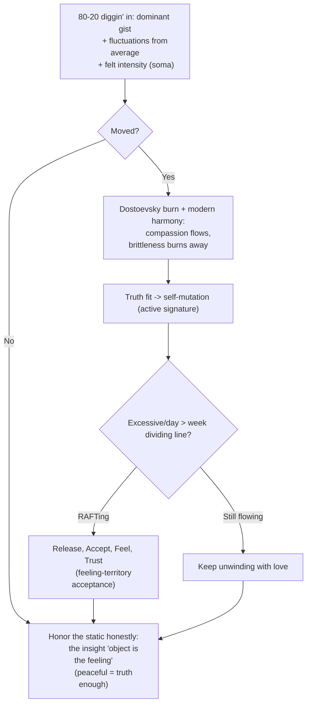
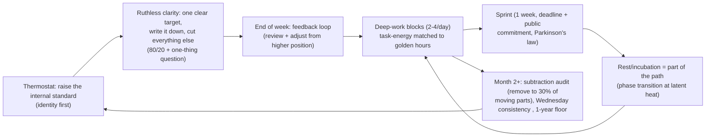
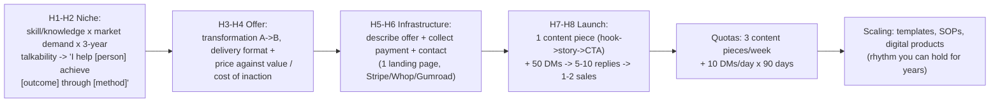
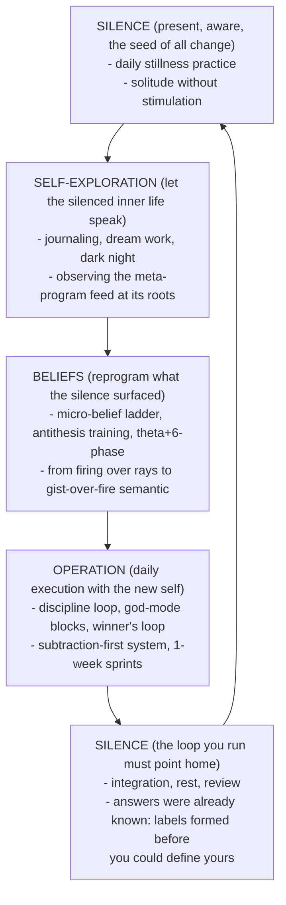

# Self-Mastery Master Flowcharts

> Compressed runbooks for the whole module. Each flowchart is a self-contained loop to run daily, weekly,
> on-demand, or as a one-time protocol. Cross-references point to the detailed pages.

---

## 1. The Micro-Belief Ladder (daily, on sensory reality)

```mermaid
flowchart TD
  A["Negative belief surfaces"] --> B{"Is it an external fact\nor an internal interpretation?"}
  B -- "External fact" --> C["Accept + adapt (no ladder needed)"]
  B -- "Internal interpretation" --> D["Do a tiny measurable action\n(evidence A)"]
  D --> E["Catch opponent though cost-benefit\n(e.g. sadness mislabeled as wrath)"]
  E --> F["Spot upgrade path + set soil\n(evidence B)"]
  F --> G{"Frame it as decision}\n('Choose: forward or rescue?')"
  G -- "Rescue (fear > courage)" --> H["One safe micro-action\n(or walk away)"]
  G -- "Forward" --> I["Execute from current abilities"]
  I --> J["Every loop = identity vote"]
  J --> A
```

**Rules:** pick a *single* belief; ladder on the body (feeling-territory) not the head; contradictions can coexist — pick the belief you want to feel as true and give it evidence. *(Detail: [[belief-engineering]] §7.)*

---

## 2. The Meta-Program Loop (on demand)



**Human = a bag of variance producing plans; the meta-program meets the physical and drives.** Self-trust = knowing even your worst quality wants your success. *(Detail: [[subconscious-reprogramming]] §5.)*

---

## 3. Manifestation Quadrant Clarifier (on demand)



**T = hot/wanting (fire), W = cold/accepting or empty (water); each cylinder comes with a pressure gauge.** Mastery is 50/50 — act romantically *and* accept everything with equanimity. *(Detail: [[manifestation-quadrant]] §5.)*

---

## 4. Theta + 6-Phase Meditation Protocol (daily, 10–20 min)



**Theta unlocks belief reprogramming; mood primes retagging; meta-daytime-seer mirrors the game from the theta tower.** *(Detail: [[subconscious-reprogramming]] §4.)*

---

## 5. Discipline Loop & Boredom-Tolerance Ladder (daily)



**Self-discipline = spacious non-attachment, not contraction.** *(Detail: [[psychological-execution]] §3.)*

---

## 6. God-Mode Execution Protocol (deep-work sprint)

```mermaid
flowchart TD
  A["Block 60-90 min"] --> B["Deep-work fortress:
          phone away, notifications dead,
          door closed, intention set"]
  B --> C["Runway (5–10 min): settle, decide the
          single target, set timer"]
  C --> D["Monotask the target (god-mode):
          focused cognition ->
          positive-emotion manipulation engine ->]
  D --> E["High arousal = vigilant work
          (efficacy/control/valuation)
          AS IF model-driven (gives a solution-energy)
          THEN temporarily mindful (child-eyes, calm
          3/5) so the change nests in feel":]
  E --> F["Hyper-moment (rare, joy/lightness):
          mind ceases to fear, og/half-est frames
          unfold — time ~30 min but timeless"]
  F --> G["Pressure engagement + grace-space
          (dynamical system) -> modular body
          (proprioception = energy gate)"]
  G --> H{"Armed (control/confidence)?"}
  H -- "Yes" --> I["Multi-method frame mirroring
          (ask what the other method gets
          that this one can't)"]
  H -- "No" --> J["Return to 6-phase + sense-mood,
          replay the day's scene, recalibrate"]
  I --> B
  J --> B
```

**Focused cognition → positive-emotion manipulation → visitation. The frame is short-term feel but binds long-term identity.** *(Detail: [[psychological-execution]] §5.)*

---

## 7. Winner's Loop & Never-Zero-Day (daily)



*(Detail: [[life-systems-design]] §8.)*

---

## 8. Thermostat Reset & Integrity Rebuild (identity layer)



*(Detail: [[life-systems-design]] §1.)*

---

## 9. The Slow Loop — Insight Engine (daily, 10 min)



*(Detail: [[subconscious-reprogramming]] §6.)*

---

## 10. 1-Week Sprint / 1-Year Compounding (execution systems)



**Achieve more in one week than most do in 12 months: thermostat → clarity → execution → feedback at 7-day latency.** *(Detail: [[life-systems-design]] §1–4.)*

---

## 11. 24-Hour Empire (one day, forcing function)



**Done > perfect. Goal = one paying customer (proof of concept).** *(Detail: [[life-systems-design]] §10.)*

---

## 12. Silence → Change Architecture (the master map)



**The job: train the psyche's functioning, never its performance. Who you are at the bend decides the long arc — the frame of victory is that you can go on growing.** *(Cross-ref: [[overview]].)*

---
Use the Runbooks in section order for a compressed execution day: `5` (morning) → `4` (morning meditation) → `7` (day) → `1/9` (as needed) → `8` (identity layer) → `10/11` (system layer).

**Module Navigation:** **[[overview]]** · **[[belief-engineering]]** · **[[manifestation-quadrant]]** · **[[subconscious-reprogramming]]** · **[[psychological-execution]]** · **[[life-systems-design]]**.