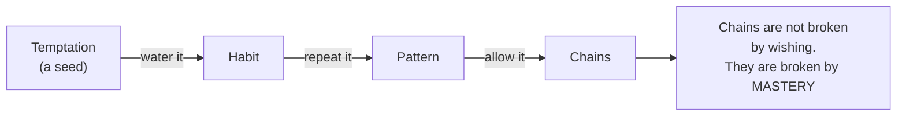
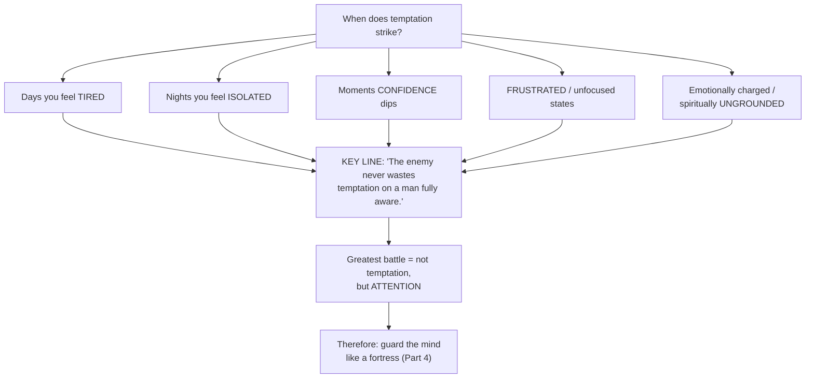
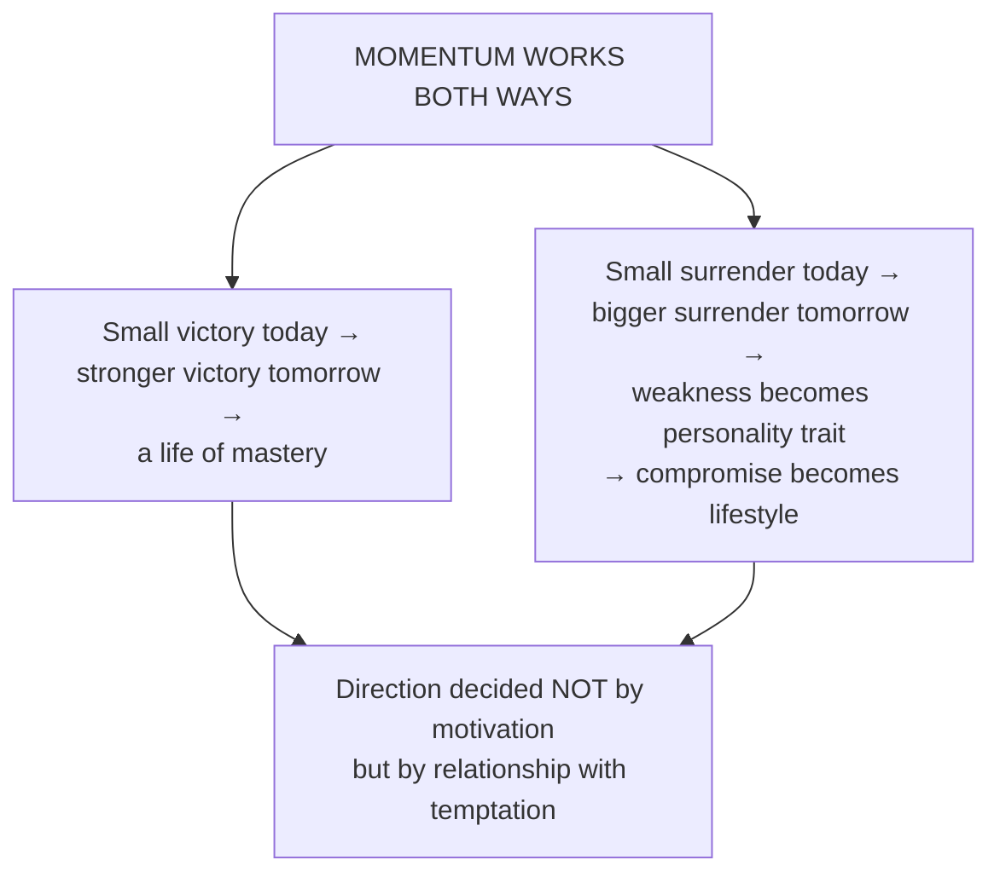
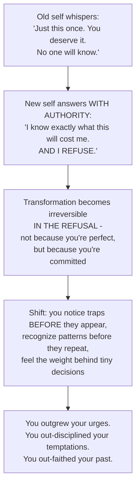
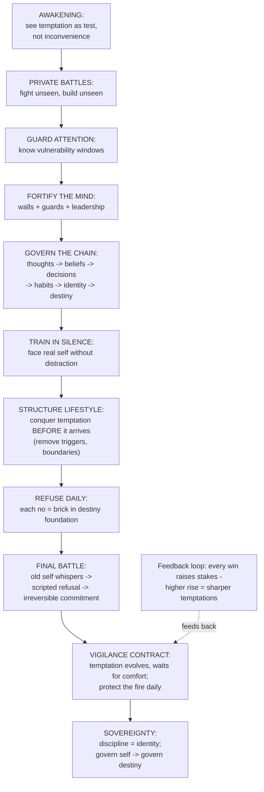

## For future agent
Complete distillation of the BHATT video "Man Who Masters His Temptations Masters His Fate" — every theme, quote, and framework from the 51-minute talk, organized into the speaker's 8-part arc with flowcharts. Motivational-spiritual genre: claims are **stated** (faith-framed), not peer-reviewed; several map onto evidence-based mechanisms and are cross-linked where they do. Read with [[psychological-execution]], [[life-systems-design]], [[subconscious-reprogramming]].

# Temptation Mastery — Full Dump

## Part 0 — The Opening Frame

The talk opens: *"Every man is being watched by God, by his future, by the destiny that waits for him on the other side of discipline."* Every day is a battlefield — not against enemies or armies but "against the most dangerous force he will ever face: his own temptations."

Core redefinitions the speaker establishes immediately:
- Temptation is **not** a side quest, not a minor inconvenience
- It IS "the spiritual enemy sent to test the strength of your character and the alignment of your soul"
- Every temptation is a QUESTION God asks: *"Who are you becoming? The man of your destiny, or the man who collapses under himself?"*

And the thesis sentence of the whole talk:

> **"Your fate is not stolen from you. You surrender it."**

Surrendered "the moment you allow temptation to weaken your mind, corrupt your habits, and fracture your focus."

## Part 1 — The Battlefield Within

**How temptation actually attacks**: in silence, not loud battles. "Through comfort, through pleasure, through impulses, through emotions trying to hijack your judgment, through desires that whisper instead of roar." The failure diagnosis: *"Most men fall not because they are weak, but because they aren't awake."*

**The modern lie**: "Just one more time. Just this once. No one will know. It doesn't matter." The speaker's counter: your spirit sees everything — private falls are recorded by your own soul. Three-stage decay he describes:
- Confidence feels it
- Discipline weakens from it  
- Destiny shifts because of it

**Self-betrayal precedes public collapse**: "A man loses respect for himself long before he loses respect from others. A man folds internally long before the world sees him collapse externally. A man destroys his potential long before life destroys his opportunities."

### The Seed Cascade

**What resistance actually does** (the positive cascade): each refusal strengthens will, sharpens mind, aligns with God, takes back control of fate. Each surrender loses the moment AND the direction.

**Evidence-mapping**: this matches the habit-compounding model ([[atomic-habits-systems]]) — identity forms from repeated behavior in BOTH directions; and the recognition that temptation exploits unattended moments matches HALT-state vulnerability research (Hungry/Angry/Lonely/Tired relapse triggers).

## Part 2 — Private Wars Build Public Victories

*"There is a truth every disciplined man eventually learns: your public victories are built on private wars."* The world sees results — composure, strength, clarity, rising influence — but none of it happens in front of people. It happens in: the mind, the habits, late nights, internal conversations, silent battles.

Key claims:
- **Silent battles are where substance is evaluated**: "It's in these silent battles where God evaluates the substance of a man."
- **Each tempting moment is a gate**: between your past and your potential. Resist → build new future. Bend → reinforce old one.
- **"What you choose in private eventually becomes the life you live in public."**

## Part 3 — Attention Is the Real Battle

This is the talk's strategic core:

*"Temptation doesn't want your peace. It wants your PURPOSE — the man you could become, the legacy you could leave, the calling on your life."*

The consumption law: *"Whatever enters you grows in you, and whatever grows in you eventually governs you."* Feed mind noise → chaotic. Lust → weak. Negativity → broken. Comfort → soft. Truth → unshakable.

**Fortress model** (three components of a guarded mind):

| Fortress Element | Mental Equivalent | Practice |
|------------------|-------------------|----------|
| Walls | Boundaries protecting focus | Filter what enters eyes/ears/spirit |
| Guards | Beliefs that filter thoughts | Take every thought captive at arrival |
| Leadership | Clear purpose directing attention | Purpose overrides impulse when trained |

## Part 4 — The Thought→Destiny Cascade & Mind Warfare

The talk's most structured passage — the chain:

*"Before a man ever loses to temptation in his actions, he loses to it in his thoughts — a whisper, a suggestion, a small permission, a silent negotiation in the mind."*

**Scripture anchors cited**: "Be transformed by the renewing of your mind" · "Take every thought captive" · "As a man thinks in his heart, so is he."

**The three impossibilities** (can't-out X the Y structure):
- You can't **out-pray** the thoughts you refuse to control
- You can't **out-work** a mindset you refuse to confront
- You can't **out-discipline** desires you continually feed in your mind

**Mind-consumption audit questions**: "Who and what have you been allowing into your mind without permission?" The king/warrior frame: a king doesn't let anyone enter his palace; don't let poison enter your spirit.

**Temptation thrives in UNEXAMINED thoughts**: "The enemy doesn't need to destroy you. He just needs you to stop thinking — to drift, to react, to follow emotions instead of principles."

## Part 5 — Silence Training & Structure

Two connected disciplines:

**Silence**: "Mastery begins in silence. Take away distractions and you face your real self — fears, cravings, wounds, impulses, habits, inner arguments. Most men run from silence because silence reveals truth. But the man who conquers silence conquers himself." In silence you learn to hear thoughts clearly → separate lies from truth, impulses from wisdom.

**Structure**: *"Weak men fall into temptation because they have no structure, no standards, no sacred boundaries, no spiritual perimeter."* The disciplined man walks with systems, boundaries, purpose — protects himself intentionally, creates distance from whatever weakens him "even if the world calls it extreme."

**The preparation principle** (one of the strongest lines):

> **"Temptation is not conquered in the moment it appears. It is conquered in the lifestyle you build long before it arrives."**

Table: Weak vs Disciplined response pattern:
| Weak Man | Disciplined Man |
|----------|----------------|
| Reacts | Prepares |
| Waits for temptation to hit | Structures life so it has no room to thrive |
| Falls and wonders why | Stands because he chose unshakability before the battle |

→ Evidence-map: this is implementation intentions + environment design + friction engineering ([[how-to-self-teach]] Engine 3; [[atomic-habits-systems]] Four Laws inverted).

## Part 6 — The Refusal Economy & Spiritual Promotions

**Momentum fork**:

**Why God tests before blessing**: "God doesn't send great destinies to men who cannot govern themselves... He refuses to let blessings become weapons that destroy them." The ungovernable man cannot manage influence, responsibility, leadership, abundance, spiritual authority. So: **private battles precede public victories as a trust qualification** — "God tests your private battles before He trusts you with public victories."

**Spiritual promotions**: every resistance = weight added to spiritual muscles; every disciplined choice sharpens destiny; every NO to impulses = YES to what God can give your future. "You're not fighting random urges. You are forging the man who will carry the life you are praying for."

Historical frame: ancient warriors mastered themselves years before battle; prophets/sages/kings endured testing seasons "not to break them but to prepare them."

## The Curse of Discipline (user-collected, 2026-08-25)

> **"The curse of discipline is that every day looks the same — but in the case of indiscipline, every year looks the same."**

The mirror image of the momentum fork above. Discipline's daily sameness IS the compounding working — nothing visible changes day-to-day because change is logarithmic, not linear. Indiscipline feels varied day-to-day (novelty, impulses, exceptions) but produces zero drift, so the years stack into identical copies.

Read the sameness correctly: a boring today is the receipt for a different tomorrow. When the graph heatmap shows the same color every day, that uniformity is evidence of motion, not the absence of it ([[atomic-habits-systems]], [[life-systems-design]]).

## Part 7 — Old Self vs New Self (The Final Battle)

*"There's always a final battle — not with the world, not with your environment, not with your enemies, but with the man you used to be."*

The old self's profile: waits in shadows of thoughts, hopes you slip, drags you back toward comfort/desire/distraction/weakness. "He wants you impulsive. He wants you addicted. He wants you easily influenced. He wants you spiritually blind. Because he knows something terrifying: if you outgrow him, you become unstoppable."

### The Confrontation Protocol

**Post-victory state changes**: temptations stop being threats and become *reminders* — of who you used to be, battles already won, how far you've risen. Calm in chaos, unshaken by noise, unimpressed by shortcuts.

## Part 8 — Vigilance Contract & Sovereignty

### The maintenance phase (most men skip this)

*"Once you rise above the urges that used to break you, a NEW responsibility appears: protect the fire that made you victorious. Temptation doesn't disappear when you win — it evolves. Quieter, smarter, more strategic. And it waits — not for your weakness, but for your COMFORT."*

Three danger mirrors:
- The moment he thinks he's untouchable → vulnerable
- The moment he believes he's finished growing → downfall begins
- The moment he's too strong to fall → enemy starts sharpening the blade

**The contract framing**: *"Your victory is not a certificate. It's a CONTRACT — a lifelong agreement: if you want to keep this strength, you must keep earning it."*

**The fire-protection list** (verbatim actions):
- Wake up early instead of sleeping in → protect fire
- Pray instead of scroll → protect fire
- Walk away from desire → protect fire
- Choose silence over ego → protect fire
- Keep mind focused when world scatters it → protect fire

**The brutal measurement**: *"Mastery is not measured by how high you climb, but by how clean you remain when you reach the mountaintop."* Higher rise → more dangerous temptations — "not because they're stronger, but because you have more to lose."

**The five-piece armor set**: discipline = shield · conviction = sword · humility = armor · prayer = breath · vigilance = survival.

### Why most men never reach the highest tier

"Not because they lack strength, but because they lack CONSISTENCY OF CHARACTER. They rise for a season, then fall into laziness. They win battles, then trust comfort more than mission. They taste growth and think the journey is over." The standard: "You don't get to keep what you don't continue to protect."

## Part 9 — Sovereignty: The Reign Begins

The final transformation inventory (from → to):
Reactive → Intentional · Emotional → Stable · Impulsive → Principled · Scattered → Focused · Worldly → Spiritually anchored · Mentally weak → Mentally fortified

**The self-governed man's relationships change**:
- Mind: battlefield → fortress
- Discipline: struggle → lifestyle
- Emotions: dictators → advisers
- Temptations: victories-for-darkness → reminders of who he refuses to be
- Validation: chases → generates
- Difficulty: avoids → confronts with calm authority

**The shift moment**: from asking *"Why is life so hard?"* to declaring *"I was built for this."* Core axiom: *"If I can rule myself, nothing outside can overthrow me."*

**The crown**: not world applause, not achievements, not respect-from-men — but being TRUSTED BY HEAVEN. "God only places weight on shoulders proven worthy of carrying it."

**The reward**: not ease — CLARITY. About who you are, what matters, what you're meant to build, what God expects. Quiet mind, steady heart, aligned soul.

Closing line: *"This is the end of the battle — but the beginning of the reign. Because the man who can govern himself is finally ready to govern his destiny."*

## The Complete System Flowchart

## Practice Protocol Extracted (operationalizing the talk)

| Cadence | Practice |
|---------|----------|
| NOW | Name top-3 temptations brutally honestly ("honesty is the first blade") |
| NOW | Map personal vulnerability windows (tired/isolated/unfocused times) |
| Daily morning | Pre-decide refusals (structure beats reaction); prayer/stillness slot |
| At attack | Run confrontation script: name cost → refuse aloud |
| Weekly review | Which fires protected? Where did comfort win? |
| Monthly | Environment audit: what enters mind unfiltered? Remove one trigger |
| Quarterly | Re-read this page; check vigilance contract still active |

## Verbatim Quote Bank (for reuse)

1. "Your fate is not stolen from you. You surrender it."
2. "Most men fall not because they are weak, but because they aren't awake."
3. "A man loses respect for himself long before he loses respect from others."
4. "Chains are not broken by wishing. They are broken by mastery."
5. "The greatest battle is not your temptation, but your attention."
6. "Whatever enters you grows in you; whatever grows in you governs you."
7. "You cannot out-pray the thoughts you refuse to control."
8. "Temptation is conquered in the lifestyle you build long before it arrives."
9. "Pressure doesn't break him — pressure reveals him."
10. "God tests private battles before trusting with public victories."
11. "Every temptation resisted becomes a spiritual promotion."
12. "Your victory is not a certificate. It's a contract."
13. "The soul you neglect becomes the soul that betrays you."
14. "Mastery is measured by how clean you remain at the mountaintop."
15. "You don't get to keep what you don't continue to protect."
16. "The greatest reward is not ease, but clarity."
17. "End of the battle — beginning of the reign."

## Honest Assessment (vault judgment layer)

**Strengths**: complete arc from awareness to governance; strongest sections are environment-design ("conquered in lifestyle before it arrives"), the attention-battle framing, and the vigilance/maintenance phase — all three align with evidence-based behavior-change science and fill gaps other motivational content skips (post-victory maintenance especially).

**Limits**: faith assertions are unfalsifiable (stated confidence); no operational specifics for boundary-building beyond "remove triggers"; heavy war metaphors risk shame-spirals in prone listeners if unpaired with self-compassion; single-authority framing discourages external support systems that addiction research values.

**Integration moves for the owner**:
1. Write the 3 named temptations + their cost sentences in daily notes
2. Script ONE refusal reply per temptation (old-self line → cost-naming refusal)
3. Add "fire protection" checkboxes to weekly review
4. Pair with vault systems: [[psychological-execution]] (dopamine/discipline mechanics), [[life-systems-design]] (structure), [[atomic-habits-systems]] (identity loop)

## Related Pages

[[overview|Self-Mastery Overview]] · [[psychological-execution]] · [[subconscious-reprogramming]] · [[belief-engineering]] · [[life-systems-design]] · [[self-mastery-flowcharts]] · [[manifestation-quadrant]]