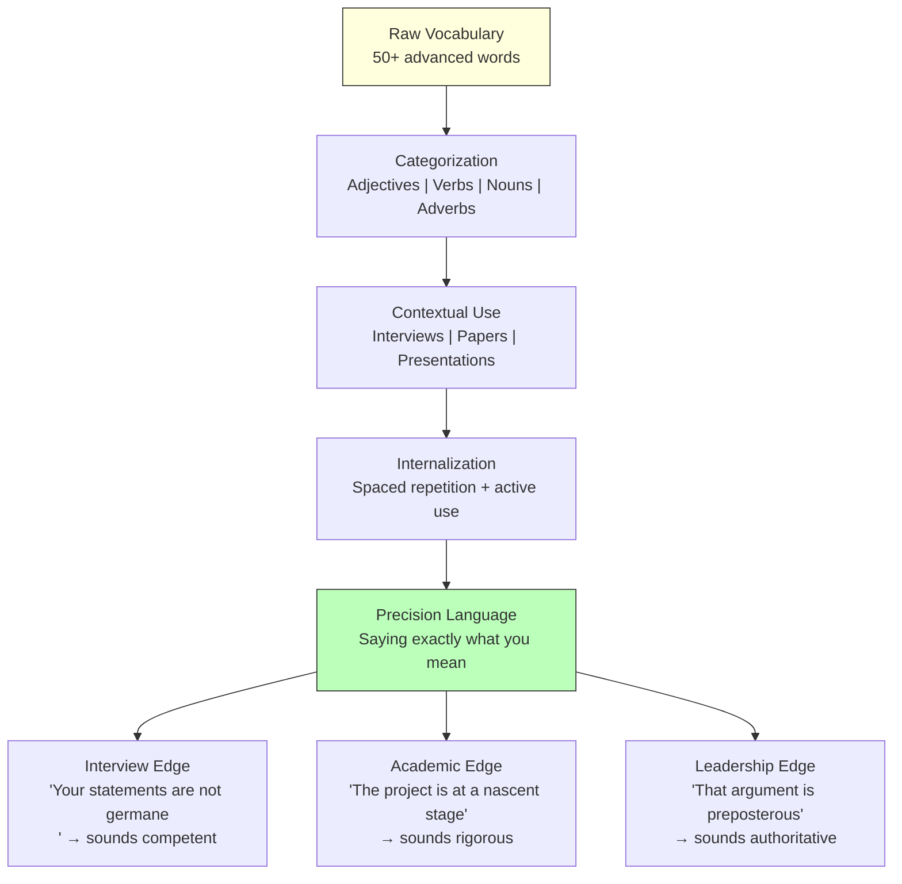
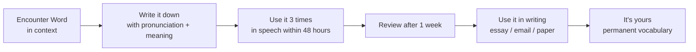

## For future agent
Wes (Interactive English) vocabulary marathon covering 50 advanced words across 5 categories: 10 "sound smarter" adjectives, 10 academic/professional adjectives, 10 advanced verbs, 10 advanced nouns, 10 advanced adverbs, plus 15 irregular verbs. Each word includes pronunciation, meaning, and contextual example sentences. This note extracts the words themselves and builds a *system* for vocabulary acquisition, aimed at a BTech student who needs precision language for quant-finance interviews and academic presentations.

# Vocabulary Building — Precision Language System

## Core Framework: Vocabulary as Competitive Advantage

**The central claim:** Precision vocabulary isn't about sounding pretentious — it's about saying *exactly* what you mean. When you can describe something as "cumbersome" instead of "kind of hard," you've communicated more in one word than most people do in a sentence. In quant-finance interviews, this precision signals competence.

---

## Word Bank — 50 Words by Category

### 10 Adjectives to Sound Smarter

| Word | Pronunciation | Meaning | Example |
|---|---|---|---|
| **ubiquitous** | yoo-BIK-wih-tus | Existing everywhere | "Smartphones are ubiquitous among college students." |
| **cumbersome** | KUM-ber-some | Difficult to handle due to size/weight/complexity | "The old reporting process was cumbersome." |
| **facetious** | fuh-SEE-shus | Treating serious issues with inappropriate humor | "Don't listen to him — he's being facetious." |
| **arduous** | AR-joo-us | Difficult, requiring great exertion | "Building the quant model was an arduous task." |
| **presumptuous** | pri-ZUMP-chuh-us | Showing disrespect by overstepping bounds | "It was presumptuous to assume he'd approve." |
| **pensive** | PEN-siv | Deeply thoughtful, reflective | "She looked pensive during the portfolio review." |
| **circuitous** | ser-KYOO-ih-tus | Taking a roundabout, indirect route | "We took a circuitous route to solve the problem." |
| **conscientious** | kon-shee-EN-shus | Careful, thorough, morally responsible | "She's conscientious about her research methodology." |
| **meticulous** | muh-TIK-yuh-lus | Showing extreme attention to detail | "He's meticulous with his data analysis." |
| **convoluted** | KON-vuh-loo-tid | Extremely complex, hard to follow | "The argument was convoluted and lost the audience." |

### 10 Academic/Professional Adjectives

| Word | Pronunciation | Meaning | Example |
|---|---|---|---|
| **germane** | jer-MANE | Relevant, closely related | "Your statements are not germane to the central argument." |
| **preposterous** | pri-POS-ter-us | Contrary to reason, absurd | "That claim is preposterous." |
| **perfunctory** | per-FUNK-tuh-ree | Done as routine, without thought | "She gave a perfunctory nod and moved on." |
| **truculent** | TRUK-yuh-lent | Aggressively hostile | "The senator was truculent with the media." |
| **austere** | aw-STIR | Severe, strict, without excess | "Her austere management style intimidated the team." |
| **capricious** | kuh-PRISH-us | Subject to sudden, unpredictable change | "The market is capricious — never assume stability." |
| **defamatory** | dih-FAM-uh-tor-ee | Damaging someone's reputation falsely | "The defamatory remarks startled everyone." |
| **esoteric** | es-oh-TAIR-ik | Understood by a small, specialized group | "Stochastic calculus is esoteric knowledge." |
| **nascent** | NAY-sent | Beginning to develop | "AI-driven trading is at a nascent stage." |
| **quintessential** | kwin-tuh-SEN-shul | The most perfect example of something | "She's the quintessential quant researcher." |

### 10 Advanced Verbs

| Word | Pronunciation | Meaning | Example |
|---|---|---|---|
| **admonish** | ad-MON-ish | Counsel against, scold gently | "The professor admonished him for sloppy methodology." |
| **advocate** | AD-vuh-kayt | Strongly support | "She advocates for transparent risk models." |
| **bemoan** | bih-MOAN | Express distress about | "He bemoaned the lack of real-world data." |
| **compel** | kum-PEL | Force or drive to do something | "The evidence compels us to reconsider." |
| **embezzle** | em-BEH-zul | Steal through fraud | "The accountant embezzled millions." |
| **extol** | ik-STOL | Praise highly | "The review extolled the model's accuracy." |
| **impugn** | im-POON | Challenge as false | "They tried to impugn his research findings." |
| **obfuscate** | OB-fuh-skayt | Make confusing, hard to understand | "Politicians often obfuscate the real issues." |
| **placate** | PLAY-kayt | Appease, calm by concession | "Nothing could placate the angry investors." |
| **repudiate** | ree-PYOO-dee-ayt | Reject with disapproval | "She repudiated the flawed analysis publicly." |

### 10 Advanced Nouns

| Word | Pronunciation | Meaning | Example |
|---|---|---|---|
| **quid pro quo** | kwid proh kwoh | Something given in exchange for something else | "The deal was a clear quid pro quo." |
| **catch-22** | katch twenty-two | Unsolvable problem (solution is within the problem) | "Needing experience to get experience — a classic catch-22." |
| **epitome** | ih-PIT-uh-mee | Perfect example of a class | "She's the epitome of a disciplined researcher." |
| **dichotomy** | dy-KOT-uh-mee | Division between two opposed things | "The dichotomy between theory and practice is real." |
| **myriad** | MIR-ee-ad | A great number of | "There are a myriad of approaches to this problem." |
| **credence** | KREE-dens | Belief in the truth of something | "The data gives credence to his hypothesis." |
| **malaise** | mal-AYZ | Vague feeling of discomfort | "There's a general malaise about the economy." |
| **sycophant** | SIK-uh-fant | Flatterer seeking favor | "He surrounded himself with sycophants." |
| **dilettante** | DIL-uh-tant | Amateur, shallow knowledge | "Don't be a dilettante — go deep on one thing." |
| **zenith** | ZEE-nith | Highest point | "The fund reached its zenith in 2024." |

### 10 Advanced Adverbs

| Word | Pronunciation | Meaning | Example |
|---|---|---|---|
| **annually** | AN-yoo-uh-lee | Once a year | "Interest compounds annually." |
| **reluctantly** | ri-LUK-tunt-lee | Unwillingly | "He reluctantly accepted the lower offer." |
| **unabashedly** | un-uh-BASHT-lee | Without embarrassment | "She unabashedly championed her controversial thesis." |
| **vaguely** | VAYG-lee | Not clearly expressed | "I vaguely remember that formula." |
| **fervently** | FURV-unt-lee | With great enthusiasm | "He fervently believes in systematic trading." |
| **diligently** | DIL-ih-jent-lee | With careful, persistent effort | "She diligently collected backtest data." |
| **vicariously** | vy-KAIR-ee-us-lee | Through someone else's experience | "I lived vicariously through his trading wins." |
| **hastily** | HAYST-lee | With excessive speed, carelessly | "They hastily drew conclusions from the data." |
| **utterly** | UT-er-lee | Completely, absolutely | "That model is utterly flawed." |
| **intently** | in-TENT-lee | With full, sharp focus | "She intently studied the correlation matrix." |

---

## System: How to Internalize Vocabulary

### Active Use Protocol
1. **Pick 5 words per week** from the bank above. Not 10. Not 20. Five.
2. **Use each word 3 times in real speech within 48 hours** — conversation, presentation practice, or self-talk.
3. **Write one paragraph per week** using all 5 words in context (essay-style, not bullet points).
4. **Review after 7 days** — can you still define and use each word naturally?
5. **Monthly rotation** — pick 5 new words, re-test old ones.

### Interview-Specific Vocabulary
These 10 words appear *constantly* in quant-finance and consulting interviews:
1. germane (relevant) — "Is this assumption germane to the model?"
2. nascent (emerging) — "This is a nascent market with high potential."
3. quintessential (perfect example) — "This is the quintessential risk-reward tradeoff."
4. meticulous (detail-oriented) — "Our backtesting is meticulous."
5. compelling (forceful) — "The evidence is compelling."
6. disparate (different) — "We're synthesizing disparate data sources."
7. mitigate (reduce risk) — "How would you mitigate tail risk?"
8. nuance (subtle distinction) — "There's an important nuance in the model."
9. leverage (use strategically) — "How do you leverage historical data?"
10. robust (resilient) — "We need a robust framework."

---

## Failure Modes / How Can Someone FAIL at Vocabulary Building?

| Failure Mode | What It Looks Like | How to Avoid |
|---|---|---|
| **Word Hoarding** | Memorizing 200 words but never using any of them. Flashcard paralysis. | Use-it-or-lose-it. 5 words used > 50 words memorized. |
| **Pretentious Overload** | Dropping "esoteric quintessential" into casual conversation. People cringe. | Match vocabulary to context. Casual = casual. Formal = formal. |
| **Wrong Word, Wrong Time** | Using "embezzle" to describe a minor mistake. Using "placate" when you mean "please." | Always check connotation, not just definition. Some words carry negative weight. |
| **Pronunciation Failure** | Knowing the word but butchering the pronunciation in an interview. | Listen to the word spoken (Forvo, Google). Practice aloud 5x before using it live. |
| **Ignoring Collocations** | Saying "make a crime" instead of "commit a crime." Words have partners. | Learn words in phrases, not isolation. "Impugn someone's character," not just "impugn." |
| **No Retrieval Practice** | Reading the word list but never testing recall. Passive recognition ≠ active use. | Close the book. Can you define "malaise"? Can you use it in a sentence? Test yourself. |
| **Dialect Mismatch** | Using British spellings in American interviews (or vice versa) inconsistently. | Pick one standard and stick to it. Consistency signals attention to detail. |

---

## Actionable Takeaways for a 2nd-Year BTech Student

1. **This week:** Pick 5 adjectives from the bank. Write them on sticky notes. Put them on your desk. Use each one in conversation at least once.
2. **For interviews:** Master the 10 "interview vocabulary" words listed above. Practice using them in STAR-format behavioral answers.
3. **For presentations:** Replace your top 5 "weak" words (hard, good, bad, nice, thing) with precise alternatives from this bank.
4. **For writing:** Before submitting any paper or report, do a "vocabulary audit" — can any generic word be replaced with a more precise one?
5. **Build a personal word journal.** One page per word: definition, pronunciation, 2 example sentences, and a personal connection ("This word describes my approach to backtesting").
6. **Don't skip pronunciation.** An mispronounced word in an interview costs more than a rare word used correctly.

---

## Quote Bank

1. "Would you like to sound smarter when you're speaking? Of course you do."
2. "These are not words that you're going to hear every day on the street. Instead, you're more likely to hear these adjectives in presentations, debates, or in-depth conversations."
3. "If someone is meticulous, that means that they try to pay really close attention to the details."
4. "A catch-22 is a problem that cannot be solved because the solution to the problem is inherent in the problem itself."
5. "If you want us to donate to your campaign, we'll need some quid pro quo."
6. "To speak of something clearly, you have to first understand it clearly." *(from articulation transcript, applicable to vocabulary)*
7. "I want to teach you a lot of different words, mostly advanced words, to help you be more precise so that you can say exactly what you want to say."
8. "These adjectives are great because they're very descriptive, very precise. And that is a great way to improve your fluency."
9. "Many people's worldview is quite literally based on memes and viral posts, which is quite worrying to think about."
10. "When you write, you have to slow down the flow of ideas and that trains you to understand them more."

---

## Related

- [[communication-mastery]] — the voice/body/words delivery system that vocabulary plugs into
- [[motivation-self-belief]] — the discipline to maintain a vocabulary practice
- [[deep-work-attention-economics]] — focused study time for deep learning of new words
- [[quant-toolkit-and-skills]] — quant-finance specific vocabulary and technical language
- [[interview-counter-guide]] — interview preparation where vocabulary precision matters
