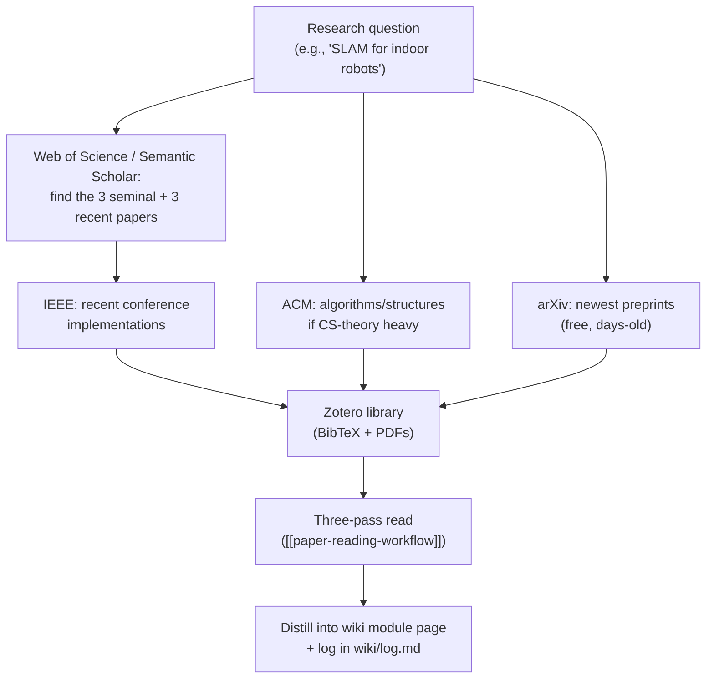

## For future agent
Deep reference on the five academic databases: holdings, fielded-search syntax, free-access routes, and study use mapped to this vault's fields (robotics, quant-finance, AI/ML, CS). Search syntax is stable and high-confidence; specific subscription holdings for KJSCE are `(TBC — confirm with library)`. Companion: [[paper-reading-workflow]].

# The Five Academic Databases

## 1. IEEE Xplore — the engineering giant

**What it holds**: 5M+ documents — IEEE journals, transactions, conference proceedings (ICRA, IROS for robotics; NeurIPS-adjacent ML applications), standards, and IET journals post-merger. The single most important DB for your fields: **robotics/ROS2 research lives here**.

### Search techniques
| Technique | Example |
|-----------|---------|
| Fielded search | `("Author Keywords":"SLAM") AND ("Publication Title":ICRA)` |
| Boolean + proximity | `"visual SLAM" AND robot NEAR/3 navigation` |
| Wildcard | `electrochem*` catches electrochemistry/electrochemical |
| Filter stack | Content Type → Conferences; Year; **Open Access** toggle |
| Command search URL | append `?searchWithin` field codes: `ti:`, `au:`, `abs:` |

### Access routes
- **KJSCE library** `(TBC — confirm holdings)`: most Indian engineering colleges hold IEEE via consortia — get the on-campus IP or proxy URL from the library
- **IEEE student membership** (~₹4-5k/yr) includes Society membership options + discounted Xplore access — worth it in year 3–4
- **Open Access filter**: ~10% of Xplore is OA; always flip it when off-campus
- Conference sites often link free PDFs of specific papers (author copies)

### Study use for this vault
- ROS2 deep-dives: search `SLAM`, `autonomous navigation`, `ROS 2` filtered to ICRA/IROS proceedings → distill into [[modules/../01-Areas/Engineering/robotics/index|robotics module]]
- Quant signal processing: `financial time series forecasting` in IEEE Trans. on Signal Processing / Neural Networks
- Set **saved search alerts** (email weekly) for your 2–3 core topics — literature comes to you

## 2. ACM Digital Library — CS theory & systems

**What it holds**: every major ACM conference + journal — algorithms (SODA), systems (SOSP, OSDI-adjacent), PL (PLDI), HCI (CHI), and the classic CS canon.

### Search techniques
- Fielded: `[[:title:]] (\"version control\") AND [[[:abstract:]] distributed` — ACM's syntax uses `[[:field:]]` brackets
- **CCS Concepts tree**: browse by taxonomy (Theory of computation → Design and analysis of algorithms) — better than keywords for surveying a subfield
- Filter: OpenAccess + ACM SIGs

### Access routes
- **ACM OpenTOC**: many conferences publish free-access TOCs — search "`<conference name>` OpenTOC"
- **ACM student membership** (~$19/yr ≈ ₹1,600) includes the full DL — the cheapest legit full-text CS library that exists
- KJSCE library `(TBC)`

### Study use
- The [[modules/../02-Resources/case-studies/cs-jj-vcs|jj-vcs case study]] lineage: version-control algorithms papers (CRDTs, merge structures) are ACM-hosted
- Algorithms interview depth beyond LeetCode: SODA/STOC papers on the structures you use

## 3. ASME Digital Collection — the hardware side

**What it holds**: ASME journals (Journal of Mechanisms and Robotics, Applied Mechanics Reviews, Journal of Computing and Information Science in Engineering) + conference proceedings (IDETC, IMECE).

### Study use for this vault
- Robotics **hardware/mechatronics** layer: actuator design, manipulator kinematics — complements the software-heavy IEEE/ROS2 side
- Applied Mechanics Reviews publishes survey papers — the best starting point for any mechanical subtopic

### Access routes
- Library `(TBC)`; **ASME student membership is cheap** and includes journal access options
- ASME has been moving to Open (OA) — many recent articles free

## 4. Taylor & Francis Online — the quant-finance home

**What it holds**: 2,700+ journals across science/social science/humanities. For this vault the crown jewel: ***Quantitative Finance* journal** (T&F) — plus *Statistical Methods*, control-engineering titles, and engineering-education journals.

### Search techniques
- Standard Boolean + field limits; "Search all T&F" vs per-journal
- **Only show content I have full access to** toggle (works with institutional IP)
- Citation export: RIS/BibTeX per article

### Study use for this vault
- **Quant-finance module** ([[01-Areas/Business/quant-finance/quantitative-finance-foundations]]): T&F publishes *Quantitative Finance*, *Applied Mathematical Finance*, *Journal of Risk* — the practitioner-academic bridge the SSRN preprints eventually become
- Search: `momentum`, `pairs trading`, `market microstructure` filtered to finance journals

### Access routes
- Library `(TBC)`; substantial OA percentage; **T&F Economics/Finance free-article collections** rotate monthly

## 5. Web of Science — the discovery engine (no full text)

**What it holds**: citation index across 90M+ records from all publishers — who cited whom, since 1900. You do NOT read papers here; you FIND them.

### The three WoS superpowers
| Power | Use |
|-------|-----|
| **Citation chaining backward** | A 2020 paper's reference list → the 5 papers you actually need to read first |
| **Times Cited forward** | Find the seminal paper in a field (sort by citations) — the canon, ranked |
| **Citation alerts** | Get emailed when anyone cites a key paper — literature tracks itself |

### Workflow
1. Find ONE good recent paper (from IEEE/ACM search or a supervisor)
2. WoS: open it → "Times Cited" → sort citing papers by relevance → read the reviews/surveys among them
3. Export results (RIS → Zotero) — never copy citations by hand

### Access routes
- Institutional subscription only `(TBC with library)` — Clarivate doesn't do individual plans
- **Free near-equivalents**: Semantic Scholar (citation chaining + TLDR summaries), OpenAlex (open API), Connected Papers (visual graph) — use these when off-campus

## Cross-Database Search Strategy (the expert pattern)

## Quick Reference: Which DB for Which Vault Topic

| Vault topic | First DB | Second | Free fallback |
|-------------|----------|--------|---------------|
| Robotics / ROS2 | IEEE Xplore | ASME | arXiv cs.RO |
| Quant-finance | T&F (Quantitative Finance) | IEEE (signal processing) | arXiv q-fin + SSRN |
| AI/ML theory | IEEE (TPAMI) | ACM | arXiv cs.LG + NeurIPS (open) |
| Algorithms/VCS | ACM | IEEE | arXiv cs.DS |
| Literature review / canon | Web of Science | — | Semantic Scholar + OpenAlex |

## Related Pages

[[paper-reading-workflow]] — the access ladder, three-pass method, vault pipeline · [[modules/../01-Areas/Engineering/robotics/index|robotics module]] · [[01-Areas/Business/quant-finance/quant-finance-strategy-hub|quant hub]] · [[modules/../02-Resources/learning-resources/index|learning-resources index]]