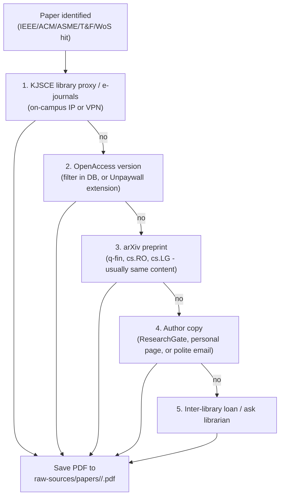
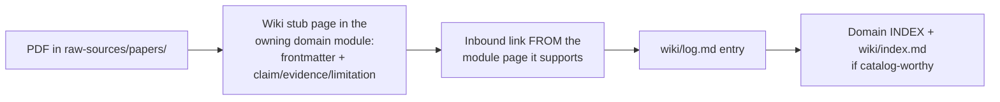

## For future agent
The operational workflow behind [[academic-databases]]: how a paper goes from "need to find" → legal access → three-pass read → distilled into a wiki module page. This is the vault's research pipeline — same discipline as the plugin-template's Definition-of-Done pattern: nothing counts as studied until it's distilled and linked.

# Paper Reading Workflow

## Stage 1 — Legal Access Ladder (try in order, stop at first hit)



**Rules**: library proxy credentials never leave the institution; no piracy mirrors — the ladder covers most papers legally; every saved PDF gets logged in `wiki/log.md` at distill time.

## Stage 2 — Three-Pass Reading (Keshav's method)

| Pass | Time | Read | Output |
|------|------|------|--------|
| **Pass 1** | 5–10 min | Title, abstract, intro HEADINGS, section headings, conclusions, figures | Decision: worth pass 2? One-line category in vault |
| **Pass 2** | ~1 hour | Full body EXCLUDING proofs/appendices; mark unread claims; skim figures carefully | 2-line summary: claim + method + result. Can now summarize to someone |
| **Pass 3** | 2–5 hrs (rare) | Virtually re-derive the paper; question every assumption; find the implicit premises | Deep critique + what YOU would do differently |

**Rule**: 80% of papers should stop at Pass 2. Pass 3 is only for papers you'll build on.

## Stage 3 — Distill Into the Vault



### Paper stub template (use in any domain)
```markdown
---
course_code: "<DOMAIN>"
title: "<Author Year - Short Title>"
tags: [paper, <field>, <method>]
confidence: "high"
source: "raw-sources/papers/<field>/<file>.pdf"
---
## For future agent
<One-line: what the paper shows and why it was kept.>

# <Title>
- **Claim**: <what it argues, one sentence>
- **Method**: <how, two sentences>
- **Evidence**: <key result + numbers>
- **Limitation**: <where it breaks / what it ignores>
- **Vault tie-in**: [[<module page it supports>]]
```

## Stage 4 — Citation Management

- **Zotero** (+ Better BibTeX plugin): one library, browser connector grabs from all five databases in one click
- Export: Better BibTeX keys (`authorYearTitle`) → paste `[[wikilinks]]` in vault notes that reference the paper stub
- In-text pattern for wiki pages: "GGR (2006) found 11% ann. excess — see [[pairs-trading-gatev-goetzmann-rouwenhorst]]"
- Word/Docs writing: Zotero plugin inserts citations + auto-bibliography

## Stage 5 — Keep the Literature Coming To You

| Channel | Setup | Frequency |
|---------|-------|-----------|
| IEEE saved-search alerts | 2–3 core topics (e.g., SLAM, financial forecasting) | weekly email |
| arXiv subscriptions | q-fin, cs.RO, cs.LG daily digest | daily email |
| Google Scholar alerts | author + keyword alerts | as-published |
| WoS citation alerts | on your 5 most-important papers | as-cited |
| Zotero feeds | follow a lab/journal RSS | weekly review |

## Failure Modes

| Failure | Mechanism | Counter |
|---------|-----------|---------|
| PDF hoarding | 200 PDFs saved, 3 read | PDF enters raw-sources ONLY with a same-day stub page ([[build-project-playbook]] discipline applied to papers) |
| Pass-3 perfectionism | Re-deriving every paper | 80/20 rule: Pass 2 is the default endpoint |
| Citation-by-hand | Manual formatting errors compound | Zotero export only |
| Off-campus giving up | No proxy → assumes paywalled | The ladder has 4 more rungs — climb them |

## Related Pages

[[academic-databases]] — the five databases in depth · [[modules/../01-Areas/Engineering/robotics/index|robotics module]] (IEEE-paper destination) · [[01-Areas/Business/quant-finance/pairs-trading-gatev-goetzmann-rouwenhorst|pairs-trading deep-dive]] (example of a distilled paper) · "paper"-tagged stubs across the vault