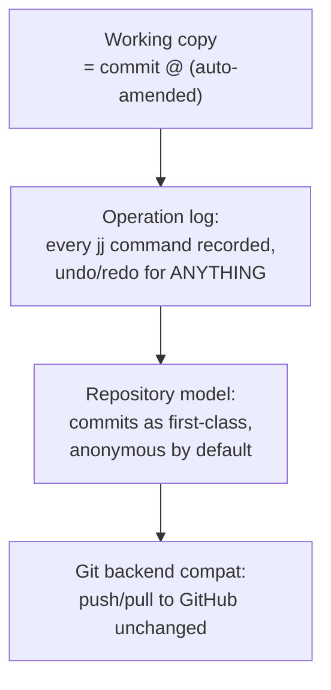

## For future agent
Case study of Jujutsu (jj) — a modern Git-compatible VCS written in Rust by a Google engineer, rethinking the developer workflow (working copy IS a commit; no staging area; automatic rebasing; operation log for undo). ~10k+ stars, real production adoption growing. This page extracts data-model lessons and the "rethink sacred UX" design courage.

# Jujutsu (jj) — Rethinking Version Control

## What It Is

A new version control system, Git-compatible on-disk (can co-exist with git remotes/repos), addressing Git's notorious UX sharp edges: the index/staging split, detached-HEAD fear, rebase conflicts, unsafe amend. Written in Rust. Design philosophy: **the working copy is itself a commit** — every state is versioned automatically.

## How It Works (conceptual)



**Load-bearing lessons**:
1. **Data-model-first design**: jj defined its commit graph + op-log BEFORE any CLI — the inverse of most tools. UX follows from the model.
2. **Killing the staging area**: `jj` treats work-in-progress as commits continuously — eliminates an entire class of "oops I lost staged changes"
3. **Undo as core primitive**: operation log makes time-travel universal, not `reflog` archaeology
4. **Compatibility as adoption strategy**: works with existing Git remotes — migration cost ≈ zero

## What To Extract

| Lesson | Application |
|--------|-------------|
| Model-before-UX design | Any tool/feature you build: define data invariants first |
| Automatic persistence | Your apps: autosave-as-default beats save-buttons |
| Sacred-cow auditing | "Why does Git have staging?" — asking why about EVERY inherited convention |
| Rust at scale | Real-world large Rust codebase reading practice |

## Failure Modes

| Failure | Mechanism | Counter |
|---------|-----------|---------|
| Muscle-memory war | Git habits fight jj idioms | Learn jj ON A THROWAWAY repo first; never mid-project |
| Early-adoption risk | Format/CLI churn pre-1.0 | Track releases; pin versions `(TBC: check current status)` |
| Conceptual confusion | Mixing git/jj mental models | One VCS per repo at any moment |

**Premortem**: *"Tried jj for a day, went back to git."* Mechanism: compared under deadline pressure with git reflexes intact. New VCS need a sandbox commitment window (2 weeks) to be fairly evaluated.

## Part 6 — Internals Push: Change-IDs, Conflict Trees, Colocation

### change-id vs commit-id
Git identity = SHA(content+parents): rebase rewrites history so every SHA changes and references break. jj adds a SECOND stable id — the change-id tracks "the logical change" while commit-id tracks "this exact snapshot". Implemented as a side-table mapping change-id to current commit-id, updated atomically on rebase/amend. Practical result: `jj log` shows stable labels (qpvuntsm-style) usable in prose/issues across history edits. mini-jj insight: add a changes.json sidecar mapping uuid to commit-sha; watch references survive your own rebases.

### Conflict trees as ordinary objects
A conflicted merge produces a TREE whose entries can be conflict records; materialization renders markers into the workdir at checkout; resolution writes a fresh normal tree. Consequences: you can COMMIT a conflicted state, rebase other work around it, resolve later. Git's conflicted index blocks everything until resolved — jj made conflicts flow through every command unchanged.

### Colocation
.jj and .git share one object store; jj imports Git refs each command and exports back. Both tools operate on one physical repo — adoption cost near zero. Engineering lesson: interop layers beat migration walls.

### Revsets
`jj log -r 'ancestors(@, 5) | mine()'` — a compositional query DSL over the commit graph: small operator set, set algebra, lazy evaluation. Study if you ever design domain query languages.

## Life Integration

- Perfect [[lr-build-your-own-x]] companion: build mini-jj concepts after studying theirs
- Vault synergy: your vault is Git-backed ([[Gotchas]] PowerShell notes) — a safe jj experiment target exists
- Metrics: sandbox-repo commands tried · data-model notes · one design-lesson applied to your own project

## Example Checkpoint Questions

1. What breaks in Git's model when you want "undo" that jj's operation log gives free?
2. Why does treating the working copy as a commit eliminate staging entirely?
3. Name one Git sacred cow jj rejected — and evaluate whether it was load-bearing or historical accident.

## Cross-Vault Links

[[02-Resources/case-studies/index|Field Index]] · [[cs-dura]] (VCS-safety sibling) · [[software-dev-general]]

## Part 5 — R&D Extension: The Data Model In Detail

### Two layers of state
jj's repository has TWO state layers, and understanding them is the whole design:

1. **Commits** — content snapshots: tree id + parent ids + **change-id** (stable identity that survives rebases — Git commits change ids on every rebase, breaking references) + description. Commits are ANONYMOUS by default; you name them only when useful.
2. **Operations (op-log)** — every command writes an operation recording: which commits existed before/after, working-copy commit id, timestamp, description ("jj commit", "jj rebase"...). Repo view = HEAD operation applied to object store.

This dual structure gives: `jj undo` (revert last op), `jj op log` (history of HISTORY itself), and conflict-free concurrent commands (operations merge like CRDT states). Git's reflog is an afterthought debugging tool; jj's op-log is a first-class product feature.

### Conflicts as ordinary data
Instead of blocking on merge conflicts, jj stores conflicted trees as first-class objects with conflict markers materialized in files. You can COMMIT conflicted states, rebase them around, resolve later in a separate operation. Git treats conflict as exceptional; jj treats it as ordinary state that flows through every other command unchanged.

### Why Rust for this
Content-addressed stores + tree walks + hashing are CPU-heavy; memory safety matters for a tool whose entire job is programmatically rewriting history. Plus single-binary distribution via cargo makes adoption friction near zero.

### mini-jj build spec (~400 lines Python — flagship [[lr-build-your-own-x]] candidate)
```
Commands:
  mj init                      -> .mj/objects/ + .mj/oplog.json
  mj save <msg>                -> hash blobs -> write tree -> commit object ->
                                  update branch ref -> append op entry
  mj log                       -> render branch history from commit store
  mj checkout <id>             -> restore tree into workdir + move ref
  mj undo                      -> pop last op-log entry, restore prior view
Data shapes:
  blob:   sha256(content) -> content file
  tree:   {path: blob_sha} json, itself content-hashed
  commit: {tree_sha, parents[], msg, ts}
  oplog:  [{op:"save", before_view, after_view, ts}]
Build order: save/log first (80% of the insight lives here),
checkout second, undo third — the op-log pays off at THIS step.
Stretch goals: tree-diff between commits; named branches as moving
pointers; garbage collection of unreferenced objects.
```

### Failure modes while building
| Failure | Counter |
|---------|---------|
| Reinventing Git commands instead of the model | Design op-log FIRST on paper; commands fall out of it |
| Hash-addressing confusion | One evening on content-addressable storage concept ([[cs-twitter-algorithm]]-style funnels don't apply here — it's simpler) |
| Undo half-implemented | Undo is the demo centerpiece; do not ship without it |
