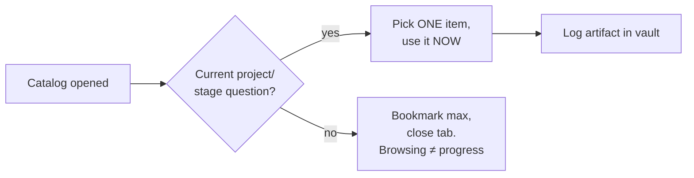

## For future agent
Index for the mega-catalog repos of learning resources. These pages exist to convert CATALOGS into SYSTEMS — each includes failure modes (hoarding, completionism) and integration routes into this vault's roadmaps. Sources fetched 2026-08-24.

# Learning Resources — Field Index

| Page | Catalog | Best For |
|------|---------|----------|
| [[lr-awesome-meta]] | sindresorhus/awesome | The catalog of catalogs — entry to every awesome-list |
| [[lr-free-for-dev]] | ripienaar/free-for-dev | Free developer tiers (cloud, APIs, tools) |
| [[lr-free-programming-books]] | EbookFoundation/free-programming-books | Free books in every language/topic |
| [[lr-freecodecamp]] | freeCodeCamp | Structured free curriculum + certifications |
| [[lr-30-seconds-of-code]] | Chalarangelo/30-seconds-of-code | Snippet library for quick wins |
| [[lr-project-based-learning]] | practical-tutorials/project-based-learning | Tutorial chains by language |
| [[lr-developer-roadmap]] | kamranahmedse/developer-roadmap (roadmap.sh) | Visual role roadmaps |
| [[lr-ossu-computer-science]] | ossu/computer-science | Free full CS degree curriculum |
| [[lr-build-your-own-x]] | codecrafters-io/build-your-own-x | Learn-by-rebuilding (Git, DB, OS…) |
| [[tech-interview-handbook]] (in careers/) | yangshun/tech-interview-handbook | Interview prep structured |

## The Meta-Rule for ALL Catalogs

Failure mode common to ALL of these: **catalog-as-identity** — being "someone who has the best resources" instead of someone who builds. Each sub-page carries specific counters.

## Cross-links

[[01-Areas/Business/careers/index|Careers Hub]] · [[01-Areas/AI-Data/data-science/index|Data Science Hub]] · [[programming/overview|Programming Hub]] · [[roadmaps-and-study-guides]]