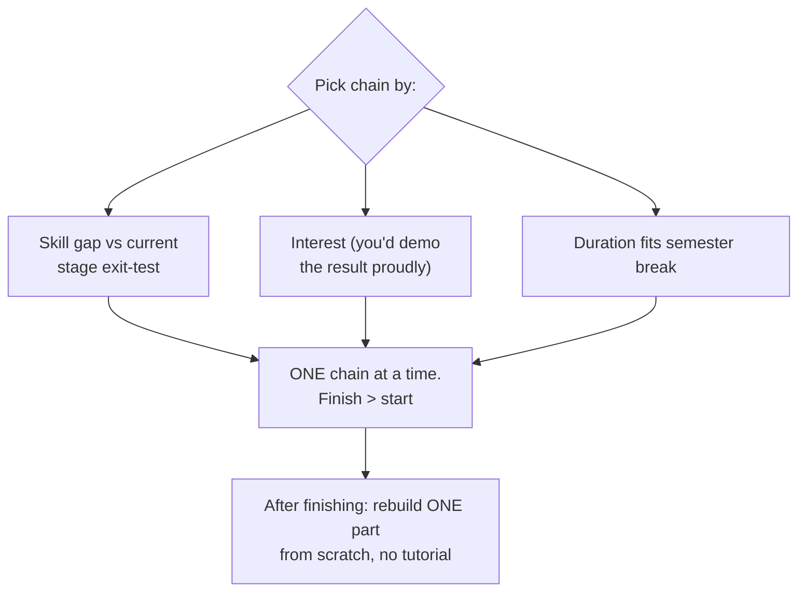

## For future agent
Two complementary catalogs combined (both serve "quick practical entry"): 30-seconds-of-code (snippet library across JS/Python/etc.) and project-based-learning (tutorial chains building real projects per language). Includes the copy-paste trap analysis and the tutorial-chain selection logic. Feeds [[python-mastery-path]], [[repo-fullstack-web-developer-path]].

# 30-Seconds-of-Code + Project-Based Learning

## Repo A: 30-Seconds-of-Code

Thousands of small, tested snippets (JS/Python/CSS/React…) each explainable in ~30 seconds. Sections by language; every snippet has description + example.

**Correct use**: lookup reference when a pattern is needed mid-build ("how do I deep-flatten an object?").
**Failure mode**: snippet-browsing as study. Snippets read = trivia; snippets USED in your code = learning. Rule: never open without a live need; after copying, retype from memory once.

## Repo B: project-based-learning

Curated tutorial chains per language (Python: build an interpreter, a blockchain, a drone…; JS: build a framework…). Each entry links to full multi-part builds.

### Chain Selection Protocol

### Failure modes

| Failure | Mechanism | Counter |
|---------|-----------|---------|
| Tutorial-following illusion | Typing along feels like building | Post-chain rebuild test (blank editor) |
| Chain-hopping | New shiny project at first hard section | Finish-or-drop rule, decided BEFORE starting |
| Tutorial-era projects as portfolio | Same calculator app as everyone | Customize: change domain/features until it's YOURS |

**Premortem**: *Six tutorials started this year.* Autopsy: each abandoned at the same relative point (~30%) where tutorials stop hand-holding. That point IS where learning starts — recognize the feeling as the beginning, not the end.

## Life Integration

- Snippet library: bookmarked, consulted during builds only
- One tutorial-chain per semester-break mapped into roadmap stage gaps
- Metrics: chains completed (≥1/quarter), post-chain rebuild pass rate, snippet-retyped-from-memory ratio

## Example Checkpoint Questions

1. What's the last snippet I RETYPED from memory after using?
2. Which chain am I mid-way through — and what % is my own code vs typed-along?

## Cross-Vault Links

[[02-Resources/learning-resources/index|Field Index]] · [[python-mastery-path]] · [[repo-fullstack-web-developer-path]] · [[build-project-playbook]]