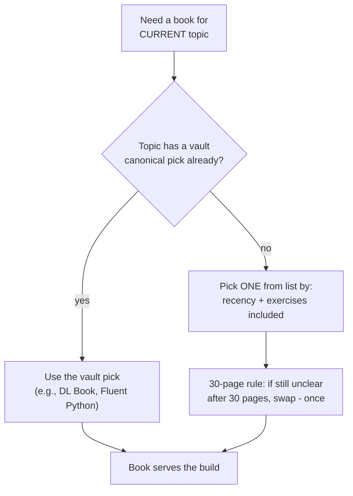

## For future agent
The canonical free programming books index (350k+ stars): thousands of free legal books/courses by language and topic, including multilingual editions. This page adds selection discipline — book-hoarding is the classic failure. Feeds [[software-dev-general]], [[01-Areas/Programming/cs50/index]].

# Free Programming Books — The Library Index

## What It Contains

Organized by: language-specific resources · free online courses · interactive programming resources · problem sets & competitive programming · **multilingual sections** (Hindi and other non-English lists exist) · podcast/screencast series.

## Selection Protocol

## Failure Modes

| Failure | Mechanism | Counter |
|---------|-----------|---------|
| Library hoarding | Downloading 40 PDFs = dopamine of preparedness | Downloads allowed only when the book is CURRENT |
| Book-switching at chapter 3 | Hard chapters trigger better-feeling alternatives | 30-page rule + one-swap limit per topic |
| Tutorial-book mismatch | Reading reference texts linearly | Reference books are LOOKED UP, not read through |

**Premortem**: *Hard drive full of PDFs; none finished.* The library grew as identity ([[how-to-self-teach]] Engine 2). Books enter reading-status only with a start date + target chapters in daily notes.

## Life Integration

- One active technical book max; slot = commute/low-energy hours
- Vault note per finished book: 5-line summary + what changed in your code
- Metrics: books-finished per quarter (≥1), downloads-without-starting (target 0)

## Example Checkpoint Questions

1. Which book am I actually mid-way through right now?
2. Of my downloaded books, how many have notes? (Notes = read; no notes = hoarded.)

## Cross-Vault Links

[[02-Resources/learning-resources/index|Field Index]] · [[repo-teachyourselfcs]] · [[curated-reading-list]]