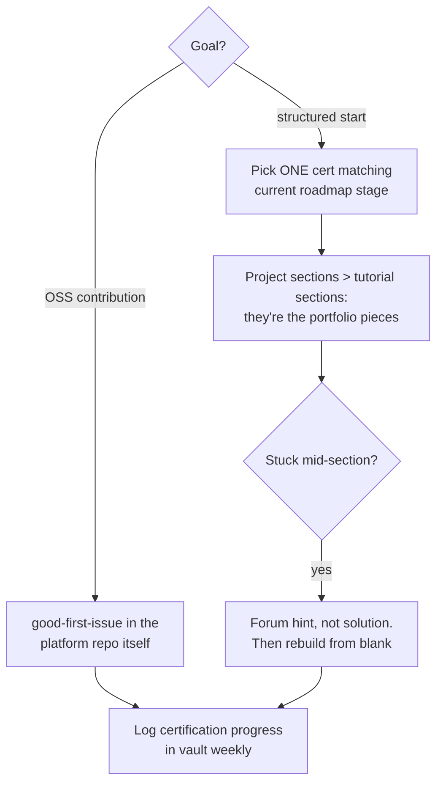

## For future agent
freeCodeCamp: the largest free structured coding curriculum (full repo is the platform itself — React/Node monorepo worth studying as architecture too). This page covers its certifications, the platform-as-codebase angle, and completion-mechanics. Fits [[repo-fullstack-web-developer-path]] as an alternative spine.

# freeCodeCamp — Structured Free Curriculum

## What It Contains

Certification tracks (~300h each, self-paced): Responsive Web Design · JavaScript Algorithms & DS · Front End Libraries · Data Visualization · APIs & Microservices · Quality Assurance · Scientific Computing with Python · Data Analysis with Python · Information Security · Machine Learning with PyTorch · College Algebra. Plus YouTube channel + forum + a published curriculum repo (the platform source).

**Dual value**: (1) the curriculum for structured learning; (2) the CODEBASE as a large-scale open-source React+Node monorepo case study — real CI, i18n infrastructure, moderation tooling.

## Usage Protocol

## Failure Modes

| Failure | Mechanism | Counter |
|---------|-----------|---------|
| Tutorial-treadmill | 10 certs collected, zero original projects | Certification = milestone; projects ([[build-project-playbook]]) = proof |
| Copy-solution loops | Hint system abused into answer key | Blank-editor rebuild after any peek |
| Cert-vacuum expectations | "Certified but unemployable" disappointment | Pair every cert with ONE deployed artifact using those skills |

**Premortem**: *Three certifications done; interviews still failing.* Autopsy: challenge-style problems (fill-in-the-blank) never built independent recall; no live-coding practiced. Certs are scaffolding — they must be followed by blank-editor building and mocks.

## Life Integration

- One track per semester-break; daily floor = one challenge
- Metrics: project-portfolio items per cert (target ≥1), blank-editor rebuild pass rate

## Example Checkpoint Questions

1. Can I rebuild my last fCC project from scratch without the walkthrough?
2. Is my current cert track serving my active roadmap stage — or replacing it?

## Cross-Vault Links

[[02-Resources/learning-resources/index|Field Index]] · [[repo-fullstack-web-developer-path]] · [[lr-project-based-learning]]