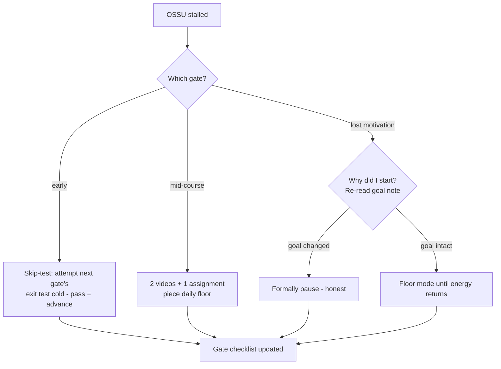

## For future agent
OSSU's flagship: a complete free self-taught CS degree (~4 years part-time equivalent) — the sibling of [[repo-ossu-data-science]]. Structure fetched 2026-08-24. This page compresses it into stage gates and integrates with Teach Yourself CS + this vault's SWE roadmap.

# OSSU Computer Science — Expanded

## What It Contains

Full curriculum: **Prerequisites** (math, basic computing) → **Core CS** (programming, algorithms, math for CS, OS, computer architecture, networks, databases, languages/compilers, distributed systems — mirroring classic undergrad) → **Advanced CS** (electives: AI, graphics, security…) → **Final project**. Each course = one MOOC with prerequisites listed; community forum support.

Note the deliberate overlap with [[repo-teachyourselfcs]]'s nine subjects — same canon, different packaging (MOOC-chains vs book+course pairs).

## Stage Gates (compressed execution)

| Gate | Courses | Exit Test |
|------|---------|-----------|
| G1 | Intro programming (any lang) | Build a non-trivial CLI from spec |
| G2 | Core math for CS | Write and check small proofs; discrete fluency |
| G3 | Algorithms | Implement + explain: sorting family, graph traversal, DP basics |
| G4 | Systems trio (OS/architecture/networks) | Explain boot-to-webpage story end-to-end |
| G5 | Databases + Languages/Compilers | Build a queryable store + a toy interpreter |
| G6 | Distributed systems | Raft-paper level reading fluency |
| G7 | Final project | Shipped system using ≥3 gate skills |

## Failure Modes

| Failure | Mechanism | Early Warning | Counter |
|---------|-----------|---------------|---------|
| 4-year guilt spiral | Degree-scale framing crushes momentum at month 2 | Counting remaining courses not completed ones | Run as GATES not semesters; skip-tested where JEE background applies |
| Course-perfectionism | Retaking to get perfect grades | Re-watching before moving on | Pass threshold = can EXPLAIN + USE, not certificate % |
| Elective black hole | Advanced CS catalog infinite | Browsing electives during core | Electives locked until G6 |
| No building between gates | Pure-MOOC diet | Months without a repo commit | Every gate ends in an artifact ([[build-project-playbook]]) |

**Premortem**: *Year 3 of "doing OSSU": still inside Core CS, portfolio empty.* Autopsy: perfectionist retakes, elective browsing, zero integration with interview prep that was the actual reason. OSSU serves DEPTH goals on multi-year horizons — if interviews are near, [[roadmap-software-engineer]] takes priority and OSSU runs in background.

## Rescue Flowchart

## Life Integration

- College synergy is maximal here: BTech coursework covers overlapping ground — map college subjects onto gates and double-count
- One gate per semester-break target
- Metrics: gates closed · labs shipped · overlap-hours saved by mapping college work

## Example Checkpoint Questions

1. Which gate am I in, and what artifact closed my LAST gate?
2. Am I studying for depth (OSSU-appropriate) or postponing interviews (wrong tool)?

## Cross-Vault Links

[[repo-ossu-data-science]] sibling · [[repo-teachyourselfcs]] · [[roadmap-software-engineer]] · [[02-Resources/learning-resources/index|Field Index]]