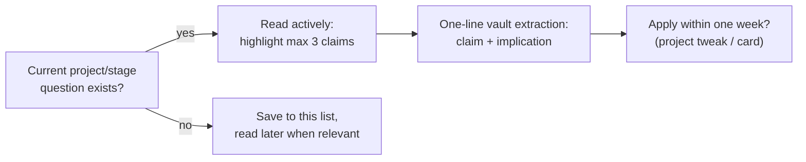

## For future agent
Deep edition of the distilled reading list. The thematic link clusters are preserved (they're the value), now prefixed with reading-strategy R&D: how to extract from essays vs skim them, the essay-to-practice conversion loop, failure modes of reading-heavy learning, and a rotation system. This page is the essay-depth layer; systematic treatment lives in sibling pages.

# Curated Reading List — Deep Edition

## Part 1 — Reading Strategy (mechanism first)

Essays fail learners in two opposite ways:

1. **Read-and-forget**: consumed like content, zero extraction → fluency illusion
2. **Completionism**: hoarding 200 open tabs as future obligations → anxiety + avoidance

**The engineered middle**:
- Read only when a CURRENT project/stage question makes the essay load-bearing
- One-line extraction per essay into vault: *"claim that changed my approach + why"*
- Essay counts toward consume-hours; must stay ≤ build-hours ([[how-to-self-teach]])

## Part 2 — Machine Learning Practice & Career

- **[A Recipe for Training Neural Networks (Karpathy)](http://karpathy.github.io/2019/04/25/recipe/)** — training discipline; also in [[ml-theory-and-moocs]]. Highest-value essay in this list.
- [Software 2.0 (Karpathy)](https://medium.com/@karpathy/software-2-0-a64152b37c35) — code written by optimization; the paradigm frame
- [Top 6 novice ML errors](https://medium.com/towards-data-science/top-6-errors-novice-machine-learning-engineers-make-e82273d394db)
- [Essential ML algorithms](https://towardsdatascience.com/essential-algorithms-every-ml-engineer-needs-to-know-3167b1e940f) · [Which algorithm for which problem](https://www.kdnuggets.com/2017/11/machine-learning-algorithms-choose-your-problem.html)
- [Regularization explained](https://towardsdatascience.com/regularization-in-machine-learning-76441ddcf99a)
- [MLE Step 2: pick a process](https://medium.com/towards-data-science/becoming-a-machine-learning-engineer-step-2-pick-a-process-942eef6ba8dd)
- [Kaggle lessons (freecodecamp)](https://medium.freecodecamp.org/what-i-learned-from-kaggle-contests-d3123e17a36b) · [Portfolio blog setup (Dataquest)](https://www.dataquest.io/blog/how-to-setup-a-data-science-blog/)
- Interview war story: [5 companies, 5 days, 5 offers](https://medium.com/@XiaohanZeng/i-interviewed-at-five-top-companies-in-silicon-valley-in-five-days-and-luckily-got-five-job-offers-25178cf74e0f)

## Part 3 — Deep Learning Concepts
[Feature Visualization (Distill)](https://distill.pub/2017/feature-visualization/) · **[How to Use t-SNE Effectively (Distill)](https://distill.pub/2016/misread-tsne/)** · [Visualizing MNIST (colah)](http://colah.github.io/posts/2014-10-Visualizing-MNIST/) · [Batch norm explained](https://medium.com/towards-data-science/batch-normalization-in-neural-networks-1ac91516821c) · Capsules: [Pt I intuition](https://medium.com/@pechyonkin/understanding-hintons-capsule-networks-part-i-intuition-b4b559d1159b), [CapsNet explainer](https://hackernoon.com/what-is-a-capsnet-or-capsule-network-2bfbe48769cc) · [Black-box theory (Quanta)](https://www.quantamagazine.org/new-theory-cracks-open-the-black-box-of-deep-learning-20170921/) · Counterpoint: [Impossibility of intelligence explosion (Chollet)](https://medium.com/@francois.chollet/the-impossibility-of-intelligence-explosion-5be4a9eda6ec) · [Population-based training (DeepMind)](https://deepmind.com/blog/population-based-training-neural-networks/) · [Autoencoders Pt 3](https://medium.com/towards-data-science/applied-deep-learning-part-3-autoencoders-1c083af4d798) · Free book: [Nielsen NN&DL ch.1](http://neuralnetworksanddeeplearning.com/chap1.html)

Distill essays are the quality ceiling of the genre — read slowly with figures.

## Part 4 — Computer Vision
Object detection: [Tryolabs overview](https://tryolabs.com/blog/2017/08/30/object-detection-an-overview-in-the-age-of-deep-learning) · [comprehensive review](https://medium.com/towards-data-science/deep-learning-for-object-detection-a-comprehensive-review-73930816d8d9) · [A Year in CV (M Tank)](http://www.themtank.org/a-year-in-computer-vision)
Production cases: [Dropbox OCR pipeline](https://blogs.dropbox.com/tech/2017/04/creating-a-modern-ocr-pipeline-using-computer-vision-and-deep-learning/) · [document scanning](https://blogs.dropbox.com/tech/2016/08/fast-and-accurate-document-detection-for-scanning/) · [Apple on-device faces](https://machinelearning.apple.com/2017/11/16/face-detection.html) · [ANPR (Earl)](https://matthewearl.github.io/2016/05/06/cnn-anpr/)
Technique: [data augmentation in TF](https://medium.com/ymedialabs-innovation/data-augmentation-techniques-in-cnn-using-tensorflow-371ae43d5be9) · [TF.js pose estimation](https://medium.com/tensorflow/real-time-human-pose-estimation-in-the-browser-with-tensorflow-js-7dd0bc881cd5)

Production case essays are interview gold: they show constraints real products face.

## Part 5 — NLP & Text
**[Stop Using word2vec (Stitch Fix)](http://multithreaded.stitchfix.com/blog/2017/10/18/stop-using-word2vec/)** — production reality check · [word2vec tutorial (Rare Tech)](https://rare-technologies.com/word2vec-tutorial/) · [Top-10 NLP tasks w/ code](https://www.analyticsvidhya.com/blog/2017/10/essential-nlp-guide-data-scientists-top-10-nlp-tasks/) · [NLTK+sklearn classification](https://bbengfort.github.io/tutorials/2016/05/19/text-classification-nltk-sckit-learn.html) · Topic modeling: [guide](https://nlpforhackers.io/topic-modeling/), [NLTK+Gensim](https://towardsdatascience.com/topic-modelling-in-python-with-nltk-and-gensim-4ef03213cd21) · [tf-idf analysis](https://buhrmann.github.io/tfidf-analysis.html) · [tfidf+wikipedia keywords](https://hackernoon.com/the-fastest-way-to-identify-keywords-in-news-articles-tfidf-with-wikipedia-python-version-baf874d7eb16) · [Clean text for ML](https://machinelearningmastery.com/clean-text-machine-learning-python/) · [NLP guide (tomassetti)](https://tomassetti.me/guide-natural-language-processing/) · [NLG at Google](https://medium.com/towards-data-science/natural-language-generation-at-google-research-bbf2c3756d80)

## Part 6 — Python Craft
Knupp pair: [unit testing](https://jeffknupp.com/blog/2013/12/09/improve-your-python-understanding-unit-testing/) + [classes & OOP](https://jeffknupp.com/blog/2014/06/18/improve-your-python-python-classes-and-object-oriented-programming/) · [OOP+TDD (Digital Cat)](http://blog.thedigitalcatonline.com/blog/2015/05/13/python-oop-tdd-example-part1/) · Custom estimators: [hnyk](http://danielhnyk.cz/creating-your-own-estimator-scikit-learn/), [SO w/CV](https://stackoverflow.com/questions/20330445/how-to-write-a-custom-estimator-in-sklearn-and-use-cross-validation-on-it)
Pandas: **[optimizing speed](https://engineering.upside.com/a-beginners-guide-to-optimizing-pandas-code-for-speed-c09ef2c6a4d6)** · [seven reshape steps](https://towardsdatascience.com/seven-clean-steps-to-reshape-your-data-with-pandas-or-how-i-use-python-where-excel-fails-62061f86ef9c) · [how to learn pandas (Petrou)](https://towardsdatascience.com/how-to-learn-pandas-108905ab4955)
Conda workflows: [tdhopper](https://tdhopper.com/blog/my-python-environment-workflow-with-conda/), [anaconda-project](https://github.com/Anaconda-Platform/anaconda-project) · [Runtime method patching (Tryolabs)](https://tryolabs.com/blog/2013/07/05/run-time-method-patching-python/) · Lambdas: [tutorial](https://pythonconquerstheuniverse.wordpress.com/2011/08/29/lambda_tutorial/), [SO language-agnostic](https://stackoverflow.com/questions/16501/what-is-a-lambda-function)
Scraping: [datawhatnow intro](https://datawhatnow.com/introduction-web-scraping-python/), [mastering scraping](https://hackernoon.com/mastering-python-web-scraping-get-your-data-back-e9a5cc653d88), [Scrapy datasets](https://medium.com/towards-data-science/using-scrapy-to-build-your-own-dataset-64ea2d7d4673)

## Part 7 — Data Engineering & Infra
[Data Engineering Pt 1 (kdnuggets)](https://www.kdnuggets.com/2018/01/beginners-guide-data-engineering-1.html) · [Kafka in Python](http://blog.adnansiddiqi.me/getting-started-with-apache-kafka-in-python/) · **[Data Science at the Command Line (free book)](https://www.datascienceatthecommandline.com/)**
Docker+DS: [Jupyter container](https://tsaprailis.com/2017/10/10/Docker-for-data-science-part-1-building-jupyter-container/), [simplified docker-ing](https://becominghuman.ai/docker-for-data-science-part-1-dd41e5ef1d80), [Docker with R](https://www.r-bloggers.com/why-use-docker-with-r-a-devops-perspective/)
Platforms: [Pachyderm](http://pachyderm.io/) · [Airbnb Scaling Knowledge](https://medium.com/airbnb-engineering/scaling-knowledge-at-airbnb-875d73eff091) · [DS Maturity Model (Domino)](https://blog.dominodatalab.com/introducing-the-data-science-maturity-model/) · [Time-series DB roundup](https://blog.outlyer.com/top10-open-source-time-series-databases) · [Data lakes primer](https://blog.rakam.io/data-lakes-a-sneak-peek-into-their-relevance-in-the-big-data-community-f3841e948dc1) · [Datastore choice mistakes](https://www.stavros.io/posts/startup-mistakes-datastore/) · [Jupyter on GCP](https://medium.com/towards-data-science/running-jupyter-notebook-in-google-cloud-platform-in-15-min-61e16da34d52) · [Colaboratory](https://research.google.com/colaboratory/unregistered.html)

## Part 8 — Statistics & Methods
Test-vs-validation: **[stats.SE canonical answer](https://stats.stackexchange.com/questions/19048/what-is-the-difference-between-test-set-and-validation-set)** · [k-fold in NNs](https://stackoverflow.com/questions/25889637/how-to-use-k-fold-cross-validation-in-a-neural-network) · [PCA do's/don'ts](https://medium.com/@sadatnazrul/the-dos-and-donts-of-principal-component-analysis-7c2e9dc8cc48) · [SVM intuition pt2](https://medium.com/towards-data-science/support-vector-machines-intuitive-understanding-part-2-1046dd449c59) · [Feature selection strategies](https://medium.com/towards-data-science/three-effective-feature-selection-strategies-e1f86f331fb1) · [A/B testing interviews (Quora)](https://www.quora.com/What-kind-of-A/B-testing-questions-should-I-expect-in-a-data-scientist-interview-and-how-should-I-prepare-for-such-questions) · [Logistic coefficients (RPubs)](https://rpubs.com/OmaymaS/182726) · [Survey methods (UCLA)](http://www.ats.ucla.edu/stat/mult_pkg/faq/svy_howtochoose.htm)

## Part 9 — Trading / Crypto / Quant-Adjacent
**[Learning to Trade with RL (WildML)](http://www.wildml.com/2018/02/introduction-to-learning-to-trade-with-reinforcement-learning/)** · [Algorithmic crypto trading (Nagpaul)](https://jaynagpaul.com/algorithmic-crypto-trading) · [Your own trading bot](https://codeburst.io/how-to-make-your-own-trading-bot-83b5c6e35036) · [Crypto rates→Sheets](https://jbuty.com/how-to-get-crypto-currencies-rates-and-more-in-google-sheet-1a57e571bc14) · [Bitcoin whitepaper annotated (Fermat)](https://fermatslibrary.com/s/bitcoin) · [Ethereum smart contracts](http://www.gjermundbjaanes.com/understanding-ethereum-smart-contracts/) → [[builds/stock-agent/overview]] · [[business/quant-finance/applications-of-quantitative-finance]]

## Part 10 — Git & Workflow
**[Oh shit, git!](http://ohshitgit.com/)** bookmark it · [Five git concepts the hard way](https://zwischenzugs.com/2018/03/14/five-key-git-concepts-explained-the-hard-way/) · [Syncing forks](https://help.github.com/articles/syncing-a-fork/) · [Code review process keys](https://dev.to/vipinjain/5-keys-to-optimizing-your-code-review-process-341e) · Open source: [First Timers Only](http://www.firsttimersonly.com/), [CodeTriage](https://www.codetriage.com/) · tmux: [HN](https://news.ycombinator.com/item?id=15776995) + [Medium](https://medium.com/actualize-network/a-minimalist-guide-to-tmux-13675fb160fa)

## Part 11 — Career, Craft & Mindset
[Imposter syndrome (Rohrer)](https://brohrer.github.io/imposter_syndrome.html) · [Sane workweek](https://codewithoutrules.com/saneworkweek/) · [Part-time programming](https://codewithoutrules.com/2018/01/08/part-time-programmer/) · [Code less, think more incrementally](https://levelup.gitconnected.com/code-less-think-more-incrementally-98adee22df9b) · Polya: [How to Solve It](https://en.wikipedia.org/wiki/How_to_Solve_It) · [How to Solve It by Computer](https://en.wikipedia.org/wiki/How_to_Solve_it_by_Computer)
Self-taught threads: [become SWE](https://news.ycombinator.com/item?id=15946136) · [Google-interview realities](http://www.reddit.com/r/learnprogramming/comments/7hb7ka/learned_to_code_got_interview_at_google_but_i/) · [Stanford CS9](https://web.stanford.edu/class/cs9/)
Soft skills: [softer skills](https://dev.to/amangautam/softer-skills-that-make-you-a-better-programmer--2g3e) · [Active listening YSK](https://reddit.com/r/YouShouldKnow/comments/8a9egh/ysk_active_listening_a_technique_developed_by_the/)
**[Programming logbook (Routley)](https://routley.io/tech/2017/11/23/logbook.html)** — maps directly onto this vault's daily-notes pattern.

## Part 12 — Aggregators & Free Books
[GoalKicker free books](http://goalkicker.com/) · [Free DS books (kdnuggets)](http://www.kdnuggets.com/2015/09/free-data-science-books.html) · [AI cheat-sheet pack](https://becominghuman.ai/cheat-sheets-for-ai-neural-networks-machine-learning-deep-learning-big-data-678c51b4b463) · [SO Developer Survey 2017](https://insights.stackoverflow.com/survey/2017#technology-languages-over-time) (era snapshot)

## Part 13 — Ingestion Notes & Era Caveat

- ~60 low-signal links dropped during ingestion (device tips, dead forums, duplicates) — documented decision, no knowledge loss for this vault
- Malformed source URLs fixed where target identifiable; otherwise omitted `(TBC)`
- Era caveat: 2017–2020 essays — concepts durable, specific tools may be superseded; check [[ml-theory-and-moocs]] for current tooling

## Example Checkpoint Questions

1. Which essay on this list would change your CURRENT project if its claim were true — and have you tested it?
2. What's the last claim you extracted into the vault from an essay? When did you apply it?

## Cross-Vault Links

[[overview]] siblings: [[ml-theory-and-moocs]] · [[python-datascience-topics]] · [[ai-data/data-science/index|Field Index]]