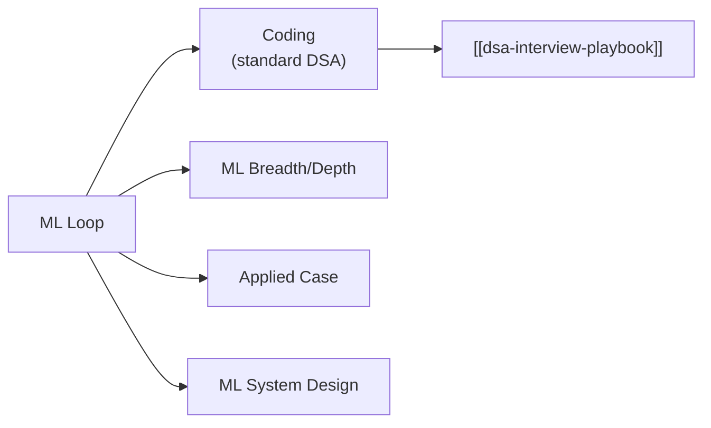
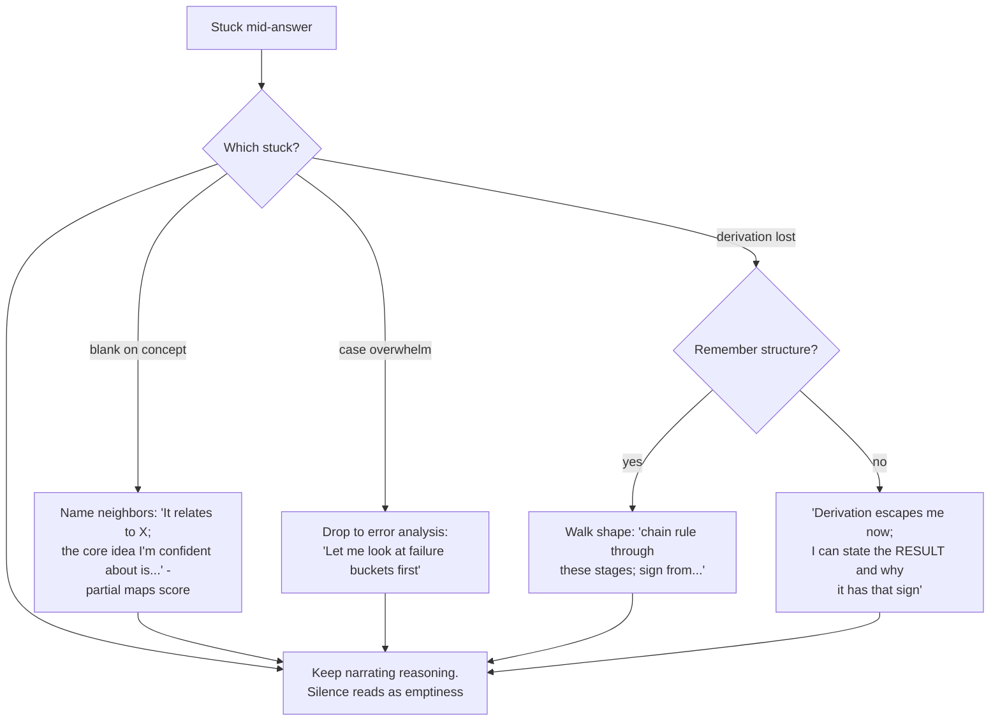

## For future agent
Deep edition of the ML interview playbook. Adds mechanism-level analysis of what each ML round scores, failure-mode taxonomy (the six ways ML candidates die), premortem of a failed loop, rescue flowcharts for blanking/case-paralysis/math-grilling, answer-skeleton discipline, and life-integration prep schedule. Theory source layer: [[ml-theory-and-moocs]]; coding side: [[dsa-interview-playbook]].

# ML Interview Playbook — Deep Edition

## Part 1 — Round Anatomy & What Each Actually Scores

| Round | Scored Signal | Hidden Failure |
|-------|--------------|----------------|
| Coding | Same as SWE | Candidates over-invest here because it's familiar; it's the *floor*, not the differentiator |
| ML breadth | Model of your mental map: do concepts CONNECT or sit isolated? | Isolated fact recital ("dropout is p=0.5") without when/why web |
| Applied case | Error-analysis instinct BEFORE solution instinct | Jumping to "try XGBoost" reveals tool-user, not thinker |
| ML system design | Data→model→deployment as ONE connected system | Designing model in isolation; forgetting data/serving = instant senior-signal absence |

**Mechanism insight**: interviewers escalate probes until they find YOUR boundary — that's information-gathering, not hostility. The winning posture is making your boundary easy to find and showing what you do at it.

## Part 2 — The Core Question Bank With Answer Skeletons

Universal skeleton for every theory answer: **Definition → Intuition/Why → When It Breaks**. The third beat is where offers live — most candidates stop at definition.

| Question | Skeleton |
|----------|----------|
| Bias-variance tradeoff? | Error=bias²+variance+noise → simple models err systematically, complex err randomly → detect which via learning curves; breaks under distribution shift |
| Why regularization? | Complexity penalty cuts variance → L1 sparsity (feature selection geometry), L2 shrinkage → breaks: wrong penalty strength chosen without CV |
| Precision vs recall? | Precision = alarm trustworthiness (false-alarm cost); recall = coverage (miss cost) → choose by business asymmetry → breaks when classes shift post-deployment |
| How does XGBoost work? | Sequential trees fitting loss gradients + regularization → wins tabular via non-linearity+interactions+native missing handling → breaks: leakage sensitivity, less parallel than RF training |
| Debug an overfit you OWNED | symptom(train 99/val 70) → curve diagnosis → fixes tried in order → result + prevention. Have ONE real story; this is asked ~always |
| Attention in one line | Tokens compute softmax(QK^T)V relevance to all others → parallel context modeling → breaks: quadratic cost in sequence length |
| Imbalanced data handling | Resample INSIDE folds only / class weights / threshold tuning / PR-AUC → never plain accuracy → breaks: resampling before split = leakage |
| k-fold CV purpose | Honest generalization estimate + model selection → leakage = fitting scalers pre-split |

## Part 3 — Failure-Mode Taxonomy

| # | Failure Mode | Mechanism | Early Warning | Counter |
|---|--------------|-----------|---------------|---------|
| F1 | **Fact-recital collapse** | Facts memorized as islands; probes need connections | Fluent first sentence, silence on follow-up "why" | Study BY connections: every concept card includes one neighbor concept |
| F2 | **Case paralysis** | Open-endedness overwhelms; waiting for THE right move | Long silence after case prompt | Pre-wired opener: "Before solutions — error analysis: how would we bucket failures?" |
| F3 | **Math grill freeze** | Derivation anxiety spikes working memory away | "I know this… just give me a second" loops | Own exactly three derivations cold: GD update, logistic loss, backprop chain rule. Depth beats breadth |
| F4 | **Project shallowness** | Built by following tutorial; own reasoning absent | Cannot explain WHY choices made in own project | Retro-audit your project: for each choice write the rejected alternative + why |
| F5 | **Buzzword vulnerability** | Named LLM/RAG/agents without mechanics | Can't answer "what would break if retrieval returned garbage?" | For each buzzword used, prepare its failure-mode paragraph |
| F6 | **Metric blindness in cases** | Optimizing without asking business cost matrix | Proposing models before asking "what does FP vs FN cost?" | Case rule #1: metrics conversation precedes models, always |

### Premortem (failed ML loop)
*Five rounds, five rejections.* Autopsy: coding fine but breadth answers were isolated facts (F1); case opened with model proposal (F6); own-project questions exposed tutorial scaffolding (F4); said "transformer" six times, explained attention zero times (F5). Every finding was visible in mock #1's recording.

## Part 4 — Rescue Flowcharts

## Part 5 — The Applied-Case Framework (full depth)

"Improve metric X for product Y":

1. **Clarify**: current value? target? why does business care? (skipping = F6)
2. **Error analysis FIRST**: bucket failures — data quality / label noise / hard cases / representation gaps
3. **Lever tree**: more data? better features? different objective? capacity? ensembling?
4. **Cost-rank levers**, cheapest-highest-yield first
5. **Validation plan BEFORE shipping any change**

ML system design variant adds three layers ([[system-design-interview]] base framework): data layer (sources, feature store, train/serve skew guard), model layer (candidate-gen → ranking two-stage pattern), deployment layer (batch vs online inference, drift monitoring, retrain cadence).

Worked micro-example (YouTube recs): two-stage — candidates narrow millions→hundreds; ranker scores; features from watch history/session; serving = precomputed candidates + online ranking <200ms; monitor watch-time drift; daily retrains.

## Part 6 — Life Integration (prep operating system)

| Phase | Focus | Cadence |
|-------|-------|---------|
| Baseline (anytime) | One real owned-project with written decision log | ongoing |
| −8 to −5 weeks | Question-bank out-loud drills; skeleton fluency | 30 min/day |
| −4 to −2 | Mocks ×2/week recorded; fix ONE weakness per mock | 90 min×2/wk |
| −1 week | Three derivations daily; project war-story rehearsal; sleep fixed | light |
| Loop week | Debrief note within 10 min post-round → feeds next mock | per round |

**Metrics**: skeletons delivered <60s each · mocks passed streak · case openers automatic (error-analysis-first reflex) · derivation confidence self-rating trend.

## Example Checkpoint Questions

1. Model good offline, bad online — top suspects AND the order you'd check them? *(skew → feedback loop → stale features)*
2. Why is accuracy fraudulent for fraud detection? State the exact arithmetic that makes it so.
3. Decision tree > neural net — three concrete regimes.
4. Your RAG bot cites nonexistent sources — diagnose retrieval vs generation; what measurement separates them?
5. Cut inference cost 10× — first question you ask before proposing anything?

## Cross-Vault Links

[[ml-theory-and-moocs]] · [[repo-ds-interviews-grigorev]] · [[roadmap-ml-engineer]] · [[system-design-interview]] · [[example-question-bank]] · [[ai-data/ai/AI_MASTER_NOTES]]