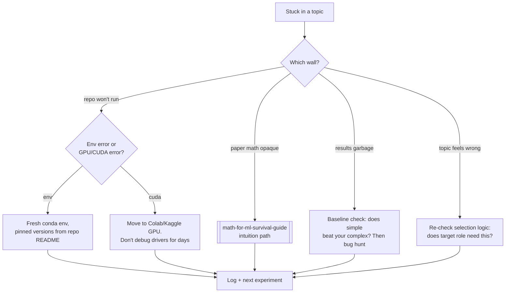

## For future agent
Deep edition of the topic-organized resource map. Adds per-topic: the standard first-project trap (what everyone builds wrong first), topic-specific failure modes with counters, entry-point recommendation (which repo/course to touch first), and topic-selection guidance tied to career direction. Frameworks live in [[python-datascience-frameworks]]; this page is the problem-type layer.

# Python for Data Science — Topics [Deep Edition]

## Part 1 — Topic Selection Logic (don't learn all of these)

Topics are chosen by TARGET ROLE + one project need — never "for completeness":

| Target Direction | Priority Topics | Deprioritize |
|------------------|----------------|--------------|
| MLE/GenAI ([[roadmap-ml-engineer]]) | NLP/Transformers, RAG patterns, recommender basics | Action recognition zoo |
| Analyst→DS | Time series, anomaly detection, feature engineering | RL environments |
| CV-flavored roles | Detection/segmentation, OCR pipelines | Speech |
| Quant-curious | Time series, anomaly detection | Face recognition |

Rule: **one topic deep beats five browsed**; each deep topic should end in a project artifact.

## Part 2 — Anomaly Detection

**Resources**: [overview essay](https://towardsdatascience.com/machine-learning-basics-part-4-anomaly-detection-recommender-systems-and-scaling-b8bbf0413aa9) · [online/streaming setting](https://stats.stackexchange.com/questions/343579/online-anomaly-detection) · [autoencoder CV](https://datascience.stackexchange.com/questions/37396/cross-validation-for-anomaly-detection-using-autoencoder) · [Model selection arXiv 1707.03909](https://arxiv.org/abs/1707.03909) · [class notes L16](https://machine-learning-class-notes.readthedocs.io/en/latest/lecture16.html)

**First-project trap**: running isolation forest on clean data and reporting accuracy. Anomaly data has no labels by definition.
**Failure modes**: threshold chosen by vibes (fix: choose via business cost of false alarms); contamination parameter guessed (fix: domain-informed); evaluation without any labeled incidents (fix: inject synthetic anomalies for validation).
**Entry point**: the overview essay → credit-card fraud public dataset → cost-sensitive evaluation writeup.

## Part 3 — Computer Vision

### Action Recognition & Detection (deepest subsection)
Curated list: [awesome-action-recognition](https://github.com/jinwchoi/awesome-action-recognition)

| Repo | Approach |
|------|----------|
| [ACAM demo](https://github.com/oulutan/ACAM_Demo) | Actor Conditioned Attention Maps, real-time |
| [twostream-attention](https://github.com/pedro-abreu/twostream-attention) | 2-stream CNN + attention |
| [realtime-action-detection](https://github.com/gurkirt/realtime-action-detection) | Real-time detection |
| [action-detection SSN](https://github.com/yjxiong/action-detection) | Temporal detection w/ Stacked Segment Network |
| [UntrimmedNet](https://github.com/wanglimin/UntrimmedNet) | Weakly supervised |
| [HCN-pytorch](https://github.com/huguyuehuhu/HCN-pytorch) | Skeleton co-occurrence features |
| [KinectOnlineActionDetection](https://github.com/AmrSaleh/KinectOnlineActionDetection) | Online Kinect-based |
| Others in list | CBR boundary regression · dRNN · ss-tad untrimmed · JAANet facial AU · cross-dataset crowded scenes · Google graph distillation |

**Trap**: starting with video action recognition as FIRST CV project (video = images × time × memory pain). Path: images → detection → then video.

### Face Recognition & Analysis
- **[face_recognition (ageitgey)](https://github.com/ageitgey/face_recognition)** — standard starter API
- [OpenFace](https://github.com/TadasBaltrusaitis/OpenFace) — facial action units
- [DeepFaceLab](https://github.com/iperov/DeepFaceLab) / [faceswap](https://github.com/deepfakes/faceswap) — replacement tooling (ethics note: consent)
- DRML / AUNets / DRML_pytorch — AU detection research lines
- ROS bridge: [ros_people_object_detection_tensorflow](https://github.com/cagbal/ros_people_object_detection_tensorflow) → [[engineering/robotics/index]]

### Object Detection & Segmentation
- **[Detectron2 (Meta)](https://github.com/facebookresearch/detectron2)** — industry-standard PyTorch framework
- [video-object-removal](https://github.com/zllrunning/video-object-removal) — bbox → removal

**Topic failure mode**: training detectors on tiny custom datasets from scratch instead of fine-tuning pretrained backbones (results disaster → quit). Always transfer-learn first.

### Other CV
[Optical flow explainer](https://medium.com/swlh/what-is-optical-flow-and-why-does-it-matter-in-deep-learning-b3278bb205b5) · [multi-label SmallerVGGNet](https://www.pyimagesearch.com/2018/05/07/multi-label-classification-with-keras) · OCR: [Tesseract+OpenCV DL pipeline](https://www.learnopencv.com/deep-learning-based-text-recognition-ocr-using-tesseract-and-opencv/) · Framework: [Videoflow](https://github.com/videoflow/videoflow)

## Part 4 — NLP

- **[HuggingFace Transformers](https://github.com/huggingface/transformers)** — de-facto standard library (2026 note)
- [ULMFiT universal LM classification](http://nlp.fast.ai/classification/2018/05/15/introducting-ulmfit.html) — the pre-transformer idea that anticipated everything
- Text summarization eval: [sumeval](https://github.com/chakki-works/sumeval)

**First-project trap**: fine-tuning an LLM before trying embeddings+logistic baseline. Modern NLP order: TF-IDF baseline → embedding similarity → small transformer fine-tune → LLM prompting/RAG. Each step justified only if the previous failed measurably.
**Failure mode**: skipping evaluation discipline entirely ("it looks better"). Fix: held-out set + at least one automatic metric before eyeballing.

## Part 5 — Speech Recognition
[Speech Recognition in Python (realpython)](https://realpython.com/python-speech-recognition/) — API-level entry; deeper requires ASR-specific study `(TBC: whisper-era resources not in source repo)`.

## Part 6 — Time Series

- **[Open ML Course Topic 9](https://medium.com/open-machine-learning-course/open-machine-learning-course-topic-9-time-series-analysis-in-python-a270cb05e0b3)** — best single intro (trends, seasonality, ARIMA family)
- [ARIMA forecasting guide](https://www.digitalocean.com/community/tutorials/a-guide-to-time-series-forecasting-with-arima-in-python-3)
- SARIMAX convergence pitfalls: [MLE convergence errors thread](https://stats.stackexchange.com/questions/313426/mle-convergence-errors-with-statespace-sarimax)
- Vault: [[business/quant-finance/forecasting-and-market-efficiency]]

**First-project trap**: random train/test split on temporal data (future leaking into past). The defining discipline of time series is *temporal* validation splits — get this wrong and every result is fiction.
**Failure modes**: ignoring stationarity → spurious regressions; forecasting with unknowable future features; evaluating single-split instead of rolling-origin.

## Part 7 — Recommender Systems
- **[Microsoft Recommenders](https://github.com/microsoft/recommenders)** — best-practice implementations + evaluation (ALS, SAR, etc.); THE reference library

**Failure mode**: evaluating with plain accuracy while ignoring ranking metrics (precision@k, NDCG) — recommenders ARE ranking problems.

## Part 8 — Reinforcement Learning Environments
- [AirSim (Microsoft)](https://github.com/microsoft/AirSim) — autonomous-vehicle simulator → [[engineering/robotics/index]]
- [RLTrader](https://github.com/notadamking/RLTrader) — crypto trading gym → [[business/quant-finance/applications-of-quantitative-finance]]
- SafetyGym (OpenAI) — constrained RL

**Trap**: RL as first ML specialty (sample inefficiency + instability = highest quit rate in ML). Enter RL only after supervised foundations are boring-stable.

## Part 9 — AutoML / Novelty / Feature Engineering
- **[AutoML Zero](https://github.com/google-research/google-research/tree/master/automl_zero)** — evolutionary search discovering algorithms from basic ops
- [Featuretools](https://www.featuretools.com/) — Deep Feature Synthesis automation

Feature-engineering failure mode: automated FE on leaky raw data produces beautiful CV scores that die in production — automation amplifies input quality both directions.

## Part 10 — Defeat-Tackling Flowchart (topic work)

## Part 11 — Life Integration

- One active topic max alongside roadmap core; topic work IS Stage-3/4 project material (double-counted deliberately)
- Entry-point rule per topic: ONE course/repo first; others become references after first artifact exists
- Metrics: artifacts per topic (target ≥1), repos-ran-successfully count, eval-discipline habit (no metric-free claims)

## Example Checkpoint Questions

1. Why is random splitting fatal for your time-series project — describe the exact leak.
2. Your detector trained-from-scratch gets mAP near zero. What's the first correction?
3. In recommenders, why does accuracy mislead — what does the product actually display to users?

## Cross-Vault Links

[[python-datascience-frameworks]] · [[roadmap-data-scientist]] · [[roadmap-ml-engineer]] · [[ai-data/ai/AI_MASTER_NOTES]] · [[curated-reading-list]]