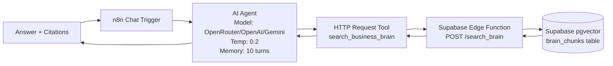

## For future agent
This module documents the **Rapple Brain** — a retrieval-only AI agent architecture built on n8n + Supabase Edge Functions. It answers questions about a business using ONLY a vector-searched knowledge base. The agent never answers from its own knowledge; it either finds the answer in the brain or refuses. This is a production pattern for grounded, hallucination-free business Q&A.

---

# Retrieval Agent — System Overview

> **Architecture**: n8n Chat Trigger → AI Agent (with HTTP Request tool) → Supabase Edge Function (vector search) → Return chunks → Agent cites sources

## High-Level Flow



## Core Components

| Component | Technology | Purpose |
|-----------|------------|---------|
| **Chat Interface** | n8n Chat Trigger | Receives user messages, starts agent run |
| **Agent Brain** | n8n AI Agent (LangChain) | Orchestrates search, synthesizes answer, enforces rules |
| **Search Tool** | HTTP Request (n8n) | Calls Edge Function with `mode=search`, `query=...` |
| **Vector Search** | Supabase Edge Function (Deno) | Embeds query, searches `brain_chunks`, returns top-k |
| **Knowledge Store** | Supabase pgvector (`brain_chunks`) | Stores note content + 384-dim embeddings + metadata |
| **Embedding Model** | OpenAI `text-embedding-3-small` (or similar) | 384-dim vectors for semantic search |

## System Prompt Rules (Non-Negotiable)

The agent operates under strict constraints:

1. **ALWAYS search first** — Never answer from own knowledge
2. **Multi-search if thin** — Re-query with different wording if first result sparse
3. **Answer ONLY from returned chunks** — No external knowledge
4. **Cite file paths** — Every claim links to source note path
5. **Tool errors ≠ empty results** — If Edge Function fails (DNS, 401, 500): "I can't reach the brain right now — that's a system problem, not a missing note." Then STOP.
6. **Refuse if not in brain** — "That's not in the brain yet" + state what was searched
7. **Never invent performance numbers** — No leads, CPL, conversion, ROI unless in brain
8. **Weight by confidence** — high=fact, medium=don't overclaim, low=explicitly unproven, draft=unfinished, archived=retired
9. **Quote verbatim** — For rebuttals/scripts, use owner's exact phrasing

## Data Model: `brain_chunks`

```sql
CREATE TABLE brain_chunks (
  id UUID PRIMARY KEY DEFAULT gen_random_uuid(),
  path TEXT NOT NULL,           -- e.g., "wiki/modules/quant-finance/momentum-jegadeesh-titman.md"
  heading TEXT,                 -- Nearest heading for context
  content TEXT NOT NULL,        -- Chunk text (target ~500-1000 chars)
  embedding VECTOR(384),        -- OpenAI text-embedding-3-small
  confidence TEXT,              -- 'high' | 'medium' | 'low' | 'speculation'
  status TEXT,                  -- 'draft' | 'published' | 'archived'
  metadata JSONB,               -- Frontmatter + extracted fields
  created_at TIMESTAMPTZ DEFAULT NOW()
);

CREATE INDEX ON brain_chunks USING ivfflat (embedding vector_cosine_ops) WITH (lists = 100);
```

## Ingestion Pipeline (Conceptual)

```
Raw Notes (Markdown) 
    → Chunk by heading (preserve heading path)
    → Embed each chunk (OpenAI API)
    → Upsert to brain_chunks (path, heading, content, embedding, confidence, status, metadata)
    → Refresh IVFFLAT index periodically
```

## Related Pages

- [[n8n-setup]] — n8n Chat Trigger, AI Agent, HTTP Request tool configuration
- [[edge-function]] — Supabase Edge Function code, deployment, authentication
- [[retrieval-agent]] — Agent system prompt, behavior rules, refusal logic
- [[database-schema]] — brain_chunks table, indexes, RLS, maintenance

## Cross-Links

- [[wiki/modules/automations/overview|Automations Overview]] — n8n patterns, workflow library
- [[wiki/modules/programming/SAAS_BUILD_NOTES|SaaS Build Notes]] — Supabase + Edge Functions patterns
- [[wiki/modules/quant-finance/quant-toolkit-and-skills|Quant Toolkit]] — Vector search, embeddings in finance context