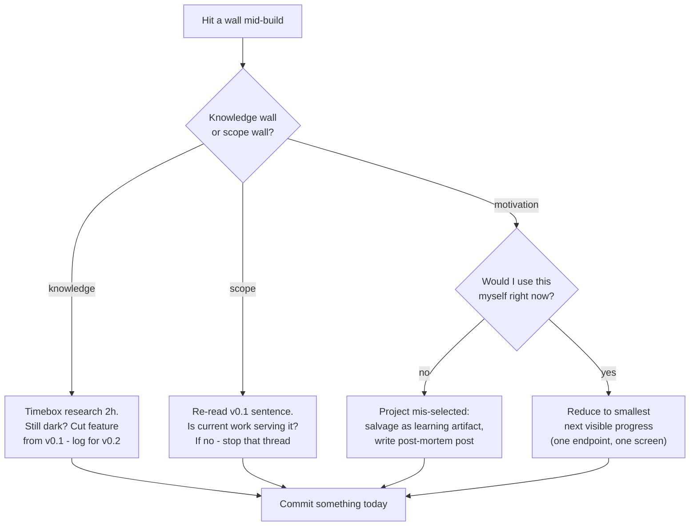

## For future agent
Deep edition of the project playbook. Adds root-cause analysis of why projects die (with base rates), a full premortem, phase-by-phase failure tables with early warnings, the defeat-tackling flowchart for mid-build collapse, portfolio strategy depth (what interviewers extract from projects), and life-integration scheduling that survives college semesters. Live vault examples referenced throughout.

# Build-Project Playbook — Deep Edition

## Part 1 — Why Projects Decide Fresher Outcomes (mechanism)

In a market where entry hiring collapsed ([[market-analysis-tech-2026]]), interviews need *cheap signals of real ability*. A deployed project is the densest legal signal available because it bundles, in one artifact:

1. **Follow-through** (most freshers have none)
2. **Real debugging war stories** (unfakeable specifics)
3. **Judgment traces** (your README's "what I'd do next" section)
4. **Conversation home-field** — "walk me through YOUR system" beats any leetcode anxiety

Projects convert interviews from exams into show-and-tell. That conversion is the entire strategic value.

## Part 2 — Selection: The Matrix + Root-Cause Filter

Score ideas 1–5 on: would-use-it-yourself · target-stack overlap · one-hard-problem-inside · demoable-in-2-min · data/API-available. Build only ≥18/25.

**Root causes of bad selection** (filter before starting):

| Bad Pick Cause | Symptom Idea | Why It Dies |
|----------------|--------------|-------------|
| Copying tutorial projects | Weather/todo app | No hard problem → boredom by week 2 |
| Impulse ambition | "Full Uber clone" | Scope >> capacity → abandonment at 30% |
| Resume-keyword fishing | Random blockchain+ML mashup | No personal use-case → zero stamina |
| Permission-blocked | Needs someone else's API/approval | Deadlock weeks kill momentum |

## Part 3 — Scoping: v0.1 Discipline (the anti-death mechanism)

Write before coding:
> *"v0.1 is done when a stranger can ______ without me."*

Everything else is v0.2+, cut until ship. **Why this works**: projects don't die from difficulty; they die from undefined done. An open-ended task has no completion signal, so motivation has nothing to grip.

## Part 4 — Phase-by-Phase Failure Tables

### Phase: Setup (week 1)

| Failure | Early Warning | Counter |
|---------|--------------|---------|
| Env/config rabbit hole before any feature | Day 2 still installing things | Skeleton-day rule: deploy EMPTY shell day 1 |
| Over-engineering repo (CI, monorepo, microservices) | More config files than code | Boring stack until v0.1 ships |

### Phase: Core build (weeks 2–6)

| Failure | Base-rate note | Early Warning | Counter |
|---------|---------------|---------------|---------|
| Data dirtier than expected | Near-universal in data projects | Cleaning >50% of sessions | Budget 40% timeline for cleaning — it IS the job |
| Hidden dependency (OAuth, paid tier) | Common | Research spiraling past timebox | Substitute simpler auth/API for v0.1 |
| Perfectionist refactor loop | High in strong students | Rewriting working code repeatedly | Feature-freeze date written on calendar |
| Tutorial relapse | Common | Videos open instead of editor | Docs-only rule after week 2 |

### Phase: Ship (the graveyard phase)

| Failure | Why It Happens Here | Counter |
|---------|--------------------|---------|
| 80%-forever | Last mile unglamorous | Ship ugly rule; ugly-deployed > beautiful-local |
| README never written | Energy spent | Write README FIRST as spec, update at end |
| Silent launch | Posting feels cringe | Pre-schedule the LinkedIn/blog post date at v0.1 kickoff |

## Part 5 — Full Premortem

*It's 4 months from now; the project died.* Findings ranked by likelihood:

1. **Scope creep killed it** — v0.1 sentence never written or ignored
2. **Deployment debt** — "I'll deploy at the end" → end never came
3. **Tutorial relapse** during the hard middle
4. **Silent death** — no public artifact, so even the learning isn't bankable
5. **Wrong-project selection** — no personal use-case, abandoned without guilt (this one is FINE if detected early — kill fast, log lessons)

## Part 6 — What Interviewers Extract (prepare these four answers per project)

1. **Hardest bug**: symptom→hypothesis→test→fix→prevention arc (rehearse aloud)
2. **A decision you'd reverse**: shows judgment maturity, not just success stories
3. **What breaks at 100× scale**: connects your toy to systems thinking ([[modules/systems-design/system-design-interview]])
4. **What you'd do with one more month**: roadmap thinking

Your live examples: stock-agent (kill-switch saga), retrieval-agent brain (tool-error-vs-empty-result distinction — a genuinely sophisticated edge case most seniors miss).

## Part 7 — Life Integration

- **Semester-aware scheduling**: heavy project weeks = college-light weeks. Map academic calendar at semester start; never schedule v0.1 ship-week against exam week.
- **Anchor habit**: project hour tied to fixed daily slot; minimum = one commit (even docs).
- **The one-commit floor**: bad days still touch the repo. Streak psychology applies to builds exactly like gym.
- **Public cadence**: one write-up per finished project; cross-post summary into vault wiki page (like [[modules/retrieval-agent/overview]]).

## Part 8 — Success Metrics

| Metric | Healthy Signal |
|--------|---------------|
| v0.1 shipped per quarter | ≥1 |
| Commit streak | ≥5 days/week during build phases |
| Deployed-and-alive URLs | Growing list, none dead |
| Interview stories banked per project | ≥3 (bug, decision, scale) |
| Ratio built-vs-consumed hours | ≥1 sustained |

## Example Self-Diagnostic Questions

1. Can a stranger run my latest project from its README alone? (Actually test it.)
2. Which premortem finding is my CURRENT trajectory closest to?
3. What did I cut from v0.1 — and do I remember why? (Cutting consciously is the skill.)

## Cross-Vault Links

[[roadmap-software-engineer]] Stage 4 · [[roadmap-ml-engineer]] Stages 3–4 · [[how-to-self-teach]] · [[interview-counter-guide]] · [[modules/stock-agent/overview]] · [[modules/retrieval-agent/overview]]